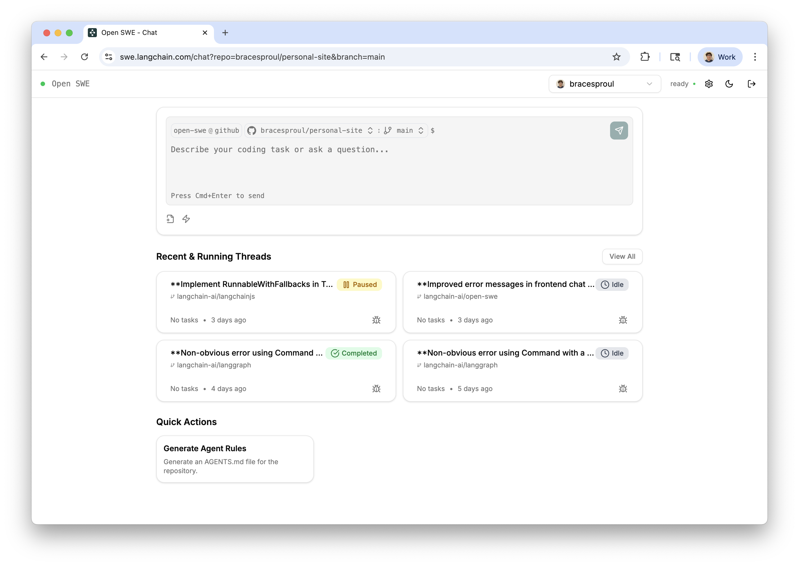

<div align="center">
  <picture>
    <source media="(prefers-color-scheme: dark)" srcset="apps/docs/logo/dark.svg">
    <source media="(prefers-color-scheme: light)" srcset="apps/docs/logo/light.svg">
    
  </picture>
</div>

<div align="center">
  <h1>Open SWE - An Open-Source Asynchronous Coding Agent</h1>
</div>

Open SWE is an open-source cloud-based asynchronous coding agent built with [LangGraph](https://docs.langchain.com/langgraphjs/). It autonomously understands codebases, plans solutions, and executes code changes across entire repositories.

> [!TIP]
> Try out Open SWE yourself using our [public demo](https://swe.langchain.com)!
>
> **Note: you're required to set your own LLM API keys to use the demo.**

> [!NOTE]
> 📚 See the **Open SWE documentation [here](https://docs.langchain.com/labs/swe/)**
>
> 💬 Read the **announcement blog post [here](https://blog.langchain.com/introducing-open-swe-an-open-source-asynchronous-coding-agent/)**
>
> 📺 Watch the **announcement video [here](https://youtu.be/TaYVvXbOs8c)**

# Features



- 📝 **Planning**: Open SWE has a dedicated planning step which allows it to deeply understand complex codebases and nuanced tasks. You're also given the ability to accept, edit, or reject the proposed plan before it's executed.
- 🤝 **Human in the loop**: With Open SWE, you can send it messages while it's running (both during the planning and execution steps). This allows for giving real time feedback and instructions without having to interrupt the process.
- 🏃 **Parallel Execution**: You can run as many Open SWE tasks as you want in parallel! Since it runs in a sandbox environment in the cloud, you're not limited by the number of tasks you can run at once.


## Usage

Open SWE can be used in multiple ways:

- 🖥️ **From the UI**. You can create, manage and execute Open SWE tasks from the [web application](https://swe.langchain.com). See the ['From the UI' page](https://docs.langchain.com/labs/swe/usage/ui) in the docs for more information.

## Local Development

Open SWE runs locally without any external repository-hosting dependencies or authentication. Configure your environment variables (such as `AZURE_OPENAI_API_KEY`) and start the agent to connect to Azure-hosted GPT‑5 models or other supported LLMs.

When not in local mode, the sandbox environment clones repositories under `/workspace/project` inside the container.


For the Azure OpenAI API version, set `AZURE_OPENAI_API_VERSION` (preferred) or `OPENAI_API_VERSION`. The agent will use `AZURE_OPENAI_API_VERSION` when available and fall back to `OPENAI_API_VERSION` otherwise.


When specifying models, Azure OpenAI expects deployment names rather than raw model IDs. Use the `azure-openai:<deployment-name>` syntax, for example `azure-openai:my-gpt5-deployment`. If your deployment name matches a base model ID (e.g., `azure-openai:gpt-4o`), ensure that a deployment with that name exists.

## Docker

You can build and run the LangGraph agent together with the web interface using Docker Compose:

```bash
docker compose build
docker compose up
```

The Compose setup builds a single image for the monorepo, then starts the LangGraph agent on port `2024` and the Next.js web UI on port `3000`.

# Documentation

To get started using Open SWE locally, see the [documentation here](https://docs.langchain.com/labs/swe/).

