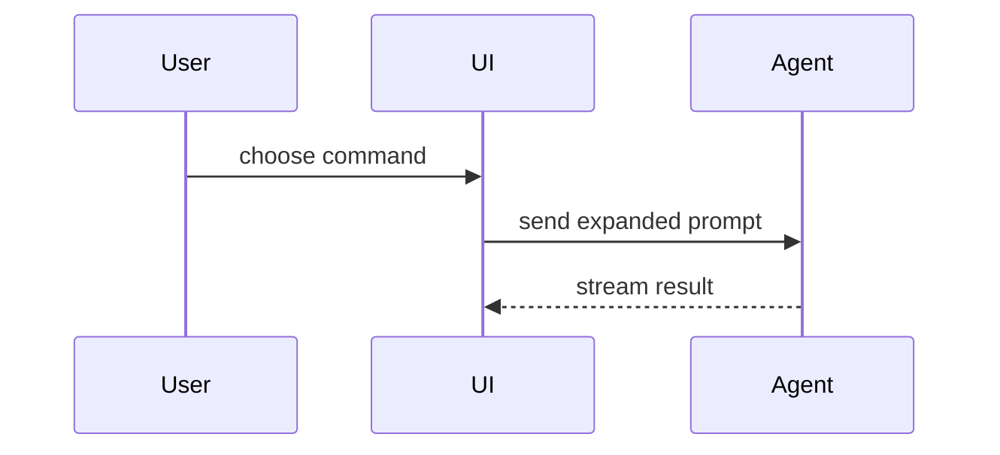

# Show, don't retype

Help the user understand the current topic visually. Skip the preamble and keep prose brief. Pick the smallest view that makes the key point clear, and place each visual next to the short text it supports.

Two kinds of visuals exist, and the split matters:

- **Sketches** are short, hand-shaped fences you write inline: pseudocode, call trees, component trees, file trees, Mermaid, and shape diffs. Use them for the *idea*.
- **Real content** — actual source, a real `git diff`, logs, generated output, screenshots — never goes into a message from memory. Write it to a file and call `show_file`. The user sees a highlighted, line-numbered card they can select lines in and comment on; you avoid transcription errors and wasted tokens.

## Sketches

Show logic or an algorithm as pseudocode:

```text
on(save)
  if content is unchanged
    return cached result
  write new content
  return fresh result
```

Show runtime control flow as a call tree:

```text
submitForm
  createSession
    persistPrompt
    launchAgent
  navigateToSession
```

Show UI structure as a component tree, including the state and module boundaries that matter:

```tsx
<SessionPage> (ui/src/routes/session.tsx)
  useSessionEvents()
  <SessionToolbar>
    <RunSkillButton> (packages/ui)
```

Show file responsibility or a broad refactor as a shallow file tree:

```text
agent/
├── tools/        # one module per tool, wired in server.py
├── middleware/   # ordered stack, see server.py
└── sandboxes/    # providers and reconnection
```

Show component interaction, control flow, or data flow with Mermaid. The dashboard renders ```` ```mermaid ```` fences inline; keep them to one idea and under ~15 nodes:



Use a `diff` fence for a **shape** change when the surrounding shape already exists — a component tree, a file layout, a call tree, or pseudocode. Match the diff shape to the topic:

```diff
 submitForm
   createSession
     persistPrompt
+    expandSkillMention
     launchAgent
-  navigateToSession
+  navigateToSession
+    subscribeToEvents
```

Show a whole block inline only when it is short, mostly new, and the user needs a copyable target shape:

```ts
function expandSkill(command: string): string {
  return `use the ${command.slice(1)} skill`
}
```

## Real content: `show_file`

Reach for `show_file` whenever the visual is something that exists on disk or can be produced by a command.

- **Code you changed.** Write the diff, then show it. Never retype a code diff into chat.

  ```bash
  mkdir -p .open-swe/artifacts && git diff > .open-swe/artifacts/changes.patch
  ```

  then `show_file(path=".open-swe/artifacts/changes.patch", title="Changes")`. Scope with paths or `git diff main...HEAD -- src/` when the full diff is noisy.

- **Code you are pointing at.** `show_file(path="agent/server.py", start_line=663, end_line=680, title="Download gating")`. The whole file renders with that range pre-selected, so the user keeps context and can widen the selection.

- **Output and logs.** Test failures, build output, a generated config: redirect to a file under `.open-swe/artifacts/` and show that, instead of pasting a wall of text.

- **Screenshots and images.** `show_file(path=".open-swe/artifacts/after.png", title="Settings page after")`.

- **Larger diagrams.** A Mermaid diagram too long to read as a fence: write it to `.open-swe/artifacts/flow.mmd` and `show_file` renders it as a diagram card.

- **Documents.** A README, a design note, or any `.md` renders as formatted Markdown, including its Mermaid fences.

Keep temporary files under `.open-swe/artifacts/` and add that path to the checkout's `.git/info/exclude`. Text is capped at 200 KB and images at 3 MB; write a narrower excerpt if you hit the cap.

After showing a card, reference it ("the highlighted lines in the card above") rather than restating its contents. The user can select lines in a text or diff card and press **Comment** to quote them into their reply, so a card is also how you invite precise feedback.

## Dense or interactive visuals

For a layout, a state comparison, an infographic, or a concept too dense for Mermaid, write one focused HTML file and publish it with `output_iframe` (dashboard) or `slack_attach_html` (Slack). Read the `html-artifacts` skill first for the authoring rules. Match the product's colors, type, and components; use real labels and data.

## Surface

- **Dashboard / desktop:** everything above applies. `show_file` and inline Mermaid are available.
- **Slack:** `show_file` is unavailable and Mermaid does not render. Keep sketches to `text` fences, and put anything longer — diffs, diagrams, multi-section explanations — in a `save_plan` artifact and send only its link.

You may use one of these views, you may use several; you will rarely use all of them. Don't overwhelm the user.

---

Adapted from the `show-me` skill in [humanlayer/skills](https://github.com/humanlayer/skills) (MIT).
