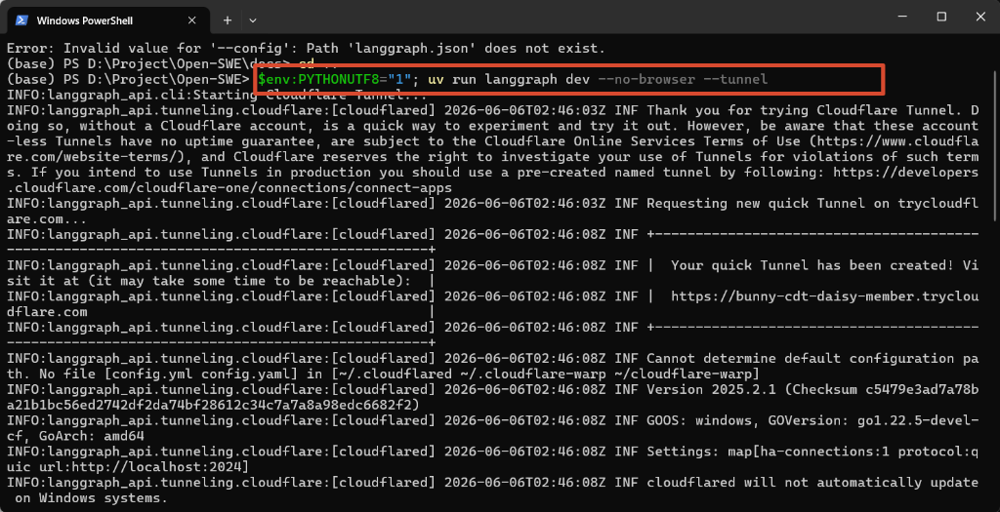
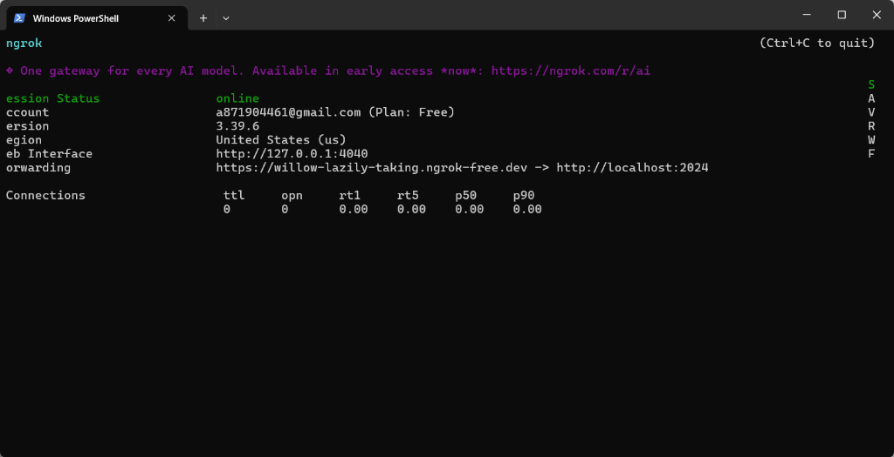
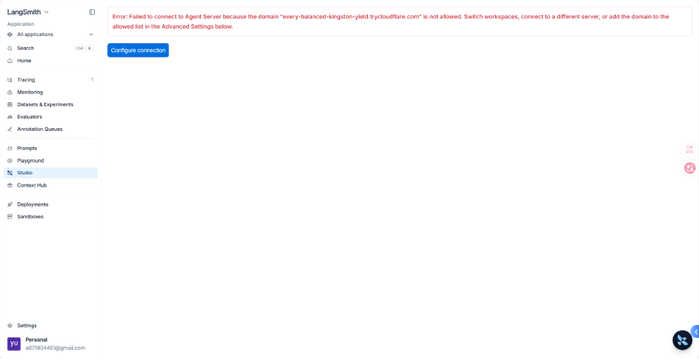
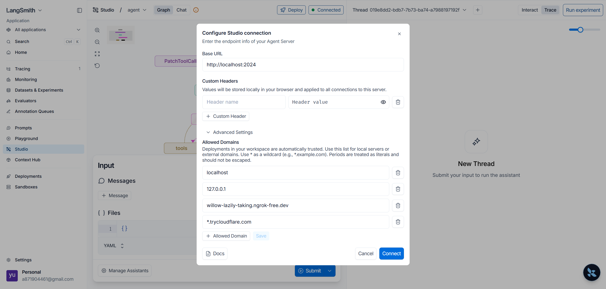

# LangSmith Studio 允许域名（Allowed Domains）配置指南

在开始在新的浏览器（如 Microsoft Edge）或新的环境中使用 LangSmith Studio 调试和运行图（Graph）之前，需要先启动本地开发服务，并将其暴露给外网以便 LangSmith Web 端（`smith.langchain.com`）能够安全访问。

本指南将详细介绍如何**启动 ngrok / Cloudflare 穿透服务**、**访问 LangSmith Studio**，以及在连接失败时**配置允许域名（Allowed Domains）**。

---

## 1. 准备工作：启动本地开发环境

要使部署在本地的 LangGraph 代理服务能被公网的 LangSmith Studio 访问，我们必须启动端口转发（穿透）隧道。

### 方式一：使用 Cloudflare 隧道启动服务（推荐）

在项目根目录下打开 PowerShell 终端，直接运行以下命令：
```powershell
$env:PYTHONUTF8="1"; uv run langgraph dev --no-browser --tunnel
```
启动后，终端将自动通过 Cloudflare 生成一个临时外网访问 URL（如 `https://*.trycloudflare.com`），并开始监听本地的 `2024` 端口：



### 方式二：使用 ngrok 启动端口转发

如果您已拥有固定的 ngrok 静态域名，可以分步启动：
1. 首先在项目根目录下正常启动本地开发服务：
   ```powershell
   $env:PYTHONUTF8="1"; uv run langgraph dev --no-browser
   ```
2. 打开另一个 PowerShell 终端，使用 `ngrok` 暴露本地的 `2024` 端口：
   ```powershell
   ngrok http 2024 --url https://willow-lazily-taking.ngrok-free.dev
   ```

启动后，会显示转发状态（Forwarding）指向 `http://localhost:2024`：



---

## 2. 访问 LangSmith Studio

准备好外网穿透 URL 后，可以使用浏览器访问 LangSmith Studio 可视化页面。在 URL 的 `baseUrl` 参数中填入您生成的穿透域名：

* **Cloudflare 访问链接**：
  `https://smith.langchain.com/studio/?baseUrl=https://<您的Cloudflare子域名>.trycloudflare.com`
* **ngrok 访问链接**：
  `https://smith.langchain.com/studio/?baseUrl=https://willow-lazily-taking.ngrok-free.dev`

---

## 3. 解决连接域名被拒错误

当在新的浏览器（如 Microsoft Edge）首次打开上述链接时，由于浏览器本地存储（Local Storage）中未保存对此穿透域名的信任，可能会遇到 **Failed to connect to Agent Server** 错误。请按以下两步配置：

### 第一步：打开连接设置面板

当您在页面上看到红色域名权限警告时：
1. 点击警告框中的蓝色 **`Configure connection`**（配置连接）按钮。
2. 或者，也可以直接点击页面顶部 header 处的连接状态指示药丸（显示 **`Connected`** 或 **`Disconnected`** 的状态灯）。



---

### 第二步：展开高级设置并添加允许域名

当 **Configure Studio connection** 面板在右侧打开后：
1. 向下滚动并点击 **`Advanced Settings`**（高级设置）折叠项以展开它。
2. 找到 **`Allowed Domains`**（允许的域名）配置列表。
3. 在文本输入框中，输入需要允许的域名，建议添加以下通配符和具体域名：
   * **`*.trycloudflare.com`**（允许所有 Cloudflare 穿透隧道）
   * **`*.ngrok-free.dev`**（允许所有 ngrok 穿透隧道）
   * 以及您终端生成的具体穿透域名（如 `every-balanced-kingston-yield.trycloudflare.com`）。
4. 点击面板右下角的蓝色 **`Save`**（保存）按钮保存设置，然后点击 **`Connect`**（连接）。



---

保存成功后，页面顶部的连接状态指示灯会变为绿色并显示 **Connected**，即可在 Microsoft Edge 浏览器中正常加载和调试可视化图（Graph）。
