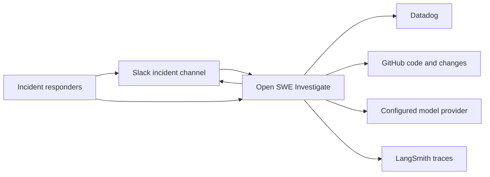
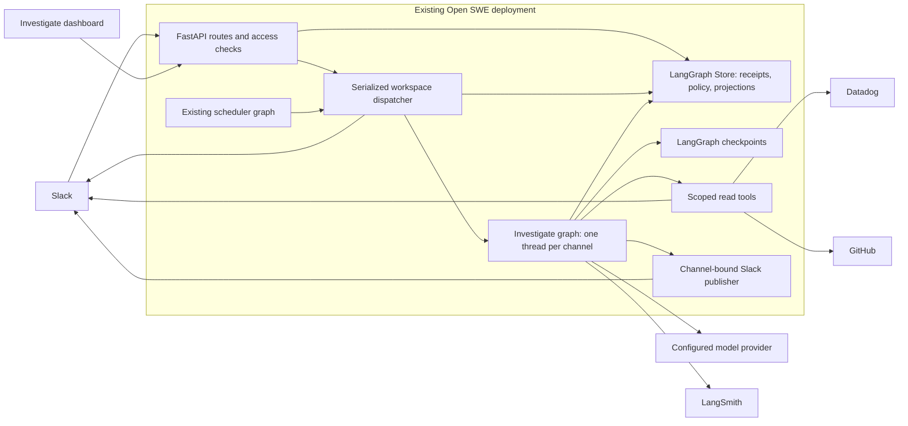
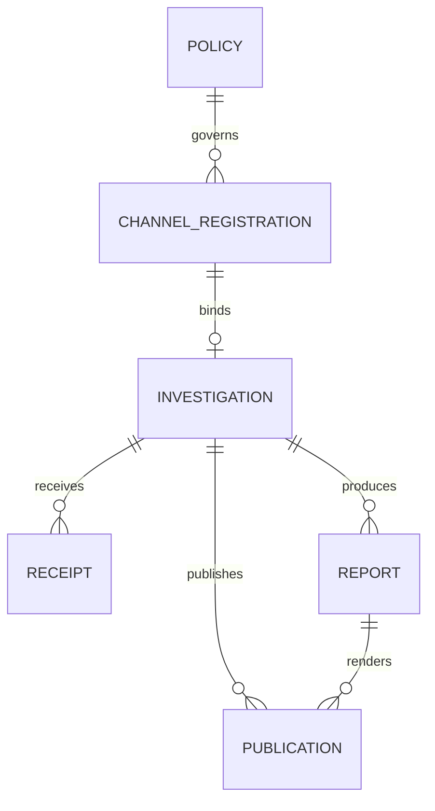
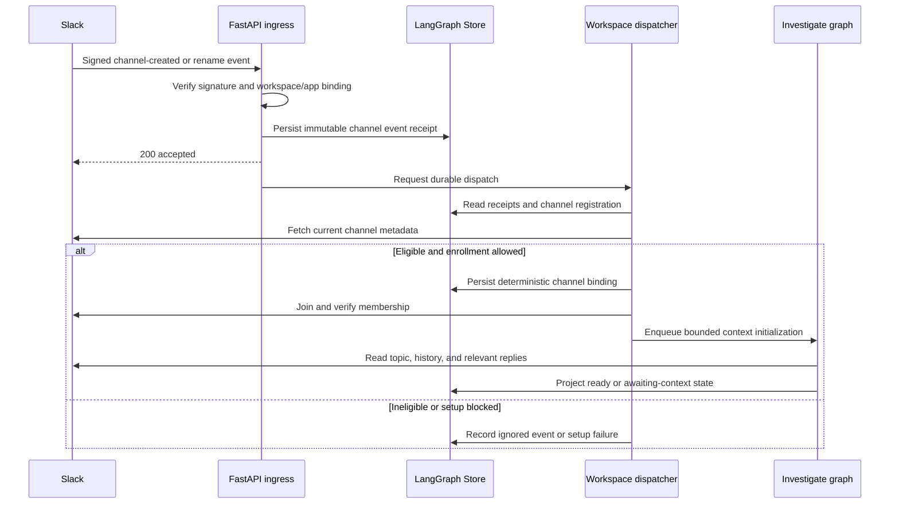
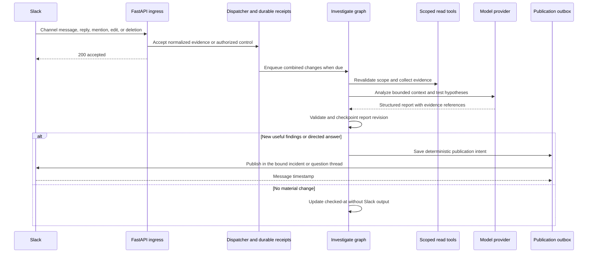
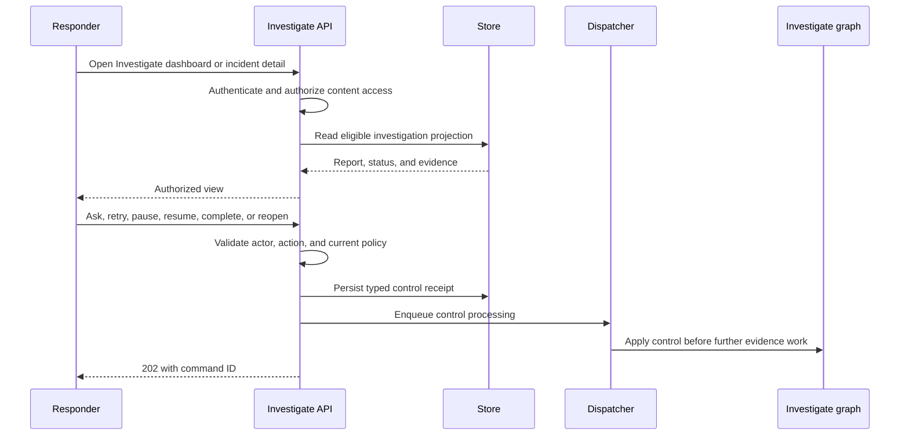
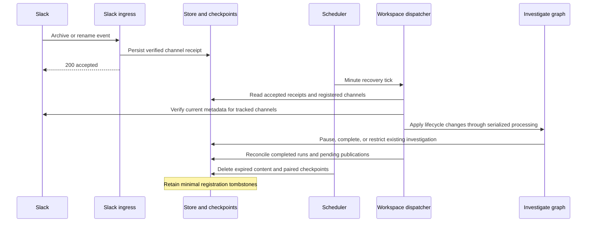
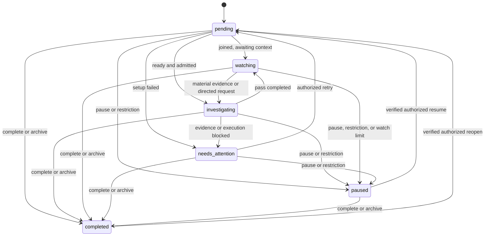

# Investigate: incident investigation product and dashboard

Status: local implementation on `codex/investigate`, based on the `make dev-ui` branch. See [local setup and verification](investigate-local.md). The sections below retain the target design; live Slack/Datadog/GitHub installation and model-quality validation have not been performed.

Implementation notes: the workspace/app binding is configured by an administrator before the first registration, then locked. Repository, service, and bot allowlists were removed on September 7, 2026; evidence access is bounded by the GitHub App installation and the team Datadog connection, and all channel messages except Open SWE's own output are evidence. Setup uses Slack identity and reported OAuth grants; event delivery, joining, and reply access still require the documented live test channel. Recovery currently uses a minute tick and source retry backoff rather than the proposed 5/15/60-second setup sequence. Uncertain Slack sends are recorded visibly and are never blindly repeated; automatic reconciliation of those sends is deferred. Delivery status identifiers remain until investigation content expires, while detailed delivery text is cleared after seven days. Default output is Observe.

**Investigate** is its own product in Open SWE, with a dedicated dashboard. **Triage** is a separate planned product for alert and bug investigation and fix PRs (user decision). This document designs Investigate: automatically joining eligible Slack channels whose names match a configured prefix, investigating the incident context, and working with responders there. Onboarding uses Slack channel creation and rename events only. Incident MCP support is deferred. Alert and bug monitoring and fix PRs belong to Triage. Production remediation is outside this release.

## Context

The team currently uses incident.io to create incident channels whose names begin with `inc-`, but wants Investigate to work from Slack channel creation and a prefix rather than depend on an incident provider (user). A person, incident.io, or another tool can create the channel. The current scope is to react to channel creation/rename events and investigate; historical channel discovery and incident MCP integration are deferred (user). Slack is where responders gather evidence and coordinate across services and repositories.

Open SWE already has a FastAPI application, durable LangGraph runs, a React dashboard, Slack integration, GitHub code access, and authorized observability tools. The following implementation points anchor this design:

| Existing component | Verified behavior and source |
| --- | --- |
| Application composition | `agent/api/app.py:create_app` mounts the Slack and dashboard routers. `langgraph.json:graphs` registers agent, reviewer, analyzer, chat, and scheduler graphs. |
| Slack ingress | `agent/slack/routes.py:slack_webhook` verifies signatures, checks channel eligibility, routes mentions and selected replies, filters bot messages, and starts background processing. |
| Coding request identity | `agent/slack/webhook.py:_process_slack_mention_impl` resolves the initiating person and generally requires their usable GitHub authorization, with a bot-token-only exception. |
| Channel restrictions | `agent/slack/client.py:slack_channel_allows_operations` rejects unverified or externally shared channels. Investigate must additionally exclude DMs and private channels in the initial release. |
| Slack history | `agent/slack/client.py:fetch_slack_thread_messages` retrieves a bounded thread window, or channel history for a code-channel session. It does not reconstruct every reply thread in an incident channel. |
| Delivery deduplication | `agent/slack/events.py:claim_slack_event` uses remote claims and a local cache, but can fail open when remote claims fail. It is insufficient as Investigate's durable inbox. |
| Durable execution | `agent/dispatch.py:create_durable_run` supports `multitask_strategy`, delayed execution, synchronous checkpoints, resumable streams, and completion callbacks. The default strategy is `interrupt`. |
| Storage | `agent/store.py:TypedStore` provides validated records in LangGraph Store. It exposes ordinary get/put/search operations, not transactional compare-and-swap or a distributed lock. |
| Read-only agent precedent | `agent/chat.py:get_chat_agent` uses repository API tools without a sandbox and excludes shell and file mutation tools. Its PR-specific context needs adaptation. |
| Observability | `agent/server.py:_observability_tools_for` gates access by identity. `agent/tool_loaders/datadog_mcp.py:load_datadog_tools` loads the configured MCP catalog. A catalog described as query-oriented is not an enforced read-only policy. |
| Dashboard access | `agent/dashboard/oauth.py:require_session` authenticates users. `agent/dashboard/routes.py:router` applies mutation origin checks. `agent/dashboard/thread_api.py:_thread_is_readable` currently permits any authenticated user to read surfaced-source threads. |
| Navigation | `ui/src/features/agents/components/AgentsSidebar.tsx:NAV` contains Kanban, Skills, Automations, and Reviews. |

Slack documents channel creation and rename notifications through [`channel_created`](https://docs.slack.dev/reference/events/channel_created) and [`channel_rename`](https://docs.slack.dev/reference/events/channel_rename), with `channels:read`. Public-channel membership can be established through [`conversations.join`](https://docs.slack.dev/reference/methods/conversations.join), with bot scope `channels:join`. These capabilities ground the proposed onboarding path; deployment validation must confirm event delivery and granted scopes for the installed bot.

## Problem Statement

Responders repeatedly assemble incident context from Slack, telemetry, deployments, and code before they can test a useful hypothesis. Findings become scattered across channel messages and reply threads. New responders must reconstruct what has already been checked and which explanations remain plausible.

Open SWE's current Slack coding workflow does not represent a persistent incident investigation. Treating each incident-channel message as a coding request would introduce competing tasks, interruptions, unsuitable authorization requirements, and excessive channel output.

This release addresses investigations in designated incident channels. It excludes detecting undeclared bugs, deciding whether an alert warrants an incident, creating PRs, changing production, writing status-page updates, or replacing an incident-management workflow.

## Assumptions

1. **The pilot covers public, internal channels in one configured Slack workspace, regardless of who creates them.** Private incidents and Slack Connect channels are excluded initially.
   **Why:** the current dashboard does not enforce private-channel membership on incident content. Supporting private incidents requires an additional access model.
2. **An administrator explicitly enables automatic investigation for a channel policy, including a nonempty prefix (default `inc-`), channel exclusions, permitted services/repositories, data sources, and budgets.**
   **Why:** prefix matching is the enrollment convention requested by the user. It authorizes automatic work under a bounded workspace policy; it does not establish vendor ownership or grant production access to whoever creates a matching channel.
3. **Datadog and GitHub are the initial investigation data sources.** Other configured sources can be added through the same constrained tool interface.
   **Why:** both have existing Open SWE integration points. An integration being configured does not automatically authorize its use by Investigate.
4. **Production reads and incident-channel findings are sufficient for the first useful release.**
   **Why:** the user prioritized investigation and expressed less interest in operational remediation. A sandbox and code-writing workflow are unnecessary for this scope.

## Functional Requirements

The following requirements are proposed behavior derived from the user's incident-channel workflow.

1. Discover matching public Slack channels from channel creation/rename events received while the feature is enabled, join eligible channels, and start an investigation when context is available without requiring a responder mention or an incident.io connection.
2. Maintain one investigation and persistent LangGraph thread per `(workspace_id, channel_id)`. Repeated events, Slack mentions, policy edits, and channel renames must reuse that identity. Multiple channels are separate investigations in v1, even if they concern the same outage.
3. Read the channel topic/purpose, incident descriptions posted in messages, conversation and reply threads, relevant telemetry, recent changes, and permitted code. Preserve author, time, source link, and retrieval time for evidence.
4. Publish an initial assessment with observed symptoms, affected scope, supported hypotheses, checks performed, and unresolved questions. Explicitly allow an inconclusive result.
5. Incorporate material new evidence and answer directed questions while automatic investigation is enabled for the channel. Ingesting a message does not imply running a model or posting a reply.
6. Let authorized responders pause, resume, complete, reopen, request another pass, and correct an investigation. These controls affect Investigate only.
7. Stop automatic investigation on explicit completion or channel archival. Pause on inactivity, maximum watch duration, exclusion, or loss of eligibility. Preserve reports and permit explicit follow-ups under the same access policy; do not infer incident resolution from silence or bot message text.
8. Expose investigations in Investigate's dedicated dashboard, including current findings, evidence, channel state, agent activity, coverage gaps, and Slack links. Structured incident-provider metadata is outside this release.
9. Exclude Investigate records from ordinary coding-task lists and prevent access through generic thread endpoints from bypassing Investigate authorization.
10. Make setup failures, missing data, exhausted budgets, and delivery failures visible without producing repeated channel messages.

### Product: Investigate

An example experience:

1. A person or incident tool creates `#inc-123-checkout-errors`, or renames a channel into the configured prefix.
2. Open SWE discovers the channel, checks eligibility, joins, and posts one introduction with a link to the dashboard investigation: “Investigate is following this channel. Findings will appear here; the full investigation is at Open investigation. Mention me with a question.” Findings, answers, and lifecycle notices are channel-level posts (changed September 7, 2026, to match code channels); a question asked inside a thread is answered in that thread. (The Observe/Channel output toggle was removed on September 7, 2026; Slack is the primary responder surface and every investigation posts there.)
3. The initial findings appear as a reply to that introduction. Each substantive claim links to evidence. A compact report might say: “Errors are concentrated in checkout-api after deployment X. Database latency is unchanged. The new retry path is a plausible cause; I have not established causality.”
4. A responder posts a trace in another reply thread. Investigate incorporates it into the same incident investigation. A direct question receives a reply in that question's thread; the shared findings remain accessible from the introduction and Investigate dashboard.
5. A materially revised explanation produces a short update in the investigation thread. Routine tool activity and unchanged hypotheses stay in the dashboard.
6. A responder selects Complete in the dashboard or issues an authorized directed completion command in Slack. Investigate stops watching and posts at most one final summary. If the channel is archived first, completion remains visible in the dashboard without attempting to post into the archived channel. Neither completion nor inactivity means production is resolved.

The agent is read-only with respect to production and repositories. Its allowed writes are investigation state and narrowly scoped Slack output. “Fix this” in an incident conversation produces an explanation of the scope and a proposed engineering follow-up, not a PR in this release.

### Investigate dashboard

Add **Investigate** as a product entry in Open SWE's application navigation. It opens its own dashboard with an incident investigation inbox, detail pages, and product settings. Responders can enter Investigate directly without navigating through the coding-task dashboard or Triage.

| Surface | Proposed behavior |
| --- | --- |
| List | Channel name/title, affected services, channel state, investigation status and stop reason, latest finding, and last meaningful update. |
| Filters | Active, Paused, Needs attention, and Completed, plus service and text search. Needs attention includes missing access, a responder question, failed execution, or an exhausted budget. |
| Detail | Findings first, then evidence and checks, incident timeline, coverage/access gaps, and expandable agent activity. Show evidence-backed conclusions separately from hypotheses. |
| Controls | Ask Investigate, Investigate again, Pause, Resume, Complete, Reopen, and Open in Slack. Controls obey the same authorization and lifecycle rules as Slack. |
| Setup | An admin-only settings panel for Slack connection and event delivery health, prefix and excluded channels, service/repository mappings, output mode, budgets, and idle/watch limits. |
| Empty state | Explain that Investigate starts when a channel is created or renamed with the configured prefix. Show “Waiting for matching channel events,” along with known permission, delivery, or join failures. |
| Visibility | Authorized SRE users can see the Investigate dashboard. Counts, previews, search results, and activity must use the same content access checks as detail. |

Proposed routes are `/investigate` and `/investigate/$investigationId`, with settings at `/investigate/settings`. Reuse shared application-shell and activity components while giving Investigate its own dashboard navigation and incident-specific detail page. Keep channel archival and investigation execution status separate. Neither field claims that an outage has been resolved.

### Separate product: Triage

Triage is the separate product for monitoring and investigating alerts and bugs and opening fix PRs (user decision). It will have its own product surface and design. Its workflow starts from an alert or bug, investigates the cause, and can produce a proposed code fix as a PR. Source integrations, prioritization, automation policy, and PR review requirements will be specified in the Triage design.

| Product | Entry point | Primary outcome |
| --- | --- | --- |
| Investigate | A Slack channel matching the configured incident prefix | Evidence-backed findings and responder collaboration, visible in Slack and a dedicated Investigate dashboard. |
| Triage | An alert or bug | Investigation of the alert or bug and, where a code fix is supported, a fix PR. |

Both products investigate problems; their entry points and workflows define the product boundary. Investigate operates independently, starting directly from Slack channel creation/rename events. A future handoff could send a supported incident diagnosis to Triage for a fix PR, with Triage reusing Open SWE's coding agent. Triage could also link an alert or bug to an existing incident investigation. These cross-product handoffs are future integration work and are outside the initial Investigate release.

## Non-functional Requirements

All numeric values here are proposed pilot defaults and acceptance targets, not existing production guarantees.

### Security

- **Inbound identity:** verify Slack's existing signature and timestamp contract against the raw body. Bind `team_id` and `api_app_id` to the configured workspace/app before accepting a channel event or conversation receipt. Resolve dashboard controls to the same server-owned workspace policy. Channel names and message text cannot supply permission grants.
- **Automatic principal:** run under a server-resolved Investigate policy, not an impersonated responder or an admin's personal GitHub token. Revalidate enabled status and access policy before each run and sensitive tool call. Client-supplied model/tool configuration cannot grant additional access.
- **Tool enforcement:** expose an explicit allowlist of read operations with service, time-window, and repository bounds. Do not attach the full main-agent tool catalog, general HTTP/shell tools, automation tools, or repository/production mutation tools. Do not rely on a prompt or an MCP read-only annotation to enforce this. Any subagent receives the same or narrower capability set.
- **Publishing:** resolve the destination channel from the stored investigation binding. The model cannot select arbitrary channels, users, URLs, or attachments for delivery. Mask customer content and secrets in channel reports; prefer source links and aggregate observations. Channel text and retrieved logs are evidence, not instructions that can widen access.
- **Dashboard authorization:** require an authenticated session plus `is_observability_authorized` for reading investigation content and sending questions. Require admin access for policy/connection changes. Lifecycle controls require an authorized responder identity. Ordinary channel messages may supply evidence but cannot change settings or access grants.
- **Generic access paths:** keep `source=investigate` out of `_SURFACED_SOURCES` initially. Dedicated Investigate endpoints must check authorization before every read and stream. Generic thread search, state/history, stream, run commands, export, and mutation routes must reject investigation threads unless they call the same policy check. Deployment-level LangGraph access must not expose these threads to less privileged browser clients.
- **Visibility changes:** recheck channel eligibility before telemetry reads and publication. Dashboard content access requires read eligibility verified within the preceding 60 seconds; if verification is stale, refresh it before returning content. A discovered private/external conversion, loss of membership, or inability to verify eligibility restricts the stored record and stops work. Cached dashboard access can therefore lag a change by at most 60 seconds. Do not leave an already-indexed report readable indefinitely under its previous public status. Administrators can see minimal setup/recovery metadata without accessing the restricted transcript or report.
- **Secrets:** reuse the existing Slack installation and server-side observability/code credentials. This release introduces no incident-provider API key or signing secret. Secrets are excluded from prompts, browser responses, receipts, and traces; connection status reports health only.
- **Data handling:** persist only the bounded context needed for the investigation. Proposed retention is 30 days for investigation content and checkpoints, 7 days for delivery receipts and detailed delivery diagnostics. Retain a minimal registration/tombstone for enrolled channels while the workspace policy exists so later events cannot restart completed or expired investigations; this contains IDs/state and timestamps, not messages or reports. Add explicit cleanup for Store records; `langgraph.json:checkpointer.ttl` does not establish Store retention. Redact tracing inputs and outputs, and align LangSmith trace retention with this policy before the pilot.

### Service Quality

| Property | Proposed requirement |
| --- | --- |
| Event acknowledgment | Persist a receipt and acknowledge within 2 seconds at p95 under pilot load, with no LLM or external context fetch in the acknowledgment path. Return a retryable failure when durable acceptance fails. |
| Initial response | With an admission slot available, admit within 60 seconds of discovering and joining an eligible channel with usable context. Target first useful findings within 3 minutes at p95 from admission with healthy upstream services. Measure queue delay separately and show queued/degraded status rather than promising this latency under saturation. |
| Debounce | Wait 15 seconds to combine ordinary conversation changes, with a maximum 60-second wait from the first pending message. A direct question bypasses this delay but does not interrupt an active investigation pass. |
| Concurrency | At most one active pass per channel. For the initial small pilot, admit one model-running investigation at a time per workspace through a serialized dispatcher; queue other investigations visibly. Scale this after measuring latency. |
| Budgets | At most 20 model calls and 5 minutes per pass. No hourly pass cap (removed September 7, 2026): new messages steer the investigation and each triggers a pass after a 15-second burst debounce; the thread is only posted to when findings change. Human requests use the same per-pass cap. |
| Slack output | At most one unsolicited findings update per investigation per 5 minutes after the initial report, and only when its substance changes. Directed answers and a single closure summary are distinct publication reasons. |
| Upstream failure | Respect `Retry-After`; use bounded retries for transient errors. Permission failures mark the relevant source unavailable. Missing results are never evidence that a service is healthy. |
| Watch limits | Pause after 2 hours without accepted human or allowlisted source activity, or after 24 hours of watching since enrollment/resume/reopen. Own output, tool activity, and edits/deletions do not extend these timers. Explicit Resume/Reopen starts a new watch window. These configurable defaults bound work without inferring resolution. |
| Recovery | A scheduler tick every minute repairs accepted-but-undispatched receipts, pending setup, completed runs awaiting projection, and publication reconciliation. Recovery does not depend on an in-process task surviving a restart. |

Slack history and reply APIs have distribution-dependent rate limits. Their internal-app limits differ from limits on certain commercially distributed apps. The connector must paginate, track incomplete history, and honor observed throttling rather than assuming one universal request rate. Source: [conversations.replies](https://docs.slack.dev/reference/methods/conversations.replies).

### Observability

Use the existing LangSmith tracing path for graph execution with the redaction/retention controls above. Add structured static log messages with investigation ID, channel ID, workspace ID, receipt ID, and run ID in `extra`; do not log raw Slack bodies or tool results.

Measure event-to-onboarding latency, event acceptance failures, join failures, empty-context duration, acceptance failures, receipt age, time to first useful report, queue delay, model calls/cost, connector errors, unknown publication outcomes, and useful/no-change passes. Expose these in the Investigate admin setup panel and operational metrics. Alert on accepted receipts remaining undispatched for five minutes and on repeated integration authentication failures. Metrics and alerts are proposed implementation work; no existing dashboard is assumed.

## Logical View

### Approach and alternatives

**Recommended: native Investigate graph with Slack channel creation/rename events and conversation ingress.** The prefix is the enrollment rule; the channel ID is the identity. Reuse Open SWE's model configuration, durable dispatch, Store, code-read tools, and telemetry connection. Add event-based onboarding, a dedicated tool policy, investigation state, and publication controls.

Alternatives:

- **Require incident.io lifecycle webhooks.** This provides authoritative incident metadata and closure signals, but makes an incident provider a prerequisite. Incident MCP support may be considered later; the current release focuses on investigation from Slack and available evidence tools.
- **Require a manual bot invite.** This adds responder work to every incident. Use channel creation/rename events for automatic onboarding.
- **Treat every matching channel as a code channel.** This inherits coding identity, tools, interruption behavior, and the assumption that every message addresses the agent. Reuse the ingress infrastructure with a separate investigation route and policy.
- **Delegate investigation to HolmesGPT immediately.** This adds a specialized connector ecosystem but also another runtime and separate policy/execution history. Keep an investigation-engine interface for later evaluation; Holmes is not a dependency of the initial release.

### System boundary

All new boxes and arrows below are proposed. They reuse the existing application and LangGraph runtime rather than adding a new service or database. Deployment region and infrastructure placement remain those of the existing deployment; this repository review does not establish them.

The dispatcher is a small durable coordinator graph, not another reasoning agent. It is the only writer of workspace admission state. Investigation graphs own their per-channel state and project reports into Store. These are separate responsibilities and must not race by updating the same records.

### Channel events and onboarding

The following is proposed behavior based on Slack's documented events and conversation APIs. Only `channel_created` and `channel_rename` can enroll a channel. There is no workspace channel scan, historical backfill, or manual enrollment interface in this release (user scope).

1. **Enable a workspace policy.** Configure `channel_prefix=inc-` (stored without `#`), excluded channel IDs, permitted evidence sources, budgets, and output mode. Reject an empty prefix. Explain that a matching creation/rename event can enroll any eligible public internal channel, including one created manually. One policy per workspace is sufficient for v1.
2. **Accept channel events.** Subscribe to `channel_created` and `channel_rename`, and persist their channel IDs after verifying the Slack envelope. For an unregistered channel, require an event whose source time is at or after `enabled_at`; a delayed event from before enablement does not enroll it. A prefix match in the event is a hint; fetch current metadata with [`conversations.info`](https://docs.slack.dev/reference/methods/conversations.info) before joining. This handles creation followed quickly by rename, out-of-order events, and visibility changes.
3. **Verify eligibility.** Require the configured workspace, an actual public channel (not a DM/MPDM), current prefix match, no explicit exclusion, and no external or pending external sharing. Use explicit conversation flags, not the channel ID prefix. Extend the metadata used by `agent/slack/client.py:slack_channel_allows_operations`; its current checks alone do not enforce this full policy.
4. **Register by channel identity.** The serialized workspace coordinator creates or retrieves the binding for `(workspace_id, channel_id)` and derives a deterministic investigation/thread ID. A policy edit or a different channel name must not change it. The prefix authorizes enrollment under the configured policy; no incident.io ID or proof of channel creator is required. A channel already used as an Open SWE coding channel needs an explicit routing decision before enrollment, so both workflows cannot consume it.
5. **Join and verify membership.** Call `conversations.join` using the installed bot and `channels:join`, accept `already_in_channel`, and verify membership before context reads or posting. Retry transient metadata/join failures after 5, 15, and 60 seconds, then through minute reconciliation for up to 15 minutes. Missing scope or persistent failure becomes Needs attention. A later authorized retry uses the same binding.
6. **Wait for useful context.** Debounce for 15 seconds after joining, then read topic/purpose, bounded history, and relevant replies. Channel creation can precede the incident description. With only a name or empty boilerplate, record `watching` with reason `awaiting_context`; do not spend an LLM/telemetry pass inventing symptoms. Later substantive messages trigger the first pass. The one introduction may be posted in channel output mode while waiting.

Subscribe to `message.channels`, `app_mention`, and `channel_archive` as well. The public-channel integration needs `channels:read`, `channels:join`, `channels:history`, `app_mentions:read`, and `chat:write`; actual grants and event delivery are checked during setup. Existing Slack routes are reused, but the sample manifest in `docs/INSTALLATION.md` must be updated during implementation. No new private-channel access is required. Sources: [channel creation](https://docs.slack.dev/reference/events/channel_created), [rename](https://docs.slack.dev/reference/events/channel_rename), [archive](https://docs.slack.dev/reference/events/channel_archive), [join](https://docs.slack.dev/reference/methods/conversations.join), [channel messages](https://docs.slack.dev/reference/events/message.channels).

### Event delivery and scope

A creation or rename event enrolls its channel if the current name matches the configured prefix and the remaining eligibility checks pass. A previously existing channel can enroll through a new rename event; its age does not matter. Already matching channels that produce no new creation/rename event are left alone. Enabling Investigate or changing its prefix does not enumerate channels or launch investigations retroactively. Bot invitations and ordinary messages do not enroll unknown channels.

Persist accepted events before acknowledging them, deduplicate Slack retries, and recover accepted-but-unprocessed events through the existing durable coordinator. A creation/rename event that never reaches durable acceptance and is not redelivered can be missed; v1 does not compensate with a channel scan. This is the accepted scope tradeoff. A later matching rename event can still enroll that channel.

Recovery is limited to accepted receipts and channels already registered with Investigate: retry setup, check access, resume interrupted work, and reconcile report delivery. Reading bounded message history within an enrolled channel remains necessary to assemble investigation context. It does not discover or backfill other channels.

### Investigation lifecycle without an incident provider

Investigate owns its watch lifecycle. Slack is authoritative for channel metadata and access, not for whether an outage is resolved.

| Signal | Investigate behavior |
| --- | --- |
| New eligible channel with context | Start the initial pass, then watch for material updates. |
| Authorized Pause / Resume | Pause or resume watching under current policy; ordinary messages never clear a pause. |
| Authorized Complete | Stop automatic work, retain findings, and publish one final summary if the channel permits posting. |
| Channel archived | Complete with reason `channel_archived`; retain the dashboard report and suppress further Slack output. |
| Channel unarchived | Refresh metadata through reconciliation; keep the investigation completed until explicit Reopen. |
| No accepted source activity for 2 hours, or watch window reaches 24 hours | Pause with reason `idle` or `watch_limit`; do not label the incident resolved. |
| Rename outside prefix, exclusion, or policy disabled | Stop automatic work and require verified eligibility plus explicit Resume. Retain identity and authorized historical access. |
| Bot removed, private/external conversion, or access cannot be verified | Pause and restrict content access. Do not automatically rejoin a previously enrolled channel after removal; require explicit Resume/recovery by an authorized operator. |
| Authorized Reopen | Revalidate the channel, restart watching on the same retained investigation, and begin a new watch window. |

Check current channel state when processing delayed archive/rename hints. Neither a late creation event, a rename back into the prefix, nor new ordinary messages can override an explicit completion/pause. Separate `can_read`, `can_watch`, and `can_publish`: archival or a prefix change stops work without itself revoking access to historical reports; privacy/external membership changes do revoke that access. A completed archived channel permits dashboard review and bounded read-only follow-ups if access is still verified, with no Slack publication.

Start idle accounting at the later of `watch_started_at` and the most recent eligible source-message time. Replayed history and duplicate deliveries do not count as new activity. Watch-limit checks also cover pending and blocked investigations so a setup failure cannot retain an open watch window indefinitely.

### Future incident MCP support

Incident MCP support is deferred. The current release requires no incident-provider credentials, connector, webhook, metadata schema, or status mapping. It investigates using Slack context, Datadog, and permitted GitHub reads.

Later, an incident MCP integration could supply additional incident context and historical findings through scoped read tools. Design and authorize that integration separately; it is not part of current onboarding or lifecycle control. Incident-management bot messages already present in an enrolled Slack channel can be used as cited evidence, without treating them as authoritative lifecycle commands.

### Conversation and investigation behavior

Route events for a registered investigation channel before the current mention-only and bot-message filters. Do not change those filters for other channels. Messages in any reply thread map to the channel's investigation ID; retain each original `thread_ts` for context and directed replies. Do not reuse the special code-channel session timestamp.

The channel event branch and registered-investigation branch must precede external channel-context lookups in the current Slack acknowledgment path. Verify the Slack signature and configured workspace; persist supported channel events or receipts for an existing durable channel binding first. Perform fresh external eligibility checks in processing before any context expansion or output. An event arriving before its binding exists can be recovered through bounded bootstrap history after registration.

Normalize message text, text-bearing blocks/attachments, author/bot identity, timestamp, edits, deletions, and source permalink. Ingest allowlisted incident-management/monitor bot messages as evidence; ignore Open SWE's own output as a trigger. Unknown bots do not trigger automatic work. Human messages are evidence by default; only authenticated, authorized controls alter behavior. Handle `app_mention` plus `message` delivery of the same message as one logical event. Apply edits by source version so a late older event cannot restore outdated text. A deletion tombstones the message in active context, excludes it from subsequent prompts, and invalidates claims whose only support was that message. Historical receipts/checkpoints remain subject to the stated retention policy; Slack deletion is not a promise of immediate erasure from every retained snapshot.

For Slack lifecycle controls, recognize an exact directed command after the bot mention: `pause`, `resume`, `complete`, or `reopen`. Validate the human actor and create the same typed command as the dashboard. Other messages, including “resolved” in a bot update or a quoted command, cannot alter lifecycle state through model interpretation.

Bootstrap a bounded channel history plus the reply threads needed for incident context. Continue through event delivery and targeted history reconciliation. Retain at most 500 normalized messages in the working context, with a 30,000-character text budget per pass. Preserve the introduction, latest incident description, cited evidence, and explicit questions when summarizing older context. Show which time ranges or replies were not retrieved. Fetching channel history alone must not be described as having read the whole incident.

Each pass loads a server-built context bundle, selects relevant tools, tests hypotheses, and returns a structured report. Model output does not directly publish or mutate lifecycle state. A deterministic finalization step validates evidence references, updates the report, and decides whether publication is warranted. Unchanged findings can update the internal checked-at timestamp without sending Slack output.

Initial code access uses GitHub reads across explicitly allowed repositories. Map service names to repository identities and deployed revisions where available. A repository's default branch is not assumed to match the deployed code. If a revision cannot be established, record that limitation. The graph uses no sandbox and cannot run arbitrary repository scripts or access production CLIs in v1.

### Data model

The entities below are **proposed** and stored through `agent/store.py:TypedStore` and LangGraph checkpoints. Relationships are application-enforced keys, not claims about relational database constraints. Scope all keys by workspace and channel where applicable. Derive investigation/thread IDs from that channel binding, not a provider ID or policy version. Keep identity and access metadata outside free-form report text.

**InvestigationPolicy — Tier 2 (Confidential).** Proposed namespace `investigation_policies`; credentials remain in the existing encrypted credential namespace, which is Tier 1 (Restricted).

| Field | Description | Type |
| --- | --- | --- |
| id, workspace_id, slack_app_id | Administrator-configured installation identity; immutable after channel registration | string |
| enabled, output_mode | Kill switch and `observe` or `channel` delivery | boolean, enum |
| channel_prefix, excluded_channel_ids | Enrollment prefix and explicit exclusions | string, string[] |
| enabled_at | Earliest event source time eligible to enroll an unknown channel | timestamp |
| idle_timeout_seconds, max_watch_seconds | Bounds on automatic watching | integer |
| budgets, model, version | Execution limits, model choice, policy revision | object, string, integer |
| credential_refs | References only, never secret values | string[] |

**ChannelRegistration — Tier 2 (Confidential).** Proposed namespace `investigation_channels`, owned by the workspace coordinator. Store `(workspace_id, channel_id)`, policy reference, investigation/thread IDs, originating event ID, suppression/terminal state, and timestamps only for enrolled channels. Retain a minimal tombstone after content expires so later events do not recreate the investigation. These records contain no transcripts, titles, reports, or production evidence and are removed when the workspace policy is deleted. A policy edit preserves them. Restarting an investigation after its content has expired is outside v1.

**Investigation — Tier 2 (Confidential) [personal data].** Proposed namespace `investigations`; its canonical execution state is checkpointed, while this record is the queryable projection.

| Field | Description | Type |
| --- | --- | --- |
| id, policy_id, workspace_id | Stable scoped identities | strings |
| channel_id, thread_id, anchor_ts | Slack channel, LangGraph thread, introduction message | string, optional string |
| channel_name, title, services | Display metadata from Slack/evidence; preserve provenance | strings, string[] |
| visibility, is_archived, is_member, matches_policy | Latest verified Slack state | enum, booleans |
| can_read, can_watch, can_publish | Server-derived access and lifecycle decisions | booleans |
| watch_started_at, last_source_activity_at | Durable watch-window and inactivity accounting | timestamps |
| status, reason, paused_by | Agent lifecycle, explanation, actor where applicable | enum, optional strings |
| current_report_id, active_run_id | Pointers to current results and work | optional string |
| processed_receipts, context_versions | Checkpoint-owned deduplication and message version state | bounded structured state |
| created_at, updated_at, last_verified_at | Creation, projection update, eligibility freshness | timestamp |
| usage, retry_after, expires_at | Durable usage and recovery/retention state | object, optional timestamps |

**Receipt — Tier 2 (Confidential) [personal data], elevated to Tier 0 when it contains customer content.** Proposed namespace `investigation_receipts`. Headers containing secrets/signatures are never stored. Event payloads are bounded and normalized before persistence.

| Field | Description | Type |
| --- | --- | --- |
| id, workspace_id, slack_app_id | Delivery identity and trusted workspace/app scope | string |
| investigation_id, channel_id | Binding, if already resolved | optional string |
| provider, kind, logical_event_key | Source, normalized event type, deduplication identity | strings |
| source_version, occurred_at | Source version and source timestamp | strings |
| payload, actor | Minimal context or typed authorized control | objects |
| received_at, expires_at | Acceptance and cleanup timestamps | timestamp |

**Report — Tier 2 (Confidential), elevated to Tier 0 when source evidence includes customer content [personal data where present].** Proposed namespace `investigation_reports`. Each revision is immutable; the investigation points to the current one.

| Field | Description | Type |
| --- | --- | --- |
| id, investigation_id, revision, run_id | Report identity and execution provenance | string, integer |
| summary, impact, outcome | Current assessment; outcome includes `inconclusive` | strings, enum |
| hypotheses | Claims with supporting/contradicting evidence and `supported`, `plausible`, or `rejected` assessment | object[] |
| evidence | Source ID/link, query/time window, observation, retrieved-at time, sensitivity | object[] |
| checked, gaps, questions | Work performed, missing coverage, directed requests | object[] |
| context_version, policy_version, created_at | Reproducibility/provenance | strings, timestamp |

**Publication — Tier 2 (Confidential).** Proposed namespace `investigation_publications`; publication text must exclude raw customer content and secrets.

| Field | Description | Type |
| --- | --- | --- |
| id, investigation_id, report_id | Deterministic publication identity | string |
| reason, destination_thread_ts, content_hash | Why to send, server-bound thread, duplicate suppression | strings |
| status, slack_message_ts | `pending`, `sent`, `unknown`, or `failed`; delivery reference | enum, optional string |
| attempts, last_error, updated_at | Retry/reconciliation metadata | integer, optional string, timestamp |

Incident records and reports are confidential even when their Slack channel is public within the workspace. Customer content retains its original sensitivity when copied into Slack or model context. Cleanup covers projections, receipts, reports, publications, and corresponding checkpoints; deleting Store records alone is insufficient. PHI is not assumed present and is not an approved source category for the pilot.

## Process View

All contracts and flows in this section are proposed additions. Existing reusable mechanisms are cited in Context.

### Acceptance, admission, and setup

Persist acceptance before returning success. A receipt is immutable; processing acknowledgments live separately in checkpoint state, so a redelivery cannot reset them. Deduplicate deliveries by provider ID and effects by logical event identity. Conflicting bodies under the same provider ID are recorded as an integration error rather than applied.

Dispatch wakeups use a deterministic workspace coordinator thread and `enqueue` execution. The dispatcher records the admitted investigation and checks LangGraph run status before admitting another. It reconciles uncertain run-creation outcomes against the deterministic investigation thread. Duplicate queued runs must check their logical pass/context version and exit before model/tool calls when already processed. Initial sequential workspace admission avoids pretending a process-local semaphore is a durable cross-worker quota.

Use `create_durable_run(..., assistant_id="investigate", multitask_strategy="enqueue", durability="sync")`. Ordinary Slack activity must not inherit the existing `interrupt` default. Do not use `queue_message_for_thread`'s read-modify-write list as a reliable concurrent inbox.

### Investigation and collaboration

The publisher operates outside the model's arbitrary tool selection. Persist intent before sending and retain the Slack message timestamp on success. On an ambiguous timeout after a send, mark `unknown` and reconcile against bot-authored messages using a stable publication identifier before retrying. Do not claim exactly-once Slack delivery: if delivery cannot be established, surface uncertainty in the Investigate dashboard rather than repeatedly posting. Updating the introduction uses its known message timestamp.

Special-case `source=investigate` in completion handling so generic Slack failure replies and usage footers do not bypass this publisher. `agent/completion.py:handle_run_completion` remains a recovery signal; the investigation finalizer owns user-visible findings.

### Dashboard access and responder controls

Controls take priority over pending ordinary evidence at the next safe boundary. Before each new tool call or publication, check pending pause/complete/disable controls and current policy. Cancel an active model/tool operation when supported, but do not promise to retract an already-issued request. Acknowledgment means “pause requested” until the checkpoint records the pause. Evidence received while paused can be retained within the retention policy without starting a pass.

### Lifecycle changes, recovery, and cleanup

Recovery checks only tracked channels' access/archival, idle/watch timers, accepted receipts, pending setup, run outcomes, and publication delivery. Use `conversations.info` for registered channel IDs and treat inability to verify access as restricted. The scheduler never lists workspace channels or enrolls a channel without an accepted creation/rename event.

The states below describe Investigate. `completed` means automatic watching stopped, not that production recovered or a root cause was proven. Reasons distinguish responder completion, archival, idle timeout, missing context, and failures.

Completed records can also become access-restricted without being reopened. Control order is serialized in checkpoint state; an old event or duplicate receipt cannot clear a newer pause/completion. A manual question or another pass while paused/completed is bounded work that preserves the prior watch state. It requires read eligibility; on an archived channel its result appears only in the dashboard. Resume/Reopen requires current watch eligibility and explicit authorization. After content expires, preserve the minimal registration tombstone and reject reopening with an expired-content reason; fresh enrollment generations are outside v1.

### API contracts

These are proposed contracts, not existing routes. Add dashboard handlers through `agent/dashboard/routes.py`. Extend the existing `/webhooks/slack` routing for channel events and registered investigation channels, keeping its signature and response conventions. No incident-provider endpoint is required.

Dashboard routes require the session, origin protections for mutations, and Investigate authorization described above. Shared errors are `401` for no session, `403` for insufficient feature permission, `404` for an absent or inaccessible investigation, `422` for invalid input, and `503` for unavailable durable storage. Responses contain `{ "detail": "safe explanation" }` on error. Authorization filtering occurs before pagination and counts.

#### `POST /webhooks/slack` — existing route, extended behavior

Request: Slack Events API envelope with `type`, `team_id`, `api_app_id`, `event_id`, and `event`, signed through the existing Slack signature/timestamp headers. Handle URL verification as today. Accept supported channel creation/rename events without requiring a human `user` field or existing channel binding. For message evidence, route only channels already bound to Investigate; bootstrap history recovers messages sent before registration. Normalize `channel` supplied as an object or an ID through `agent/slack/routes.py:_event_channel_id`.

Responses: `200 {status: "accepted"|"duplicate"}` after durable acceptance; `200 {status: "ignored", reason: string}` for an irrelevant event; `401 {detail}` for failed verification or workspace/app mismatch; `400 {detail}` for malformed supported payload; `503 {detail}` when durable acceptance fails. A response carrying `accepted` must not mean merely queued in process memory. Default body limit for supported event handling: 256 KiB, with `413 {detail}` above it.

#### `GET /dashboard/api/investigate/investigations`

Request: optional `view=active|paused|needs_attention|completed`, `service`, `q`, opaque `cursor`, and `limit` (default 25, maximum 100).

Response: `200 {items: InvestigationSummary[], next_cursor: string|null}`. Summary fields: `id`, `channel_id`, `channel_name`, `title`, `services`, `is_archived`, `status`, `reason`, `latest_finding`, `updated_at`, and `slack_url`. Channel status is not a substitute for outage status. Search only authorized records. Shared errors apply.

#### `GET /dashboard/api/investigate/investigations/{id}`

Request: investigation ID; optional activity pagination cursor.

Response: `200 {investigation: InvestigationSummary, report: Report|null, coverage: object, activity: ActivityItem[], next_cursor: string|null, allowed_actions: string[]}`. Activity items contain `id`, `type`, `at`, and a bounded display payload. Refresh this projection every five seconds while active in v1; reuse transcript rendering without granting raw LangGraph access. Shared errors apply.

#### `POST /dashboard/api/investigate/investigations/{id}/commands`

Request: `{request_id: string, action: "ask"|"investigate_again"|"pause"|"resume"|"complete"|"reopen", text?: string}`. `ask` requires nonempty text of at most 8,000 characters. Resolve the acting user server-side. Deduplicate by actor, investigation, and request ID.

Response: `202 {command_id: string, status: "accepted"|"duplicate"}`; `409 {detail}` for a lifecycle-incompatible action; `429 {detail, retry_after_seconds}` for exhausted request/execution allowance. Shared errors apply. A request ID reused with different content returns `409`.

#### `GET /dashboard/api/investigate/settings`

Request: administrator session.

Response: `200 {policy: InvestigationPolicy, connection: {slack_configured: boolean, workspace_id: string, slack_app_id: string, required_scopes_present: boolean, verified_at: string|null, error: string|null}, last_operation: {command_id: string, status: "pending"|"applied"|"failed", error: string|null}|null}`. Credentials are never returned. Shared errors apply.

#### `PATCH /dashboard/api/investigate/settings`

Request: administrator session and `{expected_version: integer, policy: object}`. Validate a nonempty normalized prefix, channel exclusions, permitted source mappings, watch limits, output mode, budgets, and model. Workspace/app identity, credential references, and tool grants remain server-owned. Reuse existing Slack/observability connection setup; this endpoint accepts no incident-provider secret.

Response: `202 {command_id: string, status: "accepted"}`; `409 {detail}` for a known version conflict. The workspace coordinator performs the authoritative version check; `last_operation` in the settings view exposes later conflicts or connection failures. Enablement becomes effective only after Slack connection and policy validation. Prefix changes preserve existing channel IDs and tombstones, recheck registered channels against the new policy, and apply to subsequent creation/rename events without enumerating other channels. Shared errors apply.

### Implementation boundaries and rollout

| Area | Proposed change |
| --- | --- |
| `agent/investigate.py`, `agent/graphs/investigate.py` | Bounded investigation graph, report finalization, explicit model/tool policy. Register `investigate` in `langgraph.json`. |
| `agent/investigations/` | Channel event handling/registration, eligibility/auth checks, durable receipts, context assembly, lifecycle timers, workspace dispatcher, publication outbox, and cleanup with tombstones. Register its coordinator graph separately. |
| `agent/slack/routes.py`, `agent/slack/client.py` | Early channel event/investigation routing, public-channel info/join, bounded history/reply reconciliation, edit/deletion handling, and incident-scoped output. Preserve ordinary Slack behavior. |
| `docs/INSTALLATION.md` | Update the app manifest example with creation/rename/archive/message subscriptions and `channels:join`; document a real installation capability check. |
| `agent/tools/`, `agent/tool_loaders/` | Export/wire scoped evidence tools. Extract reusable observability loading from the main agent while retaining distinct authorization checks. |
| `agent/run_config.py`, `agent/input_messages.py` | Server-owned investigation context and accurate system/human/evidence attribution. A channel message does not become a privileged system instruction. |
| `agent/scheduler.py`, `agent/completion.py` | Reconciliation/retention ticks and investigation-aware completion handling. |
| `agent/dashboard/routes.py`, `agent/dashboard/thread_api.py` | Dedicated Investigate API, access enforcement, and exclusion from generic coding views and access paths. |
| `ui/src/features/investigate/`, `ui/src/routes/investigate/` | Investigate dashboard, detail/settings surfaces, and product navigation integration. |

Implement in three increments: (1) a new channel created under a dedicated test prefix, durable event-based onboarding and a report visible only in the Investigate dashboard; (2) first report and directed replies in a small set of live incident channels; (3) bounded automatic follow-ups and broader opt-in. Start in `observe` output mode, which permits context reads and dashboard reports but no Slack posts. Disablement stops admission and further tool/publication calls; it does not archive channels or modify any incident provider.

Validation must include channel creation before incident context is posted, rename into/out of the prefix, a matching channel created manually, duplicate/out-of-order events, retries, prefix policy changes, and recovery after accepted-event processing is interrupted. Verify that pre-existing matching channels remain untouched without a new creation/rename event, that an older channel can enroll on a new matching rename, and that an event never accepted is not recovered through workspace enumeration. Test metadata/join permission failures, bot removal without auto-rejoin, archival/unarchival, idle/watch timers, completion/reopen ordering, and retention without automatic re-enrollment. Run the scenario with no incident-provider or incident MCP connection configured.

Conversation tests cover bots with no human `user` field, duplicated mentions, reply-thread evidence, message edits/deletions, source outages, missing deployed revision, policy revocation, private/external conversion, and replay after a process restart. Inject failures before/after receipt persistence, channel registration, join, run creation, report checkpoint, and Slack send to verify recovery and duplicate suppression.

Also test that generic thread endpoints cannot expose investigation data, that model/subagent tools cannot write code or change production, that multiple queued receipts cannot exceed budgets, and that a paused or completed investigation stays stopped under ordinary messages and repeated channel events. UI checks cover list/detail status, missing access, pause requested versus applied, and links. Run only the related Python and UI tests, following repository policy.

Evaluate report quality offline on 10–20 historical incident transcripts using only evidence available at each replay point; this evaluation does not enroll old production channels. Have responders assess whether findings are supported, useful, and novel; record incorrect causal claims, missed evidence, time to useful findings, model cost, and unsolicited message count. Opening the pilot requires passing access/recovery tests and a responder-reviewed sample, not a model's self-reported confidence.

## Open Questions

1. **Are any incident channels private, and must the pilot cover them?** The proposed pilot excludes them, including public channels that become private.
   **Why it matters:** private incident support requires verified viewer membership and permission revocation across every projection and trace surface.
2. **Which services, repositories, deployment metadata, and observability queries should the first policy permit?** Choose a small concrete service set and the source of its deployed revision.
   **Why it matters:** this determines whether the agent can connect telemetry to code and whether an incident channel is an appropriate destination for the resulting findings.
3. **Does the installed Slack bot receive channel creation/rename/archive events before membership where documented, and can it join channels and read both history and replies with its actual grants?** Validate these with a newly created public test channel. Missing event subscriptions or grants must be fixed before launch; workspace polling is outside scope.
   **Why it matters:** the public API docs establish a supported integration path, but the team's installed app manifest and workspace restrictions determine what is available. A partial history read must remain visible as a coverage gap.
4. **Who should receive Investigate access, and are the proposed retention and tracing controls appropriate for the connected production data?** Confirm the existing observability allowlist and applicable customer-data constraints.
   **Why it matters:** dashboard access and evidence processing must be at least as restrictive as the underlying incident and telemetry policy.
5. **Does the target deployment keep raw LangGraph thread/Store access behind server credentials, and can its run-admission behavior support the proposed coordinator?** Validate enqueue, retry, thread TTL, and cancellation behavior on the deployed runtime.
   **Why it matters:** application route checks must not be bypassed, and crash-safe serialization cannot be inferred from an in-process lock or a plain Store put.
6. **Are the proposed 2-hour idle pause, 24-hour watch limit, and explicit completion/reopen controls appropriate for the team's incident workflow?** These are proposed defaults, not provider-derived lifecycle states.
   **Why it matters:** channels often remain open after an incident; Slack alone does not supply authoritative resolution or severity.
