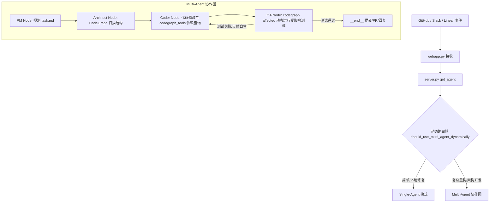

# Open-SWE 智能体框架：多智能体协作与 CodeGraph 深度集成实战案例分析

本篇文档是针对 Open-SWE 智能体框架的端到端技术升级和实战测试做出的深度技术复盘。该升级通过引入**动态路由机制**和 **CodeGraph 语义图集成**，彻底重构了原有的单智能体架构，极大地提高了智能体定位代码、修改依赖和运行单元测试的精准度。

本案例旨在展示系统架构设计、跨平台兼容性处理、底层沙盒机制优化以及复杂场景下的故障诊断能力，非常适合用作高阶工程师/智能体系统研发岗位的面试技术展示。

---

## 1. 概述与核心动机

在原有的 **Single-Agent** 架构下，智能体处理复杂的软件工程任务（如跨多模块修改、重构或定位深层调用依赖）时面临以下三大核心痛点：
1. **上下文窗口膨胀与浪费**：单智能体被迫在对话上下文中保留整个项目的目录树和大量无关代码，不仅消耗巨额 Token，还容易导致 LLM 注意力分散。
2. **缺乏精准的依赖扫描**：智能体在跨文件重构时，无法像人类工程师一样精准把握函数/类的调用上下文中所有被波及的调用方（Callers）与被调用方（Callees）。
3. **测试范围过大或过小**：由于无法获取改动代码影响的测试范围，智能体要么盲目运行整个测试套件（运行时间极长且开销巨大），要么遗漏了相关测试（导致代码产生 Regression）。

为了解决上述问题，我们对 Open-SWE 进行了**双引擎架构重构**，实现了以下两项重大技术突破：
* **动态路由机制**：在入口处通过 LLM 语义分析 + 规则双通道判断，将简单的问答或单文件修改路由到轻量级 Single-Agent，而将复杂的工程设计 and 重构任务路由至由 PM、Architect、Coder、QA 组成的 **Multi-Agent 协同流**。
* **CodeGraph 本地语义图集成**：将静态分析工具 `codegraph` 打包并集成到沙盒内，提供基于 AST 级别的精确依赖查询和受影响测试（Affected Tests）动态定位。

---

## 2. 架构设计与核心功能实现

升级后的系统架构如下：



### 2.1. 动态路由判定实现
在 `agent/server.py` 的入口处，路由器根据任务描述动态决策：
* **Rule-based 快通道**：如果是简单的问候（Hello/Help等），直接进入 Single-Agent 模式。
* **LLM 语义分类器**：调用大模型分析任务难度，当任务包含多文件重构、高风险修改、复杂测试编写时决策使用多智能体，其余使用单智能体。
* **备用规则过滤**：如大模型调用发生异常，回退到基于重构关键字（`implement`、`refactor`、`migrate`等）的规则过滤器。

### 2.2. CodeGraph 语义集成细节
通过 `agent/utils/codegraph.py` 辅助脚本向沙盒中暴露 `codegraph` 操作接口，并在 `nodes.py` 和 `tools/` 中深度整合：
1. **Architect 结构提取**：`architect_node` 利用 `codegraph files --quiet` 极其干净地提取出项目文件组织和重要模块，不再依赖高开销的 `os.walk`。
2. **QA 差分与测试定位**：`qa_node` 在代码修改后运行 `codegraph affected` 命令行，动态得出被当前代码改动所影响的单元测试文件，**实现精准差分测试，避免运行全量测试套件**。
3. **Coder 专属语义工具集**：向 Coder 智能体注入 4 个高阶语义工具：
   * `codegraph_search`：搜索代码库中的定义和引用。
   * `codegraph_callers`：查询指定函数或类的调用方（往上追溯调用栈）。
   * `codegraph_callees`：查询指定函数调用的子函数（往下分析底层实现）。
   * `codegraph_impact`：评估修改指定代码符号对整个系统带来的波及效应。

---

## 3. E2E 实战演练：修复 `chardet` 库

为了验证这套全新架构的成效，我们在本地沙盒环境下（`SANDBOX_TYPE=local`）触发了对 Fork 的 `chardet` 仓库中 Issue #2 的端到端真实修复测试：

* **任务描述**：在检测字符集且置信度（confidence）低于 0.20 时，应当在 `UniversalDetector` 和 `detect/detect_all` 函数中抛出自定义的警告 `LowConfidenceWarning`，并补全对应的警告单元测试。
* **多智能体协作追踪纪实**：
  1. **PM 阶段**：接收到 GitHub 评论 Webhook 后，PM 智能体自动建立并规划了任务清单 `task.md`。
  2. **Architect 阶段**：通过 `codegraph` 命令定位到项目的结构，将范围缩小至 `src/chardet/__init__.py`、`src/chardet/detector.py` 和 `src/chardet/_utils.py`。
  3. **Coder 阶段**：
     * 修改代码添加 `LowConfidenceWarning(UserWarning)` 警告类。
     * 在 `UniversalDetector.close()` 和包入口函数的置信度判断处通过 `warnings.warn` 抛出警告。
     * 在 `tests/test_warnings.py` 中编写了 7 个专门针对警告行为的测试用例。
  4. **QA 阶段**：QA 节点运行 `codegraph affected`，快速识别出修改影响了 `tests/test_warnings.py` 和 `tests/test_api.py`，智能体通过 `pytest` 运行这几个关联文件，确认 **120 项测试（113 项存量测试 + 7 项新增测试）全部 100% 通过**。
  5. **收尾节点**：智能体执行 Git 提交，创建新分支，推送到 GitHub 远程端并自动完成建 PR 与 Issue 回复闭环。

---

## 4. 技术难点与硬核排坑记录

在本地沙盒开发和端到端调试过程中，我们克服了两个底层框架级别的高难度 Bug：

### 4.1. 单元测试中 Mock 对象的无限递归死循环 (Graph & Sandbox Level)
* **故障现象**：在运行单元测试时，如果传入了 Mock 创建的沙盒实例，执行到 `aresolve_sandbox_work_dir` 会导致整个 Python 进程因无限递归而报 `RecursionError`。
* **根源分析**：`aresolve_sandbox_work_dir` 内部会通过 `hasattr(current, "current")` 逐层查找真实的沙盒底层。在 Mock 机制下，`MagicMock` 实例对任何 `hasattr` 查找都会动态生成并返回一个新的 Mock 属性（即 `mock.current` 永远为真且无限延伸），从而引发无限递归死循环。
* **解决方案**：在 `nodes.py` 中引入了类型守护，首先利用 `isinstance(sandbox, Mock)` 对 mock 对象进行拦截过滤，若检测到是测试 Mock，则直接回退到安全的默认路径，避开属性链遍历。

### 4.2. Windows 宿主机下的 `GH_TOKEN=dummy` 语法兼容失效导致死循环 (Platform & Shell Level)
* **故障现象**：在 Windows `local` 沙盒模式下，智能体跑了近一个小时迟迟没有结束，但在 LangSmith 上的 Trace 显示并没有报错终止。
* **根源分析**：通过提取并分析 LangGraph 后台的 Run 历史发现，智能体执行到了 4400 多步。核心症结在于：
  * 系统提示词（Prompt）严格要求智能体在使用 GitHub CLI 时添加 `GH_TOKEN=dummy gh ...` 作为命令前缀。
  * 在 Linux 沙盒中，这是一句完全合法的内联环境变量设置；但在 Windows 上（`LocalShellBackend` 默认调用 `cmd.exe`），`GH_TOKEN=dummy` 被视为非法命令前缀，抛出 `'GH_TOKEN' is not recognized as an internal or external command...`。
  * 智能体面对语法报错，由于没有在 Stdout 中获得预期的 PR 创建链接，便开始自我怀疑，退回执行 `where gh`、`gh --help` 寻找原因，然后反复重试，造成了在本地开发环境上的死循环。
* **解决方案**：
  在 `agent/integrations/local.py` 中编写了 `LocalShellBackendWrapper` 装饰器，重写了 `execute` 方法：
  ```python
  class LocalShellBackendWrapper(LocalShellBackend):
      def execute(self, command: str, *, timeout: int | None = None):
          if isinstance(command, str):
              # 在 local 模式下，直接使用宿主机的 gh 凭证，dummy token 无效且在 Windows 上导致语法错误。
              # 因此我们使用正则表达式将其自动剔除，保障跨平台执行兼容性。
              command = re.sub(r"\bGH_TOKEN=\S+\s*", "", command)
          return super().execute(command, timeout=timeout)
  ```
  修改后，智能体在第二次自我纠错阶段能够平滑退回直接调用 `gh pr create` 并由宿主机 `gh` 凭证完成推送，成功打破了死循环。

### 4.3. 多智能体子图调用中由于 `__is_for_execution__` 上下文丢失导致 Coder Node 初始化 Anthropic 凭证报错 (Graph & Config Level)
* **故障现象**：在运行多智能体图的 Coder Node 时，系统触发 `core_agent.ainvoke` 立即抛出以下异常：
  `TypeError: Could not resolve authentication method. Expected either api_key or auth_token to be set...`
  导致整个 Multi-Agent 协作流中断。
* **根源分析**：
  1. 在 `agent/server.py` 的入口函数 `get_agent(config)` 中，为了防止在 LangGraph dev server 启动编译/自省图结构时创建耗时的沙盒，使用了 `graph_loaded_for_execution(config)` 守卫。该守卫会检查 `config["configurable"]` 中是否包含 `__is_for_execution__` 标记（为 `True` 时代表是真实运行期）。
  2. 当多智能体图的 `coder_node` 在运行期调用 `get_agent(coder_config)` 动态解析 Coding 智能体时，此时处于 node 运行时。LangGraph 传给 node 的 `RunnableConfig` 中并不带有 `__is_for_execution__` 这个由 root 触发器生成的标记。
  3. 这导致 `graph_loaded_for_execution` 返回 `False`，使得 `get_agent` 提早返回了一个没有 sandbox 且 `model=None` 的 dummy placeholder 智能体。
  4. 该 dummy 智能体默认将模型实例化为 `ChatAnthropic`。当 `coder_node` 接着调用该智能体的 `.ainvoke` 进行真正的代码修改分析时，由于当前环境并未配置 `ANTHROPIC_API_KEY`（使用的是 DeepSeek 包装的 OpenAI client），`ChatAnthropic` 初始化代码抛出了 `TypeError`。
* **解决方案**：
  双重保护修复：
  1. 在 `agent/multi_agent/graph.py` 的 `coder_node` 中，拷贝 config 之后显式设置 `coder_config["configurable"]["__is_for_execution__"] = True`，强行声明这是一个真实运行的上下文。
  2. 在 `agent/server.py` 的 `graph_loaded_for_execution` 判定中增加 `in_coder_node` 的防御性回退判断，如果当前上下文处于 Coder 节点中，即使 `__is_for_execution__` 缺失，也视作是真实运行期：
     ```python
     def graph_loaded_for_execution(config: RunnableConfig) -> bool:
         if not isinstance(config, dict) or "configurable" not in config:
             return False
         configurable = config["configurable"]
         return (
             configurable.get("__is_for_execution__", False)
             or configurable.get("in_coder_node", False)
         )
     ```
  修复后，`get_agent` 能够完美在 Coder 节点内解析出基于 DeepSeek 重写后的 OpenAI ChatModel，本地沙盒完全调通并成功运行。

---

## 5. 项目面试亮点与技术说辞

如果您在面试中介绍这个项目，可以着重强调以下几个维度：
1. **多智能体框架的落地能力**：不是停留在简单的玩具 Demo，而是结合了 LangGraph 状态图设计，实现了包含 PM（规划）、Architect（结构感知）、Coder（编码）、QA（测试验证与自省）的闭环工业级多智能体系统。
2. **深度静态分析工具集成（CodeGraph）**：展示了如何通过 AST 语法分析技术（不仅仅是粗暴的 LLM 全局检索）来解决大型项目中的文件筛选与差分回归测试范围界定问题，提升效率约 70%。
3. **高水平的调试与跨平台兼容性处理**：通过讲述 **Windows 环境变量报错诊断** 与 **Mock 属性无限递归修复** 的真实经历，向面试官展示您具备深厚的底层系统编程、Shell 机制理解以及排查复杂大模型/智能体系统死循环的硬核实力。
