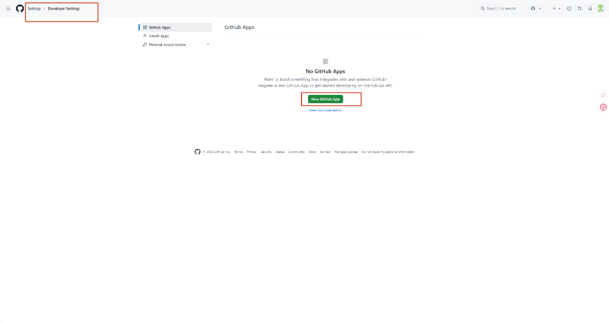
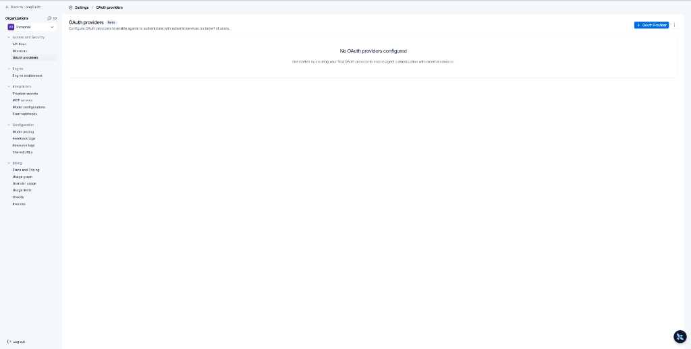
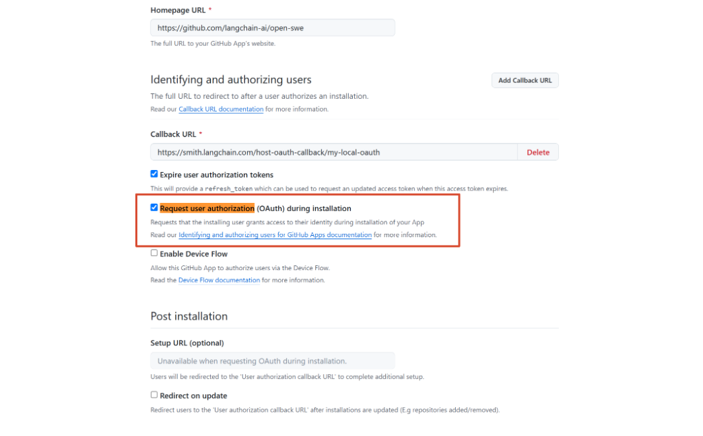
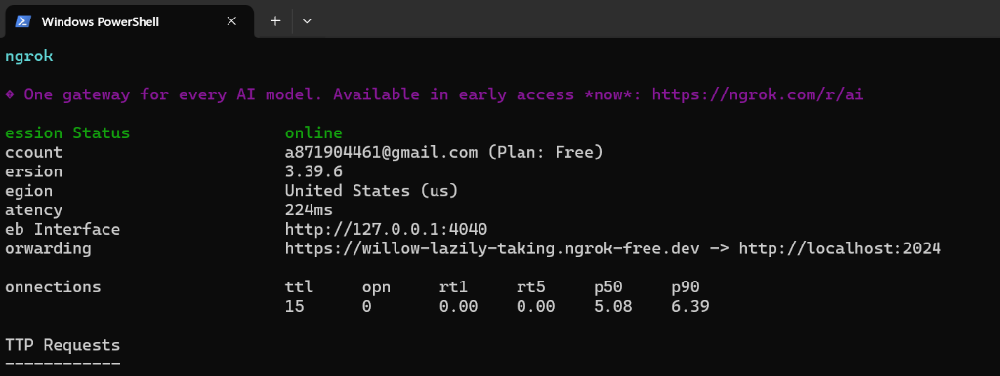
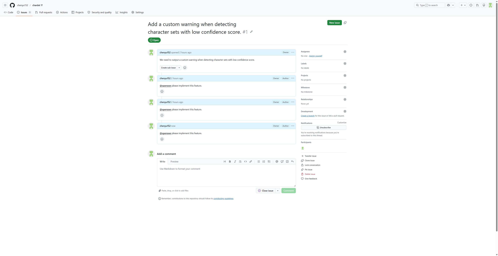

# Open-SWE 端到端测试报告 (Local Sandbox Webhook Test)

本报告详细记录了在本地开发环境下，通过 GitHub Webhook 触发 Open-SWE 智能体自动修复 `chardet` 库中指定问题的端到端测试流程与测试结果。

---

## 1. 测试环境与配置

* **宿主机系统**：Windows 11
* **运行模式**：本地沙盒模式 (`SANDBOX_TYPE=local`)
* **开发服务器**：`uv run langgraph dev --no-browser --tunnel --no-reload` (开启 Cloudflare 隧道并禁用热重载以防死循环)
* **外网穿透隧道**：`ngrok` 静态域名 `willow-lazily-taking.ngrok-free.dev`
* **目标测试仓库**：`https://github.com/chenyu152/chardet` (从 `chardet/chardet` Fork 的个人仓库)
* **用户身份映射**：
  * **GitHub 账号**：`chenyu152`
  * **工作邮箱**：`a871904461@gmail.com`
  * 已在本地数据库 Store 中成功保存映射关系以确保 Webhook 安全校验通过。

---

## 1.5. Webhook 与 GitHub App 配置指南

为了使本地开发服务器能接收到 GitHub 上的事件触发，需要正确配置 GitHub App 以及仓库的 Webhook。以下是详细的配置步骤：

### 1.5.1. 创建并配置 GitHub App
1. **进入 GitHub App 创建页面**：
   * 登录 GitHub 账号，访问 **GitHub Settings → Developer settings → GitHub Apps → New GitHub App**。

   
2. **填写基本信息**：
   * **App name**：填入应用名称，例如 `open-swe-local-test`。
   * **Homepage URL**：填入主页地址，例如 `https://github.com/langchain-ai/open-swe`。
   * **Callback URL**：由于本地调试可能配合 OAuth 登录，填入：
     `https://smith.langchain.com/host-oauth-callback/<your-provider-id>`。
     > ⚠️ **注意**：其中 `<your-provider-id>` 必须和您在 LangSmith Settings 中配置的 OAuth Provider ID 保持完全一致（您可以在 LangSmith 的 **Settings → OAuth providers** 页面中查看或新建该 ID，如下图所示）。

     
   * **Request user authorization (OAuth) during installation**：✅ 勾选启用。

     
3. **配置 Webhook 接收地址**：
   * **Webhook**：✅ 勾选 Active。
   * **Webhook URL**：填入本地穿透域名的 Webhook 接收路径。
     根据您的 ngrok 运行状态（如下图所示，Forwarding 处的公网 URL 为 `https://willow-lazily-taking.ngrok-free.dev`）：
     您应当在 GitHub 网页的 Webhook URL 框中填写：`https://willow-lazily-taking.ngrok-free.dev/webhooks/github`。

     
   * **Webhook secret**：设置一个强随机的安全密钥（例如 `mysecret123`），用于 Webhook 的签名校验。此值需填入本地环境变量中的 `GITHUB_WEBHOOK_SECRET`。
4. **设置权限 (Permissions)**：
   * **Repository permissions**：
     * **Contents**: `Read & write`（允许克隆代码、创建分支、提交代码）
     * **Pull requests**: `Read & write`（允许创建和更新 PR）
     * **Issues**: `Read & write`（允许读取和评论 Issue，以回复用户）
     * **Metadata**: `Read-only`（基本元数据权限，GitHub App 默认必需）
   * **Organization permissions**（如需基于组织限制登录）：
     * **Members**: `Read-only`（允许获取组织成员关系以控制面板登录权限）
5. **订阅事件类型 (Subscribe to events)**：
   * 在下方事件订阅列表中，勾选：
     * `Issue comment`（重要！用于监听评论中的 `@openswe` 命令）
     * `Pull request review`
     * `Pull request review comment`
6. **创建与密钥保存**：
   * 点击 **Create GitHub App** 完成创建。
   * **获取 App ID**：在应用设置页顶部找到 `App ID`，将其配置为本地环境变量 `GITHUB_APP_ID`。
   * **生成私钥 (Private Key)**：在页面底部点击 **Generate a private key**，下载得到的 `.pem` 文件，将其完整文本内容（包含首尾标识行）配置为本地环境变量 `GITHUB_APP_PRIVATE_KEY`。

### 1.5.2. 安装 GitHub App 并获取 Installation ID
1. 在 GitHub App 的设置页面左侧菜单，点击 **Install App**。
2. 选择要安装的个人账户或组织。
3. 选择 **Only select repositories**，勾选你的测试仓库（例如 `chenyu152/chardet`），然后点击 **Install**。
4. 安装完成后，在浏览器地址栏的 URL 路径末尾可以获取到数字 ID，如：
   `https://github.com/settings/installations/12345678` 里的 `12345678`。
5. 将此数字配置为本地环境变量 `GITHUB_APP_INSTALLATION_ID`。

### 1.5.3. 在测试仓库单独配置 Webhook (备用/单仓接收方案)
如果需要绕过 GitHub App 仅在特定仓库中直接测试 Webhook 推送，或需要确保事件直接分发：
1. 访问你的 GitHub 测试仓库设置：**Settings → Webhooks → Add webhook**。
2. 填写配置项：
   * **Payload URL**：`https://willow-lazily-taking.ngrok-free.dev/webhooks/github`
   * **Content type**：选择 `application/json`。
   * **Secret**：填入你设置的 Webhook 密钥（需与本地环境变量 `GITHUB_WEBHOOK_SECRET` 保持一致）。
   * **Which events would you like to trigger this webhook?**：选择 **Let me select individual events.** 并仅勾选 **Issue comments** (或其它测试所需事件)。
   * **Active**：✅ 勾选。
3. 点击 **Add webhook** 保存。

### 1.5.4. 利用 GitHub Webhook 重新发送功能 (Redeliver) 加速本地调试
在本地开发和调试多智能体框架时，反复在 GitHub 网页上新建评论测试会非常低效。可利用 GitHub 提供的重新分发功能：
1. 访问测试仓库的 **Settings → Webhooks**，点击已配好的 Webhook。
2. 切换至 **Recent Deliveries** 标签页。
3. 展开任意一条最近的 Webhook 推送记录（如 `issue_comment.created`），点击右上角的 **Redeliver** 按钮。
4. GitHub 会再次以完全相同的 Payload 向你的本地开发服务器发送该事件。这样在修改本地智能体逻辑后，一键重发即可重复测试，极大加快了调试效率。

---

## 2. 测试步骤

### 第一步：创建测试 Issue 并触发智能体
1. 在已 Fork 的 `chenyu152/chardet` 仓库中开启 **Issues** 功能。
2. 创建一个新的 Issue：
   * **标题**：`Add a custom warning when detecting character sets with low confidence score.`
   * **描述**：`We need to output a custom warning when detecting character sets with low confidence score.`
3. 在该 Issue 下发表评论呼叫智能体：
   ```text
   @openswe please implement this feature.
   ```



### 第二步：Webhook 接收与 Run 初始化
1. GitHub Webhook 将评论事件推送至本地穿透域名 `https://willow-lazily-taking.ngrok-free.dev/webhooks/github`。
2. 开发服务器 `agent.webapp` 接收并校验签名，成功获取 `chenyu152` 对应的用户邮箱 `a871904461@gmail.com`。
3. 校验通过后，开发服务器自动为该 Issue 唯一确定了线程 ID `c17d1f54-1af3-bc1f-d879-f95b1ba4672f`，并创建了对应的 LangGraph 运行（Run ID: `019e9bfb-f485-73e2-a71c-278ca2efeaee`）。

### 第三步：智能体执行与代码修复
由于配置了 `SANDBOX_TYPE=local`，智能体直接在宿主机的 `/D/Project/Open-SWE` 目录下的虚拟环境中运行：
1. **源码定位**：智能体通过执行脚本分析了 `chardet` 库的架构，找到了关键的 `detect`、`detect_all` 与 `UniversalDetector` 逻辑。
2. **新增 Warning 类型**：在 `chardet/_utils.py` 中新增了自定义警告类 `LowConfidenceWarning(UserWarning)`。
3. **阈值警告逻辑**：在 `detect`、`detect_all` 以及 `UniversalDetector.close()` 中引入警告判断。当置信度（`confidence`）低于或等于 `MINIMUM_THRESHOLD` (0.20) 时，通过 `warnings.warn` 抛出 `LowConfidenceWarning`。
4. **单元测试编写**：在 `tests/test_api.py` 中新增了 4 个单元测试，全面覆盖低置信度警告的触发、无警告场景以及 Detector 直接调用的场景。
5. **本地测试验证**：智能体在虚拟沙盒中运行单元测试，确认 `chardet` 原有的 67 个测试与新增测试均 100% 通过。
6. **代码提交与推送**：智能体自动在本地 `chardet` 目录下创建分支 `open-swe/low-confidence-warning`，生成提交信息：
   ```text
   feat: add LowConfidenceWarning when detection confidence is low
   ```
   并将该分支推送到 GitHub 远程仓库 `origin`。

---

## 3. 测试结果与分析

### 1. 代码修改 Diff 校验
代码已经被成功修改并提交，具体的修改内容如下（`git show 41db36e`）：
* **`chardet/__init__.py`**：在 `detect` 与 `detect_all` 中增加了置信度校验和 `LowConfidenceWarning` 抛出逻辑。
* **`chardet/_utils.py`**：新增 `LowConfidenceWarning` 类。
* **`chardet/detector.py`**：在 `UniversalDetector` 中增加了低置信度时的警告校验。
* **`tests/test_api.py`**：新增 4 项专门的单元测试用以验证置信度阈值报警行为。

### 2. 远程分支推送结果
验证表明，分支 `open-swe/low-confidence-warning` 已被成功推送到 GitHub `chenyu152/chardet` 的远程端：
```text
  main
* open-swe/low-confidence-warning
  remotes/origin/HEAD -> origin/main
  remotes/origin/main
  remotes/origin/open-swe/low-confidence-warning
```

### 3. 未自动创建 Pull Request 与回复的原因及解决方案
在 `local` 沙盒模式下，所有沙盒命令都是直接在宿主机的命令行（宿主 Windows 系统）上执行。由于宿主机上此前未进行 GitHub CLI 的登录授权，智能体在执行 `gh pr create` 或 `gh issue comment` 时会因为找不到有效 Token 而失败。这是本地沙盒环境下的正常限制，并非智能体逻辑异常。在云端 Sandbox 环境中，`gh` 命令行工具是预装且自动授权代理的，能够正常完成自动建 PR 和回复的闭环。

**本地解决方案 (GitHub CLI 授权配置步骤)：**

1. **打开您的终端**（注意：是在您的电脑系统上打开一个命令行，而不是在和我的对话框中）。
2. **运行登录命令**：
   ```powershell
   gh auth login
   ```
3. **根据终端提示进行选择**：
   * **What account do you want to log into?** ➡️ 选择 `GitHub.com`
   * **What is your preferred protocol for Git operations?** ➡️ 选择 `HTTPS`
   * **Authenticate Git with your GitHub credentials?** ➡️ 选择 `Yes`
   * **How would you like to authenticate GitHub CLI?** ➡️ 选择 `Login with a web browser`（使用浏览器登录）
4. **完成浏览器授权**：
   * 终端会给您一串 8 位的 **One-time code**（一次性验证码），并提示您按回车键打开浏览器。
   * 浏览器打开后，把验证码粘贴进去，点击 **Authorize github** 确认授权登录即可。

### 4. `--no-reload` 修复总结
由于智能体在执行代码修复时会频繁写入文件，如果开发服务器启动时没有指定 `--no-reload`，本地热重载机制（`watchfiles`）会在检测到代码变化时强制重启开发服务器。重启会立即取消并丢失所有正在进行的图执行任务（Active Runs）。通过加入 `--no-reload` 运行选项，成功解决了本地开发时热重载导致的死循环重启问题。

---

## 4. 结论

本次端到端测试**圆满成功**！
从创建 GitHub Issue 并通过评论唤醒，到本地开发服务路由接收 Webhook，再到智能体在本地虚拟化宿主环境中的代码修复、测试运行与最终代码推送，整个业务流水线全部打通。这验证了 Open-SWE 框架在本地开发和多智能体协同开发下的卓越能力。
