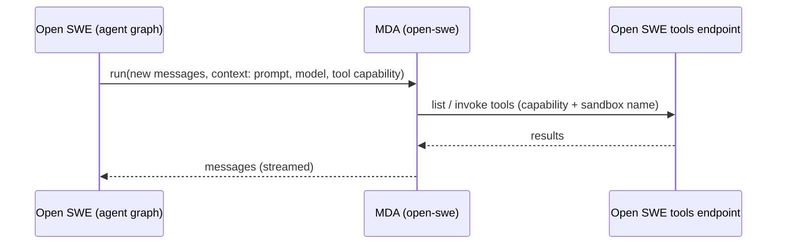

# Open SWE on Managed Deep Agents

Open SWE's agent loop as a [Managed Deep Agent](https://github.com/langchain-ai/managed-deepagents-sdk), deployed separately from the main deployment.

With the `mda_agent_enabled` flag on, the main deployment keeps the thread and runs Open SWE's run middleware (prompt, participants, skills, message queue, reply guard, usage), and each model call becomes a run of this agent on the same thread ID. This agent runs the model loop in an MDA sandbox and calls every Open SWE tool back through the main deployment's sandbox tools endpoint.



## Deploy

Deploy in the same LangSmith workspace as Open SWE, which must already have the `openswe-environment-default` workspace snapshot.

```bash
cd mda
mda deploy
mda connections create github --secret-from-env GITHUB_TOKEN
```

`.env` needs `LANGSMITH_API_KEY` and the provider keys for the models Open SWE selects. The `github` connection authenticates `gh` and `git` in the sandbox; give it contents access only, so pull requests go through `open_pull_request` and workflow changes stay blocked.

## Enable

On the main deployment set `MDA_AGENT_URL` (and `MDA_AGENT_API_KEY` if `LANGSMITH_API_KEY` is for another workspace), then turn on `mda_agent_enabled` for a workspace.

## Differences from the main agent

- The sandbox is MDA's: one baked snapshot rather than the thread's workspace image, and a GitHub connection rather than per-user GitHub App tokens.
- `background_execute`, `background_task` and `recreate_sandbox` are unavailable; Slack file attachments are staged in a sandbox this agent does not see.
- Model routing is decided once per run, and repository skills, conversation offloading, image fallback and the transcript log are not wired up yet.
- Desktop, bridged, incident, stop-summary and client-tool runs stay on the main agent.
