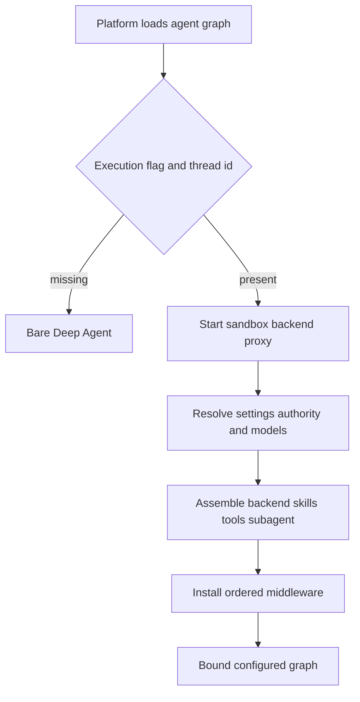
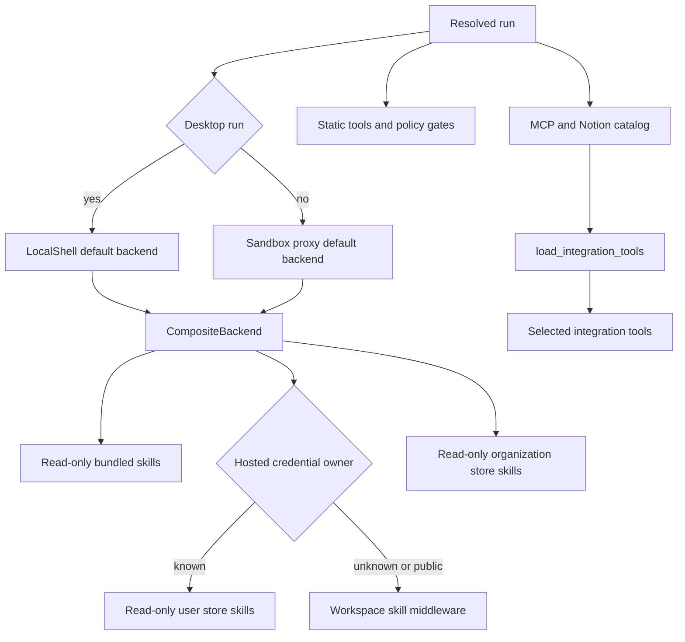
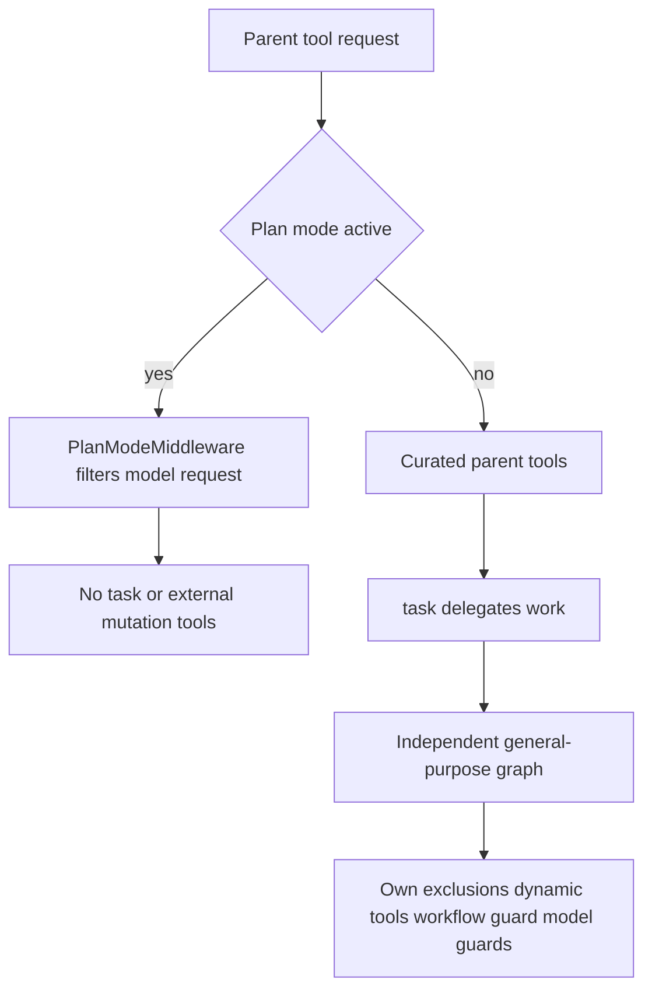

# Coding Agent Assembly

`get_agent(config)` in `agent/server.py` is the assembly boundary for the primary coding agent. It turns an executable, thread-scoped `RunnableConfig` into a `create_deep_agent` graph with a thread backend, resolved models, a curated capability surface, a general-purpose subagent, skills, and ordered middleware. The deployed `agent` graph is `agent.graphs.agent:traced_agent`, an export of this factory.

## Entry gate and run contract

The factory has a cheap discovery path and a full thread-run path.

The factory sets `DEFAULT_RECURSION_LIMIT`. Full assembly requires a `thread_id` and the `__is_for_execution__` configurable flag to be exactly `True`; otherwise it returns a Deep Agent with an empty prompt and no supplied tools, backend, or middleware. In either path it binds a config with `__pregel_*` keys removed: LangGraph reinjects those runtime objects per invocation, and binding a read-time runtime would make subsequent state reads unserializable.

`RunConfig` is deliberately a tolerant cross-launcher boundary. Its declared fields are optional, extras survive dumping, and parsing drops individual invalid fields rather than throwing away the rest of `configurable`. Input creation separately serializes authored human or system content in an `<input-message>` envelope with a namespaced sender, surface, kind, optional channel, and structured data. Dynamic person/channel/system introductions are content-addressed, allowing duplicate introductions to be skipped and contexts that summarization has hidden to be reintroduced.

## Resolution, authority, and sandbox

The triggering `profile_login` determines authorization and personal-integration ownership. Durable choices come from thread settings, seeded from the first sender and retained by the thread, so a later participant does not silently change model or repository-instruction policy. If credential scope cannot be determined, assembly continues but omits MCP and Notion integrations rather than assuming personal authority.

The factory immediately creates and starts a cached `SandboxBackendProxy`, allowing sandbox connection to overlap settings retrieval. A desktop run reconnects to a `LocalShellBackend`; its requested local directory must exist and be either allowlisted or a desktop-created worktree. Hosted reconnect calls `ensure_sandbox_for_thread` with the selected environment. That lifecycle reuses a cached backend or the sandbox id in thread metadata, refreshes proxy credentials and Git identity, or creates and persists a sandbox. It does **not** replace an unreachable sandbox by default because replacement can discard uncommitted work; it does replace a deleted sandbox, whose stale id would otherwise block all future runs.

## Model policy and prompt preparation

Main and general-purpose-subagent model pairs resolve in precedence order: team defaults, dashboard profile overrides (including an optional separate subagent override), stored thread settings, then a valid canonical per-run `agent_model_id`/`agent_effort` pair. A stored model also captures the routing preference. Hosted assembly persists resolved main/subagent settings and repository instructions before applying the Fable availability gate, ensuring the deployment-wide gate is reevaluated on each run. Model construction failures become deferred error models; fallback middleware exists only when the fallback id differs from the primary id. When adaptive routing is enabled, a `ModelSelectionMiddleware` receives the fast, balanced, and performance models and records that routing was applied in run metadata.

The Deep Agent receives `system_prompt=""`; `PrepareAgentRunMiddleware` creates the actual prompt per run and `BasePrepareRunMiddleware` prepends it as the system message for every model call. `construct_system_prompt` composes the working environment, dashboard and source context, plan guidance, repository/default instructions and scope, task and dependency guidance, untrusted-comment protection, commit/PR guidance, environment/admin guidance, and the shared base. The shared base conditionally includes sandbox-download instructions.

Preparation also derives sender-specific context—identity, commit attribution, user instructions, participant identities, PR draft preference, workspace-admin status—and appends it as a separate generated context message after a human input. It does not rewrite cached authored history. Its checkpoint latch is a fingerprint of middleware type, latest message, and preparation configuration: a resumed equivalent invocation skips work, while a new invocation refreshes context, credentials, and prompt. Consequently `_prepare` implementations must be idempotent when a failure occurs before checkpoint persistence.

## Backend, skills, and capability selection

The backend overlays immutable skill routes over the run workspace, while integration schemas require explicit selection.

The default route of `CompositeBackend` is the sandbox proxy. Bundled skills are read-only `FilesystemBackend` content. Hosted runs add read-only organization skills and, when a verified credential owner exists, read-only user skills in that owner’s store namespace; desktop runs instead expose a read-only `StateBackend` snapshot of user skills. The ordered skill-source list is passed to both parent and general-purpose subagent. Hosted runs without a credential owner use `WorkspaceSkillsMiddleware`. Desktop additionally maps virtual `/large_tool_results/` and `/conversation_history/` to a sanitized thread-specific artifact root outside the project, so Deep Agents offloads do not become git changes.

The parent static list includes web, plan, background, thread, PR, feedback, and permitted Slack capabilities. Slack tools require trusted `slack`, `schedule`, or `incidents_agent` source context with both channel and thread timestamp. Personal settings and user-skill tools are removed without a credential owner. `admin_thread` is re-authorized against the triggering identity or scheduled authorization before `ADMIN_TOOLS` grant environment, organization-skill, sandbox-reset, and automation operations. Desktop reduces the surface to `http_request`, `fetch_url`, and `web_search`; stop-summary reduces it to Slack read/reply. Signed sandbox download/service tools are only offered for hosted LangSmith sandboxes outside stop summaries.

MCP and Notion tools are gathered concurrently during hosted assembly and represented by `DynamicToolMiddleware`; the model must call `load_integration_tools` before it can call one. The middleware resets selections at run start, adds only selected schemas to model requests, serializes construction per integration group, turns loading failures into unavailable-tool responses, and rejects duplicate or reserved names. Its catalog can name tools before a costly loader runs, though the current factory supplies already-loaded MCP and Notion sequences.

## Subagent and enforcement boundaries

The only configured subagent is Deep Agents’ `general-purpose` worker. It receives the shared Open SWE base plus task mechanics, the same skill sources, and static parent tools minus background work, feedback, Slack/incident communication, thread management, and user-settings operations. Its description instructs it to relay Slack needs to its parent.

Plan-mode filtering is parent-local, so delegation itself must be removed to prevent a bypass.

`ExcludeToolsMiddleware` removes Deep Agents’ `grep` normally and applies the stricter stop-summary exclusions when needed. `PlanModeMiddleware` is always installed. It resets state to this run’s initial `plan_mode`, recomputes the tool list on every model call, and therefore handles an `enter_plan_mode` change on the next turn without leaking stale state into later runs. Its exclusion set removes `task`, background and external mutation operations, selected sandbox/PR/Slack/skill/environment/automation operations, and loaded MCP tool names. File editing and `execute` remain available; the no-mutation shell rule is prompt policy, not a hard shell restriction. Removing `task` matters because the independently compiled subagent does not inherit the parent plan filter.

The subagent gets its own dynamic-tool and normal exclusion middleware, workflow-push guard, OpenAI response sanitizer, model-error handler, and model-call timeout. Parent middleware is not a security boundary for it.

## Middleware ordering and safe changes

The supplied parent middleware is ordered outermost to innermost: conversation offloading; preparation; optional incident/workspace-skill/dynamic-tool middleware; input and image validation; call limit, tool error/exclusion/read/retry guards; PR/workflow/proxy/message-queue guards; wrap-up, usage, optional routing/fallback, and plan filtering; provider/thinking sanitizers and stable tool ordering; model errors; finally `ModelCallTimeoutMiddleware`. The innermost timeout covers the provider call and propagates outward to fallback. `ToolRetryMiddleware` retries `task` twice inside the tool-error wrapper. `create_deep_agent` supplies its own `PatchToolCallsMiddleware`, so this factory intentionally does not add the obsolete custom orphan repairer.

When changing assembly, preserve the execution gate, sender-versus-thread-settings authority split, read-only skill routes, and the independent subagent boundary. Focused assembly tests cover backend/skills routes, public/unknown credential behavior, desktop and stop-summary surfaces, Slack/admin gates, subagent parent-only tools and guards, plan exclusions, middleware order, and concurrent tool loading. Related pages: [Middleware Stack](middleware-stack.md), [Sandbox Lifecycle](sandbox-lifecycle.md), [Models & Profiles](../concepts/models-profiles-instructions.md), [Tools](../concepts/tools.md), and [Context Engineering](../workflows/context-engineering.md).
