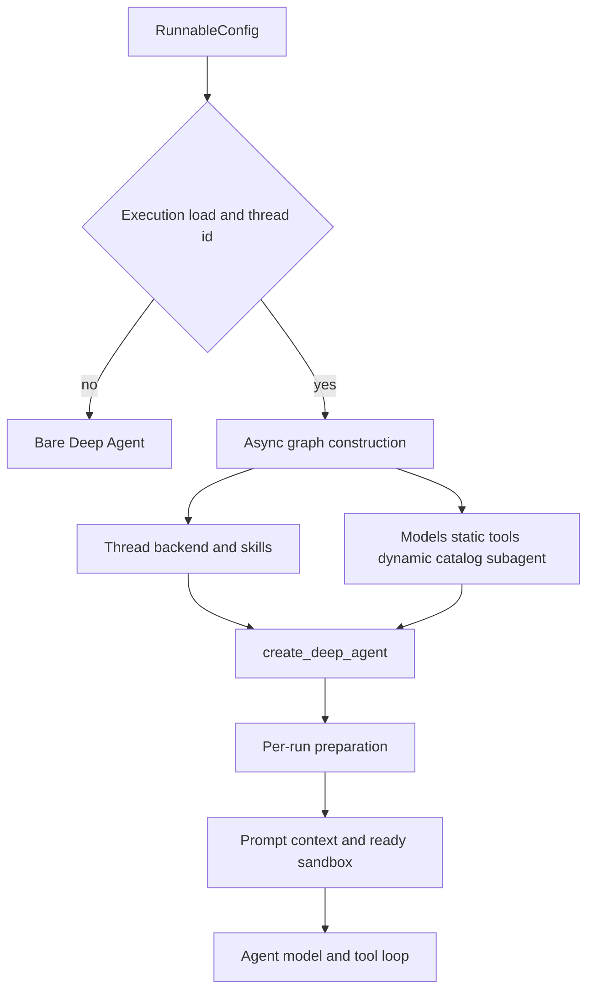

# Coding agent assembly

`agent.graphs.agent` exports `get_agent` and `traced_agent`; the latter wraps the async factory with tracing. `get_agent(config)` is the composition boundary for the main coding agent. It has two distinct phases:

* **Graph construction** happens once when the factory resolves durable/run configuration and supplies models, backend, tools, subagents, skills, and middleware to `create_deep_agent`.
* **Per-run preparation** happens in `PrepareAgentRunMiddleware` before agent execution. It waits for the backend, resolves working-directory and sender context, records run metadata, and renders the actual system prompt.

The factory is async-only. Keep additions to this path asynchronous; do not add blocking provider, filesystem, or network work to graph construction or middleware hooks.

This shows the deliberate boundary between assembly and per-run preparation.

## Entry gate and configuration ownership

The factory sets `recursion_limit` to `DEFAULT_RECURSION_LIMIT`. A full graph is constructed only when `configurable.thread_id` exists and `graph_loaded_for_execution` finds `__is_for_execution__ is True`; schema/discovery loads receive only `create_deep_agent(system_prompt="", tools=[])`, without the backend or supplied middleware. This prevents non-executing graph loads from provisioning thread resources.

`RunConfig` is the tolerant contract for `configurable`: its known fields are optional, unknown keys round-trip, and malformed fields are dropped individually rather than losing the entire run configuration. The triggering `profile_login` is separately resolved and is used for authorization and personal integrations. By contrast, model and repository settings are frozen in thread settings after initial seeding, so a later participant does not silently replace the thread's operating policy.

## Construction: backend and model policy

For an executable run, `get_agent` creates a cached `SandboxBackendProxy` and starts it immediately, while it loads thread settings. Its reconnect callback chooses `create_desktop_backend` for a desktop run; hosted runs call `ensure_sandbox_for_thread` with the environment slug and, for LangSmith sandboxes, personal credentials. The proxy—not a direct sandbox—is the default backend passed to the final `CompositeBackend`.

A desktop backend uses `LocalShellBackend` rooted at `local_project_path`; that path must be an allowed registered project or an Open SWE desktop worktree. Hosted sandbox lifecycle preserves uncommitted work: a cached backend is reused or the recorded sandbox reconnects and refreshes proxy authentication; an unreachable existing sandbox raises by default, while a deleted sandbox is replaced and its new id is stored in thread metadata.

Model selection begins with team defaults, then applies dashboard profile main/subagent overrides, stored thread settings, and finally a validated explicit `agent_model_id` plus `agent_effort`. The final override is the only per-run mechanism that moves a thread from stored settings, and resolved settings are persisted before the deployment-wide Fable gate. Provider kwargs are built separately for main, subagent, and title models. Construction errors become a deferred error model, so provider setup fails at invocation rather than preventing graph compilation; a fallback middleware is installed only when its model id differs from the primary.

## Construction: skills and tool surfaces

The `CompositeBackend` overlays immutable skill routes on the sandbox default backend:

| Run type | Ordered `skills` routes |
| --- | --- |
| Hosted with login | `/skills/`, `/organization-skills/`, `/bundled-skills/` |
| Hosted without login | `/organization-skills/`, `/bundled-skills/` |
| Desktop | `/skills/`, `/bundled-skills/` |

Bundled skills come from a read-only virtual `FilesystemBackend`; hosted organization and user skills use read-only namespaced `StoreBackend`s. Desktop user skills are a read-only `StateBackend` snapshot. Desktop additionally routes `/large_tool_results/` and `/conversation_history/` to virtual directories outside the selected repository, preventing Deep Agents history/tool-result offloads from becoming accidental git changes. The ordered source list is shared with the general-purpose subagent.

The parent receives a curated static tool list, not every importable tool. It is conditioned by trusted Slack context, admin status, sandbox-download availability, desktop mode, and stop-summary mode. Desktop uses only `http_request`, `fetch_url`, and `web_search`; a stop-summary run uses only Slack read/reply. Admin tools are added only after `admin_thread` is rechecked against configured administrators. `ExcludeToolsMiddleware` then removes Deep Agent `grep` normally or a broader read-only stop-summary set.

Connected integrations are exposed through `DynamicToolMiddleware`. Hosted non-summary runs eagerly obtain Observability, Currents, and Notion tool objects, while Browser is another dynamic group when configured. The model initially receives only the `load_integration_tools` catalog; selected schemas are added on the next model request, direct unselected calls are rejected, and `loaded_integration_tools` resets for every run. Corridor is intentionally different: its configured names form a static catalog, but its MCP handshake is deferred until selection. Catalog names cannot collide with static or Deep Agent tool names.

## Subagents and prompt preparation

Only the general-purpose subagent is assembled. It uses the chosen subagent model, shared skill routes, the Open SWE shared-base prompt followed by Deep Agents task mechanics, and the parent static tools minus background tools and parent-context-sensitive Slack/thread/settings tools. Subagents compile as separate graphs, so parent middleware does not secure their calls: their own stack includes dynamic tools when available, exclusion, OpenAI response sanitization, model-error handling, and a model-call timeout. This is why plan mode also excludes `task`: the parent plan filter would not constrain delegated work.

The factory deliberately supplies an empty `system_prompt`; preparation creates `rendered_system_prompt`. Hosted preparation concurrently awaits the sandbox and resolves the triggering identity, then appends a generated sender-context message only after a human message. That message holds identity, attribution, draft preference, workspace-admin status, participant identities, and sender-level instructions. Its dynamic-context hash is checked before insertion, which avoids rewriting cached human history or duplicating already-visible context. Desktop preparation only awaits its backend/work directory and renders a desktop prompt.

`construct_system_prompt` builds the per-thread main-agent layer: working environment, dashboard and source context, plan guidance, repository/default/custom/environment instructions, optional admin-environment guidance, and finally the static `OPEN_SWE_SHARED_BASE`. `render_open_swe_shared_base` appends sandbox download guidance only where downloads are available. Participant-specific instructions therefore remain turn-scoped generated context, rather than becoming durable system-prompt material.

## Middleware order is behavior

Middleware is supplied outermost to innermost. Its significant order is:

1. `PrepareAgentRunMiddleware`, then optional `DynamicToolMiddleware`.
2. Input sanitation, `ModelCallLimitMiddleware`, tool-error conversion, exclusion, subdirectory reads, and retry for `task`.
3. Hosted PR-creation guard, workflow-push guard, GitHub proxy refresh, and the message-queue check except in stop-summary mode.
4. Timeout wrap-up, step-limit notification, usage recording, optional fallback, and `PlanModeMiddleware`.
5. Provider/thinking response sanitizers, stable tool-result ordering, model-error handling, then innermost `ModelCallTimeoutMiddleware`.

The innermost timeout measures the provider call and lets a timeout propagate outward to fallback. Tool error conversion deliberately wraps task retry. `create_deep_agent` supplies its own `PatchToolCallsMiddleware`; the factory must not add the retired custom orphaned-tool-call repairer.

`PlanModeMiddleware` is always installed with the factory's initial `plan_mode` value. At run start it overwrites stale state with that value, but recomputes filtered tools on every model request, allowing `enter_plan_mode` to restrict the next turn of the same run without leaking a prior run's state. The exclusions include `task` and external/mutating capabilities; the prompt's read-only shell behavior is guidance, not a hard `execute` restriction.

## Safe extension and verification

A new built-in tool needs three deliberate steps: export it from `agent/tools/__init__.py`, wire it into the appropriate static list or dynamic loader in `get_agent`, and review authorization plus parent/subagent exposure and mode exclusions. Exporting alone makes a lazy import available but does not grant it to an agent. Since all tool-loader and built-in tool entrypoints are async, preserve that convention in the implementation and wiring.

When changing assembly, update focused async tests in `tests/agent/test_agent_assembly_context.py`. They lock down backend handoff for Deep Agents eviction/history offloading, read-only skill routes, desktop state and artifact routing, parent-only tools, mode-specific tool sets, dynamic Browser behavior, absence of the custom repair middleware, and critical middleware ordering. Related operational detail lives in [Middleware Stack](middleware-stack.md), [Sandbox Lifecycle](sandbox-lifecycle.md), [Models & Profiles](../concepts/models-profiles-instructions.md), [Tools](../concepts/tools.md), and [Context Engineering](../workflows/context-engineering.md).
