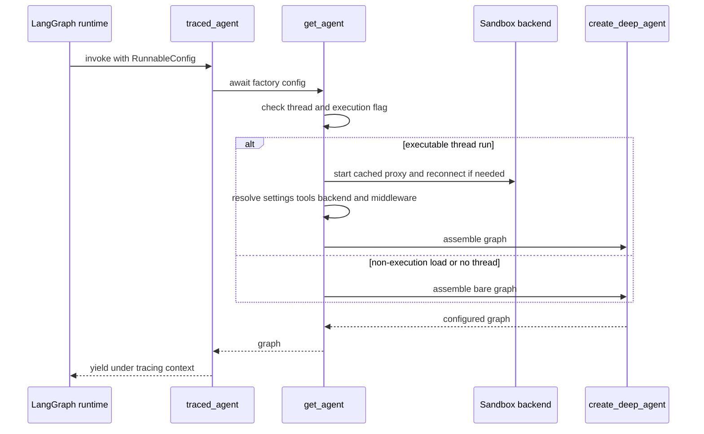
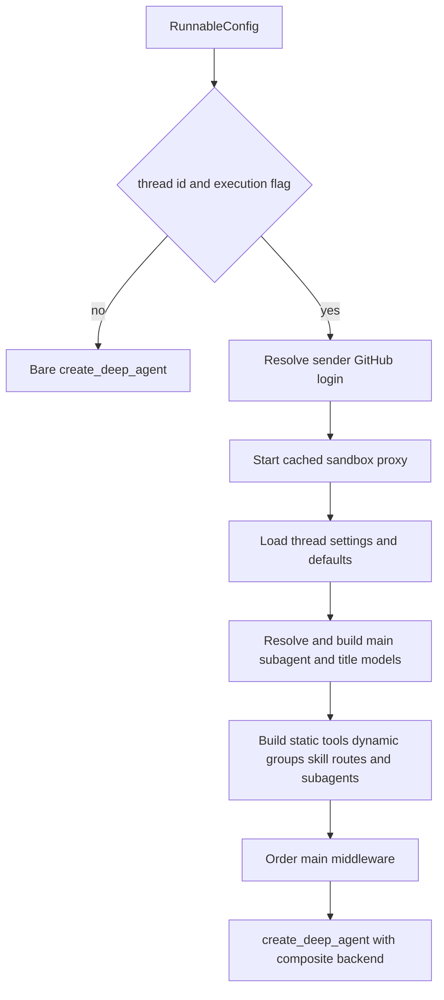

# Agent Graph & get_agent Factory

`get_agent(config)` in `agent/server.py` compiles the main coding-agent graph for each run. It is the composition boundary that resolves thread and sender context, selects the sandbox and models, constructs the filesystem/tool/subagent surface, and supplies the resulting pieces to `create_deep_agent`.

## Entrypoint and execution gate

`langgraph.json` registers `agent.graphs.agent:traced_agent` as the `agent` graph. The module only re-exports the server factory and wrapper. `traced_agent` is `traced_graph_factory(get_agent, AGENT_TRACING_PROJECT)`: it awaits construction and yields the graph inside LangSmith project `open-swe-agent`.

The factory takes a cheap bare-graph path for non-execution loading and a full per-thread assembly path for an executable run.

Before either path, the factory sets `config["recursion_limit"]` to `DEFAULT_RECURSION_LIMIT` (9,999), LangGraph's superstep budget. It only performs full assembly when `configurable.thread_id` exists and `graph_loaded_for_execution` finds a true `__is_for_execution__` flag. Otherwise it returns `create_deep_agent(system_prompt="", tools=[])`, without a sandbox or supplied middleware. This keeps graph discovery and schema-oriented loads from provisioning run resources.

## Resolution and assembly flow

This flow distinguishes stable, persisted thread choices from per-run credentials and execution resources.

### Identity, backend, and settings ownership

`profile_login` is resolved from the GitHub login in `configurable`, or from the triggering email (including a Slack triggering email). It represents the sender of the message that started this run and governs authorization and credentialed integrations. In contrast, the thread carries the frozen model and repository-instruction settings; a later sender does not implicitly replace those choices.

The factory gets a cached `SandboxBackendProxy` keyed by thread and starts it. Its reconnect callback creates a `LocalShellBackend` for desktop runs; other runs call `ensure_sandbox_for_thread` with the selected environment slug. Thus the graph holds a reconnectable thread-bound backend rather than directly owning a sandbox instance.

Model/effort resolution begins with team defaults, applies dashboard profile overrides, then stored thread settings, and finally accepts an explicit `agent_model_id`/`agent_effort` only if it is supported and the effort is valid for that model. That explicit pair is the sole per-run input allowed to move an existing thread from its stored selection. Resolved main and subagent choices (and repository instructions) are persisted on non-desktop runs before the deployment-wide Fable gate is applied, so a current deployment gate is evaluated every run. Main, subagent, and title models are constructed with provider-specific kwargs; `_make_model_or_defer` converts construction failures into a deferred error model so the factory still returns a graph and the failure appears when the model is called.

A fallback middleware is created only when the configured or derived fallback id differs from the primary model. The fallback is deliberately outside the call-timeout middleware, allowing a timed-out primary call to escalate.

## Prompt preparation and run state

The factory passes an empty `system_prompt` to `create_deep_agent`. `PrepareAgentRunMiddleware` instead resolves run-dependent context during its before-agent hook and calls `construct_system_prompt`; that renderer fills `SYSTEM_PROMPT_TEMPLATE` with working directory, source, repository, plan, environment, and feature-gated sections, then appends the static `OPEN_SWE_SHARED_BASE`.

The result is stored as `rendered_system_prompt` in graph state. `BasePrepareRunMiddleware.awrap_model_call` prepends it to any existing system message and applies `wrap_system_prompt` on every model request. Preparation is checkpointed with a fingerprint of middleware, latest message, and configuration: `run_prepared_for` skips repeat setup for a resumed invocation, but preparation must be idempotent because a failure before checkpointing can run it again. A new message or relevant configuration makes the fingerprint change and prepares fresh context.

The prompt instructs the agent to make a tool call every turn. Since no component fabricates a missing call, a model response with no tool call is the normal end of the run.

## Filesystem and skills

The deep agent receives a `CompositeBackend` whose default route is the sandbox. Read-only routes overlay skill locations:

- Bundled skills use a virtual `FilesystemBackend`.
- Hosted organization skills use a namespaced `StoreBackend`; sender-specific user skills use a separately namespaced store route when a login is available.
- Desktop user skills use a read-only `StateBackend` snapshot rather than the hosted store.

The selected routes form an ordered `skill_sources` list supplied to both the parent and general-purpose subagent. On desktop, `/large_tool_results/` and `/conversation_history/` are additionally routed to virtual filesystem directories outside the checked-out project. This prevents Deep Agents' offloaded results and evicted history from becoming repository changes or being captured by `git add -A`. The backend passed to `create_deep_agent` also enables its built-in filesystem result eviction and history summarization/offloading behavior.

## Tool surfaces and plan mode

`static_tools` is an intentionally curated parent surface, not every export in `agent.tools`. It includes web, plan, background, Linear, thread, PR, Slack, and skill-management operations. It is adjusted for trusted Slack source context, admin-thread workspace tools, and sandbox-download capability; desktop reduces it to web request/search tools and stop-summary mode reduces it to the Slack read/reply pair.

Browser, Observability, Currents, Notion, and Corridor are not equivalent eager static tools. Browser tools are loaded for non-desktop, non-stop-summary runs. The integration groups are supplied to `DynamicToolMiddleware`; each group loads only on agent request, avoiding an MCP/credential handshake before the first model call. The middleware reserves built-in and static names so a dynamic group cannot collide with them. `ExcludeToolsMiddleware` then removes permanently unsafe/unwanted tool names, using `DEEP_AGENT_EXCLUDED_TOOLS` normally and the broader stop-summary exclusion set for stop summaries.

`PlanModeMiddleware` is installed for every full graph and is state-aware, not merely a factory-time filter. A run starts in plan mode only when `configurable.plan_mode is True`; an `enter_plan_mode` tool call can also update state during the run. In plan mode it excludes delegation, background execution, PR and sandbox mutation, selected skill/thread/Slack/Linear mutations, and environment-management tools. Read-only operations, filesystem tools, `save_plan`, and `approve_plan` remain available. This blocks a delegated subagent from bypassing the plan-mode read-only intent because `task` itself is excluded.

## Subagents

The general-purpose subagent is always supplied. `_general_purpose_subagent` retains the Deep Agents general-purpose name and mechanics prompt, prefixes the Open SWE shared base, shares the ordered skills, and removes background execution plus parent-context-sensitive Slack and thread tools. It may receive the same dynamic integration middleware as the parent. A browser subagent is appended only when browser tools were loaded.

Subagents compile as separate graphs, so the parent's model middleware does not wrap their model calls. Each subagent therefore has `SanitizeOpenAIResponsesMiddleware` and `ModelCallTimeoutMiddleware`; the general-purpose spec also has its dynamic and exclusion middleware. This preserves provider-response sanitation and a bounded delegated model call independently of the parent stack.

## Main middleware boundaries

The list passed by the factory is ordered **outermost to innermost**. Its effective boundary order is:

1. `PrepareAgentRunMiddleware`, followed optionally by `DynamicToolMiddleware`.
2. Tool-input sanitization, `ModelCallLimitMiddleware(run_limit=5000, exit_behavior="end")`, tool-error conversion, exclusion, subdirectory-agent reads, and retry of `task` (up to two retries).
3. PR creation guard except on desktop, workflow push guard, GitHub proxy refresh, and message-queue check except for stop summaries.
4. Timeout wrap-up and step-limit notification, then optional model fallback and state-aware plan-mode filtering.
5. Fireworks, OpenAI-response, and thinking-block sanitizers; stable tool-result ordering; finally `ModelCallTimeoutMiddleware`.

The timeout is innermost so it measures the provider call itself and propagates outward to fallback when one is configured. `ModelCallLimitMiddleware` is a separate high ceiling that ends a run at 5,000 calls. Tool exceptions become tool messages, while the explicit `task` retry policy handles retryable delegated-task failures. The factory does not add a custom orphaned-tool-call repairer: `create_deep_agent` supplies its built-in `PatchToolCallsMiddleware`.

## Changing and testing the factory

For an Open SWE fork, change `get_agent` when replacing the sandbox provider, model policy, parent tool surface, subagent definitions, or middleware ordering. Preserve the execution gate and the ordering contracts: moving a guard changes what it wraps, and adding a parent-only guard does not protect compiled subagents.

Focused regression coverage is in:

- `tests/agent/test_agent_assembly_context.py` for backend/skill wiring, parent-only tools, and middleware presence.
- `tests/agent/test_factory_tool_loading.py` for concurrent hosted integration loading.
- `tests/agent/test_plan_mode.py` for plan-mode prompt, state transition, and exclusions.
- `tests/middleware/test_prepare_run_middleware.py` for preparation fingerprints and wrapped prompt injection.
- `tests/models/test_agent_subagent_models.py` for distinct main/subagent profile resolution and Fable gating.

See [Middleware Stack](middleware-stack.md) for component-level middleware semantics, [Sandbox Lifecycle](sandbox-lifecycle.md) for provisioning, [Models & Profiles](../concepts/models-profiles-instructions.md) for model policy, [Tools](../concepts/tools.md) for tool contracts, and [Context Engineering](../workflows/context-engineering.md) for injected context.
