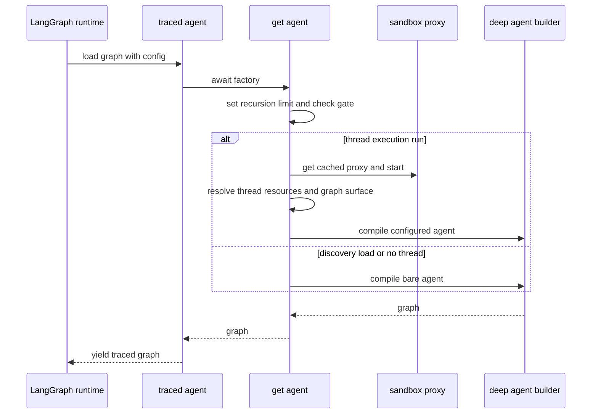
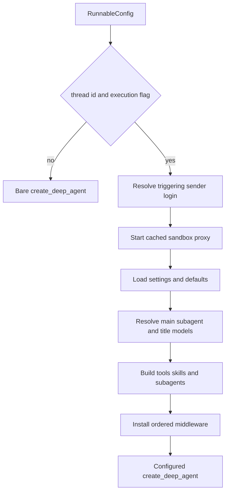

# Agent Graph & get_agent Factory

`get_agent(config)` in `agent/server.py` is the per-run composition boundary for the main coding agent. It resolves the triggering sender and the thread's durable choices, starts the thread backend, builds models, tools, skills, subagents, and middleware, and gives them to `create_deep_agent`. The compiled graph is otherwise stateless: durable state belongs in LangGraph thread state/metadata and the thread-bound sandbox.

## Entrypoint and executable-run gate

`langgraph.json` registers `agent.graphs.agent:traced_agent` as `agent`. The graph module re-exports the server factory; `traced_agent` is a `traced_graph_factory(get_agent, AGENT_TRACING_PROJECT)` wrapper that constructs the graph then yields it inside the `open-swe-agent` LangSmith tracing context.

The factory has a cheap bare path for discovery/schema-oriented loads and a full path only for an executable thread run.

It always sets `config["recursion_limit"]` to `DEFAULT_RECURSION_LIMIT` (9,999), LangGraph's superstep budget. Full assembly requires both `configurable.thread_id` and a true `configurable.__is_for_execution__`, as read by `graph_loaded_for_execution`. Otherwise the result is `create_deep_agent(system_prompt="", tools=[])` with no supplied sandbox or middleware. Do not relax this gate when adding a resource that provisions credentials, sandboxes, or integrations.

## Per-thread resolution and backend lifecycle

This separates sender-specific authority from persistent thread configuration.

`profile_login` identifies whoever sent the message that started the run. It is resolved through `resolve_github_login` and drives authorization and credentialed integrations. Model choices and repository instructions instead come from the thread's frozen settings, initially seeded from a profile; a later participant does not silently replace them.

The factory obtains a cached `SandboxBackendProxy` for the thread and starts it. Its reconnect callback builds a `LocalShellBackend` for desktop runs; hosted runs use `ensure_sandbox_for_thread` with the selected environment slug. That lifecycle reuses a cached backend or reconnects the stored sandbox id, refreshes proxy auth, and creates one when absent. An unreachable existing hosted sandbox is not silently replaced, because replacement loses uncommitted work; a deleted sandbox can be replaced. The factory therefore holds a reconnectable proxy, not a directly owned sandbox.

Model/effort selection cascades from team defaults to dashboard profile overrides to stored thread settings, then accepts an explicit `agent_model_id`/`agent_effort` only when the model is supported and accepts that effort. That explicit pair is the only per-run input allowed to move a thread off stored settings. On hosted runs the resolved main/subagent settings and repository instructions are persisted before the deployment-wide Fable gate, so the gate is evaluated anew each run. Main, subagent, and title models use provider-specific kwargs; `_make_model_or_defer` returns a deferred error model if construction fails, surfacing provider setup failure at call time rather than failing graph construction. A fallback is installed only when its id differs from the primary id.

## Prompt preparation: thread context is not participant input

The factory deliberately passes `system_prompt=""` to `create_deep_agent`. `PrepareAgentRunMiddleware` prepares the actual prompt in its before-agent hook, stores it in `rendered_system_prompt`, and the base middleware prepends it to every model request's system message after applying `wrap_system_prompt`.

`SYSTEM_PROMPT_TEMPLATE` is the **main-agent, per-thread/environment** layer. Its rendered order is: working environment; dashboard context; source context; plan-mode entry guidance and optional active-plan guidance; self-awareness; default prompt/default repository; optional repository-scope restriction; repository setup and task execution; optional Corridor guidance; dependency and untrusted-comment guidance; commit/PR guidance; repository custom instructions; environment instructions; optional admin-thread environment guidance; then `shared_base_section`.

`shared_base_section` ends with `render_open_swe_shared_base`, which returns the stable `OPEN_SWE_SHARED_BASE` plus download guidance only when sandbox downloads are available. For a non-admin run it is prefixed with direction to use an admin Web UI thread for managed-environment changes. For an admin run it instead includes `ADMIN_ENVIRONMENT_SECTION` before the shared base, granting the workspace setup guidance and tools. This is intentionally different from user input: the template holds thread, source, repository, and environment context—not a participant's identity or personal instructions.

During hosted preparation, `construct_sender_context` produces sender identity, attribution, draft preference, workspace-admin status, participant identities, and sender-level instructions. `_sender_context_messages` appends it as a separate generated system-context message after a human input, rather than rewriting that input or embedding it in the system prompt. It identifies the latest human sender and skips an already-visible dynamic-context hash, preserving cached history and keeping sender metadata scoped to that turn. Desktop preparation only resolves the work directory and renders the desktop prompt.

Preparation is checkpointed by `run_prepared_for`, a fingerprint of middleware type, latest message, and configuration. A resumed attempt with the same fingerprint skips completed setup, while later invocations prepare fresh tokens, prompts, and context. `_prepare` must remain idempotent: a failure before checkpointing causes it to run again. The prompt instructs the agent to use a tool every turn; no component invents a missing tool call, so a model turn without one normally ends the run.

## Backend, skills, and tools

The agent gets a `CompositeBackend` whose default is the sandbox proxy. Read-only routes overlay bundled skills, hosted organization skills from a LangGraph-store namespace, and—when a login is present—sender user skills from a user namespace. Desktop replaces hosted user skills with a read-only `StateBackend` snapshot. The ordered `skill_sources` list is passed to the parent and general-purpose subagent. On desktop, `/large_tool_results/` and `/conversation_history/` are routed to virtual per-thread filesystem directories outside the selected project so Deep Agents offloads do not appear in git status or get swept into `git add -A`.

The static parent tool list is curated per run. It is trimmed when Slack context is unavailable, augmented for an authorized admin thread, and conditionally includes sandbox-download tools. Desktop is reduced to `http_request`, `fetch_url`, and `web_search`; stop-summary mode is reduced to Slack read/reply. `ExcludeToolsMiddleware` removes `grep` in ordinary runs and the broader stop-summary exclusion set, including mutating Deep Agent filesystem/delegation tools.

Optional integrations use `DynamicToolMiddleware`. Observability, Currents, and Notion tools are loaded during assembly as eager groups; their schemas still become callable only after `load_integration_tools` selects them. Corridor contributes a static catalog and defers its MCP load until selected. The middleware prevents direct use before selection, serializes a group's load, converts loader failures to unavailable-tool messages, and clears `loaded_integration_tools` at each run start. Reserved static and Deep Agent names prevent catalog collisions.

## Plan mode and subagent boundaries

`PlanModeMiddleware` is always installed. At `before_agent` it resets state to the factory's `configurable.plan_mode is True` value, preventing a stale state value from a previous run leaking into a later one; it filters every model request, so `enter_plan_mode` restricts the next turn in the same run. `enter_plan_mode` persists planning status when it has a thread and returns a `Command` setting `plan_mode=True`. `approve_plan` first verifies active state/config/metadata and valid plan content, persists approval with `plan_mode=False`, then returns a `Command` clearing the state.

While active, the exclusion set removes delegation and external mutation, including automation, environment, PR, thread, sandbox, selected skill/Slack/Linear tools, and `task`. File editing remains so the agent can draft a plan outside the repository; `execute` remains available, so the read-only shell restriction is prompt discipline rather than a hard technical boundary. Removing `task` matters because the general-purpose subagent is a separately compiled graph and does not inherit parent plan filtering.

The general-purpose subagent is always present. It reuses the Deep Agents general-purpose identity and mechanics prompt, prepends the rendered Open SWE shared base, receives ordered skills, excludes background tools, and removes parent-context-sensitive Slack and thread tools. A browser subagent is added only if browser tools loaded. Parent middleware does not wrap these separately compiled graphs, so every subagent receives its own `SanitizeOpenAIResponsesMiddleware` and `ModelCallTimeoutMiddleware`; the general-purpose subagent also receives dynamic-tool and exclusion middleware.

## Middleware ordering is a control boundary

The main list is ordered **outermost to innermost**:

1. `PrepareAgentRunMiddleware`, then optional `DynamicToolMiddleware`.
2. Tool-input sanitation, `ModelCallLimitMiddleware(run_limit=5000, exit_behavior="end")`, tool-error conversion, exclusion, subdirectory reads, and retry for `task` (up to two retries).
3. Hosted PR creation guard, workflow-push guard, GitHub proxy refresh, and (except stop summaries) message-queue check.
4. Timeout wrap-up, step-limit notification, optional fallback, and state-aware plan-mode filtering.
5. Fireworks/OpenAI/thinking sanitizers, stable tool-result order, then innermost `ModelCallTimeoutMiddleware`.

The timeout must remain innermost: it measures the provider call and propagates out to fallback. The distinct model-call limit ends a run at 5,000 calls. `ToolErrorMiddleware` precedes task retry, so the retry behavior remains wrapped inside error conversion. `create_deep_agent` provides its built-in `PatchToolCallsMiddleware`; do not add a redundant custom orphaned-tool-call repairer.

## Safe changes and focused tests

`get_agent` is the principal customization seam for a fork: use it to change sandbox provider, model policy, parent tool surface, subagents, or middleware. Preserve the execution gate, the thread/sender ownership distinction, and wrapping order; adding a parent-only guard does not secure a subagent.

Focused coverage includes `tests/agent/test_agent_assembly_context.py` for assembly, backend/skill routes, mode-specific tools, parent-only tools, and ordering; `tests/agent/test_plan_mode.py` for active prompt content, exclusions, and plan transitions; and middleware tests for preparation fingerprints and prompt wrapping. See [Middleware Stack](middleware-stack.md), [Sandbox Lifecycle](sandbox-lifecycle.md), [Models & Profiles](../concepts/models-profiles-instructions.md), [Tools](../concepts/tools.md), and [Context Engineering](../workflows/context-engineering.md).
