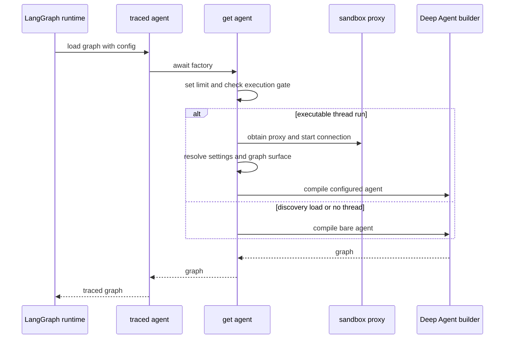
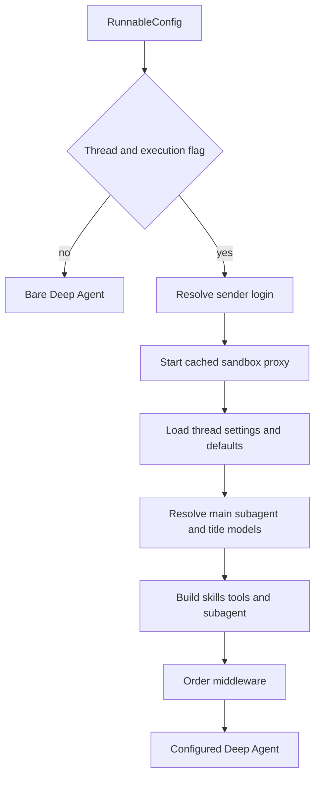

# Coding Agent Assembly

`get_agent(config)` in `agent/server.py` is the per-run composition boundary for the main coding agent. It resolves run-specific authority and durable thread choices, starts a thread backend, assembles models, skills, tools, subagents, and middleware, then supplies them to `create_deep_agent`. The compiled graph itself is stateless; long-lived state belongs to LangGraph thread state and metadata plus the thread-bound sandbox.

## Entrypoint and execution gate

`langgraph.json` registers `agent.graphs.agent:traced_agent` as the `agent` graph. That module re-exports the server factory and its tracing wrapper. The factory sets the LangGraph recursion limit to 9,999 before taking either path.

This shows the factory's cheap discovery path versus full executable-run assembly.

Full assembly requires both `configurable.thread_id` and `configurable.__is_for_execution__ is True`, as parsed through `RunConfig`. A schema/discovery load, or one without a thread, returns `create_deep_agent(system_prompt="", tools=[])` without a supplied sandbox or middleware. This gate prevents graph loading from provisioning credentials, sandboxes, or integrations.

`RunConfig` is intentionally permissive at this boundary: all declared fields are optional, unknown configurable keys round-trip, and parsing drops malformed fields rather than rejecting an entire run. Relevant factory inputs include identity and source, repository and environment, model/effort choices, `plan_mode`, `stop_summary`, and `admin_thread`.

## Thread resources and ownership

This flow separates triggering-sender authority from persistent thread configuration.

`profile_login` is the person who triggered this run. It controls authorization and credentialed integrations. In contrast, model selection and repository instructions come from thread settings, which are seeded from a profile then retained for the thread; a later participant does not silently replace them. Sender draft-PR preference is refreshed into the run configuration.

The factory gets a cached `SandboxBackendProxy` for the thread and calls `start()` immediately, overlapping connection/provisioning with settings resolution. Its reconnect callback creates a `LocalShellBackend` for desktop runs. Hosted runs call `ensure_sandbox_for_thread` with the selected environment and, for LangSmith sandboxes, sender credentials. The stable proxy is what the graph receives; its target can reconnect or be replaced without replacing the graph's backend handle.

For a hosted thread, sandbox lifecycle reuses an in-memory backend or reconnects the sandbox id stored in thread metadata, refreshes GitHub proxy credentials and git identity, and creates/binds a sandbox only when none exists. An unreachable existing sandbox raises `SandboxUnreachableError` by default rather than being silently replaced and losing uncommitted work. A deleted sandbox is replaced because the stored stale id would otherwise permanently prevent progress. Preparation posts a user-facing notification before propagating an unreachable-sandbox failure.

## Model, profile, and prompt resolution

The primary and subagent model/effort pairs begin with team defaults. Dashboard profile overrides may replace them, including a separate subagent override; stored thread settings then take precedence. An explicit `agent_model_id` plus `agent_effort` is the only per-run choice that can move a thread off stored settings, and it is accepted only after canonicalization when the model is supported and the effort is valid for that model. The resolved thread settings—including repository instructions—are persisted before the deployment-wide Fable gate is applied, so that gate is evaluated on every run. Main, subagent, and title models receive provider-specific kwargs; model construction failures become deferred error models so graph compilation still succeeds. A fallback middleware is installed only when its model id differs from the primary model.

The factory passes an empty `system_prompt` to `create_deep_agent`. `PrepareAgentRunMiddleware` does the per-invocation work: it resolves credentials, sandbox work directory, environment, repository context, sender information, and title generation, then saves `rendered_system_prompt` in state. Its model wrapper prepends that prompt, wrapped as system context, to each model request.

The per-thread `SYSTEM_PROMPT_TEMPLATE` is ordered from working environment, dashboard/source and plan guidance through repository setup, execution, optional Corridor, dependency/untrusted-content and PR guidance, repository/environment/admin instructions, ending with the shared base. `render_open_swe_shared_base` adds the stable `OPEN_SWE_SHARED_BASE` and only adds download guidance when signed sandbox downloads are available. It also distinguishes an admin environment thread from ordinary runs, which are directed to an admin Web UI thread for managed-environment changes.

Participant input is deliberately not put in this durable prompt. Hosted preparation builds sender identity, attribution, draft preference, workspace-admin status, participant identities, and user instructions as a separate generated context message after human input. It deduplicates a context hash already visible in the transcript, avoiding historical-message rewriting. Preparation is checkpointed using a fingerprint of middleware type, latest message, and preparation configuration: retries of the same checkpointed invocation skip setup, while a later invocation refreshes tokens and context. Consequently `_prepare` operations must be idempotent.

## Composite filesystem, skills, and tools

The configured agent receives a `CompositeBackend` whose default is the sandbox proxy. Passing an initialized backend lets Deep Agents wire filesystem tool-result eviction and history summarization/offloading. Read-only overlay routes expose:

- `/bundled-skills/` from `agent/bundled_skills/` through a virtual `FilesystemBackend`;
- hosted `/organization-skills/` from a shared LangGraph-store namespace; and
- hosted `/skills/` from the triggering user's namespaced store, when a login exists.

Desktop instead exposes a read-only `StateBackend` snapshot at `/skills/`; its state schema includes those files. Desktop also routes `/large_tool_results/` and `/conversation_history/` to virtual, thread-specific directories outside the selected project, so offloaded data is not added to the user's repository. The ordered `skill_sources` list is passed to both the main agent and general-purpose subagent, and all skill routes reject writes.

The parent static tool surface is assembled for the run rather than inferred from imports. It includes web, plan, skill, Linear, thread, background, sandbox, PR, and reporting tools; Slack tools are retained only for trusted Slack or scheduled source context with a complete thread reference. Authorized admin threads add environment, automation, organization-skill, and sandbox-reset tools. Signed-download tools require a non-desktop, non-summary LangSmith sandbox. Desktop is limited to `http_request`, `fetch_url`, and `web_search`; stop-summary mode is limited to Slack read and reply. `ExcludeToolsMiddleware` removes Deep Agents' `grep` normally and also removes mutation/delegation filesystem tools in stop-summary mode.

Optional integrations are exposed through `DynamicToolMiddleware`. During assembly, observability (authorization-gated), Currents, Notion, and optional Browser tools are loaded into eager groups; schemas become available only after the agent calls `load_integration_tools`. Corridor instead supplies a static catalog and defers its MCP handshake until selected. The middleware rejects direct use before loading, prevents collisions with static and Deep Agent names, serializes group construction, turns loader failures into unavailable-tool results, and clears loaded integration state at each run start. Tool loader failures or timeouts during assembly degrade to an empty group rather than failing assembly.

## Plan mode and subagents

`PlanModeMiddleware` is installed unconditionally. At run start it sets state to the factory's `configurable.plan_mode is True` value, preventing stale state from a prior run from leaking forward. It filters tools on every model request, so `enter_plan_mode` can restrict the next turn in the same run.

While active, the exclusion set removes delegation and externally mutating tools, including background, browser action, sandbox, PR, thread-management, selected skill/Slack/Linear, environment, and automation tools. `task` must be excluded because a subagent is independently compiled and does not inherit parent plan-mode filtering. File editing remains available for plan files, and `execute` remains available; the prompt, not a shell enforcement mechanism, supplies the read-only-command discipline.

The always-present general-purpose subagent preserves the Deep Agents general-purpose identity and mechanics prompt, prepends the Open SWE shared base, shares the skill source list, and omits background and parent-context-sensitive Slack, thread, user-settings, and notification tools. It receives dynamic-tool handling when configured plus its own `grep` exclusion. Parent middleware does not wrap separately compiled subagent graphs, so subagents receive their own OpenAI-response sanitizer, model-error middleware, and model-call timeout middleware.

## Middleware ordering and operational invariants

The parent middleware list is ordered outermost to innermost:

1. `PrepareAgentRunMiddleware`, then optional `DynamicToolMiddleware`.
2. Tool-input sanitation; `ModelCallLimitMiddleware(run_limit=5000, exit_behavior="end")`; tool-error conversion; exclusion; subdirectory reads; and `task` retry, up to two times.
3. Hosted PR-creation guard, workflow-push guard, GitHub proxy refresh, and—except in summary mode—message-queue checking.
4. Timeout wrap-up, step-limit notification, usage recording, optional model fallback, and plan-mode filtering.
5. Fireworks/OpenAI/thinking sanitizers, stable tool-result ordering, model-error handling, and innermost `ModelCallTimeoutMiddleware`.

The innermost timeout measures the provider call and propagates outward to fallback. `ToolErrorMiddleware` intentionally precedes task retry. Deep Agents itself provides `PatchToolCallsMiddleware`; the factory must not add the obsolete custom orphaned-tool-call repair middleware. Parent-only guards are not subagent security controls.

## Change guidance and tests

Use `get_agent` to change the sandbox provider, policy for models, parent tool surface, subagent specifications, or parent middleware. Preserve the executable-run gate, sender-versus-thread ownership, read-only skill routes, and wrapper ordering. When adding an integration, ensure its names cannot collide with static or Deep Agent tools and decide whether it belongs in the parent, subagents, or both.

`tests/agent/test_agent_assembly_context.py` verifies the assembly contract: initialized composite backend, hosted and desktop skill routes, mode-specific tools, parent-only tools, dynamic browser behavior, exclusions, and key middleware ordering. `tests/agent/test_plan_mode.py` checks plan prompt behavior and the plan-mode exclusion boundary. See [Middleware Stack](middleware-stack.md), [Sandbox Lifecycle](sandbox-lifecycle.md), [Models & Profiles](../concepts/models-profiles-instructions.md), [Tools](../concepts/tools.md), and [Context Engineering](../workflows/context-engineering.md).
