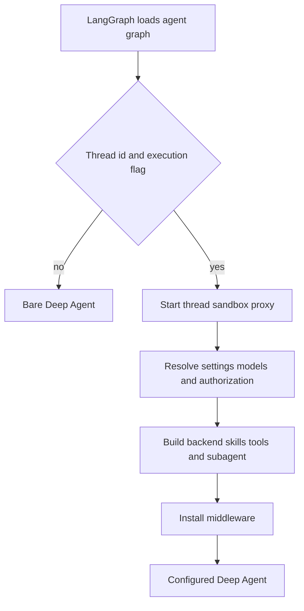

# Coding Agent Assembly

`get_agent(config)` in `agent/server.py` is the composition boundary for the primary coding agent. For an executable thread run, it resolves durable thread settings and sender-scoped authority, starts a thread backend, then supplies the resulting models, curated tools, subagents, skills, backend, and ordered middleware to `create_deep_agent`. The `agent` deployment entrypoint in `langgraph.json` is `agent.graphs.agent:traced_agent`, which currently re-exports this factory.

## Load gate and configuration contract

The executable-run gate separates inexpensive graph discovery from thread-bound agent assembly.

The factory sets the LangGraph recursion limit to `DEFAULT_RECURSION_LIMIT`. Full assembly requires both `configurable.thread_id` and `configurable.__is_for_execution__ is True`; otherwise it returns `create_deep_agent(system_prompt="", tools=[])`, with no supplied backend or middleware. The returned graph is bound using `bindable_config`, which removes `__pregel_*` runtime internals so a read-time runtime is not serialized into later invocations.

`RunConfig` is the tolerant boundary around `configurable`: all declared fields are optional, unknown keys survive round trips, and parsing drops only invalid fields rather than losing an otherwise usable run configuration. This matters because different launchers and graph types add distinct keys.

## Assembly flow and ownership

`profile_login` is the person who triggered this run. It controls authorization and credentialed integrations. In contrast, model choices and repository instructions are loaded from thread settings—initially seeded from a profile and then retained by the thread—so a later participant does not silently replace durable decisions.

The factory creates a cached `SandboxBackendProxy` and starts its reconnect task before resolving the rest of the graph surface. Desktop reconnects to a `LocalShellBackend`; hosted runs call `ensure_sandbox_for_thread` with the configured environment. That lifecycle uses a cached backend when available, otherwise reconnects the sandbox id recorded in thread metadata, refreshes proxy credentials, or creates and binds a new sandbox. It deliberately raises for an unreachable existing sandbox rather than replacing potentially uncommitted work; a deleted sandbox is replaced because retaining its stale id would permanently block the thread.

## Model and profile policy

Main and general-purpose-subagent model/effort pairs resolve in this order:

1. Team defaults.
2. Dashboard profile overrides, including a separate subagent override when provided.
3. Stored thread settings.
4. A per-run `agent_model_id` and `agent_effort` pair, only after canonicalization and validation against `SUPPORTED_MODEL_IDS` and `model_supports_effort`.

The accepted per-run pair becomes the main and subagent pair and is stored with repository instructions for hosted runs. The Fable availability gate is deliberately applied *after* storage, so a deployment-wide enablement decision is evaluated each run instead of frozen into thread settings. Provider-specific keyword arguments are computed separately for main, subagent, and title models. Construction failures are deferred into an error model, allowing the graph to compile and reporting provider setup failure at model-call time. A fallback middleware is installed only if its model id differs from the primary model.

## Prompt and per-run preparation

The factory gives `create_deep_agent` an empty static system prompt. `PrepareAgentRunMiddleware` renders the per-thread prompt in its before-agent hook into `rendered_system_prompt`; its base class prepends that content to every model request and wraps it as authoritative system instructions.

`construct_system_prompt` builds the main-agent layer in a fixed order: working environment, dashboard/source context, plan guidance, self-awareness, default repository, optional repository scope, repository setup and task execution, optional Corridor guidance, dependency and untrusted-comment guidance, commit/PR guidance, repository instructions, environment instructions, optional admin-environment guidance, and shared-base guidance. `render_open_swe_shared_base` appends `OPEN_SWE_SHARED_BASE` and conditionally adds sandbox-download guidance. Sender identity, commit attribution, standing user instructions, and participant context are intentionally excluded from this durable prompt layer.

For hosted runs, preparation resolves the GitHub token, triggering identity, sandbox work directory, environment, sender instructions, and thread participants. It adds the resulting sender context as a separate generated input after a human message, identifies the latest attributed human sender, and does not re-add a context hash still visible after history summarization. This avoids rewriting cached user history and scopes sender-specific metadata to the relevant turn. A sandbox-unreachable failure also posts a user-facing notification before being re-raised.

Preparation is checkpointed. `run_prepared_for` fingerprints the middleware class, latest message, and configuration; a resumed attempt with the same fingerprint skips setup, while a later invocation re-prepares fresh credentials, prompt, and context. Preparation implementations must be idempotent because failure before checkpoint persistence permits a retry.

## Backend and skills

The primary backend is a `CompositeBackend` whose default route is the sandbox proxy. It overlays read-only skill routes:

- Bundled skills are served from a virtual `FilesystemBackend`.
- Hosted organization skills come from a store namespace shared by the organization.
- Hosted user skills come from a store namespace scoped to `profile_login` when one exists.
- Desktop user skills instead use a read-only `StateBackend` snapshot.

The ordered `skill_sources` list is supplied to both the parent and the general-purpose subagent. Desktop additionally routes `/large_tool_results/` and `/conversation_history/` to a thread-specific artifact directory outside the selected project, preventing Deep Agents history and tool-result offloads from becoming repository changes.

## Curated and dynamic tools

The parent gets a curated static tool list. Slack tools require trusted Slack or schedule source context with a channel and thread timestamp. Authorized admin threads add environment, organization-skill, sandbox-reset, and automation controls. Sandbox download/service URL tools require the LangSmith sandbox provider and are omitted for desktop and stop-summary runs. Desktop is restricted to `http_request`, `fetch_url`, and `web_search`; stop-summary mode is restricted to Slack read and reply.

`ExcludeToolsMiddleware` removes Deep Agents' `grep` in normal runs. In stop-summary mode it also removes mutating filesystem and delegation tools. Plan mode applies a distinct filter that removes delegation and external mutation—including `task`, browser actions, HTTP requests, PR/thread/sandbox operations, and selected Slack, Linear, skill, environment, and automation tools. File editing and `execute` remain available, so the plan-mode shell read-only expectation is prompt-enforced rather than a hard execution boundary.

Integration schemas are exposed through `DynamicToolMiddleware`, not appended directly to the static list. Observability, Currents, and Notion tools are eagerly loaded during factory assembly (with loader failures and timeouts yielding no tools); their schemas become usable only after `load_integration_tools`. Browser tools are also a dynamic group and do **not** create a browser subagent. Corridor provides a static name catalog and defers its MCP handshake until the agent selects a Corridor tool. The middleware resets selected integration tools at run start, prevents direct calls before selection, serializes construction per group, and reserves static/Deep Agent names to reject collisions.

## Plan mode and subagent boundary

`PlanModeMiddleware` is installed for every graph. At run start it resets `plan_mode` in state to the factory's `configurable.plan_mode is True` value, preventing stale state from a prior run leaking forward. It filters every model request, so `enter_plan_mode` can restrict the very next turn in the same run. Excluding `task` is essential: the general-purpose subagent compiles as an independent graph and does not inherit the parent's plan-mode filter.

The only configured subagent is the Deep Agents general-purpose subagent. It receives the Open SWE shared base plus Deep Agents task mechanics, the same ordered skills, static tools excluding background execution/tasks and parent-context-sensitive Slack/thread/user-settings tools, and a description requiring Slack communication to be relayed through the parent. Because it compiles independently, parent middleware does not wrap it. It therefore receives its own dynamic-tool and exclusion middleware, workflow-push guard, OpenAI response sanitization, model-error handling, and model-call timeout.

## Middleware order is behavior

The supplied parent list is ordered outermost to innermost:

1. `PrepareAgentRunMiddleware`, then optional `DynamicToolMiddleware`.
2. Input sanitation, `ModelCallLimitMiddleware`, tool-error conversion, tool exclusion, subdirectory reads, and retry for `task`.
3. PR/workflow guards, GitHub proxy refresh, and—outside stop summaries—message-queue checking.
4. Timeout wrap-up, step-limit notification, usage recording, optional model fallback, and plan-mode filtering.
5. Provider/thinking sanitizers, stable tool-result ordering, model-error handling, then `ModelCallTimeoutMiddleware`.

The innermost timeout measures the provider call itself and can propagate outward to the fallback model. The call limit ends the run at `MODEL_CALL_RECURSION_LIMIT`; task retry sits inside `ToolErrorMiddleware`. `create_deep_agent` supplies its own `PatchToolCallsMiddleware`, so the factory must not add the obsolete custom orphaned-tool-call repairer.

## Change guidance and focused tests

Treat `get_agent` as the customization seam for sandbox providers, model policy, parent tools, skills routes, subagents, and middleware. Preserve the execution gate, the distinction between triggering-sender authority and durable thread settings, and the subagent boundary: a parent-only guard does not secure a separately compiled subagent.

`tests/agent/test_agent_assembly_context.py` checks backend/skills routing, desktop and stop-summary tool surfaces, parent-only tools, subagent guards, and middleware order. `tests/agent/test_factory_tool_loading.py` verifies parallel eager loading. `tests/models/test_agent_subagent_models.py` covers independent profile subagent overrides and Fable gating. Related material: [Middleware Stack](middleware-stack.md), [Sandbox Lifecycle](sandbox-lifecycle.md), [Models & Profiles](../concepts/models-profiles-instructions.md), [Tools](../concepts/tools.md), and [Context Engineering](../workflows/context-engineering.md).
