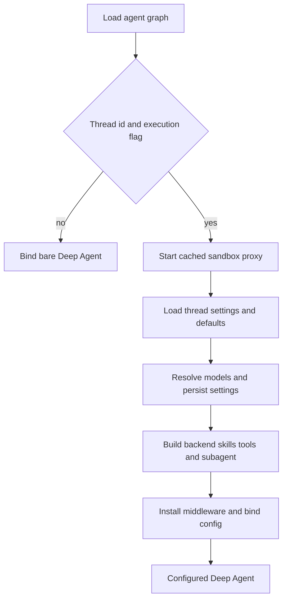
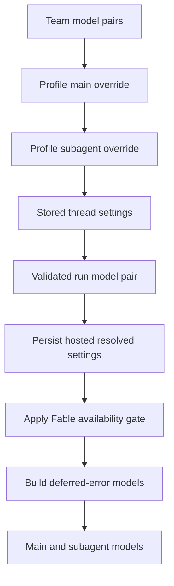

# Coding Agent Assembly

`get_agent(config)` in `agent/server.py` is the composition boundary for the primary coding graph. The deployed `agent` graph is `agent.graphs.agent:traced_agent`, an export of this factory. An executable thread run receives a Deep Agent configured with its backend, model(s), skills, tool surface, general-purpose subagent, and middleware; graph discovery receives a minimal agent instead.

## Configuration-resolution flow

The graph is deliberately cheap when it is loaded for inspection rather than execution.

`RunConfig.parse` is the tolerant boundary around `configurable`: declared fields are optional, unknown keys survive, and invalid fields are discarded individually. This accommodates webhook, dashboard, cron, and graph-specific configuration without a malformed optional value losing `thread_id`. The factory sets `DEFAULT_RECURSION_LIMIT`; it requires both `thread_id` and `__is_for_execution__ is True` for full assembly. Otherwise it returns `create_deep_agent(system_prompt="", tools=[])`. Finally, `bindable_config` strips `__pregel_*` runtime plumbing before `with_config`, because LangGraph supplies those internals for each invocation and a read-time runtime is not serializable for later graph calls.

## Thread, identity, and model policy

The triggering `profile_login` is the authorization identity. In particular, personal credentials and sender-specific instructions are scoped to verified private ownership. Durable choices instead live in the thread: its settings are seeded from the original profile and reused so a later participant does not silently change the selected model or repository instructions.

Main and subagent settings have explicit precedence, while the availability gate remains a deployment-time decision.

The main and subagent pairs start with team defaults. A profile main override updates both pairs, then a separate profile subagent override may replace only the subagent pair; stored thread settings override those values. A per-run model/effort pair wins only after canonicalization, membership in `SUPPORTED_MODEL_IDS`, and effort support validation. Hosted runs persist the resolved pairs, model-routing choice, and repository instructions *before* Fable gating, so changing the deployment-wide gate affects every run rather than being frozen in settings. Model construction failures are represented by deferred error models, and fallback middleware is present only when its configured fallback id differs from the primary id. Optional adaptive routing creates a `ModelSelectionMiddleware` from the configured fast, balanced, and performance pairs and records whether it was applied in run metadata.

## Backend, sandbox, and skills

Assembly starts a cached `SandboxBackendProxy` early, while settings loading continues. Its reconnect callback creates a validated `LocalShellBackend` for desktop runs; hosted runs call `ensure_sandbox_for_thread` with the selected environment. The lifecycle reuses a cached backend or reconnects the metadata sandbox id and refreshes its GitHub proxy. It does **not** silently replace an unreachable existing sandbox, protecting possibly uncommitted work. A deleted sandbox is replaced, since a stale deleted id would otherwise prevent all future runs; callers can explicitly permit replacement of merely unreachable sandboxes only when the checkout is re-derivable.

The graph gives Deep Agents a `CompositeBackend`, with the sandbox proxy as default and read-only skill routes layered over it:

- Bundled skills are a virtual `FilesystemBackend`.
- Hosted organization skills are a `StoreBackend` in the organization namespace.
- Hosted user skills are a `StoreBackend` in the credential owner namespace, when private credentials are available.
- Desktop user skills are a read-only `StateBackend` snapshot.

The ordered skill route list is shared by the parent and general-purpose subagent. Desktop additionally maps the virtual `/large_tool_results/` and `/conversation_history/` directories to a sanitized thread-specific artifact root outside the local project, so automatic offloads do not show up in Git changes.

## Prompt and input preparation

The static `system_prompt` passed to `create_deep_agent` is empty. `PrepareAgentRunMiddleware` performs per-run setup and stores `rendered_system_prompt`; its model wrapper makes that rendered content the authoritative system message before any existing system message.

For hosted runs, preparation obtains the GitHub token, default repository, triggering identity, sandbox work directory, environment, sender instructions, and participant identities. `construct_system_prompt` renders the main template with environment, dashboard and source context, plan guidance, self-awareness, default repository and optional scope, setup and task guidance, dependency and untrusted-comment rules, commit/PR instructions, repository and environment instructions, optional admin guidance, and shared-base guidance. `render_open_swe_shared_base` adds sandbox-download guidance only when those tools are enabled. Desktop preparation instead awaits the local backend and renders a desktop prompt.

Sender identity, commit attribution, user instructions, and participant context are not durable prompt text. After a human message, preparation serializes them as a distinct generated sender-context message. It finds the latest attributed human sender and avoids reinserting context whose hash is still visible after summarization. This preserves cached authored history while reintroducing context that summarization has evicted.

Preparation is checkpointed by a fingerprint of middleware class, latest message, and relevant configuration. A resumed attempt with the same fingerprint skips setup; a later message or configuration prepares fresh context. Therefore `_prepare` work must be idempotent: a failure before checkpoint persistence can retry it. If a hosted sandbox is unreachable while preparation awaits it, the middleware posts a user-facing notification and re-raises.

## Tools and delegation boundary

The parent static surface includes web, plan, background, thread, PR, user-setting, sandbox, reporting, and—when trusted source context permits—Slack tools. The factory removes personal user tools without a private credential owner, removes Slack tools unless the source and Slack thread context are trusted, and rechecks both `admin_thread` and workspace authorization before adding `ADMIN_TOOLS`. Desktop runs are limited to `http_request`, `fetch_url`, and `web_search`; stop-summary runs are limited to Slack read/reply. Sandbox download, service URL, and iframe tools are available only for the supporting sandbox provider and not in those restricted modes.

Dynamic integrations are not appended to that static list. MCP and Notion tools are loaded concurrently during hosted assembly when credential scope is known; browser tools are another dynamic group except in desktop and stop-summary modes. `DynamicToolMiddleware` exposes a `load_integration_tools` catalog, resets selections at run start, and requires a tool to be selected before it can be called. It serializes construction of each group, turns construction failure into an unavailable-tool result, and rejects names colliding with static or Deep Agent tool names. This keeps costly integration work out of the initial model tool surface while retaining explicit selection state.

`ExcludeToolsMiddleware` always removes Deep Agents' `grep`; stop-summary mode additionally excludes mutating filesystem and delegation tools. `PlanModeMiddleware` is installed unconditionally. It resets run state from `configurable.plan_mode`, recomputes the filtered list for every model request, and can therefore restrict the next turn after `enter_plan_mode`. Its exclusions include `task`, external mutation, browser actions, HTTP requests, PR/thread/sandbox operations, and selected workspace tools. File editing and `execute` remain available, with shell read-only behavior enforced by prompt guidance rather than a hard sandbox boundary. Removing `task` matters because a subagent is separately compiled and would not inherit the parent filter.

There is one configured Deep Agents subagent, `general-purpose`. It receives the shared base plus Deep Agents task mechanics, the same ordered skill sources, and static parent tools after background execution/tasks and parent-context-sensitive Slack, thread, and user-setting tools have been removed. It has its own dynamic-tool middleware when configured, exclusion and workflow-push guards, OpenAI response sanitation, model-error handling, timeout, and conversation offloading. Parent middleware is not inherited across that compilation boundary; parent-only controls must not be treated as subagent controls.

## Middleware ordering and operations

The supplied list is outermost to innermost. `ConversationOffloadingMiddleware` is first, followed by preparation, optional workspace-skills and dynamic-tools middleware; input sanitation, model-call limit, tool errors, exclusions, subdirectory reads, and task retry; PR/workflow and GitHub-proxy guards plus message-queue checking when applicable; timeout wrap-up, step notification, usage recording, optional selection/fallback, and plan mode; then provider/thinking sanitation, stable tool-result ordering, model errors, and `ModelCallTimeoutMiddleware` innermost. The innermost timeout covers the provider call and can propagate to the outer fallback middleware. The model-call limit ends at `MODEL_CALL_RECURSION_LIMIT`; `task` retry is inside tool-error conversion. `create_deep_agent` supplies `PatchToolCallsMiddleware`, so the factory does not install the retired custom orphaned-tool-call repairer.

## Focused verification and change guidance

Treat `get_agent` as the extension boundary for sandbox providers, model policy, skills routes, parent tools, integrations, subagents, and middleware. Preserve the execution gate, identity-versus-thread-settings distinction, read-only skill routes, and the independently compiled subagent boundary. Relevant focused tests cover sandbox startup overlap, backend and skills routing, desktop and stop-summary surfaces, parent-only subagent tools, admin/file-download gates, dynamic browser tools, middleware guards/order, model routing, parallel integration loading, and profile subagent overrides.

Related pages: [Middleware Stack](middleware-stack.md), [Sandbox Lifecycle](sandbox-lifecycle.md), [Models, Profiles, and Instructions](../concepts/models-profiles-instructions.md), [Threads and State](../concepts/threads-and-state.md), [Tools](../concepts/tools.md), and [Context Engineering](../workflows/context-engineering.md).
