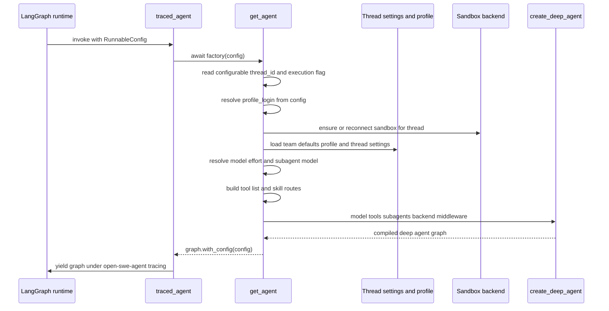

# Agent Graph & get_agent Factory

The main coding agent is not a static graph. It is compiled fresh for every run
by an async factory, `get_agent(config)` in `agent/server.py`, which reads the
run's `RunnableConfig`, resolves the caller's identity and the thread's settings,
attaches a sandbox, curates the tool list, wires the middleware stack, and hands
all of it to `create_deep_agent`. The registered LangGraph entrypoint is a thin
wrapper, `traced_agent`, that calls `get_agent` and runs the returned graph under
a dedicated LangSmith tracing project.

## Entrypoint and registration

`langgraph.json` maps the `agent` graph to `agent.graphs.agent:traced_agent`,
and `agent/graphs/agent.py` merely re-exports `get_agent` and `traced_agent`
from `agent/server.py`. `traced_agent` is produced by `traced_graph_factory`,
which wraps the factory in an async context manager that builds the graph and
yields it inside `ls.tracing_context(project_name="open-swe-agent")`.

Per-thread assembly performed by `get_agent` on every run.

## Fast path for non-execution loads

The graph is loaded for reasons other than running a turn (schema
introspection, listing). `get_agent` first checks `graph_loaded_for_execution`,
which reads the `__is_for_execution__` flag from `configurable`. If there is no
`thread_id`, or the load is not for execution, it returns a bare
`create_deep_agent(system_prompt="", tools=[])` with no sandbox and no
middleware. Only an execution load provisions a sandbox and pays the full
assembly cost.

Every returned graph — bare or full — sets `config["recursion_limit"]` to
`DEFAULT_RECURSION_LIMIT` (9,999), the LangGraph superstep budget that bounds
the agent loop.

## Identity, sandbox, and thread settings

For an execution load, `get_agent` resolves three things that drive everything
else:

- **GitHub identity.** `resolve_github_login` extracts the login of whoever sent
  the message that started the run. This `profile_login` drives authorization and
  credentialed integrations, which stay personal to the sender; everything else
  comes from the thread's own frozen settings.
- **Sandbox.** A cached `SandboxBackendProxy` is obtained for the `thread_id`
  with a `reconnect` callback. For desktop runs the callback builds a
  `LocalShellBackend` rooted at an allowlisted project; otherwise it calls
  `ensure_sandbox_for_thread`, which get-or-creates a healthy sandbox bound to
  the thread and refreshes the GitHub App proxy auth.
- **Model settings.** Team defaults, the sender's dashboard profile, stored
  thread settings, and per-run overrides are layered to produce the resolved
  model and effort.

### Model and effort resolution order

Model selection is a precedence cascade, each layer overriding the previous:

1. Team default model pair (main and subagent), read via a short-TTL cache.
2. Dashboard profile overrides for the sender, when the thread has no stored
   model.
3. Stored thread settings (`model_id`, `effort`, `subagent_model_id`,
   `subagent_effort`) — the frozen per-thread choice.
4. An explicit per-run `agent_model_id` / `agent_effort` from `configurable`,
   accepted only when the model is in `SUPPORTED_MODEL_IDS` and supports the
   requested effort. This is the one thing allowed to move a thread off its
   stored settings, and the new choice is then persisted back.

The resolved main and subagent settings are written back to thread settings
(outside desktop runs) so later turns stay on the same model, and each is then
passed through `gate_fable_model` before building `provider_model_kwargs`. Model
construction uses `_make_model_or_defer`, which returns a deferred error model
rather than raising, so a provider misconfiguration surfaces at call time
instead of failing the whole factory. See
<!-- openwiki: broken internal link [../concepts/models-profiles.md] file "../concepts/models-profiles.md" does not exist. Fix the href or restore the target, then delete this comment. -->
[Models & Profiles](../concepts/models-profiles.md).

## System prompt assembly

`create_deep_agent` is called with `system_prompt=""`; the real prompt is
rendered per-run inside `PrepareAgentRunMiddleware`, not at factory time. Its
`_prepare` hook calls `construct_system_prompt` (from `agent/prompt.py`) with the
resolved working directory, dashboard URLs, Linear context, plan-mode flag, repo
custom instructions, environment, source channel, and feature gates.
`construct_system_prompt` fills `SYSTEM_PROMPT_TEMPLATE` with per-thread,
main-agent-specific sections and appends the static, run-invariant
`OPEN_SWE_SHARED_BASE` (via `render_open_swe_shared_base`) that carries the Open
SWE identity and conventions.

The rendered text is stored in run state as `rendered_system_prompt`. The base
prepare middleware's `awrap_model_call` prepends it to the request's system
message on every model call, wrapping the whole thing with `wrap_system_prompt`.

A key control-flow invariant follows from the prompt: it instructs the agent to
call a tool every turn, and nothing re-injects a tool call, so **a model turn
with no tool call ends the run**. This is the primary stop condition of the agent
loop; the prompt states plainly that "a turn with no tool call is how you stop."

## Backend composition

The agent's filesystem is a `CompositeBackend`: the sandbox is the `default`
backend, and skill routes overlay specific virtual paths onto other backends.

- **Sandbox backend** — the `default`, holding the git checkout and shell.
- **`FilesystemBackend`** wrapped in `ReadOnlyBackend` for the bundled skills
  route (read from the on-disk bundled skills directory in virtual mode).
- **`StoreBackend`** (read-only) for organization skills and, when a
  `profile_login` is known, the sender's personal user skills — each namespaced
  in the LangGraph store.
- **`StateBackend`** (read-only) for user skills on desktop runs, where skills
  live in run state rather than the store.

Skill routes are resolved into an ordered `skill_sources` list passed to both the
main agent and its subagents. On desktop runs the composite also routes the
agent's own scratch paths (`/large_tool_results/`, `/conversation_history/`) to
`FilesystemBackend`s outside the user's project so offloads are not swept into
git. See [Sandbox Lifecycle](sandbox-lifecycle.md).

## Tools

The tool list is curated per-run. A large `static_tools` list covers HTTP/web,
plan control, background tasks, Linear, thread management, PR creation, Slack,
and skill management, with several conditional additions:

- Slack tools are dropped when Slack is not enabled for the thread.
- Admin threads gain workspace-management `ADMIN_TOOLS`.
- Sandbox file-download tools are added only when that feature is enabled.
- Desktop and stop-summary modes collapse the list to a minimal subset.

Optional integration tools (Observability, Currents, Notion, Corridor) are not
put in `static_tools`; they are registered as lazy groups in a
`DynamicToolMiddleware` so the MCP handshake only runs when the agent actually
asks for the group. `ExcludeToolsMiddleware` then removes tools that should never
be exposed (e.g. `grep` via `DEEP_AGENT_EXCLUDED_TOOLS`, or the broader
stop-summary exclusion set). See [Tools](../concepts/tools.md).

## Subagents

`create_deep_agent` receives a list of `SubAgent` specs. The always-present one
is the general-purpose subagent built by `_general_purpose_subagent`, which
reuses Deep Agents' `GENERAL_PURPOSE_SUBAGENT` name and prompt but prepends the
Open SWE shared base so delegated work inherits the same identity and
conventions. Its tools are the static tools minus background execution and minus
parent-only, source-context tools (Slack and thread tools), and it is given the
same skill sources. A `browser` subagent is added only when browser tools loaded.

Subagents compile into their own graphs, so parent middleware never wraps them.
Each `SubAgent` therefore carries its own model guards via
`_subagent_model_middleware` — a `SanitizeOpenAIResponsesMiddleware` and a
`ModelCallTimeoutMiddleware` — so a wedged delegated `task` model call raises and
escalates through the parent's `task` retry rather than parking silently. The
general-purpose subagent also carries the `DynamicToolMiddleware` and its own
`ExcludeToolsMiddleware`.

## Middleware stack

The main agent's `middleware` list is ordered outermost to innermost. The
salient members and their roles:

- **`PrepareAgentRunMiddleware`** — outermost per-run setup; renders the system
  prompt, resolves work dir and sender context, schedules title generation, and
  latches `run_prepared_for` so resumed attempts skip completed setup.
- **`DynamicToolMiddleware`** (when integration groups exist) — lazy tool
  loading.
- **`ModelCallLimitMiddleware`** — caps model calls at
  `MODEL_CALL_RECURSION_LIMIT` (5,000) with `exit_behavior="end"`.
- **`ToolErrorMiddleware`** — turns tool exceptions into tool messages.
- **`ExcludeToolsMiddleware`**, **`SubdirAgentsReadMiddleware`**,
  **`ToolRetryMiddleware`** (retrying the `task` tool), plan-mode and PR/push
  guards, message-queue and GitHub-proxy hooks, timeout wrap-up, and provider
  sanitizers.
- **`ModelFallbackMiddleware`** — added only when a fallback model differs from
  the primary; a model-call timeout escalates outward to it.
- **`ModelCallTimeoutMiddleware`** — innermost, so its deadline covers the
  provider call itself and a timeout escalates outward to the fallback.

For the full ordering and semantics, see
[Middleware Stack](middleware-stack.md), and for how the prompt and injected
context shape each turn, see [Context Engineering](../workflows/context-engineering.md).

## Customization boundary

`get_agent` is the single seam for forking Open SWE: the sandbox provider,
model, tools, subagents, and middleware are all chosen here, and `create_deep_agent`
consumes them. The customization guide documents this function as the place to
swap those pieces.
