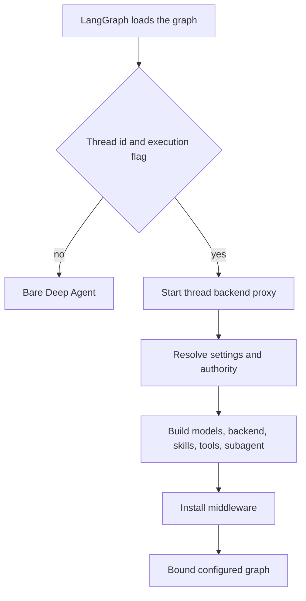

# Coding Agent Assembly

`get_agent(config)` in `agent/server.py` is the composition boundary for the primary coding graph. For an executable thread run it starts a thread backend, resolves durable settings and sender-scoped authority, then gives `create_deep_agent` a model, backend, skills, parent tools, an independently configured subagent, and middleware. The deployed `agent` graph is `agent.graphs.agent:traced_agent`, a re-export of this factory.

## Load gate and configuration contract

This shows the execution gate and the subsequent assembly path.

The factory sets `DEFAULT_RECURSION_LIMIT`. Full assembly requires a `thread_id` and `configurable.__is_for_execution__ is True`; graph discovery instead returns `create_deep_agent(system_prompt="", tools=[])` without a supplied backend or middleware. It binds the result with `bindable_config`, which strips `__pregel_*` runtime internals: LangGraph injects them at invocation time, and binding a read-time runtime would make later state reads unserializable.

`RunConfig` is deliberately a tolerant cross-launcher boundary around `configurable`: declared fields are optional, extras survive serialization, and parsing drops individual invalid fields rather than discarding the entire configuration. This permits graph- and trigger-specific keys while protecting essentials such as `thread_id`.

## Resolution, authority, and backend lifecycle

`profile_login` identifies the triggering actor and drives authorization. Hosted personal integrations use `credential_login` only after the thread's private credential scope is verified; if that lookup fails, MCP and Notion integrations are omitted. In contrast, model settings and repository instructions come from thread settings, initially seeded from a profile and then retained by the thread so a later participant does not silently replace durable choices.

The factory creates and starts a cached `SandboxBackendProxy` before loading settings. Its reconnect callback creates a `LocalShellBackend` for desktop, or calls `ensure_sandbox_for_thread` with the selected workspace for hosted runs. Sandbox lifecycle deliberately does not replace an unreachable existing sandbox by default, because it may hold uncommitted work; it does replace a deleted sandbox so the thread is not permanently tied to a stale id.

Desktop backend creation validates `local_project_path`: it must be an allowlisted project or an Open SWE worktree. A desktop `CompositeBackend` also maps Deep Agents' virtual `/large_tool_results/` and `/conversation_history/` directories to a sanitized, thread-specific artifact root outside the repository, preventing offloaded results and history from appearing in git changes.

## Model policy and persistence

The main and general-purpose-subagent model/effort pairs resolve in order:

1. Workspace defaults.
2. Dashboard profile overrides; a profile can independently override the subagent pair.
3. Stored thread settings.
4. A canonicalized per-run `agent_model_id` and `agent_effort`, only when the id is supported and the effort is valid for it.

An accepted per-run pair updates both main and subagent choices. Hosted assembly persists resolved main/subagent settings, model-routing preference, and repository instructions before Fable gating; the global Fable availability check therefore remains live each run. Slack `/oswe` ask runs are subsequently forced to the fast route without changing the stored thread choice. Provider kwargs are constructed independently for main, subagent, and title models; construction failures become deferred error models so compilation succeeds and the error is reported when called. Fallback middleware exists only when its model id differs from the primary one.

When adaptive routing is enabled by profile/workspace policy or persisted thread settings, `ModelSelectionMiddleware` receives independently constructed fast, balanced, and performance models. A stable hash of the thread id chooses either `auto` or `performance` routing mode, recorded in run metadata rather than `configurable`.

## Per-run context and prompt

The factory supplies an empty static system prompt. `PrepareAgentRunMiddleware` renders the thread-specific prompt during preparation into `rendered_system_prompt`; `BasePrepareRunMiddleware` prepends it to each model request as a system message.

`construct_system_prompt` renders source-aware working-environment and dashboard context, plan guidance, self-awareness, default-repository and optional repository-scope guidance, repository setup and task execution, dependency and untrusted-comment guidance, commit/PR guidance, repository and workspace instructions, optional admin-workspace guidance, then shared-base guidance. `render_open_swe_shared_base` appends static `OPEN_SWE_SHARED_BASE` and conditionally adds sandbox-download guidance.

Hosted preparation resolves the GitHub token, triggering identity, sandbox work directory, workspace, sender instructions, and thread participants. It converts sender identity, attribution, user instructions, and participant identities into a separate generated input following a human message rather than putting them in durable system instructions or rewriting historical user text. The dynamic context block has a hash and is not re-added while it remains visible after summarization. An unreachable sandbox triggers a user-facing notification before the error is re-raised.

Preparation is checkpointed using a fingerprint of middleware class, latest message, and configuration. A resumed attempt with the same fingerprint skips setup, while a later invocation refreshes prompt and credentials. Since a failure before the checkpoint can retry `_prepare`, its side effects must be idempotent.

## Backend, skills, and tool surface

The parent backend is a `CompositeBackend` with the sandbox proxy as default. It overlays read-only skills: bundled skills from a virtual `FilesystemBackend`; hosted organization skills from a LangGraph store namespace; hosted user skills from a credential-login-scoped store namespace; or desktop user skills from a snapshotted `StateBackend`. The ordered `skill_sources` are passed to both parent and general-purpose subagent. On hosted runs without a verified personal credential, `WorkspaceSkillsMiddleware` exposes the available shared skills instead.

The static parent surface includes web, planning, background, thread, sandbox, PR, reporting, and eligible Slack controls. It is narrowed by authority and mode:

- Personal settings/instruction/skill tools require a verified credential scope; channel-history reads require a private thread.
- Slack tools require trusted Slack, schedule, or incident source context and required channel/thread identifiers; DM runs exclude reactions.
- An authorized admin thread adds `ADMIN_TOOLS`; `read_only_sql` additionally requires a private admin surface.
- Desktop gets only `http_request`, `fetch_url`, and `web_search`; stop-summary gets only Slack thread read/reply.
- Signed sandbox download/service tools require the LangSmith sandbox provider and are unavailable in desktop and stop-summary modes.

`ExcludeToolsMiddleware` removes the Deep Agents `grep` tool in normal runs and applies specialized stop-summary, Slack-ask, and automatic-incident exclusions. `PlanModeMiddleware` is always installed. It resets state to the factory's initial value on each run and filters every model request, so `enter_plan_mode` restricts the next turn without leaking stale mode into a subsequent run. Plan mode excludes delegation (`task`) and external mutation while retaining file editing and `execute`; those latter shell/file constraints are prompt-enforced. Excluding `task` also prevents a separately compiled subagent from bypassing the parent filter.

MCP and Notion are dynamic integrations, loaded only for hosted non-stop-summary runs with known credential scope. Their already-built schemas are catalogued by `DynamicToolMiddleware`, which resets selected tools at each run start, requires `load_integration_tools` before a call, builds groups under per-group locks, turns loading failures into unavailable-tool results, and rejects collisions with reserved static and Deep Agents names.

## Subagent boundary and middleware ordering

The single configured subagent is the Deep Agents general-purpose subagent. It receives shared-base/task guidance, the same skill sources, and static tools minus background execution, background tasks, feedback, Slack and other parent-source-sensitive controls. It has its own optional dynamic-tools, workspace-skills, incident, PR-creation, workflow-push, conversation-offloading, exclusion, sanitization, model-error, and timeout middleware. Parent middleware does not wrap it, so every safety or context boundary that must apply to delegation must be installed explicitly on this independently compiled graph.

The parent middleware list is ordered outermost to innermost. Conversation offloading and per-run preparation come first, followed by optional incident/workspace/dynamic middleware; input/image sanitation, call limiting, tool-error conversion, exclusion, subdirectory reads, and task retry; PR/workflow/proxy/message-queue guards; timeout wrap-up, step/usage recording, optional model routing and fallback, and plan-mode filtering; then provider/thinking sanitizers, stable tool-result ordering, model errors, and `ModelCallTimeoutMiddleware`. The innermost timeout covers the provider call and can escalate outward into the fallback model. `create_deep_agent` supplies `PatchToolCallsMiddleware`, so the factory intentionally does not add the obsolete custom orphaned-tool-call repairer.

## Operational change guidance and tests

Use `get_agent` as the extension seam for backend providers, resolution policy, skills routes, static tools, integrations, subagents, and middleware. Preserve the executable-load gate, sender authority versus durable thread settings, narrow-mode tool lists, and the independently compiled subagent boundary.

`tests/agent/test_agent_assembly_context.py` verifies eager backend start, model routing, skill/backend routes, desktop state and tool surface, authority-sensitive tools, subagent omissions, and selected middleware. `tests/models/test_agent_subagent_models.py` checks that profile overrides can set an independent subagent model pair. Related material: [Middleware Stack](middleware-stack.md), [Sandbox Lifecycle](sandbox-lifecycle.md), [Models & Profiles](../concepts/models-profiles-instructions.md), [Tools](../concepts/tools.md), and [Context Engineering](../workflows/context-engineering.md).
