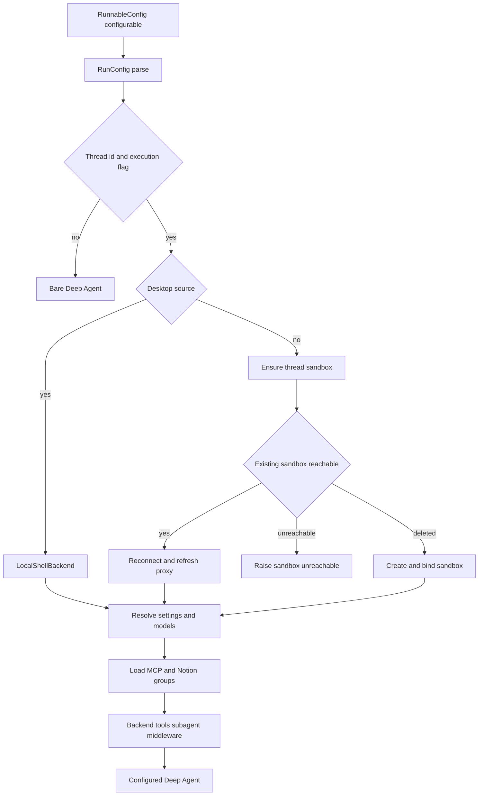

# Coding Agent Assembly

`get_agent(config)` is the public graph factory used by the `agent` entry in `langgraph.json`. It traces total factory work for a string thread id and delegates to `build_agent`, the composition boundary for the primary coding agent. An executable, thread-bound run becomes a `create_deep_agent` graph with a sandbox backend, resolved models, scoped tools and skills, one forked general-purpose subagent, and an ordered middleware stack.

## Entry gate and configuration

`RunConfig` is the tolerant contract around LangGraph's `configurable` mapping: declared fields are optional, unknown keys are retained, and parsing drops invalid fields individually. This permits launchers and graph types to add keys without making a malformed optional field discard the thread identity.

`build_agent` sets `DEFAULT_RECURSION_LIMIT`. It only does full assembly when there is a `thread_id` and `__is_for_execution__ is True`; discovery and state reads receive a bare agent with an empty system prompt and no supplied tools. Before binding either result, `bindable_config` removes `__pregel_*` internals, because LangGraph reinjects those per invocation and binding a read-time runtime would break later serialization.

*Factory control flow: execution gating, desktop-versus-cloud backend selection, cloud sandbox failure behavior, and the dynamic integration-tool stage.*

## Sandbox branch and lifecycle

The factory creates a cached `SandboxBackendProxy` with a reconnect callback and starts it while the rest of the graph is assembled. Desktop runs construct a `LocalShellBackend`; its `local_project_path` must resolve to an existing allowlisted project or a configured desktop worktree. Hosted runs call `ensure_sandbox_for_thread` using the selected workspace slug.

Hosted lifecycle prioritizes preserving work. An existing sandbox is reused from a process connection or reconnected using its thread metadata id, then its GitHub proxy and git identity are refreshed. An unreachable existing sandbox raises `SandboxUnreachableError` by default instead of silently replacing potentially uncommitted work. A deleted sandbox is replaced, since retaining its stale id would make every future run fail; callers can opt into replacement for an unreachable sandbox only when its checkout is re-derivable.

Preparation awaits the proxy. In hosted mode, a sandbox-unreachable error causes a user-facing notification and is re-raised. Desktop preparation instead awaits the local proxy, resolves its work directory, and produces a desktop prompt. Desktop also diverts Deep Agents' `/large_tool_results/` and `/conversation_history/` virtual directories to a sanitized thread-specific artifacts root outside the repository, preventing offloaded data from becoming git changes.

## Durable settings and model policy

The triggering `profile_login` establishes authority and personal integration eligibility, while model and repository-instruction choices are durable thread settings. For hosted runs, settings resolve in this precedence order:

1. Workspace defaults.
2. A profile main-model override, with an optional separate profile subagent override.
3. Stored thread settings.
4. A valid, canonicalized per-run `agent_model_id` plus `agent_effort`; this updates both main and subagent choices.

The resolved main/subagent settings, model-routing preference, and repository instructions are persisted before the Fable availability gate. Thus an operational Fable switch is evaluated every run rather than frozen in old metadata. The gate then applies to main, subagent, and title models. Provider options are generated per model; a construction failure becomes a deferred error model so the graph can compile and surface the failure on use. Fallback middleware is added only when its fallback id differs from the chosen main model.

Adaptive model routing is chosen from the stored preference, with a dashboard `model_selection` override. When enabled, deterministic thread bucketing selects `auto` or `performance` routing, routing models are constructed, and the mode is recorded in metadata. Slack ask runs disable adaptive routing because they produce one answer.

## Prompt and per-run context

The compiled graph intentionally has `system_prompt=""`. `PrepareAgentRunMiddleware` renders and installs the per-run prompt before model calls; `BasePrepareRunMiddleware` prepends the rendered result as a system message. `construct_system_prompt` renders the main template from a working-environment section, dashboard and source context, self-awareness, optional default-repository and scope guidance, repository setup, collaboration, task execution, dependency and untrusted-comment guidance, commit/PR guidance, repository instructions, recent-thread and workspace sections, optional admin guidance, and shared-base guidance. The shared base conditionally includes sandbox-download instructions.

For hosted runs, preparation resolves the GitHub token, default repository, triggering identity, sandbox work directory, workspace, participants, and optional recent context. It appends participant/person context as generated messages only when its dynamic-context hash is not already visible, rather than baking sender-specific data into durable system instructions. It records selected attribution and invocation usage on a best-effort basis.

Preparation is checkpointed with a fingerprint of middleware type, latest message, and preparation configuration. A resumed attempt with the same fingerprint skips completed setup, but a later invocation receives fresh credentials and context. `_prepare` must therefore be idempotent: failure before checkpoint persistence permits it to run again.

## Backend, skills, and tool surfaces

A `CompositeBackend` defaults to the sandbox proxy and overlays read-only skill routes. Bundled skills use `FilesystemBackend`. Desktop adds a read-only `StateBackend` at `/skills/`; hosted runs expose organization skills from a shared LangGraph store namespace and, when there is a credential login, user skills from a login-scoped store namespace. `skill_sources` is passed to Deep Agents and the desktop state schema carries snapshotted files. When credential scope is unknown for a hosted public context, `WorkspaceSkillsMiddleware` supplies workspace skills rather than exposing personal resources.

The static parent tool surface is context-sensitive. Personal tools are removed without a credential login; channel-reading is private-thread-only; trusted Slack source context enables Slack tools, with a reduced DM surface. Admin context adds `ADMIN_TOOLS`, while the private admin surface adds SQL and approval-policy tools. Desktop is explicitly restricted to `http_request`, `fetch_url`, and `web_search`; stop-summary runs are restricted to Slack read/reply. Sandbox downloads and port exposure require LangSmith sandboxes and are unavailable for desktop or stop-summary runs. `ExcludeToolsMiddleware` then removes the appropriate Deep Agent tools for normal, Slack-ask, automatic-incident, or stop-summary execution.

The `agent.tools` package exposes these built-ins lazily: its name-to-module map imports and caches a requested public tool only on attribute access. This keeps the assembly surface declarative without eagerly importing every tool implementation.

## Dynamic integrations and the subagent boundary

Hosted, non-stop-summary runs with verified credential scope load MCP tools and Notion tools concurrently during assembly. MCP sources are layered instance, workspace, then user, with a later same-named connection replacing an earlier one. The result is not placed on the static tool list: `DynamicToolMiddleware` creates `MCPs` and `Notion` integration groups and reserves static and Deep Agent names against collisions.

Only group names reach the model initially. The model must call `load_integration_tools` before an integration tool call; the middleware loads each group at most once behind a per-group lock, treats loading failure as unavailable tools, and resets selections at each non-forked run start. Loaded schemas are appended to a model request. This gives integrations explicit, lazy activation even though discovery occurred during factory assembly.

The sole configured subagent is the forked `general-purpose` subagent. It receives the static tools (except `save_user_settings`), the same dynamic middleware, transcript and workspace/incident support where applicable, conversation offloading, and selected guards. It compiles independently, so parent middleware does not automatically secure it: `_SubagentToolGuard` blocks parent-context-sensitive operations such as most Slack, thread, settings, background, and SQL tools, while its own stack includes workflow and PR guards plus model sanitization, error handling, and timeout protection.

## Middleware order and operations

The parent stack is supplied outermost to innermost. Conversation offloading precedes run preparation, transcript/context middleware, optional incident/workspace skills and dynamic tools. It then applies input/image validation, model-call limits, tool-error conversion, exclusions, subdirectory reads, and task retry. Guards and proxy refresh precede message-queue checking; timeout wrap-up, reply requirements, step-limit notification, usage recording, optional routing and fallback precede provider/thinking sanitizers, stable tool-result ordering, model-error handling, and innermost `ModelCallTimeoutMiddleware`.

The innermost timeout covers the provider call and can propagate to fallback middleware. The task retry is deliberately scoped to `task`, while `ModelCallLimitMiddleware` ends a run at its limit. `create_deep_agent` supplies built-in tool-call repair, so the factory does not add the obsolete custom repair middleware.

## Verification and change guidance

Focused assembly tests assert that a configured graph receives an initialized composite backend for Deep Agents eviction/offloading, skill routes are read-only, desktop artifacts stay outside the repository, and desktop/stop-summary/admin/personal tool gating is correct. They also inspect parent/subagent middleware boundaries, model-routing behavior, and model profile/subagent override and Fable-gate behavior. The dynamic-tool tests use a barrier to verify eager MCP and Notion discovery proceeds concurrently, and verify dynamically selected schemas survive legacy plan-state input without becoming static tools.

When changing this factory, preserve the execution gate, the distinction between sender authority and durable settings, sandbox preservation semantics, and the independently compiled subagent boundary. Related material: [Middleware Stack](middleware-stack.md), [Sandbox Lifecycle](sandbox-lifecycle.md), [Models & Profiles](../concepts/models-profiles-instructions.md), [Tools](../concepts/tools.md), and [Context Engineering](../workflows/context-engineering.md).
