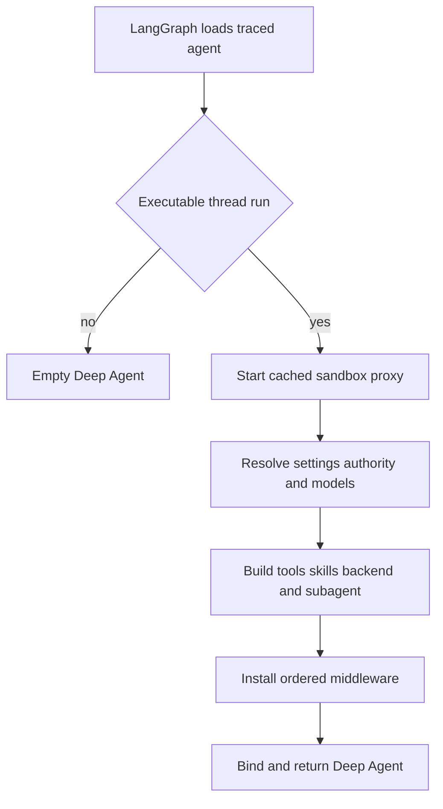

# Coding Agent Assembly

`get_agent(config)` is the assembly boundary for the primary coding graph. The deployment registers `agent.graphs.agent:traced_agent`; that alias reaches `get_agent`, which measures factory startup and delegates to `build_agent`. The factory constructs a fresh Deep Agents graph around a LangGraph thread, while durable choices such as the model pair are stored in thread settings.

## Factory control flow

The factory uses a cheap, empty graph for discovery and builds the thread-bound graph only for execution.

### Execution gate and config contract

`build_agent` sets `DEFAULT_RECURSION_LIMIT`. It returns `create_deep_agent(system_prompt="", tools=[])` when either `thread_id` is absent or `__is_for_execution__` is not exactly `True`; no sandbox, tools, or custom middleware are attached on that path. Before returning either graph, `bindable_config` removes `__pregel_*` runtime plumbing, which avoids persisting a read-time LangGraph runtime onto subsequent calls.

`RunConfig` is deliberately tolerant of the shared `configurable` envelope. Declared values are optional, unknown keys are allowed and retained by serialization, and parsing removes fields that fail validation one at a time. This lets dashboard, webhook, and scheduled launches share the contract without one malformed optional field discarding a usable `thread_id`.

### Sandbox first, with loss-averse recovery

For an executable thread, the factory starts a cached sandbox proxy before it awaits settings, overlapping sandbox startup with other factory work. The reconnect callback selects `LocalShellBackend` for desktop runs and `ensure_sandbox_for_thread` for hosted runs, scoped to the configured workspace.

Hosted lifecycle is deliberately conservative. An existing cached or recorded sandbox is reconnected and its GitHub proxy credentials refreshed; an unreachable but still existing sandbox raises `SandboxUnreachableError` rather than silently replacing uncommitted work. A deleted sandbox (`SandboxGoneError`) is recreated and rebound, because retaining the recorded deleted id would otherwise strand the thread. Desktop backends only accept an allowlisted project or a configured desktop worktree.

## Resolving identity, settings, and models

The triggering `profile_login` determines authorization and personal integration scope. In contrast, graph behavior is based on thread settings: on a new hosted thread workspace defaults may be overridden by the triggering profile, then the resolved values are stored; later turns use the stored values. This prevents a later participant from silently changing a thread's model policy.

The main and general-purpose-subagent model pairs resolve in this order:

1. Workspace defaults, or desktop defaults for a local run.
2. Dashboard profile overrides; a separate subagent override can replace the inherited subagent pair.
3. Stored thread settings, including stored routing choices.
4. A canonicalized per-run `agent_model_id`/`agent_effort` pair, but only when the id is supported and that effort is valid for it.

Resolved settings—both model pairs, routing settings, and repository instructions—are persisted before Fable gating. Thus the deployment-wide Fable availability gate is evaluated on every assembly rather than frozen into thread metadata. Provider options are built separately for main, subagent, and title models. A model-construction exception becomes a deferred error model so compilation succeeds and the failure is surfaced when called; fallback middleware is added only when the fallback id differs from the primary id.

When adaptive routing is enabled, `ModelSelectionMiddleware` selects `fast`, `balanced`, or `performance` for a turn and replaces the requested model. In automatic mode its classifier examines the latest genuine human task rather than injected dynamic context; classifier failure falls back to `balanced`. The selected route and model are recorded during preparation.

## Backend, skills, and tool surface

The graph receives a `CompositeBackend` with the sandbox proxy as its default route. It overlays read-only skill routes in ordered `skill_sources`:

- Hosted runs expose organization skills from a shared LangGraph store namespace and, when private credentials are known, user skills from a login-scoped namespace, followed by bundled skills from the repository.
- Desktop runs expose a read-only state snapshot of user skills, followed by bundled skills, and use `DesktopAgentState` to carry that snapshot.
- Desktop additionally redirects the Deep Agents virtual `/large_tool_results/` and `/conversation_history/` directories to a sanitized, thread-specific artifact root outside the local project. Offloading therefore does not appear as repository changes.

The parent receives a curated static list rather than every export in `agent/tools`. Personal user-setting and user-skill tools are omitted without a verified private credential scope; channel-history reads require a private thread; Slack thread tools require trusted source context; and admin tools require admin context. Desktop is narrowed to `http_request`, `fetch_url`, and `web_search`, while stop-summary mode is narrowed to Slack thread read/reply. `ExcludeToolsMiddleware` always removes Deep Agents' built-in `grep`; stop summaries additionally remove filesystem mutation, `execute`, and task delegation. Automatic incident sessions apply an additional exclusion set for actions and replies.

MCP and Notion schemas are exposed through `DynamicToolMiddleware`. The factory loads their authenticated catalogs concurrently, but the model must invoke `load_integration_tools` before it can call a selected integration tool. The middleware clears selections at each run start, serializes construction of a group, converts unavailable requested tools into an error result, and refuses names that collide with static, Deep Agents, or loader tool names. This makes integrations extensible without putting every connected schema on the initial model request.

## Prompt and prepare-run flow

`create_deep_agent` receives an empty static system prompt. `PrepareAgentRunMiddleware` instead renders `construct_system_prompt` during its before-agent phase and prepends the result as a system message to each model call. The renderer composes the `system/main` template with working-directory/environment guidance, source and dashboard context, default custom instructions, conditional repository-scope guidance, collaboration and untrusted-comment guidance, repository instructions, recent thread context, and workspace instructions. The chosen working-environment section changes for desktop and bridged local checkouts.

On hosted runs preparation resolves the GitHub token, sandbox work directory, triggering identity, workspace, and participants. It appends not-yet-visible participant descriptions as generated messages rather than baking sender-specific information into the durable prompt. It also writes resolved attribution/model metadata and usage best-effort. If sandbox attach fails, it posts a user-facing unreachable-sandbox notification and reraises the failure.

`BasePrepareRunMiddleware` checkpoints setup using a hash of middleware type, latest message, and preparation configuration. A resumed run with the matching latch skips preparation; a new message or changed relevant config prepares again. Since a failure before checkpoint persistence can invoke `_prepare` again, preparation operations must be idempotent.

## Subagent and middleware boundaries

The factory configures one forked `general-purpose` subagent. It gets its own model, parent static tools except `save_user_settings`, transcript and optional conversation-offloading support, plus a tool guard for parent-only capabilities such as most Slack/thread operations, background work, personal settings, and incident operations. The subagent has no `skills` field of its own: it executes against the forked parent context/backend.

A subagent is independently compiled, so parent middleware is not a security boundary for delegated work. The factory explicitly supplies its own `WorkflowPushGuardMiddleware`, provider response sanitizer, model-error handler, call timeout, optional dynamic tools, optional workspace-skill and incident middleware, PR guard for hosted runs, and tool guard. It disables inherited reply, message-queue, and model-selection middleware where configured.

The parent middleware list is ordered outermost to innermost. It begins with conversation offloading, prepare-run, transcript, and optional incident/workspace skills. It then applies input/image validation, call limit, tool-error handling, exclusions, subdirectory read support, task retry, and hosted PR/workflow guards. Reply/CLI requirements, queue checking, timeout wrap-up, step-limit notification, usage recording, optional selection/fallback/dynamic tools, provider sanitizers, stable result ordering, and model-error handling follow. `ModelCallTimeoutMiddleware` is innermost, so its deadline covers the provider call and propagates outward to fallback handling. Deep Agents itself supplies its `PatchToolCallsMiddleware`; the factory does not add the obsolete custom orphan-repair middleware.

## Safe extension and verification

Treat `build_agent` as the composition seam for a new sandbox provider, tool group, skill route, subagent, or middleware. Preserve the executable-run gate; do not grant parent-only tools merely by passing them to a separately compiled subagent; reserve names when adding dynamic tool groups; and make new prepare-run work retry-safe. Changes to the static surface should be reviewed against source, credential, privacy, desktop, stop-summary, and incident gates—not just the nominal tool list.

Focused assembly tests verify sandbox startup overlap, skill/backend routes, desktop state and artifact behavior, tool surfaces and subagent guards, middleware presence, model routing, and removal of the obsolete repair middleware. A dedicated factory test verifies parallel MCP/Notion loading and dynamic selection behavior; model tests verify independent profile subagent overrides. See also [Middleware Stack](middleware-stack.md), [Sandbox Lifecycle](sandbox-lifecycle.md), [Models & Profiles](../concepts/models-profiles-instructions.md), [Tools](../concepts/tools.md), and [Context Engineering](../workflows/context-engineering.md).
