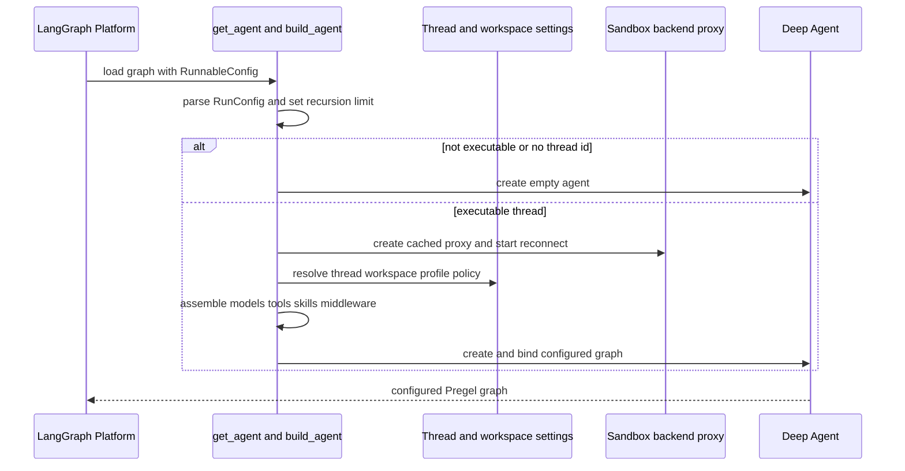

# Coding Agent Assembly and Execution

`get_agent` in `openswe.server` is the composition boundary for the primary coding agent. It delegates to `build_agent`, which turns an executable, thread-bound `RunnableConfig` into a Deep Agent with a backend, durable settings, models, skills, static and dynamic tools, a general-purpose subagent, and middleware. The deployment registers `openswe.graphs.agent:traced_agent`; that symbol re-exports `get_agent`.

## Execution gate and factory flow

```mermaid
sequenceDiagram
    participant Platform as LangGraph Platform
    participant Factory as get_agent and build_agent
    participant Settings as Thread and workspace settings
    participant Backend as Sandbox backend proxy
    participant DeepAgent as Deep Agent
    Platform->>Factory: load graph with RunnableConfig
    Factory->>Factory: parse RunConfig and set recursion limit
    alt not executable or no thread id
        Factory->>DeepAgent: create empty agent
    else executable thread
        Factory->>Backend: create cached proxy and start reconnect
        Factory->>Settings: resolve thread workspace profile policy
        Factory->>Factory: assemble models tools skills middleware
        Factory->>DeepAgent: create and bind configured graph
    end
    DeepAgent-->>Platform: configured Pregel graph
```

This shows factory-time graph assembly; `PrepareAgentRunMiddleware` performs per-invocation work later, before the agent starts calling the model.

`RunConfig` is the tolerant boundary around `configurable`. Its declared fields are optional because graph and launch source determine which exist; extras survive serialization; and parsing drops individual invalid fields rather than discarding the whole configuration. The factory always sets `DEFAULT_RECURSION_LIMIT`. It returns an empty Deep Agent when `thread_id` is absent or `__is_for_execution__` is not exactly true, avoiding sandbox and integration setup during graph inspection. `bindable_config` removes `__pregel_*` runtime objects before binding because LangGraph supplies them on invocation and a read-time runtime is not serializable into later calls.

## Durable policy, identity, and model selection

The run's `profile_login` is the triggering actor and determines authorization and private credentials. Durable choices instead come from thread settings: the factory starts with workspace defaults, applies profile overrides while seeding or resetting a thread, then normally restores stored thread model, subagent, routing, and repository-instruction settings. An explicit valid `agent_model_id` / `agent_effort` can override the main and subagent pair for an explicit selection; IDs and effort must be supported. This prevents later participants from silently changing a thread's durable operating policy.

Resolved settings are persisted for hosted threads before the Fable feature gate is applied. Thus a deployment-wide Fable enablement decision is evaluated on every run rather than frozen in saved settings. Provider construction is separate for main, subagent, and title models; failures produce deferred error models so compilation succeeds and the model call reports the setup error. A fallback model is only created when it has a different ID from the primary. The factory also installs `ModelSelectionMiddleware`: adaptive routing can select a persisted route or classify the latest human task, while a requested model becomes the default route for later turns.

## Backend, desktop, and sandbox safety

For a normal executable run, `build_agent` obtains a cached `SandboxBackendProxy`, registers a reconnect callback, and starts it while other settings load. The callback creates a validated `LocalShellBackend` for a desktop run; hosted runs call `ensure_sandbox_for_thread` for the selected workspace. The proxy is intentionally the long-lived handle: reconnect can replace its current backend without rebuilding the graph.

Sandbox metadata is the source of truth, not run configuration. Hosted lifecycle reconnects a bound sandbox and refreshes its proxy, creates and binds a new sandbox when none is recorded, and lets task workers attach to their coordinator. An unreachable existing sandbox raises by default, protecting uncommitted work; a deleted sandbox is replaced because its stale ID would otherwise prevent recovery. Desktop projects must be allowlisted or under the configured worktree directory. Their virtual `/large_tool_results/`, `/conversation_history/`, and `/blobs/` paths are routed to a sanitized thread-specific artifacts directory outside the repository, so offloads cannot be accidentally staged by `git add -A`.

## Backend routes and skills

The graph gives Deep Agents a `CompositeBackend` whose default is the sandbox or desktop backend. It overlays read-only routes:

- Bundled skills use a virtual `FilesystemBackend`.
- Hosted organization skills use a store namespace shared by the organization.
- Hosted personal skills use a store namespace scoped to the verified credential login; unknown credential scope omits personal MCPs and skills.
- Desktop user skills come from a read-only `StateBackend` snapshot.
- Hosted binary blobs use a thread-scoped store route; `FilesystemMiddleware` is explicitly configured to offload binary content there.

The ordered `skill_sources` are passed to the parent and used by its workspace-skills middleware and subagent. `ConversationOffloadingMiddleware` also receives the composite backend, with manual offloading enabled by `offload_conversation`.

## Prompt and invocation preparation

The graph is created with an empty static system prompt. `PrepareAgentRunMiddleware` derives the live prompt at `before_agent`, stores it as `rendered_system_prompt`, and its base class prepends it as a system message on every model request. `construct_system_prompt` renders the `system/main` template with working-directory and local-checkout behavior, dashboard and source context, custom default prompt, repository-scope and collaboration guidance, untrusted-comment guidance, repository instructions, recent thread context, and workspace instructions. `prompts.prompt` only reads prompt resources below its packaged root, renders Jinja templates with `StrictUndefined`, and rejects path traversal.

Preparation is checkpointed by a fingerprint of middleware type, latest message, and preparation configuration. A resume with the same latch skips completed work; a later invocation refreshes prompt, credentials, and context. Preparation must be idempotent because a failure before the checkpoint can repeat it. Hosted preparation resolves the GitHub token and sandbox concurrently with triggering identity, posts a user-facing notification for an unreachable sandbox, resolves workspace and participants, records model/source metadata and usage on a best-effort basis, and injects participant identity blocks only when their content hash is not visible after summarization.

Input envelopes and dynamic context are deliberately structured. `human_input` serializes user text into an escaped `<input-message>` carrying a namespaced sender ID, surface, kind, optional channel, and structured data. Person, channel, and system introductions are `<dynamic-context>` blocks; their canonical hash supports deduplication, including after history summarization removes older visible messages.

## Tool surfaces and integration loading

The static tool list is filtered through the actor's resolved access policy. Slack tools require trusted thread context, with a narrow channel-posting exception for schedules; workspace-admin tools depend on admin access. Hosted sandbox file download and service tools are offered only where the LangSmith sandbox provider supports them. Desktop runs are narrowed to HTTP and web-search tools, while stop-summary runs expose only Slack thread read/reply. Client-owned tool names replace colliding server tools, and `ExcludeToolsMiddleware` removes Deep Agent tools that are unsafe for the run mode. When a thread prefers sandbox tools, the corresponding server tools are removed and integration schemas are hidden from the model.

MCP connections are loaded by precedence—instance, workspace, user, then managed gateway—so later same-named connections replace earlier ones. Their tool objects are placed in `DynamicToolMiddleware`. The model initially sees only `load_integration_tools` and a catalog; it must load an integration before calling its tools. Construction is serialized per group, loader failure becomes an unavailable-tool result, and reserved or duplicate names are rejected. For compatible Anthropic and OpenAI Responses models, newly loaded schemas are added at the load-result position in provider-native message blocks to preserve the prompt cache; otherwise they are added to the ordinary request tool list.

## Subagent boundary and middleware ordering

The only configured subagent is Deep Agents' fork-mode `general-purpose` subagent. It has its own model, filtered tool list, transcript/offloading and optional incident/workspace middleware. `_SubagentToolGuard` rejects parent-context-sensitive tools such as Slack, background execution, thread management, personal settings, SQL, incidents, and managed-tool connection. Parent middleware does not wrap this independently compiled graph, so the subagent installs its own workflow-push guard, optional dynamic-tool middleware, OpenAI response sanitizer, model-error handler, timeout, and hosted PR-creation guard. Parent-only protections must therefore be mirrored deliberately when delegation could reach the same capability.

The parent middleware list is behaviorally ordered from outer setup to inner provider call: filesystem and conversation offloading; run preparation, transcript, client/incident/workspace surfaces, image validation, model-call limit, tool errors/exclusions and task retry; PR/workflow/task and GitHub-proxy guards; queue and event delivery; reply/CLI-result requirements, notifications and usage; model selection and fallback; dynamic integrations; provider sanitizers, stable tool-result ordering, model errors; then `ModelCallTimeoutMiddleware`. The innermost timeout covers the provider call and can propagate to fallback middleware. Deep Agents receives the backend directly, and `create_deep_agent` supplies its built-in tool-call repair rather than this factory adding a duplicate repair layer.

## Operations and change guidance

Change `build_agent` when adding a backend route, policy-controlled static tool, model policy, skill source, integration group, or middleware. Preserve the execution gate, metadata-backed sandbox binding, distinction between triggering authority and stored thread settings, and the independent subagent boundary. Tool changes should account for access filtering, static-name reservations, client-tool replacement, desktop/stop-summary restrictions, and whether a capability is reachable through the sandbox tools endpoint.

Focused assembly tests in `tests/agent/test_agent_assembly_context.py` cover public versus private skill/MCP exposure, blob offloading, sandbox startup concurrency, stored model policy, access-controlled tools, Slack surfaces, and subagent guards. They capture `create_deep_agent` arguments rather than requiring live providers, making them the primary regression suite for factory wiring. Related pages: [Middleware Stack](middleware-stack.md), [Sandbox Lifecycle](sandbox-lifecycle.md), [Models & Profiles](../concepts/models-profiles-instructions.md), [Tools](../concepts/tools.md), and [Context Engineering](../workflows/context-engineering.md).
