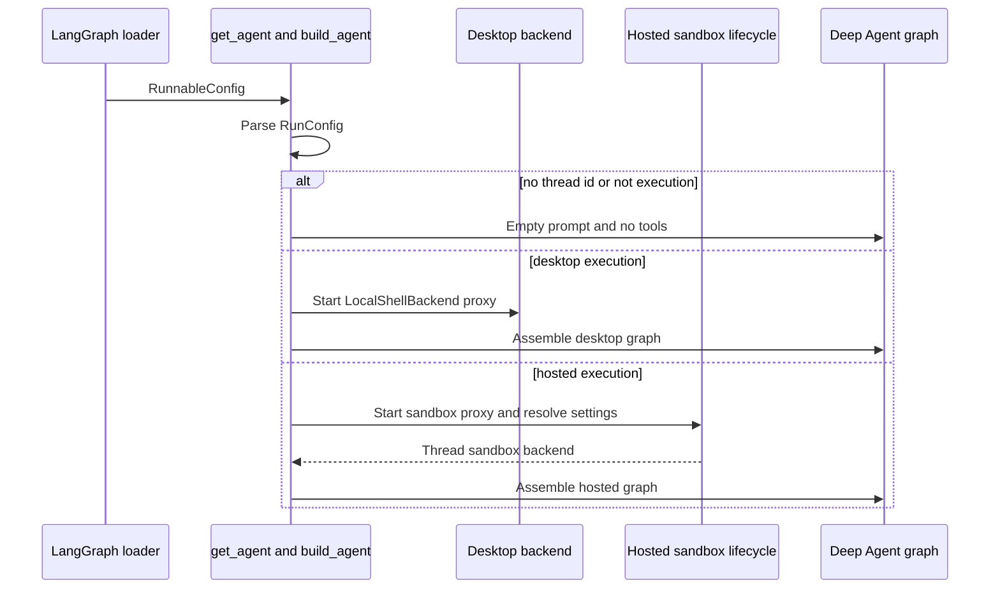

# Coding Agent Assembly

`get_agent(config)` is the public graph factory; it wraps `build_agent` in a total-factory tracing phase when a string thread id is present. The deployment registers `agent.graphs.agent:traced_agent`, which re-exports this factory. For an executable thread, assembly creates a `create_deep_agent` graph with a selected model, sandbox-backed composite filesystem, skills, a curated tool surface, one general-purpose subagent, and ordered middleware. The factory deliberately passes an empty static system prompt: per-run preparation supplies the rendered prompt later.

## Entry gate and paths

```mermaid
sequenceDiagram
    participant Loader as LangGraph loader
    participant Factory as get_agent and build_agent
    participant Desktop as Desktop backend
    participant Sandbox as Hosted sandbox lifecycle
    participant Agent as Deep Agent graph
    Loader->>Factory: RunnableConfig
    Factory->>Factory: Parse RunConfig
    alt no thread id or not execution
        Factory->>Agent: Empty prompt and no tools
    else desktop execution
        Factory->>Desktop: Start LocalShellBackend proxy
        Factory->>Agent: Assemble desktop graph
    else hosted execution
        Factory->>Sandbox: Start sandbox proxy and resolve settings
        Sandbox-->>Factory: Thread sandbox backend
        Factory->>Agent: Assemble hosted graph
    end
```
This shows the graph-load gate and the distinct non-execution, desktop, and hosted coding paths.

`RunConfig` is the defensive boundary around `RunnableConfig["configurable"]`: declared fields are optional, unknown fields are retained, and parsing removes individually invalid fields rather than discarding the entire configuration. The factory sets `DEFAULT_RECURSION_LIMIT`, then takes the inexpensive path when there is no `thread_id` or `__is_for_execution__` is not exactly `True`. That path returns a bare Deep Agent with `system_prompt=""` and no tools. Every assembled graph is bound with `bindable_config`, which removes `__pregel_*` runtime values; LangGraph reinjects them per invocation, avoiding serialization of a read-time runtime.

## Sandbox, project, and filesystem context

The executable path creates a cached `SandboxBackendProxy` immediately and starts it while settings are loaded. A desktop run reconnects to `LocalShellBackend`; hosted execution calls `ensure_sandbox_for_thread` with the selected workspace slug. Desktop project paths are validated as a registered project or an application-created worktree before becoming the shell root.

The parent backend is a `CompositeBackend` with the sandbox proxy as its default route. It adds read-only skill routes:

- bundled skills from a virtual `FilesystemBackend`;
- hosted organization skills from a shared store namespace;
- hosted personal skills from the credential owner's store namespace when private credential scope is known; or
- desktop user skills from a read-only `StateBackend` snapshot.

The ordered skill routes are given both to the parent and the general-purpose subagent. Hosted runs also route `/blobs/` to a thread-scoped store, allowing binary offloads to be read without the sandbox. Desktop routes `/large_tool_results/`, `/conversation_history/`, and `/blobs/` to a sanitized thread directory under an artifacts root outside the project, so agent scratch material is not swept into Git changes.

If hosted credential scope cannot be determined, assembly continues but omits MCP and Notion integration loading. Sandbox attachment happens during preparation; an unreachable sandbox posts a user-facing notification and re-raises the error rather than silently continuing without a workspace.

## Durable settings and model selection

The initiating `profile_login` determines authorization and private integrations. Durable choices come from thread settings, initially seeded from profile and workspace defaults, rather than being replaced by later participants. In the normal resolution path, workspace defaults provide main and subagent pairs; profile overrides can replace the main pair and independently replace the subagent pair; stored thread settings then take precedence unless a dashboard auto-selection reset is requested.

Explicit per-run `agent_model_id` and `agent_effort` are accepted only for supported models with compatible effort. Explicit selection disables adaptive routing. With adaptive routing enabled outside Slack ask mode, the main model begins at the fast route and a distinct fast subagent pair is selected when necessary; saved routing pairs preserve resumability. Image input can temporarily override a text-only pinned choice, and `ImageModelFallbackMiddleware` switches text-only selected or routed models to a vision-capable model for requests carrying images.

Resolved main/subagent pairs, routing settings, and repository instructions are persisted for hosted threads before the Fable availability gate is applied. That ordering lets a deployment-wide Fable switch take effect on each run instead of becoming a permanent thread setting. Provider kwargs are computed independently for main, subagent, and title models. Model construction failures become deferred error models, preserving graph construction and surfacing the setup failure at call time. A fallback model is configured only when its id differs from the primary id.

## Prompt and run preparation

`PrepareAgentRunMiddleware` is the first application middleware. Its checkpointed base class fingerprints the middleware type, latest message, and preparation configuration. An already checkpointed identical attempt skips work; later invocations refresh prompt, credentials, and context. Because failure before checkpoint persistence permits a retry, preparation operations must be idempotent. When a rendered prompt exists, the base middleware prepends it to the request system message.

Preparation waits for the sandbox, resolves its work directory, and renders `construct_system_prompt`. The prompt function delegates the ordered layout to `system/main` and supplies working-environment, dashboard and source context, optional default instructions and repository scope, collaboration, untrusted-comment, repository-instruction, recent-context, and workspace sections. Desktop preparation renders a desktop prompt after resolving the local work directory.

For hosted execution, preparation concurrently obtains the triggering identity and sandbox, loads workspace and participant context, records run metadata and best-effort usage, and appends newly needed participant messages. It deduplicates visible dynamic-context hashes, so a summarized history does not receive duplicate person blocks. It also records resolved attribution model and effort in `configurable` for downstream consumers.

## Tools and integration loading

The static parent list includes web, background, plan, thread, PR, user-skill/settings, Slack, event, and administration capabilities, then passes through access control. Slack tools require trusted Slack-related context; Slack reply obligations are handled by `RequireUserReplyMiddleware`. Admin capabilities depend on `actor_has_admin_context`. Desktop deliberately replaces the list with only `http_request`, `fetch_url`, and `web_search`; stop-summary execution replaces it with Slack thread read/reply.

`ExcludeToolsMiddleware` further removes Deep Agent tools and selects a more restrictive stop-summary or Slack-ask exclusion set. Client-owned tool names remove their server equivalents and are represented by `ClientToolsMiddleware`. The `agent.tools` package itself is a lazy export catalog: it resolves an implementation module only when a public tool attribute is requested, keeping assembly imports lightweight.

MCP and Notion tools are integration groups behind `DynamicToolMiddleware`, not ordinary static tools. The model sees a catalog and must invoke `load_integration_tools` before calling one. The middleware rejects colliding names, serializes each group build, converts load failure into unavailable-tool responses, and rejects a direct unselected integration call. Loaded schemas are attached to later model requests; providers that support mid-conversation additions receive anchored provider-native additions to preserve prompt caching.

## Subagent and middleware composition

The sole configured subagent is `general-purpose`, compiled in `fork` mode with the shared tool list and ordered skills. It carries a `_SubagentToolGuard` that denies Slack, background, thread-management, user-settings, service-connection, SQL, and incident-sensitive calls; Slack and other parent-context operations must be relayed by the parent. Its middleware explicitly disables inherited reply, message-queue, event-delivery, and model-selection middleware, then supplies its own transcript, optional incident/workspace-skill/dynamic-tool middleware, guard middleware, and conversation offloading. This boundary matters: parent middleware is not automatically a security boundary for a separately compiled subagent.

The parent sequence is intentional. `FilesystemMiddleware` and conversation offloading precede preparation; then transcript/client/incident/workspace-skill support, validation, model-call limit, tool error handling, exclusions, subdirectory reads, and task retry are installed. Guards and proxy refresh follow, then reply/CLI-result requirements, notification and usage recording, model selection/fallback/image fallback, optional dynamic tools, provider sanitizers, stable tool-result ordering, and model-error handling. `ModelCallTimeoutMiddleware` is innermost, so its deadline covers the provider call and can propagate to fallback behavior. Passing the backend to `create_deep_agent` also enables Deep Agents filesystem and history-offload behavior; the factory does not add its obsolete orphaned-tool-call repairer.

## Operations and tests

Changes to this factory should preserve the execution gate, credential-scope degradation, project-path validation, and the distinction between triggering-sender authority and durable thread settings. Any parent-only tool or guard should be evaluated separately for the forked subagent. `tests/agent/test_agent_assembly_context.py` covers skill and blob routes, missing credential scope, sandbox-start overlap, access-filtered surfaces, Slack/subagent boundaries, routing, and image fallback. Desktop path and artifact-route validation live in `tests/agent/test_desktop.py`.

Related pages: [Middleware Stack](middleware-stack.md), [Sandbox Lifecycle](sandbox-lifecycle.md), [Models & Profiles](../concepts/models-profiles-instructions.md), [Tools](../concepts/tools.md), and [Context Engineering](../workflows/context-engineering.md).
