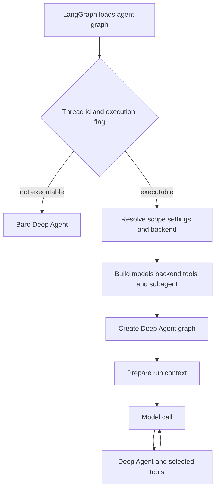

# Coding agent assembly and execution

`openswe.server.build_agent` is the composition boundary for the primary coding graph. The deployed `agent` graph entrypoint is `openswe.graphs.agent:traced_agent`, an alias of `get_agent`. For an executable, thread-bound run, the factory resolves identity and persisted policy, starts a backend, builds a `CompositeBackend`, selects models and tools, and gives those plus an ordered middleware stack to `create_deep_agent`.

## Load gate and configuration

```mermaid
flowchart TD
    Load["LangGraph loads agent graph"] --> Gate{"Thread id and execution flag"}
    Gate -- "not executable" --> Bare["Bare Deep Agent"]
    Gate -- "executable" --> Resolve["Resolve scope settings and backend"]
    Resolve --> Assemble["Build models backend tools and subagent"]
    Assemble --> Graph["Create Deep Agent graph"]
    Graph --> Prepare["Prepare run context"]
    Prepare --> Model["Model call"]
    Model --> Tools["Deep Agent and selected tools"]
    Tools --> Model
```
This is the factory gate and the resulting model/tool loop; per-run preparation runs before model calls.

`RunConfig` is the tolerant contract around `RunnableConfig["configurable"]`. Its declared fields are optional, extra keys are retained, and parsing removes invalid fields individually rather than discarding the remaining configuration. This permits webhook, dashboard, scheduler, and graph-specific configuration to survive intermediate reads and rewrites.

The factory sets `DEFAULT_RECURSION_LIMIT`. Full assembly requires a `thread_id` and `__is_for_execution__ is True`; discovery or state-read loads instead receive a bare `create_deep_agent(system_prompt="", tools=[])`. Both paths bind a version of the config with `__pregel_*` keys removed, because runtime plumbing must be reinjected per invocation rather than serialized into the graph.

## Resolution and backend lifecycle

The triggering `profile_login` drives authorization, while durable agent choices come from thread settings. The factory obtains a credential scope for hosted runs; failure to establish that scope deliberately omits MCP tools rather than exposing personal integrations. It also checks whether a thread is backed by a desktop or CLI bridge.

A cached sandbox backend proxy is created for the thread and started during normal graph assembly. Its reconnect callback creates a `LocalShellBackend` for a desktop run; otherwise it calls `ensure_sandbox_for_thread` for the selected workspace. A desktop project path is accepted only when it is an existing allowlisted project or an Open SWE worktree. Hosted sandbox lifecycle reuses a cached or recorded backend and refreshes its GitHub proxy. An unreachable existing sandbox raises instead of being silently replaced, protecting uncommitted work; a deleted sandbox is replaced because a stale id would otherwise permanently prevent the thread from running.

The graph's `CompositeBackend` uses that sandbox/bridge as its default. It mounts bundled skills read-only; hosted runs add organization skills and, when the credential scope permits, personal skills. Desktop runs expose read-only state-backed personal skills. Desktop also routes `/large_tool_results/`, `/conversation_history/`, and `/blobs/` to a sanitized thread-specific artifact directory outside the project, so Deep Agents offloads do not become Git changes. Hosted binary blobs instead use a thread-scoped store backend.

## Models, persisted policy, and routing

For hosted runs, workspace defaults seed main/subagent and title models. Existing thread settings override those defaults; an explicit valid `agent_model_id` and `agent_effort` can override the main and subagent pair in the applicable selection modes. The override is accepted only for a supported model and compatible effort. Thread settings store the resolved main/subagent policy, routing pairs, and repository instructions before Fable availability gating, so a deployment-wide Fable toggle remains effective on every run.

When adaptive routing is enabled, the factory uses configured fast, balanced, and performance model pairs and initially uses the fast route. `ModelSelectionMiddleware` can later route the main call or accept a validated requested model during preparation; it records the selected model and effort in run configuration and thread metadata. Provider construction failures are converted to deferred error models so graph compilation succeeds and the failure is reported when the model is called. Fallback middleware only has a fallback when its model id differs from the primary.

## Prompt and run preparation

The Deep Agent receives an empty static prompt. `PrepareAgentRunMiddleware` renders `construct_system_prompt` during its before-agent hook and prepends it as the system message on model calls. The prompt renderer loads `system/main` with working-directory and source guidance, default prompt, repository scope, collaboration and untrusted-comment guidance, repository instructions, recent context, and workspace instructions. It distinguishes hosted, desktop, and bridged local-checkout environments.

Preparation is checkpointed by a fingerprint of middleware class, the latest message, and preparation configuration. A resumed execution with the same fingerprint skips completed work; later invocations refresh credentials, workspace information, prompt, and context. `_prepare` implementations must therefore be idempotent: failure before the checkpoint can repeat them.

For hosted runs preparation concurrently attaches the backend and resolves the triggering identity, then resolves workspace and participants. Participant introductions are generated context messages only when their content hash is not still visible to the model; summarization cutoff is respected when deciding visibility. Sandbox attachment failure posts a user-facing notification before it is re-raised. Preparation also schedules title generation, records run metadata and best-effort usage, and can persist a validated opening model request.

## Tool surface and subagents

The static parent surface is filtered by resolved access and source context. Slack tools require trusted thread context, with the scheduler retaining only channel listing and posting when no Slack thread exists. Admin tools depend on admin context. Desktop runs use only `http_request`, `fetch_url`, and `web_search`; stop summaries use only Slack thread reading and reply. `ExcludeToolsMiddleware` applies mode-specific Deep Agent exclusions, and client-provided tools replace same-named server tools.

MCP integrations are represented by `DynamicToolMiddleware`. The model first sees `load_integration_tools` and a name catalog, then explicitly loads a group before calling its tools. Per-group locks serialize construction, failures become unavailable-tool results, and duplicate/reserved names are rejected. Depending on the provider, loaded schemas are passed in the next request or inserted as provider-native additions to preserve prompt-cache behavior. If tools are configured to run inside the sandbox, integrations are not model-visible; code-interpreter middleware can expose selected MCP and static tools through that path.

The configured `general-purpose` subagent runs in `fork` mode with its own model, tools, conversation offloading, and middleware. It does not rely on inherited parent guards: `_SubagentToolGuard` rejects parent-only capabilities such as Slack and thread management, user settings, background execution, and sensitive incident/admin tools. It also explicitly disables selected inherited middleware and receives its own transcript, workspace-skill, dynamic-tool, workflow-push, and model middleware.

## Middleware ordering and operational invariants

The parent stack is supplied outermost to innermost. It begins with filesystem and conversation offloading, preparation, optional review/client/incident/workspace-skill layers, image validation, call limit, tool error handling, exclusions, subdirectory and task retry. It then installs PR/workflow/task and GitHub-proxy guards, queue/event delivery where applicable, reply/CLI-result requirements, step-limit and usage recording, selection/fallback/image/dynamic/MCP layers, sanitizers, stable tool-result ordering, model-error handling, and finally `ModelCallTimeoutMiddleware`.

The innermost timeout therefore covers the provider call and propagates outward to fallback. `ModelCallLimitMiddleware` ends a normal run at `MODEL_CALL_RECURSION_LIMIT`. `FilesystemMiddleware` and `ConversationOffloadingMiddleware` receive the composite backend; that is what connects Deep Agents file-result eviction and history offloading to the configured routes. The factory does not add the obsolete custom orphaned-tool-call repairer because `create_deep_agent` supplies `PatchToolCallsMiddleware`.

## Change and test guidance

Treat `build_agent` as the extension seam for model policy, backend routes, tools, subagents, and stack composition. Preserve the execution gate; distinguish triggering-user authorization from durable thread settings; and apply a restriction to independently compiled subagents when it must hold there too. Changes to source-sensitive tool exposure should also consider prefix-cache stability across a web follow-up to a Slack thread.

`tests/agent/test_agent_assembly_context.py` exercises backend and skill routing, binary offloading, task-tool availability, sender draft preferences, concurrent sandbox startup, model routing/persistence, authorization, Slack tools, and subagent guards. Related material: [Middleware Stack](middleware-stack.md), [Sandbox Lifecycle](sandbox-lifecycle.md), [Models, Profiles, and Instructions](../concepts/models-profiles-instructions.md), and [Tools](../concepts/tools.md).
