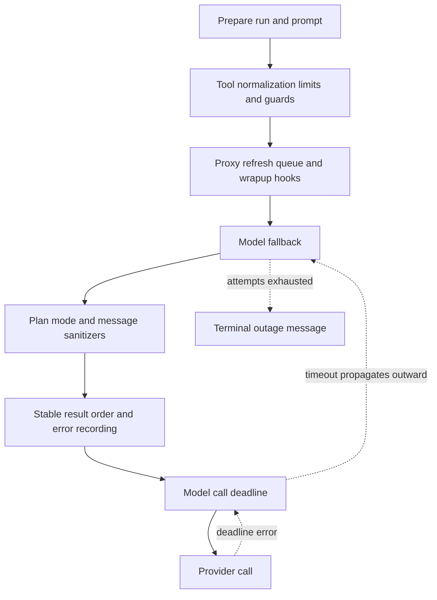

# Agent middleware stack

The four agent factories pass explicit middleware lists to `create_deep_agent`. List order is architectural: Deep Agents composes wrappers as an onion, so earlier entries are outer layers and later entries are closer to the model or tool executor. An exception travels back outward through the wrappers that invoked it. Hooks decorated as `before_model` and `after_agent` participate at those graph lifecycle points rather than being interchangeable model-call wrappers.

The lists are therefore not inventories. A new wrapper must be exported from `agent/middleware/__init__.py` (the package deliberately lazy-loads its public exports) **and deliberately placed** in the applicable factory. In particular, do not move the model deadline outside fallback, or place a policy/tool normalizer after tool execution. For graph ownership and tools, see [Agent Graph](agent-graph.md), [Reviewer and Analyzer](reviewer-and-analyzer.md), and [Tools](../concepts/tools.md).

## Coding-agent order

`get_agent` in `agent/server.py` constructs this outer-to-inner chain:

1. `PrepareAgentRunMiddleware`
2. `DynamicToolMiddleware` — only when configured integration groups are nonempty
3. `SanitizeToolInputsMiddleware`
4. `ModelCallLimitMiddleware`
5. `ToolErrorMiddleware`
6. `ExcludeToolsMiddleware`
7. `SubdirAgentsReadMiddleware`
8. `ToolRetryMiddleware` — limited to `task`
9. `PullRequestCreationGuardMiddleware` — omitted for local runs
10. `WorkflowPushGuardMiddleware`
11. `refresh_github_proxy_before_model`
12. `check_message_queue_before_model` — omitted in stop-summary mode
13. `TimeoutWrapupMiddleware`
14. `notify_step_limit_reached`
15. `record_run_usage`
16. `ModelFallbackMiddleware` — only when a resolved fallback model differs from the primary
17. `PlanModeMiddleware`
18. `SanitizeFireworksMessagesMiddleware`
19. `SanitizeOpenAIResponsesMiddleware`
20. `SanitizeThinkingBlocksMiddleware`
21. `StableToolResultOrderMiddleware`
22. `ModelErrorMiddleware`
23. `ModelCallTimeoutMiddleware`

The conditions above are part of the contract. Local runs use a restricted static tool set and omit the PR guard; stop-summary mode omits queue consumption and uses a different excluded-tool set. `PlanModeMiddleware`, in contrast, is always installed so a mid-run `enter_plan_mode` can restrict the following turn.

The coding model-call path shows the inner deadline, outward exception propagation, and fallback boundary; tool wrappers and lifecycle hooks apply in their own phases.

### Preparation and lifecycle

All four top-level graphs begin with a `BasePrepareRunMiddleware` subclass. Its `before_agent` latch fingerprints the middleware type, latest message, and preparation configuration. A checkpointed matching fingerprint skips completed setup on a resumed attempt; a changed invocation prepares again. `_prepare` must consequently be idempotent, because a failure before the checkpoint can cause it to run again. The base wrapper also inserts the prepared rendered system prompt into every model request.

The coding preparation layer provides run-specific sandbox, prompt, and context setup. `DynamicToolMiddleware` exposes integration names initially and defers expensive tool construction, such as an MCP handshake, until the agent explicitly loads an integration. `ExcludeToolsMiddleware` removes named tools from model requests. `SubdirAgentsReadMiddleware` and tool/input guards surround execution at the outer end of the chain.

Before a coding or reviewer model call, `refresh_github_proxy_before_model` best-effort refreshes a near-expiry sandbox GitHub proxy token. The queue hook then reads pending thread messages from the LangGraph `("queue", thread_id)` namespace, deletes the item before creating the injected messages to avoid replay, and processes messages FIFO. It is intentionally absent from the coding stop-summary graph.

`TimeoutWrapupMiddleware` starts its monotonic clock lazily and, after `OPEN_SWE_WRAPUP_TIMEOUT_SECONDS` (45 minutes by default), adds a system instruction to finish the current work rather than start new investigation. The coding-only after-agent hooks notify an active Slack thread when the model-call-limit marker ends the run, and best-effort persist completed token usage before scheduling cost enrichment. Neither telemetry failure nor notification failure changes the agent result.

### Model failures and time limits

`ModelCallTimeoutMiddleware` is innermost in the coding chain. It uses `asyncio.wait_for` around the downstream model call and converts a timeout to `ModelCallTimeoutError`, a `TimeoutError` subclass. Its configured wall-clock limit is `OPEN_SWE_MODEL_CALL_TIMEOUT_SECONDS`, defaulting to 900 seconds for missing, invalid, or nonpositive values. This handles transports that can stall without a provider HTTP timeout.

The preceding `ModelErrorMiddleware` logs and classifies an escaping model exception, records the classification in thread metadata when possible, and re-raises unchanged. In the coding graph, that error next reaches `ModelFallbackMiddleware`. Fallback alternates primary and cross-provider fallback attempts for transient provider statuses, transport/connection errors, and timeout errors, using the `0, 5, 15, 30, 45` second schedule with jitter. A known unavailable-model access error becomes an explanatory `AIMessage`; exhausted transient attempts normally become a terminal outage `AIMessage` rather than a run crash. Non-transient errors continue outward.

## Tool execution: normalize, guard, retry, and stop safely

`SanitizeToolInputsMiddleware` precedes the general tool error boundary and repairs malformed `read_file.offset` and `read_file.limit` strings by extracting leading digits before Pydantic validation. The coding-only PR guard prevents shell-based PR creation from bypassing `open_pull_request` outside local runs. The workflow-push guard blocks pushes that modify `.github/workflows` until recorded human approval permits a rewritten safe command.

`ToolRetryMiddleware` applies only to delegated `task` calls. It retries transient status and transport failures, including a subagent `ModelCallTimeoutError`; subagent graphs are separate, so their parent fallback wrapper does not cover their model calls. On exhaustion, invalid prompt/context errors are returned as structured failed data for the caller model, while other errors are re-raised.

`ToolErrorMiddleware` is the broad recovery boundary. Ordinary unhandled tool exceptions become `ToolMessage(status="error")` data, allowing the model to adjust. A sandbox gateway rejection explicitly marked transient is also returned to the model as `sandbox_transient`, because the SDK guarantees the command never started. The shared sandbox retry helper has the same safety condition and retries only that class, up to four attempts with bounded exponential backoff and jitter.

A sandbox that is actually unreachable is terminal: a `SandboxConnectionError` other than `SandboxServerReloadError`, or a sandbox `ResourceNotFoundError`, triggers a best-effort notification and is re-raised. The notifier prefers an active Slack thread, then Linear, then a configured GitHub issue or PR if it can obtain a token. The coding-agent notification does not silently replace the sandbox, because an empty replacement could conceal loss of uncommitted work. The reviewer may request replacement because its checkout can be re-derived; an unsuccessful replacement remains a typed unreachable failure.

## Reviewer, analyzer, and chat variants

The reviewer runs a deliberately smaller but still sandboxed chain:

1. `PrepareReviewerRunMiddleware`
2. `SanitizeToolInputsMiddleware`
3. `ModelCallLimitMiddleware`
4. `ToolErrorMiddleware`
5. `refresh_github_proxy_before_model`
6. `check_message_queue_before_model`
7. `TimeoutWrapupMiddleware`
8. the Fireworks, OpenAI Responses, and thinking-block sanitizers
9. `RepairOrphanedToolCallsMiddleware`
10. `StableToolResultOrderMiddleware`
11. `ModelErrorMiddleware`
12. `ModelCallTimeoutMiddleware`
13. `settle_review_check_on_exit`

It has no model fallback, plan mode, dynamic/excluded/subdirectory tools, task retry, PR guard, workflow-push guard, step-limit notifier, or usage recorder. Before its next model request, orphan repair inserts an error `ToolMessage` for an AI tool call that lacks a matching result, preventing a provider from repeatedly rejecting resumed history. On exit, the reviewer settles a still-open GitHub review check: it preserves a pending published conclusion when present, otherwise closes an incomplete review as `neutral`, not as a PR failure.

The review-style analyzer has the narrowest sandboxed chain: `PrepareAnalyzerRunMiddleware`, `SanitizeToolInputsMiddleware`, `ModelCallLimitMiddleware`, `ToolErrorMiddleware`, `TimeoutWrapupMiddleware`, and `SanitizeOpenAIResponsesMiddleware`. Its preparation creates the review-style prompt, ensures the sandbox, and configures the GitHub proxy; it deliberately has no fallback or per-call deadline middleware in its top-level list.

The PR chat graph is read-only and has no sandbox. Its chain is `PrepareChatRunMiddleware`, `SanitizeToolInputsMiddleware`, `ModelCallLimitMiddleware`, `ToolErrorMiddleware`, `ExcludeToolsMiddleware`, the three provider-message sanitizers, and `ModelCallTimeoutMiddleware`. Preparation obtains a repository-scoped GitHub App token and renders PR context; excluded filesystem mutation and shell tools ensure the model never sees them. Its explicitly declared general-purpose subagent is also read-only and separately installs a filesystem allowlist, OpenAI Responses sanitizer, and deadline—parent middleware does not wrap a compiled subagent graph.

## Change and test checklist

When changing this stack, identify the hook phase first, then place the wrapper relative to the failure boundary it needs to observe. Preserve the deadline-inside-fallback relationship, ensure a new public middleware has a lazy package export, and update every factory whose semantics require it rather than assuming the coding list is inherited. Add focused tests for failure classification, request mutation, or ordering-sensitive recovery.

`tests/middleware/` covers timeout cancellation and configuration, fallback eligibility/alternation/exhaustion, preparation idempotence and prompt injection, queue injection, sanitizers, stable ordering, dynamic tools, and orphan repair. The timeout test additionally asserts that coding and reviewer subagent specifications each carry their own `ModelCallTimeoutMiddleware`; sandbox retry tests verify the pre-start-only retry boundary.
