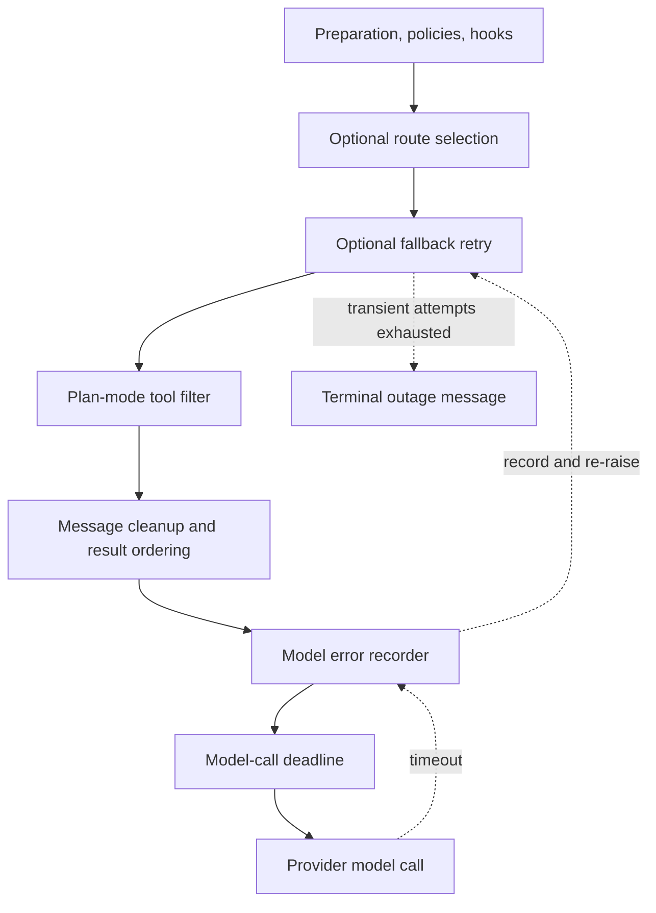

# Agent Middleware, Limits, and Failure Semantics

`get_agent` and `get_reviewer_agent` supply ordered lists to `create_deep_agent`. The list is an onion: an earlier middleware wraps later middleware, while hooks run at their corresponding graph phase. Consequently, ordering is a runtime contract: outer layers can prepare a request, transform a tool response, or observe exceptions from inner layers. See [Agent Graph](agent-graph.md), [Reviewer and Analyzer](reviewer-and-analyzer.md), [Tools](../concepts/tools.md), and [Follow-up Messages](../workflows/follow-up-messages.md) for the surrounding graph and delivery behavior.

## Coding-agent stack

The production coding-agent list, outer to inner, is:

1. `ConversationOffloadingMiddleware`
2. `PrepareAgentRunMiddleware`
3. `IncidentMiddleware`, when an incident session exists
4. `WorkspaceSkillsMiddleware`, when workspace skills are applicable
5. `DynamicToolMiddleware`, when it has integration groups
6. `SanitizeToolInputsMiddleware`
7. `ValidateImageReadsMiddleware`
8. `ModelCallLimitMiddleware`
9. `ToolErrorMiddleware`
10. `ExcludeToolsMiddleware`
11. `SubdirAgentsReadMiddleware`
12. `ToolRetryMiddleware` for `task`
13. `PullRequestCreationGuardMiddleware`, except for local runs
14. `WorkflowPushGuardMiddleware`
15. `refresh_github_proxy_before_model`
16. `check_message_queue_before_model`, except in stop-summary mode
17. `TimeoutWrapupMiddleware`
18. `notify_step_limit_reached`
19. `record_run_usage`
20. `ModelSelectionMiddleware`, when adaptive routing is enabled
21. `ModelFallbackMiddleware`, when a different fallback model resolves
22. `PlanModeMiddleware`
23. the Fireworks, OpenAI Responses, and thinking-block message sanitizers
24. `StableToolResultOrderMiddleware`
25. `ModelErrorMiddleware`
26. `ModelCallTimeoutMiddleware`

The factory conditionally constructs fallback middleware from `LLM_FALLBACK_MODEL_ID` or the primary model's default fallback, and constructs selection middleware only for adaptive routing. The routing middleware persists an automatically selected route in state (unless plan mode is active), emits a UI routing event in automatic mode, and overrides the requested model; plan mode always uses the performance route. The fallback remains outside selection, so it can alternate the route-selected primary request with its cross-provider model.

`ConversationOffloadingMiddleware` exposes Deep Agents summarization without streaming its internal model output. It can summarize automatically according to the inherited token policy, or, when configured for manual offloading, performs the compaction before a model call and ends that graph turn. It emits started, failed, completed, or skipped status to the stream and records compaction metadata in state.

This is the inner coding-agent model-call path; a deadline becomes an observable exception before the optional fallback decides whether it is recoverable.

### Preparation, state, and tool safety

`BasePrepareRunMiddleware` is the shared checkpointed `before_agent` foundation for coding and reviewer preparation. It fingerprints the latest message, middleware class, and preparation configuration. If checkpointed `run_prepared_for` matches, it skips setup on resume; a new invocation on the same thread prepares fresh context. Because a failure before the latch checkpoint can cause setup to run again, each specialization's `_prepare` work must be idempotent. Its model wrapper prepends the rendered system prompt to the request's existing system message.

`WorkspaceSkillsMiddleware` limits retained skill metadata to the configured skill sources and clears load errors before it calls the underlying skills middleware. This prevents personal skill context retained in a public checkpoint from being carried into a later request. `DynamicToolMiddleware` exposes integration groups only when available, and `ExcludeToolsMiddleware` removes tools inappropriate for the current mode. `SanitizeToolInputsMiddleware` extracts leading integer values from malformed `read_file.offset` and `read_file.limit` strings before Pydantic validation. `ValidateImageReadsMiddleware` checks image content magic bytes after a `read_file` call and changes an extension/content mismatch into a text error rather than leaving a non-image attachment that would poison later provider requests.

`PlanModeMiddleware` is always installed. Its `before_agent` hook resets `plan_mode` to the value resolved for this run, preventing a stale state value from forcing a later implementation run into plan mode. On every model call it recomputes and filters the offered tools while active. Thus a mid-run `enter_plan_mode` action restricts the next model turn, including configured MCP tools, rather than only affecting runs that started in plan mode.

Before every model call, the proxy-refresh hook best-effort refreshes a near-expiry sandbox GitHub installation token. The queue hook then reads `("queue", thread_id)` from the LangGraph store. It deletes `pending_messages` before building the message update to prevent a rerun from delivering them twice, preserves FIFO order, and injects the resulting human input. It also consumes a pending autofix event; errors in this integration are logged and leave the model call able to continue.

### Limits, policy, and completion hooks

`ModelCallLimitMiddleware` ends the run at its configured call limit. `TimeoutWrapupMiddleware` starts its clock lazily per middleware instance and, after `OPEN_SWE_WRAPUP_TIMEOUT_SECONDS` (45 minutes by default), augments the system prompt with a wrap-up instruction. `notify_step_limit_reached` is an after-agent hook: when the final message carries the call-limit marker, it best-effort posts a Slack-thread explanation.

The PR guard blocks command forms that create a pull request outside `open_pull_request`, returning a tool error rather than executing them; it is omitted for local runs. The workflow-push guard only permits its rewritten safe push to workflow files after recorded human approval, otherwise returning a blocked result with an approval URL. These guards sit outside the tool-error boundary so their controlled tool responses reach the model normally.

`RecordRunUsageMiddleware` tags model responses and the active trace with the selected route and invocation identifiers. It finalizes invocation usage with an error state if an inner model call raises, including an authentication-rejected code for a 401/authentication exception, and finalizes normal usage in `after_agent`. This accounting wrapper is absent from the reviewer graph.

## Model failures, retries, and observability

`ModelCallTimeoutMiddleware` is innermost, so `asyncio.wait_for` covers the provider operation itself. It uses `OPEN_SWE_MODEL_CALL_TIMEOUT_SECONDS` when it is a positive number and otherwise defaults to 900 seconds; a timeout becomes `ModelCallTimeoutError`, a `TimeoutError`. That exception first crosses `ModelErrorMiddleware`, which logs classified fields, records its type and classification code in thread metadata when context is available, and re-raises the original exception unchanged.

When installed, `ModelFallbackMiddleware` sees that re-raised timeout and other transient failures. It alternates primary and fallback models for six default attempts, using delays `0, 5, 15, 30, 45` seconds plus positive jitter. Its eligibility includes connection and timeout errors, retryable `ModelError`, selected 408/409/425/429/5xx/529 statuses, and a classified overloaded generic OpenAI error. A provider model-not-available access error is immediately turned into an explanatory `AIMessage`; exhausted eligible failures normally become a terminal outage `AIMessage`, while `surface_outage_message=False` instead re-raises the final error. Non-eligible exceptions also escape immediately.

The delegated `task` tool has an independent, narrower retry policy: it retries retryable HTTP statuses and transient transport names, including a subagent `ModelCallTimeoutError`, because subagents do not receive the main fallback wrapper. It is configured for two retries with a one-second initial delay and ten-second maximum delay. On final failure, invalid-prompt and context-length errors return structured `failed` data to the parent model; other failures are re-raised.

## Tool and sandbox failure boundary

`ToolErrorMiddleware` converts ordinary unhandled tool exceptions into `ToolMessage(status="error")` JSON with the error type, text, and tool name when available, allowing the model to correct its next action. It treats sandbox conditions more carefully:

* `SandboxRetryableConnectionError` is a pre-start WebSocket-upgrade rejection. The middleware returns a `sandbox_transient` tool error explicitly stating that no command ran or changed state.
* A `SandboxConnectionError`, except `SandboxServerReloadError`, is terminal. So is `ResourceNotFoundError` only when the missing resource is the sandbox, not a file. The middleware notifies the user and re-raises, ending the run instead of repeating failing calls and notifications.

`retry_transient_sandbox_errors` is the corresponding direct-operation utility. It retries only the SDK-marked pre-start condition, at most four attempts, with bounded exponential backoff and jitter; other sandbox errors are not retried. Unreachable-sandbox notification prefers the active Slack thread, then Linear, then a configured GitHub issue or PR when a token is available. The coding agent does not automatically replace an unreachable sandbox: a replacement could hide loss of uncommitted work.

## Reviewer stack and exit guarantee

The reviewer deliberately has a smaller list: `PrepareReviewerRunMiddleware`, `SanitizeToolInputsMiddleware`, `ModelCallLimitMiddleware`, `ToolErrorMiddleware`, `refresh_github_proxy_before_model`, `check_message_queue_before_model`, `TimeoutWrapupMiddleware`, the three provider sanitizers, `RepairOrphanedToolCallsMiddleware`, `StableToolResultOrderMiddleware`, `ModelErrorMiddleware`, `ModelCallTimeoutMiddleware`, and `settle_review_check_on_exit`.

It omits conversation offloading, incident and workspace-skill layers, dynamic/excluded/subdirectory tool handling, image-read validation, task retry, PR/workflow guards, adaptive selection, plan mode, usage recording, and model fallback. `RepairOrphanedToolCallsMiddleware` is reviewer-specific: before a model call it finds persisted AI tool calls without matching results and inserts synthetic error `ToolMessage` values immediately after them. This repairs a cancelled or sandbox-interrupted review so providers do not reject its message history.

The reviewer opts into sandbox replacement because its checkout is re-derived for each review and a persistent PR thread should not remain unusable after a sandbox disappears. A failed replacement remains a typed `SandboxUnreachableError` and is notified. The final after-agent hook closes a tracked unpublished review check as **neutral**, so incomplete reviewer infrastructure is not displayed as a code failure. If `publish_review` completed but its completion PATCH failed and stored a pending real conclusion, the hook retries that conclusion instead.

## Safe changes and focused tests

Preserve outer-to-inner placement when changing this stack. In particular, moving the deadline outside fallback prevents timeout recovery; moving error recording outside fallback misses failures that fallback consumes. Keep preparation idempotent, delete the queue entry before injecting it, and classify a sandbox failure as retryable only when the SDK guarantees the command never began. New middleware should also declare whether it changes checkpointed state, model requests, tool results, exit behavior, or stream events.

Focused tests cover queue injection, preparation latching, model selection, fallback eligibility and alternation, timeout cancellation, sanitizers, orphaned-call repair, stable tool ordering, image validation, offloading, usage recording, and step-limit notification. Sandbox recovery tests specifically verify reviewer replacement, the coding agent's default refusal to replace, and preservation of `SandboxUnreachableError` when reviewer replacement fails. Extend the focused test at the ordering or failure boundary being changed rather than relying only on a full agent run.
