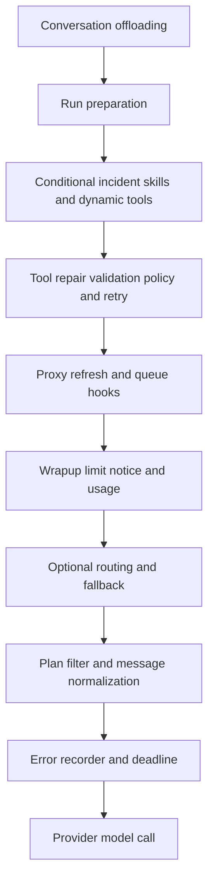
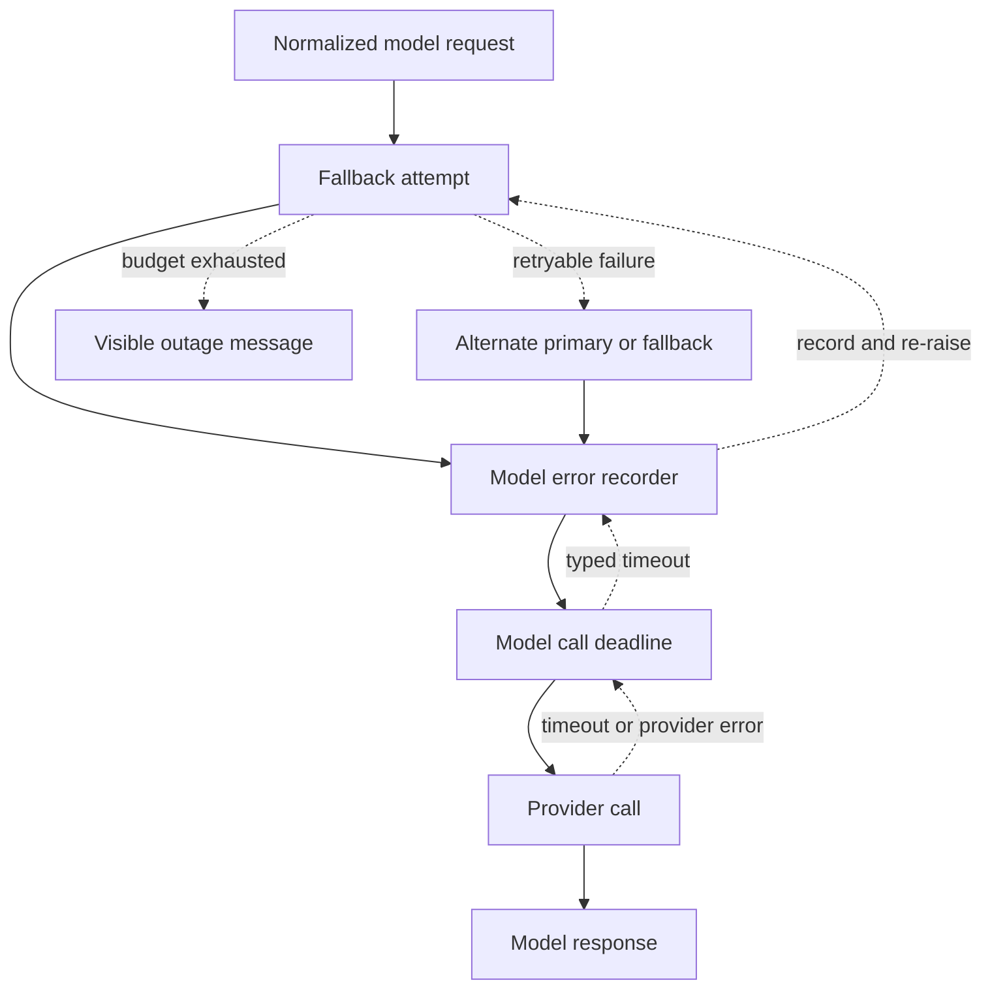

# Agent Middleware Stack

`get_agent` and `get_reviewer_agent` give ordered middleware lists to `create_deep_agent`. The list is an onion: earlier entries are outer wrappers around later entries. Consequently, outer middleware can prepare a request, intercept a tool call, or handle exceptions from every inner layer; ordering is a runtime contract. See [Agent Graph](agent-graph.md), [Tools](../concepts/tools.md), [Follow-up Messages](../workflows/follow-up-messages.md), and [PR Creation](../workflows/pr-creation.md) for adjacent concerns.

## Coding-agent assembly and scope

The coding-agent list is outer to inner:

1. `ConversationOffloadingMiddleware`
2. `PrepareAgentRunMiddleware`
3. `IncidentMiddleware`, when an incident session exists
4. `WorkspaceSkillsMiddleware`, for non-local anonymous runs
5. `DynamicToolMiddleware`, when configured integration groups are nonempty
6. `SanitizeToolInputsMiddleware`
7. `ValidateImageReadsMiddleware`
8. `ModelCallLimitMiddleware`
9. `ToolErrorMiddleware`
10. `ExcludeToolsMiddleware`
11. `SubdirAgentsReadMiddleware`
12. `ToolRetryMiddleware` for `task`
13. `PullRequestCreationGuardMiddleware`, except in local runs
14. `WorkflowPushGuardMiddleware`
15. `refresh_github_proxy_before_model`
16. `check_message_queue_before_model`, except in stop-summary mode
17. `TimeoutWrapupMiddleware`
18. `notify_step_limit_reached`
19. `record_run_usage`
20. `ModelSelectionMiddleware`, when adaptive routing is enabled
21. `ModelFallbackMiddleware`, when a distinct fallback resolves
22. `PlanModeMiddleware`
23. `SanitizeFireworksMessagesMiddleware`
24. `SanitizeOpenAIResponsesMiddleware`
25. `SanitizeThinkingBlocksMiddleware`
26. `StableToolResultOrderMiddleware`
27. `ModelErrorMiddleware`
28. `ModelCallTimeoutMiddleware`

This shows the coding-agent middleware nesting, with earlier boxes wrapping later boxes.

The parent stack is intentionally broader than subagents. The parent installs preparation, policy, queue, usage, selection, and fallback responsibilities. Its general-purpose subagent receives its own conversation offloader and may receive incident, workspace-skill, and dynamic-tool middleware, but does not inherit the complete parent list; `ToolRetryMiddleware` is therefore the parent-side escalation boundary around the delegated `task` tool.

`ConversationOffloadingMiddleware` extends Deep Agents summarization. It can compact context automatically or, when configured manually, ends the graph after producing the summary; it emits start, completion, failure, or skipped status events while hiding summarizer output from the user stream. `WorkspaceSkillsMiddleware` replaces the built-in skills middleware at its normal stack position and scopes checkpointed skill metadata to its configured source routes, preventing unrelated personal-skill context from being retained in public thread state.

## Preparation, context, and tools

`BasePrepareRunMiddleware` supplies checkpointed `before_agent` setup for agent and reviewer specializations. Its fingerprint combines the middleware class, latest message, and preparation configuration. A matching `run_prepared_for` latch skips completed setup on a resumed invocation; a later invocation on the same thread gets fresh tokens, prompts, and review/diff context. Subclass preparation must be idempotent because a failure before the checkpoint may execute it again. Its model wrapper inserts the rendered system prompt.

`DynamicToolMiddleware` exposes integration groups lazily, while `ExcludeToolsMiddleware` removes configured names from model requests. `SanitizeToolInputsMiddleware` repairs malformed `read_file` `offset` and `limit` strings before validation. `ValidateImageReadsMiddleware` checks image blocks returned by `read_file` against known image signatures and replaces an extension/content mismatch with a text error, avoiding a checkpointed invalid image that would cause later provider requests to fail.

`PlanModeMiddleware` is always installed. Its `before_agent` hook resets `plan_mode` to the value resolved for this invocation, and it recomputes offered tools on every model call. While active it removes external-mutation tools (and MCP tools in the coding-agent configuration), so an `enter_plan_mode` action restricts the next turn rather than only a run that started in plan mode. When adaptive routing is enabled, `ModelSelectionMiddleware` persists a selected route per run and swaps the request model; plan mode uses the performance route, and the optional fast-versus-fast-alt experiment is deterministic per thread.

Before every model call, the proxy-refresh hook best-effort renews a near-expiry sandbox GitHub installation token. The queue hook then reads `("queue", thread_id)` from the LangGraph store, deletes `pending_messages` before building the update to avoid duplicate delivery, and injects queued human input FIFO. It also consumes a pending autofix event. Follow-up images are omitted when the resolved model lacks vision support.

## Policy, limits, and completion hooks

`ModelCallLimitMiddleware` terminates the agent at its configured run limit; in the main agent an incident policy may override the normal recursion limit. `TimeoutWrapupMiddleware` starts a monotonic clock lazily per middleware instance and, after `OPEN_SWE_WRAPUP_TIMEOUT_SECONDS` (45 minutes by default), appends a one-time wrap-up instruction to each subsequent model request. `notify_step_limit_reached` is an after-agent hook that recognizes the limit marker and best-effort posts a Slack-thread explanation.

The PR guard blocks `execute` and `background_execute` fallbacks that create pull requests outside `open_pull_request`, including `gh pr create`, GitHub API, `curl`, and bounded nested-shell forms. It returns a non-recoverable error `ToolMessage` instead of running the command and is omitted only for local runs. The workflow-push guard intercepts pushes which change `.github/workflows`: it records the exact change fingerprint, requests human approval, and only then substitutes a safe rewritten push command.

`RecordRunUsageMiddleware` tags model responses with invocation and selected-route metadata. On an exception it finalizes an invocation as an error (including authentication rejection where identifiable), and its after-agent hook finalizes usage for runs with both invocation and thread IDs. This is a parent-only accounting boundary.

## Model failure and recovery

Provider-specific message sanitizers and stable tool-result ordering form the request-normalization boundary immediately inside plan-mode filtering. `ModelCallTimeoutMiddleware` is innermost, so its wall-clock deadline covers the provider operation itself. A stalled call becomes `ModelCallTimeoutError`, a `TimeoutError`; `ModelErrorMiddleware` logs, classifies, stores type and classification code in thread metadata when context is available, and re-raises it. The optional fallback wrapper is outside both layers and can then retry the classified timeout.

This is the inner model failure flow; recording occurs before fallback decides whether to retry.

`ModelCallTimeoutMiddleware` reads `OPEN_SWE_MODEL_CALL_TIMEOUT_SECONDS`, accepts only a positive numeric value, and otherwise uses 900 seconds. This sits above provider client request timeouts, allowing provider-level retry first while making websocket stalls observable.

`ModelFallbackMiddleware` is installed only when configured or default fallback resolution produces a different model. It makes six attempts by default—one initial attempt plus backoff entries `0, 5, 15, 30, 45` seconds, with positive-delay jitter—and alternates primary and fallback models. It retries connection and timeout failures, retryable `ModelError`, and selected 408/409/425/429/5xx/529 provider statuses. Model-not-available access errors immediately become a user-facing `AIMessage`; exhausted transient failures normally return an outage `AIMessage`, though `surface_outage_message=False` re-raises the last error.

## Tool and sandbox failure boundary

`ToolErrorMiddleware` turns ordinary unhandled tool exceptions into `ToolMessage(status="error")` JSON, allowing the model to self-correct. A `SandboxRetryableConnectionError` becomes a `sandbox_transient` error because the SDK guarantees that the command never started. In contrast, `SandboxConnectionError` other than `SandboxServerReloadError`, and a `ResourceNotFoundError` for the sandbox resource, are unreachable-sandbox failures: the middleware notifies the user and re-raises to end the run rather than repeatedly fail and notify.

`ToolRetryMiddleware` is narrower than model fallback: it wraps parent `task` delegation with at most two retries, a one-second initial delay, and ten-second maximum delay. Its predicate accepts retryable statuses and transient transport names, including a subagent `ModelCallTimeoutError`, because subagents lack parent fallback. On exhaustion, prompt/context errors return structured failed data to the model; other errors are re-raised.

`retry_transient_sandbox_errors`, used for direct operations, retries only SDK-marked pre-start connection rejections, at most four times with bounded exponential backoff and jitter. Sandbox-unreachable notification prefers the active Slack thread, then Linear, then a configured GitHub issue or PR when a token is available. Coding-agent recovery deliberately does not automatically replace a sandbox: replacement could conceal loss of uncommitted work.

## Reviewer differences and exit guarantee

The reviewer has a smaller outer-to-inner stack: `PrepareReviewerRunMiddleware`, `SanitizeToolInputsMiddleware`, `ModelCallLimitMiddleware`, `ToolErrorMiddleware`, `refresh_github_proxy_before_model`, `check_message_queue_before_model`, `TimeoutWrapupMiddleware`, the three message sanitizers, `RepairOrphanedToolCallsMiddleware`, `StableToolResultOrderMiddleware`, `ModelErrorMiddleware`, `ModelCallTimeoutMiddleware`, and `settle_review_check_on_exit`.

It omits conversation offloading, incident and workspace-skill layers, dynamic/excluded tools, image-read validation, subdirectory instructions, task retry, PR/workflow guards, run usage, model selection, plan mode, and fallback. `RepairOrphanedToolCallsMiddleware` inserts synthetic error results directly after persisted AI tool calls whose IDs have no `ToolMessage`, so an interrupted review can resume without provider tool-result validation failure.

Reviewer sandbox setup may replace a dead sandbox because its checkout is re-derived. A failed replacement remains a typed `SandboxUnreachableError`. On reviewer exit, `settle_review_check_on_exit` closes an unpublished tracked check as neutral so an infrastructure interruption is not presented as a PR code failure. If `publish_review` finished but its completion PATCH failed, it instead retries the stored real conclusion.

## Safe changes and focused tests

When adding a layer, decide whether it applies to the parent, subagent, reviewer, or only a model/tool phase, then preserve its nesting relationship. In particular, moving the deadline outside fallback prevents timeout recovery, moving error recording outside fallback misses failures fallback consumes, and moving queue deletion after injection risks duplicate follow-up delivery. Treat sandbox failures as retryable only where the SDK guarantees the command did not start.

Focused tests cover queue injection, fallback eligibility and alternation, preparation latching, timeout cancellation, step-limit notification, subdirectory instructions, and sandbox retry/recovery. Extend the closest test when changing an ordering edge, a classification boundary, or a completion short-circuit.
