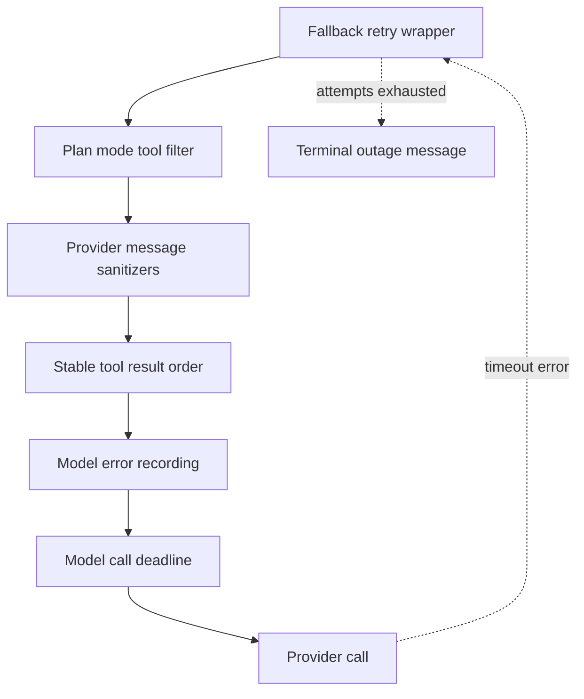

# Middleware Stack and Failure Boundaries

The agent factories pass explicit middleware lists to `create_deep_agent`. List order is significant: it is an onion, with the first entry outermost and the last entry nearest the model or tool executor. A wrapper can therefore normalize or block work before it reaches an inner layer, and exceptions propagate back outward. This page covers those boundaries; see [Agent Graph](agent-graph.md), [Reviewer and Analyzer](reviewer-and-analyzer.md), [Sandbox Lifecycle](sandbox-lifecycle.md), [Tools](../concepts/tools.md), and [PR Creation](../workflows/pr-creation.md) for the components they protect.

## Main agent: installed order

`get_agent` installs the following chain, outer to inner:

1. `PrepareAgentRunMiddleware`
2. `DynamicToolMiddleware`, only when at least one integration group is available
3. `SanitizeToolInputsMiddleware`
4. `ModelCallLimitMiddleware`
5. `ToolErrorMiddleware`
6. `ExcludeToolsMiddleware`
7. `SubdirAgentsReadMiddleware`
8. `ToolRetryMiddleware` for `task`
9. `PullRequestCreationGuardMiddleware`, except for local runs
10. `WorkflowPushGuardMiddleware`
11. `refresh_github_proxy_before_model`
12. `check_message_queue_before_model`, except in stop-summary mode
13. `TimeoutWrapupMiddleware`
14. `notify_step_limit_reached`
15. `record_run_usage`
16. `ModelFallbackMiddleware`, only when a distinct fallback resolves
17. `PlanModeMiddleware`
18. `SanitizeFireworksMessagesMiddleware`
19. `SanitizeOpenAIResponsesMiddleware`
20. `SanitizeThinkingBlocksMiddleware`
21. `StableToolResultOrderMiddleware`
22. `ModelErrorMiddleware`
23. `ModelCallTimeoutMiddleware`

The final placement is intentional: the deadline surrounds the provider operation and a timeout travels outward to fallback when present. The provider-format sanitizers and stable tool-result ordering are likewise close to the model request. In contrast, input repair and tool policy wrappers sit outside execution, where they can alter or short-circuit a call.

This inner-call flow shows why a stalled provider is converted into a failure that fallback can handle rather than leaving the run silent.

### Model deadline, fallback, and observability

`ModelCallTimeoutMiddleware` uses `asyncio.wait_for` to cancel a call exceeding `OPEN_SWE_MODEL_CALL_TIMEOUT_SECONDS`; invalid or non-positive values fall back to 900 seconds. It raises `ModelCallTimeoutError`, a `TimeoutError` subclass. This protects transports that can stall without a normal client read timeout and applies to both main graphs and their separately compiled subagent graphs.

When configured through `LLM_FALLBACK_MODEL_ID` or the primary model's default fallback, and different from the primary, `ModelFallbackMiddleware` alternates primary and fallback attempts. It recognizes selected HTTP statuses (including rate limits and 5xx), provider connection and timeout errors, transport errors, and the middleware deadline. The default retry delays are `0, 5, 15, 30, 45` seconds with positive jitter. Provider access errors that identify an unavailable model are immediately turned into an explanatory `AIMessage`; other non-transient exceptions propagate. After transient attempts are exhausted, the default is a terminal outage `AIMessage`, though the class can be configured to re-raise instead.

`ModelErrorMiddleware` is inside the fallback wrapper and outside the deadline. Every failed underlying attempt is logged with its full exception, classified, and best-effort recorded in thread metadata for the completion path, then re-raised unchanged. The main agent's after-agent `record_run_usage` separately persists completed-run token usage when preparation supplied a run ID and schedules deferred cost enrichment; telemetry failures are debug-logged rather than failing the run.

## Tool-call boundaries and sandbox failures

`ToolErrorMiddleware` converts ordinary unhandled tool exceptions to `ToolMessage(status="error")` JSON, preserving error type and tool name when available so the model can recover on a later turn. It distinguishes a safe-to-repeat connection rejection from an unavailable sandbox:

* `SandboxRetryableConnectionError` means the SDK rejected the WebSocket upgrade before the execute frame was sent. The middleware returns a `sandbox_transient` error result that says no command ran, so a retry cannot double-execute it.
* A `SandboxConnectionError`, except `SandboxServerReloadError`, or a `ResourceNotFoundError` whose resource type is `sandbox`, is terminal. The middleware attempts user notification and re-raises; continuing would make each subsequent sandbox call fail and repeatedly notify.

The shared `retry_transient_sandbox_errors` helper follows the same safety invariant for direct operations. It retries only `SandboxRetryableConnectionError`, at most four attempts, with jittered bounded exponential backoff. Other sandbox errors are not retried.

Sandbox-unreachable notification chooses an active Slack thread first, then a Linear issue, then a configured GitHub issue or PR if a token is available. The coding-agent message deliberately does not automatically provision a replacement: an empty replacement could conceal uncommitted work. Reviewer setup differs because its checkout is re-derived: it opts into replacement, persists the new sandbox ID, and still surfaces `SandboxUnreachableError` if replacement fails.

## Reviewer variant and interrupted state repair

The reviewer has a leaner chain: `PrepareReviewerRunMiddleware`, `SanitizeToolInputsMiddleware`, `ModelCallLimitMiddleware`, `ToolErrorMiddleware`, the GitHub-proxy and queue before-model hooks, `TimeoutWrapupMiddleware`, the three provider sanitizers, `RepairOrphanedToolCallsMiddleware`, `StableToolResultOrderMiddleware`, `ModelErrorMiddleware`, `ModelCallTimeoutMiddleware`, and `settle_review_check_on_exit`.

It does not install dynamic tools, exclusion/subdirectory hooks, delegated-task retry, fallback, plan mode, PR-creation protection, workflow-push protection, step-limit notification, or usage recording. `RepairOrphanedToolCallsMiddleware` repairs persisted history before model invocation: after cancellation or a mid-tool sandbox failure, it inserts an error `ToolMessage` immediately after each unmatched AI tool call. This restores the tool-call/result pairing providers require and lets the reviewer retry rather than permanently rejecting the thread.

The final reviewer after-agent hook prevents a GitHub `Open SWE Review` check from staying in progress when the run ends without `publish_review`. It settles a pending published result if one was recorded; otherwise it closes the check as neutral, treating an incomplete review as infrastructure failure rather than a PR failure.

## Lifecycle hooks, state, and control inputs

`BasePrepareRunMiddleware` supplies checkpointed `before_agent` setup. Its fingerprint includes middleware class, latest message, and configuration: a resumed attempt with the same fingerprint skips completed preparation, while a later invocation refreshes run state. Subclass preparation must be idempotent because a failure before checkpointing can run it again. The wrapper also injects the prepared rendered system prompt into each model request.

Before each eligible model call, the proxy hook best-effort refreshes a near-expiry sandbox GitHub installation token. The next queue hook consumes a pending auto-fix event and messages from LangGraph store namespace `("queue", thread_id)`, deletes `pending_messages` before converting it to state, and retains FIFO order. Deleting first prevents a repeated hook from injecting the same messages twice. Image payloads are adapted for the selected model, including removal plus a warning when it lacks vision support.

`PlanModeMiddleware` is always installed. Its `before_agent` resets `plan_mode` to the value resolved for this run, avoiding a stale checkpointed `True`; when active it recomputes and filters external-mutation tools for every model request. Thus an `enter_plan_mode` state update takes effect on the next turn. `DynamicToolMiddleware` exposes configured integration groups, while `ExcludeToolsMiddleware` filters named tools from requests. `SanitizeToolInputsMiddleware` repairs leading integer values in `read_file` `offset` and `limit`; `SubdirAgentsReadMiddleware` adds applicable ancestor `AGENTS.md` instructions once per thread.

## Policy, limits, and extension rules

`TimeoutWrapupMiddleware` starts its clock lazily per constructed graph and, after `OPEN_SWE_WRAPUP_TIMEOUT_SECONDS` (45 minutes by default), adds a system instruction to finish the current step and end the turn. `notify_step_limit_reached` is an after-agent hook that recognizes the `ModelCallLimitMiddleware` marker and posts a Slack explanation when possible.

The PR guard prevents `execute` and `background_execute` from bypassing `open_pull_request` through `gh`, GitHub API, or `curl` pull-request creation commands, including bounded nested shell expansion. The workflow guard inspects pushes affecting `.github/workflows`; an approval for the exact recorded change permits a rewritten safe command, while other states return a blocked tool result and arrange an approval request.

`ToolRetryMiddleware` retries only delegated `task` calls, with two retries and bounded delay. Its predicate includes retryable HTTP statuses, transient transport errors, and `ModelCallTimeoutError`, which is important because independently compiled subagents have a deadline but no fallback wrapper. Its failure handler returns structured `failed` data only for prompt/context errors and re-raises other exhausted failures.

When adding middleware, first choose the lifecycle boundary: `before_agent` for idempotent setup, `before_model` for state injection, model wrappers for request transformation or provider failures, tool wrappers for validation and policy, and `after_agent` for best-effort notification or settlement. Preserve the deadline-inner/fallback-outer relationship and avoid swallowing terminal sandbox errors. A new error classification, short-circuit, or ordering change needs focused tests; existing tests cover deadline cancellation and configuration, fallback eligibility and alternation, queue injection, preparation, sanitizers, orphan repair, ordering, subdirectory instructions, and sandbox retry/reviewer recovery.
