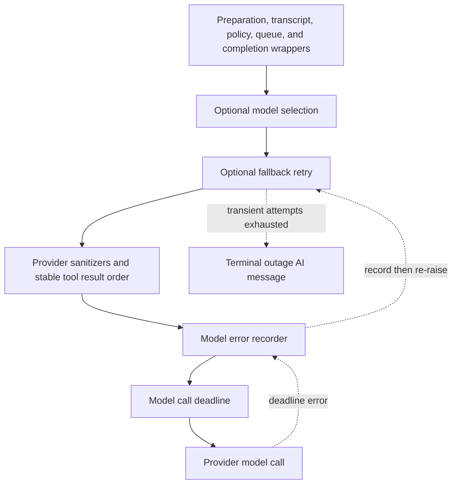

# Agent Middleware Stack

`build_agent` and the reviewer factory give ordered middleware lists to `create_deep_agent`. The list is an **onion**: entries nearer the beginning wrap entries after them for the hooks they share. A wrapper can therefore modify a request before an inner layer sees it, observe an inner exception, or alter completion behavior. Middleware order is a change-safety contract, not a cosmetic list: moving a deadline, fallback, policy guard, or transcript layer can change recovery, security, or observability semantics. See [Agent Graph](agent-graph.md), [Tools](../concepts/tools.md), [Follow-up Messages](../workflows/follow-up-messages.md), and [PR Creation](../workflows/pr-creation.md).

## Coding-agent assembly

The production coding-agent list below is outer to inner. Items marked conditional are omitted when their factory condition is not met.

1. `ConversationOffloadingMiddleware`
2. `PrepareAgentRunMiddleware`
3. `TranscriptMiddleware`
4. `IncidentMiddleware` — conditional on an incident session
5. `WorkspaceSkillsMiddleware` — conditional for eligible non-local credential-less runs
6. `DynamicToolMiddleware` — conditional when integration groups exist
7. `SanitizeToolInputsMiddleware`
8. `ValidateImageReadsMiddleware`
9. `ModelCallLimitMiddleware`
10. `ToolErrorMiddleware`
11. `ExcludeToolsMiddleware`
12. `SubdirAgentsReadMiddleware`
13. `ToolRetryMiddleware` for `task`
14. `PullRequestCreationGuardMiddleware` — omitted for local/desktop runs
15. `WorkflowPushGuardMiddleware`
16. `refresh_github_proxy_before_model`
17. `check_message_queue_before_model` — omitted in stop-summary mode
18. `TimeoutWrapupMiddleware`
19. `RequireUserReplyMiddleware`
20. `notify_step_limit_reached`
21. `record_run_usage`
22. `ModelSelectionMiddleware` — conditional when adaptive routing is enabled
23. `ModelFallbackMiddleware` — conditional when a distinct fallback model resolves
24. `SanitizeFireworksMessagesMiddleware`
25. `SanitizeOpenAIResponsesMiddleware`
26. `SanitizeThinkingBlocksMiddleware`
27. `StableToolResultOrderMiddleware`
28. `ModelErrorMiddleware`
29. `ModelCallTimeoutMiddleware`

The first layers establish the run and its durable observation boundary. Preparation populates state and the system prompt; transcript writes are best-effort observability, deliberately decoupled through a per-run background writer so a transcript failure cannot fail the run. Conversation offloading derives from the deep-agents summarization middleware, records its outcome in state and emits status events; its summary model is hidden from the user-facing stream.

The middle layers govern the tool surface. Sanitization repairs known malformed numeric tool arguments, while image-read validation prevents extension/content mismatches from leaving an invalid image block checkpointed in conversation history. Exclusion and subdirectory instructions shape the model-visible surface. The two command guards run outside the actual tool execution: the PR guard returns an error result for shell/API fallbacks that create a PR rather than `open_pull_request`, and the workflow guard holds pushes that change `.github/workflows` until recorded human approval.

### Model-call onion

*Caption: The ordered inner coding-agent model-call path; exceptions move outward, so the deadline must remain inside error recording and fallback.*

`ModelCallTimeoutMiddleware` is innermost, so `asyncio.wait_for` covers the provider operation rather than merely outer bookkeeping. It converts a wall-clock expiration into `ModelCallTimeoutError`, a `TimeoutError`. `ModelErrorMiddleware` logs and classifies that exception, persists its type and classification to thread metadata when context exists, then re-raises it. The optional fallback wrapper can consequently treat a timeout as transient. Moving the deadline outside fallback would disable this recovery; moving error recording outside fallback would omit errors the fallback absorbs.

When adaptive routing is enabled, `ModelSelectionMiddleware` stores the selected `fast`, `balanced`, or `performance` route in state before a model turn and overrides the request model. In automatic mode it uses a hidden structured-output classifier on the latest human task; a classifier failure falls back to `balanced`. `RecordRunUsageMiddleware` tags model responses with the selected route and invocation ID, and finalizes invocation usage both on normal agent completion and on model-call failure.

`ModelFallbackMiddleware` is attached only when configuration or the primary model's default resolves to a different fallback model. It alternates primary and fallback across six default attempts, using a jittered `0, 5, 15, 30, 45` second backoff schedule. Connection, timeout, retryable LangChain model errors, and selected overload/status failures are eligible; invalid requests are not. A provider model-access error is surfaced immediately as an `AIMessage`; exhausted eligible attempts ordinarily produce an outage `AIMessage`, while `surface_outage_message=False` re-raises the last error.

## Run lifecycle, follow-ups, and termination

`BasePrepareRunMiddleware` is the base for agent and reviewer setup. Its `before_agent` latch fingerprints the latest message, middleware class, and subclass preparation configuration. A matching checkpointed `run_prepared_for` skips setup on a resumed invocation; a changed invocation prepares fresh credentials, prompt material, and context. Subclass preparation must be idempotent because a failure before checkpointing can run it again. The wrapper then prepends `rendered_system_prompt` to the request system message.

Before each eligible coding-agent model call, `refresh_github_proxy_before_model` refreshes a near-expiry GitHub-proxy token. The queue hook also consumes a pending autofix event and reads `("queue", thread_id) / "pending_messages"`. It snapshots queued follow-ups in FIFO order, builds human input messages, and then removes only consumed entries. That last step is intentionally after construction: if a follow-up arrives during image fetching or model lookup, it remains queued instead of being deleted with the snapshot. A dashboard follow-up can move the owed reply surface from Slack to web; images are omitted with a warning for a text-only resolved model.

`TimeoutWrapupMiddleware` starts its per-instance monotonic clock lazily and, after `OPEN_SWE_WRAPUP_TIMEOUT_SECONDS` (45 minutes by default), appends a system instruction to finish the current step and report useful state rather than start new investigation. `ModelCallLimitMiddleware` ends at its configured limit; the after-agent step-limit hook recognizes its marker and notifies Slack. `RequireUserReplyMiddleware` initializes the reply surface for each run. If a turn that owes a reply ends without a successful final reply-tool result (or `slack_no_reply_needed`), it re-invokes the model with at most two nudges; after that budget it posts the last assistant text on the model's behalf rather than leave the requester silent.

## Tool and sandbox failure boundaries

`ToolErrorMiddleware` converts ordinary unhandled tool exceptions into `ToolMessage(status="error")` JSON with the error type, message, and tool name where available, allowing a subsequent model turn to correct course. It deliberately re-raises cancellation.

Sandbox failures are classified more narrowly:

- `SandboxRetryableConnectionError` means the SDK rejected the WebSocket upgrade before the execute frame was sent. It becomes a `sandbox_transient` error ToolMessage stating that nothing ran or changed; retrying it cannot double-run a command.
- `SandboxConnectionError`, except `SandboxServerReloadError`, means the sandbox is unreachable. `ResourceNotFoundError` is terminal only when its resource type is `sandbox`; a missing file remains an ordinary tool-local error.
- A terminal sandbox failure triggers a best-effort user notification and is re-raised, ending the run so later sandbox calls do not repeatedly fail and notify.

`retry_transient_sandbox_errors` is the direct-operation counterpart. It retries only the SDK-guaranteed pre-start error, at most four times with bounded exponential backoff and jitter. Terminal failures are never retried. Notification selects an active Slack thread first, then Linear, then a configured GitHub issue or PR when a token is available. The coding agent does not automatically replace an unreachable sandbox: replacement could hide loss of uncommitted work. Reviewer setup can replace its sandbox because its checkout is re-derived; a failed replacement remains a typed `SandboxUnreachableError`.

The delegated `task` tool has a separate retry envelope. `ToolRetryMiddleware` retries it twice for retryable HTTP/provider statuses and transport exception types, including a subagent `ModelCallTimeoutError` because subagents lack this parent fallback wrapper. On exhaustion, `task_on_failure` returns structured failed data only for invalid-prompt or context-length errors; other failures propagate.

## Reviewer stack and completion guarantee

The reviewer has a smaller, separately assembled list: `PrepareReviewerRunMiddleware`, `SanitizeToolInputsMiddleware`, `ModelCallLimitMiddleware`, `ToolErrorMiddleware`, `refresh_github_proxy_before_model`, `check_message_queue_before_model`, `TimeoutWrapupMiddleware`, the three provider message sanitizers, `RepairOrphanedToolCallsMiddleware`, `StableToolResultOrderMiddleware`, `ModelErrorMiddleware`, `ModelCallTimeoutMiddleware`, and `settle_review_check_on_exit`.

It does not install conversation offloading, transcript capture, dynamic/excluded tools, image validation, subdirectory instructions, task retry, PR/workflow guards, reply enforcement, usage recording, adaptive selection, or fallback. `RepairOrphanedToolCallsMiddleware` protects a resumed review whose persisted `AIMessage` contains a tool call but no corresponding result: before the next model request it inserts a synthetic error `ToolMessage` immediately after each orphaned call, allowing the model to recover rather than sending a provider-invalid transcript.

`settle_review_check_on_exit` is an after-agent completion guarantee. If a tracked review check remains unpublished, it closes it as **neutral**, since an incomplete reviewer run is infrastructure failure rather than a code failure. If `publish_review` completed but only the check-completion PATCH failed, stored pending conclusion data is retried instead of replacing the real conclusion with neutral.

## Safe extension and focused tests

When adding or moving middleware, first decide which hooks it needs (`before_agent`, `before_model`, model wrapper, tool wrapper, or `after_agent`) and test the resulting nesting. Preserve the outer-to-inner order above, especially the timeout → error recording → fallback relationship, guard placement ahead of execution, and best-effort transcript boundary. Preserve queue snapshot/consume behavior and only retry a sandbox operation when the SDK proves it never started.

Focused tests cover preparation latching and prompt injection, queue FIFO delivery and concurrent-arrival preservation, fallback eligibility/alternation, deadline cancellation, error-tool conversion and cancellation propagation, message sanitizers, image validation, orphaned-call repair, stable tool ordering, reply enforcement, offloading, model selection, usage recording, and transcript buffering. Sandbox retry/recovery tests additionally verify the pre-start retry invariant, no automatic coding-agent replacement, reviewer replacement eligibility, and typed failure when replacement fails. Extend the nearest of these tests whenever changing ordering, state ownership, an error classification, or a completion short circuit.
