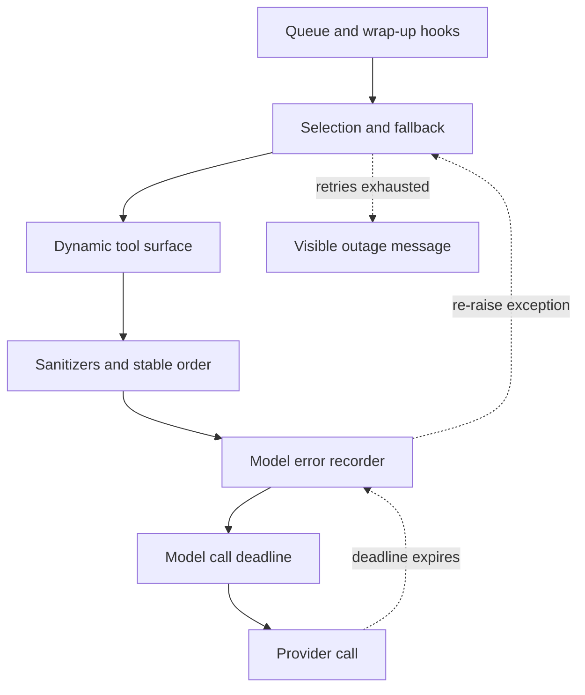

# Middleware and Run Guardrails

`get_agent` and `get_reviewer_agent` supply ordered middleware to `create_deep_agent`. The list is an onion: an earlier entry wraps later entries for the hooks it implements. Order is therefore a runtime contract—outer layers can change requests or observe errors from inner layers. This page covers the run boundary; see [Agent Graph](agent-graph.md), [Tools](../concepts/tools.md), [Follow-up Messages](../workflows/follow-up-messages.md), and [PR Creation](../workflows/pr-creation.md) for the graph, tool surface, incoming messages, and delivery workflow.

## Coding-agent assembly

The coding-agent list is outer to inner. Conditional entries are included only when their stated condition holds:

1. `ConversationOffloadingMiddleware`
2. `PrepareAgentRunMiddleware`
3. `TranscriptMiddleware`
4. `IncidentMiddleware` for an incident run
5. `WorkspaceSkillsMiddleware` when workspace skills apply
6. `SanitizeToolInputsMiddleware`
7. `ValidateImageReadsMiddleware`
8. `ModelCallLimitMiddleware`
9. `ToolErrorMiddleware`
10. `ExcludeToolsMiddleware`
11. `SubdirAgentsReadMiddleware`
12. `ToolRetryMiddleware` for `task`
13. `PullRequestCreationGuardMiddleware`, except for local runs
14. `WorkflowPushGuardMiddleware`
15. `refresh_github_proxy_before_model`
16. `check_message_queue_before_model`, except in stop-summary mode
17. `TimeoutWrapupMiddleware`
18. `RequireUserReplyMiddleware`
19. `RequireCliResultMiddleware` for a bridged non-stop-summary run
20. `notify_step_limit_reached`
21. `record_run_usage`
22. `ModelSelectionMiddleware` when adaptive routing is enabled
23. `ModelFallbackMiddleware` when a distinct fallback model resolves
24. `DynamicToolMiddleware` when configured integration groups contain tools
25. `SanitizeFireworksMessagesMiddleware`
26. `SanitizeOpenAIResponsesMiddleware`
27. `SanitizeThinkingBlocksMiddleware`
28. `StableToolResultOrderMiddleware`
29. `ModelErrorMiddleware`
30. `ModelCallTimeoutMiddleware`

The inner model path is deliberately ordered so that sanitizers and tool-result ordering make a provider-valid request, `ModelErrorMiddleware` records exceptions, and the innermost deadline converts a hang into an exception. The optional fallback is outside all of those layers and can retry that exception. `ModelCallTimeoutMiddleware` uses `asyncio.wait_for`; its timeout defaults to 900 seconds and is overridden only by a positive `OPEN_SWE_MODEL_CALL_TIMEOUT_SECONDS` value.

This shows the coding agent's model-call nesting and the timeout-to-fallback failure path.

### Preparation and mutable run context

`BasePrepareRunMiddleware` provides checkpointed `before_agent` setup for the coding and reviewer specializations. It fingerprints the latest message, middleware class, and preparation configuration. A matching checkpointed `run_prepared_for` latch skips setup on a resumed invocation, while a later invocation on the same thread prepares fresh prompt, token, and review/diff context. Implementations must be idempotent because setup can run again if failure occurs before the checkpoint. Its model wrapper prepends the rendered system prompt.

The outer conversation-offloading layer exposes Deep Agents summarization without streaming its internal model output; coding runs can request manual offloading. `TranscriptMiddleware`, incident policy, and workspace skills are assembly-time additions. `SanitizeToolInputsMiddleware` corrects known malformed integer arguments, while `ValidateImageReadsMiddleware` checks `read_file` image blocks by magic bytes and turns an extension/content mismatch into an error tool result rather than letting a permanently checkpointed invalid image poison later provider calls.

`ExcludeToolsMiddleware` applies the run's disallowed tool names. `SubdirAgentsReadMiddleware` and dynamic tools extend the usable surface, but `DynamicToolMiddleware` is deliberately inside fallback: each retry receives the same outer request processing while the dynamic tool layer selects tools for the model request. Adaptive `ModelSelectionMiddleware`, when enabled, is outside fallback and supplies the chosen route before fallback handles transient provider failures.

Before every applicable model call, the GitHub proxy hook refreshes a near-expiry sandbox installation token. The queue hook then reads pending messages from LangGraph storage under `("queue", thread_id)`, appends them as human input in FIFO order, and consumes only the snapshot after message construction. This preserves follow-ups appended during asynchronous image/model work instead of deleting them. It also consumes a pending autofix event; failures are logged and do not block a model call.

## Delivery and policy guardrails

`TimeoutWrapupMiddleware` starts its clock lazily for each middleware instance. After the positive `OPEN_SWE_WRAPUP_TIMEOUT_SECONDS` value or its 45-minute default, it adds a system instruction to finish the current step and preserve/report useful state instead of beginning further investigation.

The completion guards prevent a technically successful but silent run. `RequireUserReplyMiddleware` resets the expected reply surface for each run, detects when the model ended a user turn without a successful reply tool call, and jumps back to the model with a bounded number of nudges. If the model still does not call the tool, it posts the final assistant text rather than leaving the requester without an answer. On bridged threads, `RequireCliResultMiddleware` similarly gives the model up to two nudges to call the CLI result tool, then ends and lets the CLI report that no result arrived. `notify_step_limit_reached` reports an exhausted model-call limit, and `RecordRunUsageMiddleware` tags responses with route/invocation metadata and finalizes invocation usage on normal completion or a model error.

PR creation is constrained to the attributed `open_pull_request` path: the PR guard blocks `execute` and `background_execute` commands that use `gh pr create`, pull-request API calls, direct `curl`, or overly nested shell expansion, returning an error ToolMessage without executing the command. The workflow-push guard independently detects pushes affecting `.github/workflows`; it records a fingerprinted pending approval, optionally posts the Slack approval prompt, and permits the exact change only after approval.

## Failure boundaries and retries

`ModelErrorMiddleware` logs and classifies an exception, writes its type and classification code to thread metadata when run context is available, then re-raises the original exception. `ModelFallbackMiddleware` is installed only if `LLM_FALLBACK_MODEL_ID` or the primary model's default fallback resolves to a different model. It alternates primary and fallback requests for transient connection, timeout, retryable `ModelError`, and selected HTTP-status failures, using the default `0, 5, 15, 30, 45` second schedule plus positive jitter. That is six attempts total. Provider model-not-available errors become actionable user-facing messages immediately. On exhausted transient attempts it normally returns a terminal outage `AIMessage`; callers can configure it to re-raise instead.

Tool failures follow a distinct boundary. `ToolErrorMiddleware` converts ordinary tool exceptions into `ToolMessage(status="error")`, allowing the model to adapt. A SDK-marked `SandboxRetryableConnectionError` becomes a `sandbox_transient` result because the command never started. In contrast, an unreachable sandbox is notified and re-raised, ending the run so repeated tool calls do not repeatedly fail and notify. Notification prefers the active Slack thread, then Linear, then a configured GitHub issue or PR when a token is available. Coding runs do not silently replace a dead sandbox because doing so can conceal loss of uncommitted work.

`retry_transient_sandbox_errors` is the direct-operation counterpart: it retries only the SDK's guaranteed pre-start failure, with a four-attempt default and jittered bounded exponential backoff (or an optional elapsed-time limit). `ToolRetryMiddleware` instead wraps delegated `task` calls. Its retry predicate covers retryable statuses and transient transport names, including a subagent `ModelCallTimeoutError`; subagents lack the top-level fallback layer. Its failure handler returns structured failed data for invalid-prompt/context-length failures and re-raises other errors.

## Reviewer variant and completion guarantee

The reviewer has a smaller outer-to-inner list: `PrepareReviewerRunMiddleware`, `SanitizeToolInputsMiddleware`, `ModelCallLimitMiddleware`, `ToolErrorMiddleware`, GitHub proxy refresh, queue processing, `TimeoutWrapupMiddleware`, the three message sanitizers, `RepairOrphanedToolCallsMiddleware`, `StableToolResultOrderMiddleware`, `ModelErrorMiddleware`, `ModelCallTimeoutMiddleware`, and `settle_review_check_on_exit`.

It does not install the coding agent's offloading, transcript, incident/workspace skills, image validation, tool exclusion/subdirectory instructions/task retry, PR/workflow guards, reply/CLI delivery guards, usage recording, model selection, fallback, or dynamic tools. Before a later reviewer model call, `RepairOrphanedToolCallsMiddleware` supplies synthetic error results for tool calls that have no corresponding result, preventing provider rejection after interruption.

The after-agent `settle_review_check_on_exit` prevents an unpublished tracked GitHub review check from remaining in progress. It closes such a check as neutral, because an incomplete review is infrastructure failure rather than a PR code failure. If `publish_review` had completed but its check-completion PATCH failed, stored pending conclusion data is retried instead.

## Safe changes and focused tests

Preserve nesting when modifying this stack. Moving the timeout outside fallback removes timeout recovery; moving error recording outside fallback misses exceptions the fallback consumes. Preserve preparation idempotency and snapshot-preserving queue consumption. Treat sandbox errors as retryable only where the SDK guarantees that a command never started. Policy guards must remain outside the tools they constrain, and completion guards must remain able to jump back to the model.

Focused tests cover queue injection and concurrent updates, preparation latching, fallback eligibility and alternation, deadline cancellation, tool input/image validation, dynamic tools, orphaned-call repair, ordering, usage recording, and reply/CLI guard behavior. Extend the closest test when changing an ordering edge, a retry classification, a checkpointed state field, or a delivery short-circuit.
