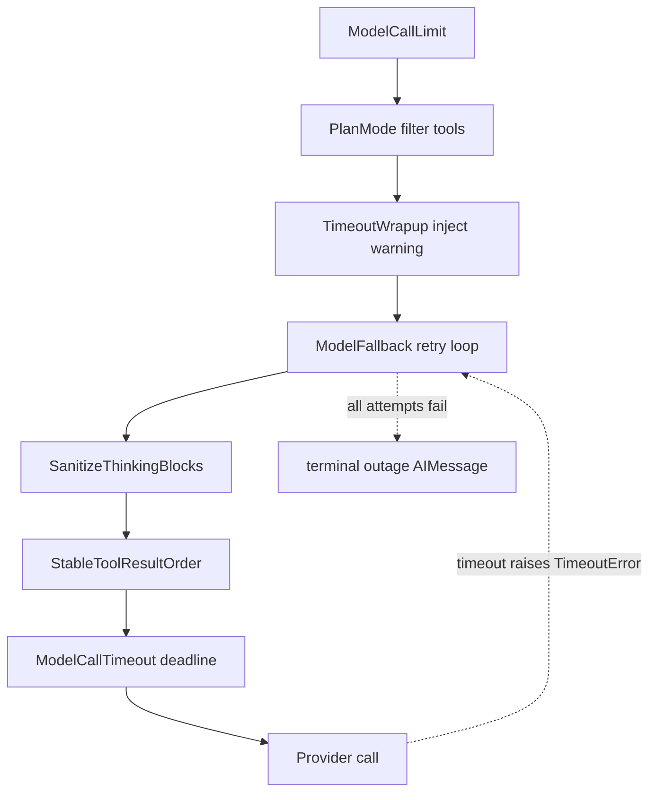

# Middleware Stack

Every model call and tool call the agent makes runs through an ordered chain of
middleware. Deep Agents / LangChain compose these as an *onion*: the outermost
middleware in the list wraps the next, and so on down to the raw provider call.
The chain is assembled once per run by the graph factory in
[`get_agent`](repo://agent/server.py#L1384-L1815), and a leaner variant is
assembled by [`get_reviewer_agent`](repo://agent/reviewer.py#L1417-L1440).

This page explains the assembled order, the responsibility of each hook, and the
non-obvious behaviors (follow-up injection, model fallback/timeout escalation,
plan mode, PR/workflow push guards, sandbox circuit breaking, task retry, and
orphaned tool-call repair). See also
[architecture/agent-graph](repo://openwiki/architecture/agent-graph.md) for how
this agent fits the wider graph, [workflows/follow-up-messages] for the queue
that `check_message_queue_before_model` drains, and
[testing/overview] for the middleware tests under
[`tests/middleware`](repo://tests/middleware).

## The onion around a model call

Model-call wrappers nest outer to inner; a `ModelCallTimeoutMiddleware` deadline surfaces as a `TimeoutError` that `ModelFallbackMiddleware` treats as retryable.

## Assembled agent order

`get_agent` passes an explicit `middleware=[...]` list to `create_deep_agent`.
The agent chain, outer to inner, is:

1. `PrepareAgentRunMiddleware` (a `BasePrepareRunMiddleware` subclass)
2. `DynamicToolMiddleware` (only when integration tool groups exist)
3. `SanitizeToolInputsMiddleware`
4. `ModelCallLimitMiddleware(run_limit=MODEL_CALL_RECURSION_LIMIT, exit_behavior="end")`
5. `ToolErrorMiddleware`
6. `ExcludeToolsMiddleware`
7. `SubdirAgentsReadMiddleware`
8. `ToolRetryMiddleware` (retries the `task` tool)
9. `PullRequestCreationGuardMiddleware` (skipped on local/desktop runs)
10. `WorkflowPushGuardMiddleware`
11. `refresh_github_proxy_before_model`
12. `check_message_queue_before_model` (skipped in stop-summary mode)
13. `TimeoutWrapupMiddleware`
14. `notify_step_limit_reached`
15. `ModelFallbackMiddleware` (only when a distinct fallback model is configured)
16. `PlanModeMiddleware`
17. `SanitizeFireworksMessagesMiddleware`
18. `SanitizeOpenAIResponsesMiddleware`
19. `SanitizeThinkingBlocksMiddleware`
20. `StableToolResultOrderMiddleware`
21. `ModelCallTimeoutMiddleware`

This is the actual order in
[`create_deep_agent(... middleware=[...])`](repo://agent/server.py#L1758-L1814).
Order matters because each hook type composes in list order: tool-input
sanitizers and guards must sit *outside* the tool executor, while the message
sanitizers and the per-call timeout must sit *innermost* so they see the final
request and the timeout covers the provider call itself.

### Why the innermost/outermost placement matters

- `ModelCallTimeoutMiddleware` is last (innermost) on purpose: its deadline then
  covers the provider call, and a timeout escalates *outward* to
  `ModelFallbackMiddleware`, which treats the resulting `TimeoutError` as a
  retryable transient error and tries the other provider
  ([server.py comment](repo://agent/server.py#L1810-L1812),
  [model_fallback.py](repo://agent/middleware/model_fallback.py#L46-L59)).
- The message sanitizers (`SanitizeThinkingBlocks`, Fireworks, OpenAI Responses)
  run just before the provider so they scrub the exact messages sent.
- `ToolErrorMiddleware` wraps tool execution from *outside*, so the guard
  middleware above it (`PullRequestCreationGuard`, `WorkflowPushGuard`,
  `SubdirAgentsRead`) can short-circuit or rewrite a tool call before it runs.

## Reviewer stack (leaner)

The reviewer graph installs a smaller chain and adds one hook the agent does not
use. In order:
`PrepareReviewerRunMiddleware`, `SanitizeToolInputsMiddleware`,
`ModelCallLimitMiddleware`, `ToolErrorMiddleware`,
`refresh_github_proxy_before_model`, `check_message_queue_before_model`,
`TimeoutWrapupMiddleware`, the three message sanitizers,
`RepairOrphanedToolCallsMiddleware`, `StableToolResultOrderMiddleware`,
`ModelCallTimeoutMiddleware`, and `settle_review_check_on_exit`
([reviewer.py](repo://agent/reviewer.py#L1417-L1440)). The reviewer has **no**
model fallback, no plan mode, no PR/workflow guards, and no subagent-read hook;
it is read-only and drives findings/publish tools instead.

## Middleware not wired by default

`agent/middleware/__init__.py` exports several middleware the default factories
do not install. `ExcludeToolsMiddleware` is present as a public re-export
([__init__.py](repo://agent/middleware/__init__.py#L9-L50)); the agent uses it,
but it exists as a standalone utility that mirrors Deep Agents' private
`_ToolExclusionMiddleware` without depending on that private import path
([exclude_tools.py](repo://agent/middleware/exclude_tools.py#L1-L46)).
`RepairOrphanedToolCallsMiddleware` is wired only in the reviewer, not the agent.
`sandbox_circuit_breaker` exports helpers (`post_sandbox_unreachable_notification`,
`extract_sandbox_id`) rather than a middleware class; they are invoked by
`ToolErrorMiddleware`, not registered as a standalone hook
([sandbox_circuit_breaker.py](repo://agent/middleware/sandbox_circuit_breaker.py#L135-L181),
[tool_error_handler.py](repo://agent/middleware/tool_error_handler.py#L23-L26)).

## Non-obvious behaviors

### Follow-up message-queue injection

`check_message_queue_before_model` is a `@before_model` hook that reads the
LangGraph store namespace `("queue", <thread_id>)` and injects any pending
messages as new human messages before the next model call, so follow-up comments
that arrived while the agent was busy are picked up mid-run. It deletes the
queued item *before* building messages to avoid double-processing on re-entry,
processes messages FIFO, and also drains a batched PR-babysitting "autofix" event
from `("autofix", <thread_id>)`
([check_message_queue.py](repo://agent/middleware/check_message_queue.py#L179-L318)).
Queued images are dropped with a warning when the resolved thread model does not
support vision
([check_message_queue.py](repo://agent/middleware/check_message_queue.py#L53-L86)).

### Model fallback and timeout escalation

`ModelFallbackMiddleware` wraps the model call in a retry loop that *alternates*
between the primary and a cross-provider fallback model with an exponential
backoff schedule (`0, 5, 15, 30, 45` seconds, plus jitter). It retries on
transient provider errors — 5xx/429-class status codes, connection/timeout
errors, and the `TimeoutError` raised by `ModelCallTimeoutMiddleware`. If every
attempt fails it returns a terminal `AIMessage` explaining the outage (by
default) instead of crashing the run, and provider "model not available" errors
short-circuit into a user-facing `AIMessage`
([model_fallback.py](repo://agent/middleware/model_fallback.py#L129-L214)).
The factory installs it only when `LLM_FALLBACK_MODEL_ID` (or the model's default
fallback) differs from the primary
([server.py](repo://agent/server.py#L1565-L1576)).

`ModelCallTimeoutMiddleware` puts a wall-clock deadline
(`OPEN_SWE_MODEL_CALL_TIMEOUT_SECONDS`, default 900s) around each provider call
so that a stalled stream — where the transport never raises its own read
timeout — becomes a `ModelCallTimeoutError` (a `TimeoutError` subclass) rather
than a silently parked run
([model_call_timeout.py](repo://agent/middleware/model_call_timeout.py#L42-L60)).

### Plan mode

`PlanModeMiddleware` strips external-mutation tools from each model request while
plan mode is active. It is installed unconditionally and is state-aware: its
`before_agent` resets `plan_mode` to the value resolved for the current run
(clearing a stale `True` left by a prior run), but the model's `enter_plan_mode`
tool can still flip it on mid-run, restricting the *next* model turn because the
tool list is recomputed on every call
([plan_mode.py](repo://agent/middleware/plan_mode.py#L38-L79),
[server.py](repo://agent/server.py#L1583-L1594)).

### PR creation guard

`PullRequestCreationGuardMiddleware` inspects `execute`/`background_execute` tool
calls and blocks shell fallbacks that create pull requests outside the
`open_pull_request` tool — `gh pr create`, `gh api .../pulls` with a POST/body,
and `curl` against the GitHub pulls endpoint — including commands nested inside
`bash -c` up to a bounded expansion depth. Blocked calls return an error
`ToolMessage` rather than executing, so a failed attributed-PR creation is
surfaced instead of silently bypassed
([pr_creation_guard.py](repo://agent/middleware/pr_creation_guard.py#L118-L266)).
It is skipped on local/desktop runs
([server.py](repo://agent/server.py#L1798)).

### Workflow push guard

`WorkflowPushGuardMiddleware` intercepts `execute`/`background_execute` git-push
commands, computes the diff for any `.github/workflows/` changes, and requires
human approval before the push proceeds. If approval is recorded it rewrites the
command to a safe fixed form and runs it; otherwise it returns a blocked
`ToolMessage` carrying an approval URL (and posts a Slack approval prompt)
([workflow_push_guard.py](repo://agent/middleware/workflow_push_guard.py#L526-L573)).

### Sandbox circuit breaking

`ToolErrorMiddleware` normalizes any tool exception into an error `ToolMessage`
so the model can self-correct instead of crashing the run. It special-cases
`SandboxClientError`: it clears the cached sandbox backend for the thread, posts
a user-facing "sandbox stopped responding" notification to the triggering
surface (Slack, Linear, or GitHub), and returns a `sandbox_unreachable` payload
telling the model to stop calling sandbox tools. The notification deliberately
does *not* auto-provision a replacement, because a fresh sandbox is empty and
swapping one in would discard uncommitted work
([tool_error_handler.py](repo://agent/middleware/tool_error_handler.py#L145-L178),
[sandbox_circuit_breaker.py](repo://agent/middleware/sandbox_circuit_breaker.py#L20-L55)).

### Task retry

The agent installs a `ToolRetryMiddleware` scoped to the `task` tool with
`retry_on=task_retry_on` and `on_failure=task_on_failure`. `task_retry_on`
retries on 5xx/429-class status codes and transient exception names — including
`ModelCallTimeoutError`, which is the escalation path for a subagent's wedged
model call since subagents have no fallback middleware. `task_on_failure` returns
a structured `failed` payload for prompt/context errors (`invalid_prompt`,
`context_length_exceeded`) and re-raises everything else
([task_retry.py](repo://agent/middleware/task_retry.py#L3-L84),
[server.py](repo://agent/server.py#L1790-L1797)).

### Orphaned tool-call repair

`RepairOrphanedToolCallsMiddleware` (reviewer only) scans the outgoing message
list before a model call and inserts a synthetic error `ToolMessage` after any
`tool_call` whose id has no matching result. Without this, a run cancelled or a
sandbox lost mid-tool-call leaves an `AIMessage.tool_call` with no `ToolMessage`,
which providers reject on the next run and permanently wedges the thread
([repair_orphaned_tool_calls.py](repo://agent/middleware/repair_orphaned_tool_calls.py#L69-L107)).

## Other hooks in the chain

- `PrepareAgentRunMiddleware` / `BasePrepareRunMiddleware` run checkpointed,
  idempotent per-run setup in `before_agent`; LangGraph checkpoints a
  `run_prepared_for` latch so resumed attempts skip completed setup while later
  invocations re-prepare
  ([prepare_run.py](repo://agent/middleware/prepare_run.py#L42-L60)).
- `SanitizeToolInputsMiddleware` coerces malformed integer args (e.g. `read_file`
  `offset`/`limit` given as `"1, 80"`) so a call succeeds instead of burning an
  LLM turn on a retry
  ([sanitize_tool_inputs.py](repo://agent/middleware/sanitize_tool_inputs.py#L1-L50)).
- `SubdirAgentsReadMiddleware` appends applicable ancestor `AGENTS.md` files to
  `read_file` results, tracking which files were already loaded per thread
  ([subdir_agents.py](repo://agent/middleware/subdir_agents.py#L139-L188)).
- `refresh_github_proxy_before_model` re-configures the sandbox GitHub proxy with
  a fresh installation token before each model call when the recorded token is
  near its one-hour expiry, preventing mid-run 401s
  ([refresh_github_proxy.py](repo://agent/middleware/refresh_github_proxy.py#L1-L45)).
- `TimeoutWrapupMiddleware` injects a wrap-up instruction into the system prompt
  once the run exceeds a wall-clock budget
  (`OPEN_SWE_WRAPUP_TIMEOUT_SECONDS`, default 45 min), telling the model to
  finish and end its turn
  ([timeout_wrapup.py](repo://agent/middleware/timeout_wrapup.py#L11-L67)).
- `notify_step_limit_reached` is an `@after_agent` hook that posts a Slack notice
  when the last message carries the `ModelCallLimitMiddleware` "Model call limits
  exceeded" marker, so a step-limit stop is explained to the user
  ([notify_step_limit.py](repo://agent/middleware/notify_step_limit.py#L20-L79)).
- `SanitizeThinkingBlocksMiddleware` drops empty Anthropic `thinking` blocks
  before provider validation, only when the request model is a `ChatAnthropic`
  ([sanitize_thinking_blocks.py](repo://agent/middleware/sanitize_thinking_blocks.py#L46-L56)).
