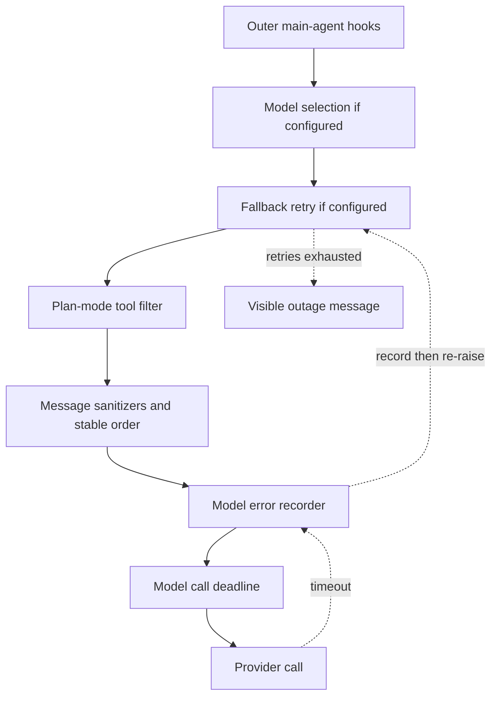

# Agent Middleware Stack

`get_agent` and `get_reviewer_agent` give ordered middleware lists to `create_deep_agent`. The list is an onion: an earlier entry wraps later entries for the hook types it implements. Consequently, an outer wrapper can handle an exception from an inner wrapper, while a `before_model` hook runs as part of each model turn. Preserve this order when changing cross-cutting behavior; it is runtime behavior, not a cosmetic registration list. See [Agent Graph](agent-graph.md), [Models, Profiles, and Instructions](../concepts/models-profiles-instructions.md), [Tools](../concepts/tools.md), and [Follow-up Messages](../workflows/follow-up-messages.md).

## Main-agent assembly

For a normal execution, the main-agent list is outer to inner:

1. `ConversationOffloadingMiddleware`
2. `PrepareAgentRunMiddleware`
3. `WorkspaceSkillsMiddleware`, when workspace skills are available
4. `DynamicToolMiddleware`, when integration groups are available
5. `SanitizeToolInputsMiddleware`
6. `ModelCallLimitMiddleware`
7. `ToolErrorMiddleware`
8. `ExcludeToolsMiddleware`
9. `SubdirAgentsReadMiddleware`
10. `ToolRetryMiddleware` for `task`
11. `PullRequestCreationGuardMiddleware`, except in a local run
12. `WorkflowPushGuardMiddleware`
13. `refresh_github_proxy_before_model`
14. `check_message_queue_before_model`, except in stop-summary mode
15. `TimeoutWrapupMiddleware`
16. `notify_step_limit_reached`
17. `record_run_usage`
18. `ModelSelectionMiddleware`, when model routing is configured
19. `ModelFallbackMiddleware`, when a different fallback model resolves
20. `PlanModeMiddleware`
21. `SanitizeFireworksMessagesMiddleware`
22. `SanitizeOpenAIResponsesMiddleware`
23. `SanitizeThinkingBlocksMiddleware`
24. `StableToolResultOrderMiddleware`
25. `ModelErrorMiddleware`
26. `ModelCallTimeoutMiddleware`

The conditional entries are deliberately in their shown positions. In particular, the deadline is innermost: it covers the actual provider call; its exception first reaches the error recorder and then the optional fallback wrapper. The model-selection wrapper is outside fallback, so the selected primary model is established before fallback alternates attempts.

This is the grounded nesting of the inner model-call path; timeout recording occurs before fallback decides whether to retry.

### State preparation and context

`BasePrepareRunMiddleware` is the shared checkpointed `before_agent` foundation for the main and reviewer preparation specializations. Its latch fingerprint includes the middleware class, latest message, and preparation configuration. A resumed matching invocation skips completed setup, whereas a later invocation can refresh prompts, tokens, and context. `_prepare` must therefore be idempotent: it can run again if failure happens before LangGraph checkpoints the latch. Its model wrapper prepends the rendered system prompt from state.

Conversation offloading extends Deep Agents summarization while marking its summary model as non-streaming and hidden. It reports automatic or manually requested progress through stream events and records completed offloading state. Workspace skills replace the built-in skills middleware at its existing position, but restrict checkpoint-visible skill metadata to configured workspace sources and clear load errors so personal skill context is not retained in public thread checkpoints.

Tool setup layers have distinct responsibilities. Dynamic tools expose configured integrations; excluded tools are removed from model requests; malformed known numeric tool inputs are normalized; and subdirectory instruction handling supplies applicable `AGENTS.md` guidance. `PlanModeMiddleware` is always present and recomputes the offered tool list each turn. It resets stale thread state to the run's resolved initial mode, then removes configured external-mutation tools while active, so an in-run `enter_plan_mode` restricts the next turn.

When configured, `ModelSelectionMiddleware` invokes a hidden structured classifier once per run state to choose `fast`, `balanced`, or `performance`; classifier failure safely defaults to `balanced`. It does not classify while plan mode is active, and routes plan-mode calls to `performance`.

### Follow-ups and operational limits

Before every ordinary main-agent model call, the GitHub proxy hook refreshes a near-expiry sandbox installation token. The queue hook then consumes a pending autofix event and reads `("queue", thread_id)` from the LangGraph store. It deletes `pending_messages` before building the state update, preventing duplicate delivery on another invocation, and processes the stored list oldest first. Queued human content is injected into the conversation; image payloads are adapted according to the resolved model's vision capability. Stop-summary runs intentionally omit this hook.

`TimeoutWrapupMiddleware` turns a long-running run toward finishing rather than starting more investigation, while `notify_step_limit_reached` detects the model-call-limit end marker and posts its explanatory notification. `record_run_usage` runs after the agent: for a prepared run it saves summarized token usage and schedules later cost enrichment. Its bookkeeping failures are caught so they cannot replace the agent outcome.

## Safety gates and tool failures

The two delivery guards apply to `execute` and `background_execute` tool calls. Outside local runs, `PullRequestCreationGuardMiddleware` blocks shell fallbacks that create pull requests—such as `gh pr create`, relevant GitHub API calls, and direct `curl` POSTs—and returns a non-recoverable error `ToolMessage`; creation should instead use the attributed PR workflow described in [PR Creation](../workflows/pr-creation.md). `WorkflowPushGuardMiddleware` inspects a parsed `git push`: when it would push workflow-file changes, it creates or reads a fingerprinted approval record, posts a Slack approval request if needed, and blocks until approval. An approved request is rewritten to its validated safe command.

`ToolErrorMiddleware` is the general tool-call boundary. Ordinary exceptions become JSON `ToolMessage(status="error")` payloads that let the model correct itself. A SDK-marked `SandboxRetryableConnectionError` instead becomes a `sandbox_transient` error because the command never started. Sandbox-unreachable errors are notified and re-raised: continuing would only repeat failures. The direct `retry_transient_sandbox_errors` utility likewise retries only the pre-start retryable error, at most four attempts with bounded exponential backoff and jitter; it never retries terminal sandbox failures. Notifications prefer an active Slack thread, then Linear, then a configured GitHub issue or PR with an available token. Coding-agent recovery does not automatically replace a dead sandbox because replacement could hide loss of uncommitted work.

`ToolRetryMiddleware` is narrower than this boundary: it wraps only delegated `task` calls. It has two retries with a one-second initial and ten-second maximum delay, accepting selected retryable HTTP statuses and transport-like exception names, including a subagent `ModelCallTimeoutError`. Subagents do not install fallback middleware. On final failure, invalid-prompt and context-length errors return structured failed data to the parent model; other failures are re-raised.

## Model failure boundary

`ModelCallTimeoutMiddleware` uses `asyncio.wait_for` to impose a wall-clock deadline. `OPEN_SWE_MODEL_CALL_TIMEOUT_SECONDS` supplies a positive override; invalid, absent, or non-positive values use 900 seconds. This protects against transports such as a stalled Responses websocket that never produces a provider timeout. It raises `ModelCallTimeoutError`, a `TimeoutError`, after provider-level timeouts have had their own chance to retry.

`ModelErrorMiddleware` logs and classifies every exception from the inner request, records its type and classification code in thread metadata when context is available, and re-raises the original exception. If fallback is installed, it receives that same exception. Fallback alternates primary on even attempts and a cross-provider fallback on odd attempts. The default five-delay schedule (`0`, `5`, `15`, `30`, `45` seconds) gives six total attempts, with up to 25% positive jitter on nonzero delays. Retry eligibility includes transient connection and timeout exceptions, retryable model errors, and statuses 408, 409, 425, 429, 500, 502, 503, 504, and 529.

A recognized Anthropic or OpenAI model-access error returns a specific user-facing `AIMessage` immediately. After transient attempts are exhausted, fallback normally returns a terminal outage `AIMessage`, preserving a visible result and checkpointed progress; `surface_outage_message=False` instead raises the last exception. Non-retryable exceptions bypass fallback.

## Reviewer differences and completion

With a thread ID and execution graph available, the reviewer uses this leaner outer-to-inner list:

`PrepareReviewerRunMiddleware`, `SanitizeToolInputsMiddleware`, `ModelCallLimitMiddleware`, `ToolErrorMiddleware`, `refresh_github_proxy_before_model`, `check_message_queue_before_model`, `TimeoutWrapupMiddleware`, the three provider message sanitizers, `RepairOrphanedToolCallsMiddleware`, `StableToolResultOrderMiddleware`, `ModelErrorMiddleware`, `ModelCallTimeoutMiddleware`, and `settle_review_check_on_exit`.

It omits conversation offloading, workspace and dynamic tools, tool exclusion, subdirectory instructions, task retry, PR and workflow guards, model routing and fallback, plan mode, step-limit notification, and usage recording. `RepairOrphanedToolCallsMiddleware` inserts synthetic failed tool results for prior tool-call IDs without results, avoiding a provider rejection after interrupted review execution.

The reviewer can replace its sandbox because its checkout is re-derived, unlike the coding agent's working sandbox; a failed replacement remains a typed `SandboxUnreachableError`. Finally, `settle_review_check_on_exit` prevents incomplete review work from looking like a code failure: it closes an unpublished tracked check as neutral. If review publication succeeded but the completion PATCH failed, it retries the saved real conclusion instead.

## Change checklist and focused tests

When adding or moving middleware, identify hook type and exception direction, then test the ordering edge—not just the new class. Keep preparation idempotent, delete queued items before injection, and classify sandbox failures as retryable only where the SDK establishes that execution never started. Moving the deadline outside fallback would remove timeout recovery; moving error recording outside fallback would fail to observe errors fallback consumes.

Focused coverage should include queue FIFO and duplicate prevention, preparation latching, timeout cancellation, fallback eligibility and alternation, tool-error classification, PR and workflow approval paths, model routing defaults, plan-mode next-turn filtering, orphaned review repair, and review-check settlement. Sandbox tests should preserve the distinction between reviewer replacement and the coding agent's no-auto-replacement rule.
