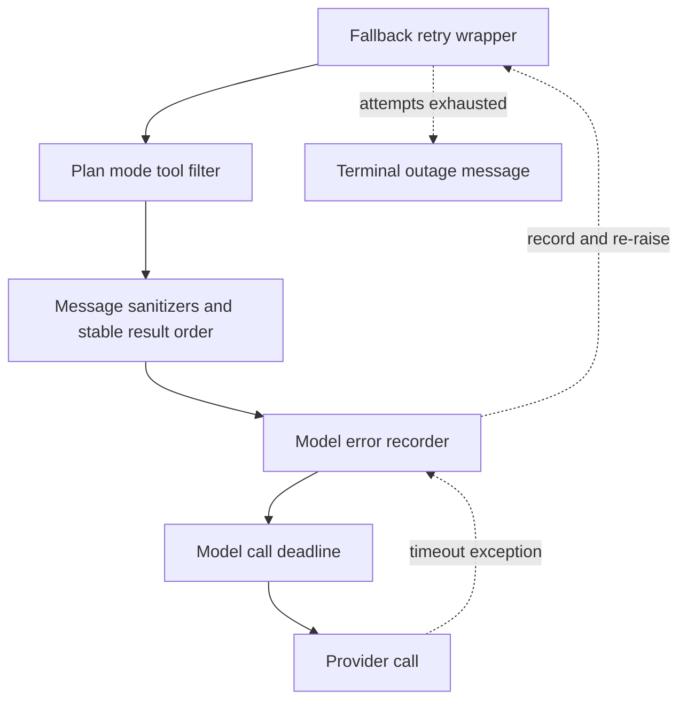

# Middleware and Failure Boundaries

`get_agent` and `get_reviewer_agent` pass ordered middleware lists to `create_deep_agent`. The list is an onion: earlier entries wrap later entries, so an outer layer can alter a request or handle an exception from every inner layer. This makes order part of the runtime contract, rather than an implementation detail. See [Agent Graph](agent-graph.md), [Reviewer and Analyzer](reviewer-and-analyzer.md), [Sandbox Lifecycle](sandbox-lifecycle.md), and [PR Creation](../workflows/pr-creation.md) for the graph, review, sandbox, and delivery contexts.

## Coding-agent stack

The coding-agent chain is outer to inner:

1. `PrepareAgentRunMiddleware`
2. `DynamicToolMiddleware`, only if it has integration groups
3. `SanitizeToolInputsMiddleware`
4. `ModelCallLimitMiddleware`
5. `ToolErrorMiddleware`
6. `ExcludeToolsMiddleware`
7. `SubdirAgentsReadMiddleware`
8. `ToolRetryMiddleware` for `task`
9. `PullRequestCreationGuardMiddleware`, except for local/desktop runs
10. `WorkflowPushGuardMiddleware`
11. `refresh_github_proxy_before_model`
12. `check_message_queue_before_model`, except in stop-summary mode
13. `TimeoutWrapupMiddleware`
14. `notify_step_limit_reached`
15. `record_run_usage`
16. `ModelFallbackMiddleware`, only when a different fallback model resolves
17. `PlanModeMiddleware`
18. `SanitizeFireworksMessagesMiddleware`
19. `SanitizeOpenAIResponsesMiddleware`
20. `SanitizeThinkingBlocksMiddleware`
21. `StableToolResultOrderMiddleware`
22. `ModelErrorMiddleware`
23. `ModelCallTimeoutMiddleware`

The last three layers form the critical model-failure boundary. Provider-specific message cleanup and stable tool-result ordering prepare a valid provider request. `ModelCallTimeoutMiddleware` is innermost, so its wall-clock deadline includes the provider operation itself. It converts a stalled call to `ModelCallTimeoutError`, which is a `TimeoutError`; that exception first passes through `ModelErrorMiddleware` for classification and thread metadata, then reaches the optional fallback wrapper. Thus a hang becomes either a retried request or a controlled, visible end to the run rather than a silent parked invocation.

This is the inner model-call path: timeout errors are recorded before the outer fallback decides whether to retry them.

### Preparation, tools, and follow-up messages

`BasePrepareRunMiddleware` supplies checkpointed `before_agent` setup for the agent and reviewer specializations. It fingerprints the latest message, middleware class, and preparation configuration. A matching `run_prepared_for` latch skips already checkpointed setup on a resumed invocation; a later invocation on the same thread gets fresh tokens, prompt material, and review/diff context. Preparation must remain idempotent because a failure before the checkpoint can run it again. Its model wrapper installs the rendered system prompt.

`DynamicToolMiddleware` exposes configured integration groups lazily; `ExcludeToolsMiddleware` filters disallowed tool names from model requests. `SanitizeToolInputsMiddleware` repairs known malformed integer arguments such as `read_file` `offset` and `limit`. `SubdirAgentsReadMiddleware` contributes applicable ancestor `AGENTS.md` instructions once per thread.

`PlanModeMiddleware` is always installed. `before_agent` resets `plan_mode` to the value resolved for this invocation, and every model request recomputes the offered tools. While active, external-mutation tools are removed; therefore an `enter_plan_mode` action changes the next model turn, not just a run that began in plan mode.

The proxy refresh hook runs before each model call. It refreshes a near-expiry sandbox GitHub-proxy installation token. Next, the queue hook reads `("queue", thread_id)` from the LangGraph store, deletes `pending_messages` before constructing messages to avoid duplicate delivery, and injects queued human input in FIFO order. It also consumes a pending autofix event. Image content is omitted with a warning when the resolved model has no vision support.

### Limits, policy, and completion

`TimeoutWrapupMiddleware` starts its clock lazily per middleware instance and, after `OPEN_SWE_WRAPUP_TIMEOUT_SECONDS` (45 minutes by default), appends an instruction to finish the current step, preserve/report useful state, and avoid new investigation. `notify_step_limit_reached` is an after-agent hook that recognizes the model-call-limit marker and posts an explanatory Slack message.

The PR guard blocks `execute` and `background_execute` command forms that create a pull request outside `open_pull_request`, including GitHub CLI, API, curl, and bounded nested `bash -c` forms. It returns a tool error instead of executing and is not installed locally. The workflow-push guard permits a rewritten safe push affecting `.github/workflows` only after recorded human approval; otherwise it returns a blocked result containing an approval URL.

`record_run_usage` is also an after-agent completion hook. When the run has a preparation-run ID, it persists summarized token usage and schedules deferred cost enrichment. Its own persistence failures are logged at debug level and do not change the agent result.

`ModelErrorMiddleware` is inside fallback but outside the deadline. On any exception from the inner request, it logs full classified fields, writes the type and classification code to the LangGraph thread metadata when available, and re-raises unchanged. This preserves the meaningful provider-error category for completion handling even where platform exception messages are scrubbed.

## Retry and failure boundaries

`ModelFallbackMiddleware` is installed only when `LLM_FALLBACK_MODEL_ID`, or the primary model's default fallback, resolves to a different model. It makes one more attempt than its backoff schedule entries: by default six attempts with delays `0, 5, 15, 30, 45` seconds plus positive jitter. Attempts alternate primary and fallback models. It retries connection and timeout failures and selected provider statuses (including 408, 409, 425, 429, 5xx, and 529). An Anthropic/OpenAI model-not-available access error is immediately converted to a user-facing `AIMessage`; an exhausted transient budget normally returns an outage `AIMessage`, although `surface_outage_message=False` re-raises the final error.

`ModelCallTimeoutMiddleware` reads `OPEN_SWE_MODEL_CALL_TIMEOUT_SECONDS`, validates that it is positive, and otherwise uses 900 seconds. `asyncio.wait_for` makes a websocket or other provider stall observable; it deliberately sits above provider-level request timeouts, which get a chance to retry inside the provider client first.

Tool failures have a separate safety boundary:

* `ToolErrorMiddleware` turns ordinary unhandled tool exceptions into `ToolMessage(status="error")` JSON carrying error type, error text, and tool name when known, allowing the model to self-correct.
* `SandboxRetryableConnectionError` means the SDK rejected the WebSocket upgrade before the execute frame was sent. It is converted to a `sandbox_transient` tool error, explicitly stating that nothing ran or changed; retrying cannot double-run the command.
* A `SandboxConnectionError`, except `SandboxServerReloadError`, means the sandbox is unreachable. So does `ResourceNotFoundError` only when the missing resource is the sandbox. These are notified and re-raised to end the run: continuing would repeatedly fail and notify.

`retry_transient_sandbox_errors` is the corresponding direct-operation utility. It retries only the SDK-marked pre-start error, at most four times, with bounded exponential backoff and jitter; terminal sandbox errors are never retried. Unreachable notification prefers the active Slack thread, then Linear, then a configured GitHub issue or PR if a token is available. Coding-agent recovery deliberately does not auto-replace a sandbox because a fresh sandbox could conceal loss of uncommitted work; users can retrigger the thread or start a new one.

`ToolRetryMiddleware` is narrower: it wraps delegated `task` calls with two retries, one-second initial delay, and ten-second maximum delay. `task_retry_on` accepts retryable statuses and transient transport exception names, including a subagent `ModelCallTimeoutError`; subagents do not have fallback middleware. On exhaustion, `task_on_failure` returns structured `failed` data only for invalid-prompt/context-length failures and re-raises other errors.

## Reviewer stack and completion guarantee

The reviewer uses a deliberately smaller chain: `PrepareReviewerRunMiddleware`, `SanitizeToolInputsMiddleware`, `ModelCallLimitMiddleware`, `ToolErrorMiddleware`, `refresh_github_proxy_before_model`, `check_message_queue_before_model`, `TimeoutWrapupMiddleware`, the three provider message sanitizers, `RepairOrphanedToolCallsMiddleware`, `StableToolResultOrderMiddleware`, `ModelErrorMiddleware`, `ModelCallTimeoutMiddleware`, and `settle_review_check_on_exit`.

It omits dynamic tools, tool exclusion, subdirectory instructions, task retry, PR/workflow guards, plan mode, run-usage recording, and model fallback. `RepairOrphanedToolCallsMiddleware` prevents an interrupted review from being permanently rejected by a provider: before a later model call, it inserts synthetic error `ToolMessage` results for tool-call IDs that have no result.

Reviewer sandbox setup opts into replacement because its checkout is re-derived for each run and a persistent PR thread should not be bricked by a dead sandbox. A failed replacement remains `SandboxUnreachableError` and is notified safely. `settle_review_check_on_exit` closes a tracked but unpublished GitHub review check as **neutral**, rather than falsely marking the PR's code as failed. If `publish_review` recorded a pending completion result whose PATCH failed transiently, the hook retries that real conclusion instead.

## Safe changes and focused tests

Preserve the outer-to-inner arrangement when adding middleware. In particular, moving the deadline outside fallback would prevent timeout recovery, and moving error recording outside fallback would miss failures the fallback consumes. Keep preparation idempotent, retain delete-before-inject queue semantics, and treat a sandbox error as retryable only when the SDK guarantees the command never started.

Focused middleware tests cover queue injection, dynamic tool behavior, preparation latching, sanitizers, orphaned-call repair, stable result ordering, timeout cancellation, fallback alternation/eligibility, step-limit notification, subdirectory instructions, and usage recording. Sandbox recovery tests verify that reviewer replacement is permitted, default coding-agent replacement is not, and a failed replacement remains typed. These are the tests to extend when changing an ordering edge, error classification, or a completion short-circuit.
