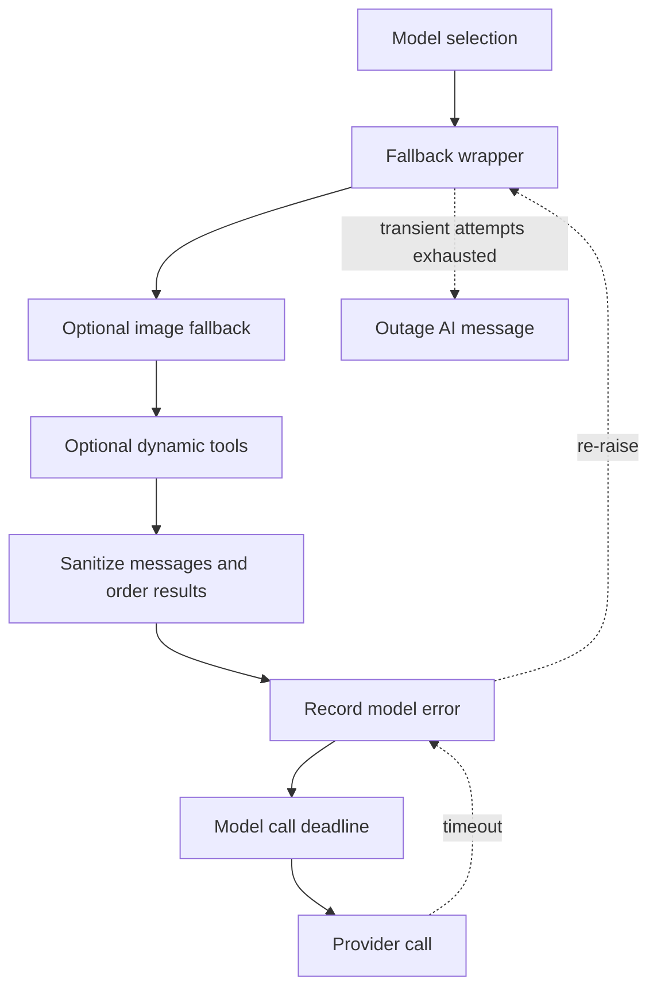

# Agent and reviewer middleware stack

`build_agent` and `get_reviewer_agent` construct `create_deep_agent` graphs with ordered middleware. The sequence is an onion: earlier entries wrap later entries for the hook types they implement. Consequently, an outer wrapper can observe or recover an inner failure, while before-model hooks run in list order. The order is an operational contract, particularly around model selection, fallbacks, sanitization, and deadlines. See [Agent Graph](agent-graph.md), [Reviewer and Analyzer](reviewer-and-analyzer.md), [Follow-up Messages](../workflows/follow-up-messages.md), and [PR Creation](../workflows/pr-creation.md).

## Coding-agent assembly

The normal coding-agent list below is outer to inner. Conditional entries are omitted when their stated condition does not hold.

1. `FilesystemMiddleware` and `ConversationOffloadingMiddleware`
2. `PrepareAgentRunMiddleware`; optionally `ReviewGuideMiddleware`, `TranscriptMiddleware`, client-tool middleware, `IncidentMiddleware`, and `WorkspaceSkillsMiddleware`
3. `ValidateImageReadsMiddleware`, `ModelCallLimitMiddleware`, `ToolErrorMiddleware`, `ExcludeToolsMiddleware`, `SubdirAgentsReadMiddleware`, and `ToolRetryMiddleware` for `task`
4. `PullRequestCreationGuardMiddleware` outside desktop runs, `WorkflowPushGuardMiddleware`, and optional task-coordination middleware
5. `refresh_github_proxy_before_model`, except in a task-coordination worker; outside stop-summary mode, `check_message_queue_before_model` and `deliver_event_matches_before_model`
6. `RequireUserReplyMiddleware`, and `RequireCliResultMiddleware` when a CLI bridge requires a result; then `notify_step_limit_reached` and `record_run_usage`
7. `ModelSelectionMiddleware`, `ModelFallbackMiddleware`, optional `ImageModelFallbackMiddleware`, optional `DynamicToolMiddleware`, and optional MCP code-mode middleware
8. Fireworks, OpenAI Responses, and thinking-block sanitizers; `StableToolResultOrderMiddleware`; `ModelErrorMiddleware`; and innermost `ModelCallTimeoutMiddleware`.

The factory builds this list from the run configuration and available integrations. Stop-summary runs narrow the tool surface and omit queue/event delivery. Desktop runs omit the PR-creation guard. The selected model is not fixed only at graph construction: `ModelSelectionMiddleware` stores a route in state before a model turn and overrides the request model. It honors a requested model, otherwise reuses a stored route, forces the fast route in fast mode, or classifies the latest human task for automatic routing; it also emits a best-effort `model_routed` stream event.

### Per-run preparation and context repair

`BasePrepareRunMiddleware` owns checkpoint-aware preparation for agent and reviewer specializations. Its fingerprint combines the middleware class, latest-message fingerprint, and preparation configuration. A matching checkpointed `run_prepared_for` latch skips repeat preparation for a resumed invocation, while a new message or configuration causes fresh setup. Subclass preparation must therefore be idempotent: a failure before the checkpoint can execute it again. The wrapper adds the prepared system prompt to each model request.

Queue delivery is a before-model context boundary, not a separate run. It snapshots the thread queue, turns each queued payload into input messages, and removes only the snapshot after every message is successfully built. This preserves messages enqueued during expensive image processing and avoids message loss on a build failure. It also handles a dashboard handoff by changing the reply surface; image payloads are resolved with awareness of the selected model and image-fallback setting.

`DynamicToolMiddleware` minimizes the initial tool schema. The model sees a `load_integration_tools` catalog rather than connected integration schemas; the loader validates names, lazily builds the needed groups under per-group locks, and records loaded names in state. Later model calls expose only those resolved tools. For supported providers, it anchors native tool additions at the loading result to preserve prompt caching; other providers receive the loaded tools in the ordinary request tool list. A direct call to an integration that has not been loaded is rejected with a tool error.

## Model-call resilience and observability

The inner model path is ordering-sensitive. Sanitizers normalize provider-specific message representations and stable ordering before the deadline wraps the provider operation. A deadline becomes a `ModelCallTimeoutError`, a `TimeoutError`, which `ModelErrorMiddleware` logs, classifies, records as thread metadata when a run context exists, and re-raises. The outer fallback can then decide whether to retry it.

```mermaid
flowchart TD
  Select["Model selection"] --> Fallback["Fallback wrapper"]
  Fallback --> Image["Optional image fallback"]
  Image --> Dynamic["Optional dynamic tools"]
  Dynamic --> Clean["Sanitize messages and order results"]
  Clean --> Errors["Record model error"]
  Errors --> Deadline["Model call deadline"]
  Deadline --> Provider["Provider call"]
  Provider -. "timeout" .-> Errors
  Errors -. "re-raise" .-> Fallback
  Fallback -. "transient attempts exhausted" .-> Reply["Outage AI message"]
```

This diagram shows the model-call wrapper path; a timeout is recorded before the fallback layer consumes or surfaces it.

`ModelCallTimeoutMiddleware` uses `asyncio.wait_for`; `OPEN_SWE_MODEL_CALL_TIMEOUT_SECONDS` must be positive or the 900-second default applies. It is intentionally above provider-level client timeouts so the client can perform its own retry first. `ModelFallbackMiddleware` is always present in the agent list but passes through when no fallback is registered. Where a fallback exists, it alternates primary and fallback models across six default attempts, with immediate first failover and jittered delays thereafter. It retries connection, timeout, retryable `ModelError`, and selected transient provider status failures. Model-access errors are turned directly into an explanatory `AIMessage`; exhausted transient failures normally produce an outage `AIMessage`, while `surface_outage_message=False` re-raises the final exception.

Model selection and fallback cooperate for requested-model handoffs: the requested-model factory registers the appropriate fallback pair for the selected model. Optional image fallback similarly supplies a vision-capable model when a request contains images that the selected text model cannot serve.

All Open SWE middleware subclasses use a trace policy that omits input payloads. `RecordRunUsageMiddleware` tags model responses and the active trace with routing/invocation data, finalizes invocation usage after the agent, and also finalizes an error path before re-raising. This makes routing and usage observable without retaining middleware inputs in traces.

## Tool failure, policy, and completion boundaries

`ToolErrorMiddleware` converts ordinary tool exceptions to JSON `ToolMessage(status="error")` values so the model can correct its approach. A retryable sandbox connection rejection is also non-terminal because the command never started; its error message explicitly says that nothing ran. In contrast, an unreachable sandbox—connection failure other than a server reload, or a missing sandbox resource—triggers a best-effort user notification and is re-raised. Continuing would only repeat failing sandbox calls and notifications.

Tool selection is controlled at several layers: `ExcludeToolsMiddleware` removes unavailable or mode-specific tools, subdirectory instructions are supplied by `SubdirAgentsReadMiddleware`, and task retries are narrowly scoped to delegated `task` calls. `PullRequestCreationGuardMiddleware` protects the dedicated PR-creation path in non-desktop runs, while `WorkflowPushGuardMiddleware` protects workflow-file pushes. These guards remain outside the tool-error normalization layer, so their tool responses can steer the model without bypassing policy.

`RequireUserReplyMiddleware` is the completion guard for an answer owed to Slack or web. It resets the reply surface and retry count for each run, verifies that a successful final reply tool call (or configured equivalent) discharged the current human turn, and re-invokes the model with a bounded number of nudges when it did not. If the budget is exhausted, it posts the latest assistant text rather than leaving the requester silent. `RequireCliResultMiddleware` adds the analogous completion requirement for an eligible CLI bridge. The queue middleware can change the reply surface mid-run when a dashboard follow-up takes over a Slack conversation.

## Reviewer specialization

The reviewer has a leaner, distinct chain: `PrepareReviewerRunMiddleware`, `ModelCallLimitMiddleware`, `ToolErrorMiddleware`, proxy refresh, queue delivery, the three message sanitizers, `RepairOrphanedToolCallsMiddleware`, `StableToolResultOrderMiddleware`, `ModelRetryMiddleware` for `TimeoutError`, `ModelErrorMiddleware`, `ModelCallTimeoutMiddleware`, and `settle_review_check_on_exit`.

It deliberately does not install the coding-agent filesystem/offloading stack, dynamic integrations, tool exclusion and delegated-task retry, PR/workflow guards, reply/CLI completion guards, run-usage recording, model selection, fallback, or image fallback. The reviewer instead retries timeouts locally. `RepairOrphanedToolCallsMiddleware` repairs history before a provider sees it by supplying synthetic error results for unmatched tool calls. On exit, `settle_review_check_on_exit` prevents an unfinished review from looking like a code failure: it closes an unpublished tracked check as neutral, but retries a stored real conclusion when publishing succeeded and only the completion update failed.

## Change and test guidance

When changing this stack, preserve the intent of each nesting edge. The deadline must remain inside error recording and fallback if timeout classification and recovery are required. Queue items must be removed only after they are fully built. Do not broaden sandbox retries beyond errors that guarantee a command did not start, and do not move a policy guard beneath a layer that could mask its result.

Focused tests cover queue snapshot behavior and handoff semantics, lazy dynamic-tool loading and provider-specific request shaping, preparation latching, timeout and fallback eligibility, model routing, tool-error conversion, reply completion, sanitizers, orphaned-tool repair, stable tool order, and usage finalization. Extend the test nearest the ordering edge being changed rather than testing only graph construction.
