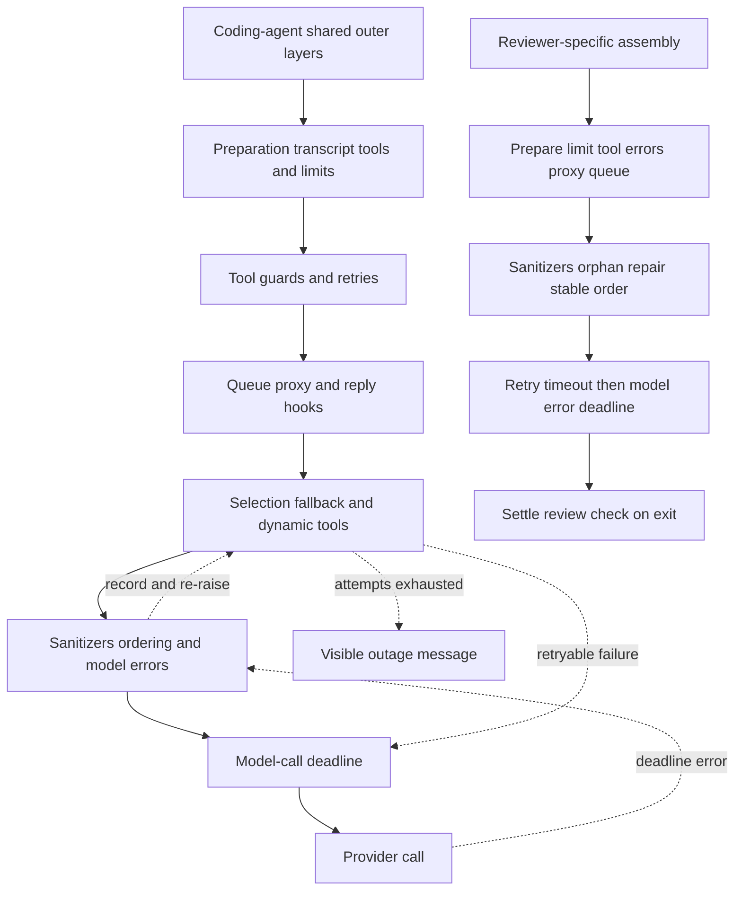

# Agent Middleware, Guards, and Recovery

`build_agent` and `get_reviewer_agent` pass ordered lists to `create_deep_agent`. The list is an onion: an earlier entry wraps later entries, so ordering determines both what is normalized before a provider call and which layer can catch an inner failure. The coding agent has the broad operational stack; the reviewer deliberately has a smaller, review-specific assembly. See [Agent Graph](agent-graph.md), [Tools](../concepts/tools.md), [Follow-up Messages](../workflows/follow-up-messages.md), and [PR Creation](../workflows/pr-creation.md).

## Assembly and interception order

The coding-agent list is outer to inner. Conditional entries are omitted when their stated condition is false:

1. `FilesystemMiddleware` and `ConversationOffloadingMiddleware`
2. `PrepareAgentRunMiddleware`, `TranscriptMiddleware`, client tools, optional incident and workspace-skills middleware, and `ValidateImageReadsMiddleware`
3. `ModelCallLimitMiddleware`, `ToolErrorMiddleware`, `ExcludeToolsMiddleware`, `SubdirAgentsReadMiddleware`, and `ToolRetryMiddleware` for `task`
4. `PullRequestCreationGuardMiddleware` except on desktop runs, `WorkflowPushGuardMiddleware`, and optional task coordination
5. `refresh_github_proxy_before_model`; except on stop-summary runs, `check_message_queue_before_model` and `deliver_event_matches_before_model`
6. `RequireUserReplyMiddleware`, and `RequireCliResultMiddleware` for a CLI bridge
7. `notify_step_limit_reached`, `record_run_usage`, `ModelSelectionMiddleware`, `ModelFallbackMiddleware`, optional image fallback, and optional `DynamicToolMiddleware`
8. provider message sanitizers, `StableToolResultOrderMiddleware`, `ModelErrorMiddleware`, and innermost `ModelCallTimeoutMiddleware`.

```mermaid
flowchart TD
  A["Coding-agent shared outer layers"] --> B["Preparation transcript tools and limits"]
  B --> C["Tool guards and retries"]
  C --> D["Queue proxy and reply hooks"]
  D --> E["Selection fallback and dynamic tools"]
  E --> F["Sanitizers ordering and model errors"]
  F --> G["Model-call deadline"]
  G --> H["Provider call"]
  H -. "deadline error" .-> F
  F -. "record and re-raise" .-> E
  E -. "retryable failure" .-> G
  E -. "attempts exhausted" .-> I["Visible outage message"]
  J["Reviewer-specific assembly"] --> K["Prepare limit tool errors proxy queue"]
  K --> L["Sanitizers orphan repair stable order"]
  L --> M["Retry timeout then model error deadline"]
  M --> N["Settle review check on exit"]
```
This shows the ordered model interception points and the separate coding-agent and reviewer failure paths.

The reviewer installs `PrepareReviewerRunMiddleware`, a model-call limit, `ToolErrorMiddleware`, proxy refresh, queue delivery, the three provider sanitizers, `RepairOrphanedToolCallsMiddleware`, stable tool-result ordering, `ModelRetryMiddleware(retry_on=(TimeoutError,))`, `ModelErrorMiddleware`, `ModelCallTimeoutMiddleware`, and `settle_review_check_on_exit`. It does not use the coding agent's filesystem/offloading/transcript layers, dynamic or client tools, subdirectory instructions, task retry, PR/workflow guards, reply enforcement, usage recording, model selection, model fallback, or image fallback.

## Run preparation, transcripts, and incoming messages

`BasePrepareRunMiddleware` is a checkpointed `before_agent` base for the agent and reviewer specializations. It fingerprints the middleware class, latest message, and preparation configuration. A matching checkpointed `run_prepared_for` latch skips completed setup on resume, but a failure before that checkpoint can invoke preparation again; `_prepare` must therefore be idempotent. Its model wrapper prepends the prepared rendered system prompt to the request's existing system message.

`TranscriptMiddleware` is an observability boundary for the coding agent: per-run state is kept in a `thread_id:run_id` registry because graph nodes do not share a `ContextVar`; events are queued to one background writer so transcript persistence does not block model streaming. Its failures are logged and swallowed rather than allowed to fail the run.

`check_message_queue_before_model` reads `("queue", thread_id)` from the LangGraph store before every applicable model call and injects a snapshot of pending follow-ups as input messages in FIFO order. It consumes only that snapshot after message construction, retaining messages appended concurrently; consequently a construction failure does not lose follow-up input. It also consumes a pending autofix event and can move the reply surface to the dashboard. Queued images are fetched only for image-capable models, otherwise the textual message gains a warning.

`RepairOrphanedToolCallsMiddleware`, used by the reviewer, repairs a persisted interrupted transcript before sending it to a provider. It inserts a synthetic error `ToolMessage` immediately after each AI tool call lacking a result, preventing provider rejection of unmatched tool-use IDs and allowing a subsequent turn to retry.

## Tool surface and policy boundaries

`DynamicToolMiddleware` keeps integration setup off the first-turn critical path. The model initially receives `load_integration_tools` and a catalog of names; requesting it resolves the relevant integration group once under a lock, records loaded names in graph state, and makes the resolved schemas available on later requests. Unknown or unavailable names become error tool messages. The factory adds this middleware only when integration groups exist; it may keep tools sandbox-only rather than model-visible.

Tool policies wrap execution, not merely the advertised schema. `ExcludeToolsMiddleware` removes disallowed names from model requests. `ToolRetryMiddleware` scopes retries to `task`: it has two retries with a one-second initial and ten-second maximum delay, recognizes transient provider/transport failures including subagent timeout, and only converts prompt/context failures to structured failure data after exhaustion. `ToolErrorMiddleware` converts ordinary unhandled tool exceptions into `ToolMessage(status="error")` payloads so the model can adapt.

A sandbox distinction is safety-critical. A SDK-marked transient connection rejection means the command did not start, so `ToolErrorMiddleware` returns a `sandbox_transient` error message saying nothing changed. A `SandboxConnectionError` other than server reload, or a sandbox `ResourceNotFoundError`, is an unreachable backend: the middleware notifies the user and re-raises, ending the run rather than repeatedly failing calls. Direct sandbox setup uses `retry_transient_sandbox_errors` for only the pre-start transient case.

The non-local PR guard blocks shell/API forms of pull-request creation outside `open_pull_request`. `WorkflowPushGuardMiddleware` examines `execute` and `background_execute` Git pushes. For changes to `.github/workflows`, it persists a fingerprinted pending approval, posts a Slack approval prompt when appropriate, and blocks the tool call until that exact change is approved; an approval executes a normalized safe push command. This protects CI definitions that can access repository secrets.

## Model routing, validity, and recovery

`ModelSelectionMiddleware` writes a selected route before the model call. It honors an explicitly requested model, otherwise uses a persisted route, a forced fast route, or a JEV classification of the latest real human task; its wrapper replaces `request.model` with the selected route model. The factory registers a fallback for requested models as they are constructed.

Provider-specific sanitizers and stable tool-result ordering run immediately inside selection/fallback tooling. `ModelCallTimeoutMiddleware` is innermost and applies `asyncio.wait_for` around the provider call. `OPEN_SWE_MODEL_CALL_TIMEOUT_SECONDS` must be positive or it falls back to 900 seconds; a deadline becomes `ModelCallTimeoutError`, a `TimeoutError`. `ModelErrorMiddleware` logs and classifies every escaping model exception, records its type and classification in thread metadata when context exists, then re-raises unchanged.

The coding agent's `ModelFallbackMiddleware` alternates primary and configured cross-provider fallback models for retryable status, connection, and timeout failures. Its default schedule provides six total attempts with delays `0, 5, 15, 30, 45` seconds plus positive jitter. A model-access error is immediately made user-visible; exhausted transient failures return a terminal outage `AIMessage` by default, or re-raise when `surface_outage_message=False`. The reviewer has no cross-provider fallback; it retries timeouts with `ModelRetryMiddleware` instead.

## Completion hooks and safe changes

`record_run_usage` tags model responses with routing/invocation metadata and finalizes configured invocation usage both on normal completion and model errors. `notify_step_limit_reached` recognizes the model-call-limit marker and informs Slack. `RequireUserReplyMiddleware` and the optional CLI-result requirement enforce delivery contracts after work has been done.

The reviewer exit hook ensures an incomplete review does not leave a GitHub check permanently in progress. If a tracked review check remains and `publish_review` did not finish, it settles it as `neutral`; if publication succeeded but the completion PATCH is pending, it retries that recorded real conclusion instead.

When changing this stack, preserve outer-to-inner ownership: place request transformations before the provider boundary, keep error recording inside the fallback wrapper so consumed failures are observed, and keep the deadline inside it so a hang can trigger recovery. Preserve queue snapshot consumption, preparation idempotency, and the rule that only SDK-guaranteed pre-start sandbox failures are safe to retry. Focused tests in `tests/middleware/` cover preparation latching, queue delivery, dynamic tool loading, timeout and fallback behavior, model selection, transcript repair, orphaned calls, sanitizers, ordering, usage recording, and tool-error behavior.
