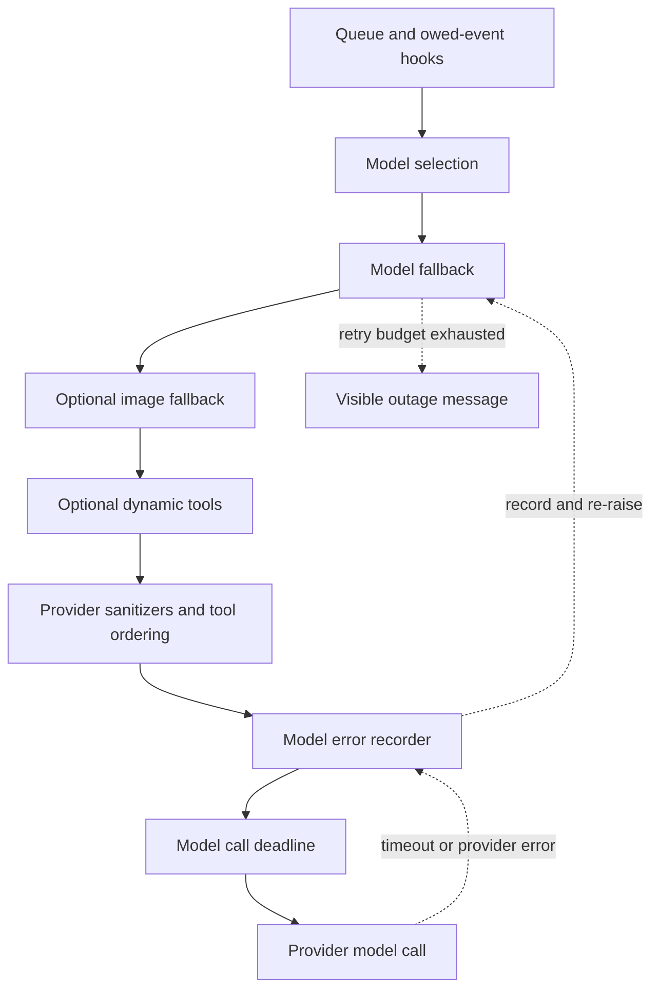

# Agent Middleware and Failure Boundaries

`build_agent` and `get_reviewer_agent` give ordered middleware lists to `create_deep_agent`. Earlier entries are outer wrappers around later entries for a matching hook, so request rewriting and exception handling proceed inward and responses/errors return outward. The lists are graph-specific: the coding-agent factory, reviewer factory, and their separately compiled subagents do **not** share one universal stack. See [Agent Graph](agent-graph.md), [Models, Profiles, and Instructions](../concepts/models-profiles-instructions.md), [Tools](../concepts/tools.md), [Follow-up Messages](../workflows/follow-up-messages.md), and [PR Creation](../workflows/pr-creation.md).

## Coding-agent assembly

The coding graph passes this outer-to-inner list to `create_deep_agent`:

1. `FilesystemMiddleware` and `ConversationOffloadingMiddleware`
2. `PrepareAgentRunMiddleware` and `TranscriptMiddleware`
3. optional client-tools, incident, and workspace-skills middleware
4. `ValidateImageReadsMiddleware`, `ModelCallLimitMiddleware`, `ToolErrorMiddleware`, `ExcludeToolsMiddleware`, and `SubdirAgentsReadMiddleware`
5. `ToolRetryMiddleware` for `task`; `PullRequestCreationGuardMiddleware` except on local runs; and `WorkflowPushGuardMiddleware`
6. `refresh_github_proxy_before_model`; except in stop-summary mode, `check_message_queue_before_model` and `deliver_event_matches_before_model`
7. `RequireUserReplyMiddleware` and, where configured, `RequireCliResultMiddleware`; then the step-limit notifier and run-usage recorder
8. `ModelSelectionMiddleware`, `ModelFallbackMiddleware`, and, when needed, `ImageModelFallbackMiddleware` and `DynamicToolMiddleware`
9. provider message sanitizers, `StableToolResultOrderMiddleware`, `ModelErrorMiddleware`, and innermost `ModelCallTimeoutMiddleware`

Some entries are conditional on run configuration or available services. In particular, dynamic integration tools are absent when no integration groups are usable; image fallback is installed only when a possible selected model lacks image support; and stop-summary mode omits the queue and event-delivery hooks. Treat changes to this sequence as control-flow changes, not list cleanup.

```mermaid
flowchart TD
  Queue["Queue and owed-event hooks"] --> Select["Model selection"]
  Select --> Fallback["Model fallback"]
  Fallback --> Image["Optional image fallback"]
  Image --> Dynamic["Optional dynamic tools"]
  Dynamic --> Sanitize["Provider sanitizers and tool ordering"]
  Sanitize --> Record["Model error recorder"]
  Record --> Deadline["Model call deadline"]
  Deadline --> Provider["Provider model call"]
  Provider -. "timeout or provider error" .-> Record
  Record -. "record and re-raise" .-> Fallback
  Fallback -. "retry budget exhausted" .-> Outage["Visible outage message"]
```

This is the verified coding-agent model-call path after before-model hooks; optional boxes are not installed for every run, and it does not describe the reviewer or subagent graphs.

### Preparation, transcript, and context lifecycle

`BasePrepareRunMiddleware` is the checkpointed preparation base used by the agent and reviewer specializations. It fingerprints the middleware class, latest message, and preparation configuration. A checkpointed matching `run_prepared_for` latch skips completed setup when an invocation resumes; a later message/configuration prepares fresh prompt, token, and context state. A failure before that checkpoint can execute `_prepare` again, so specializations must be idempotent. Its model wrapper prepends the prepared `rendered_system_prompt` to the request system message.

`TranscriptMiddleware` is an observability boundary, not a correctness dependency. It keeps per-run state in a registry keyed by thread and run because graph nodes do not share a `ContextVar`; it queues transcript events to one background writer per run and logs/swallows transcript failures so database trouble cannot fail the agent. `ConversationOffloadingMiddleware` uses a hidden tagged model to summarize/offload old conversation context and emits status events; manual offload jumps to the end after performing that work.

The preparation middleware resolves the model-related run state; then `ModelSelectionMiddleware` selects a requested model, persisted route, fixed fast route, or an automatic route based on the latest human task, and replaces `request.model` for the call. The selected model is subsequently eligible for fallback registration. If a text-only selected model sees image blocks, the optional image-fallback middleware substitutes its configured vision model.

### Tools, follow-ups, and user-visible completion

`DynamicToolMiddleware` exposes only a `load_integration_tools` catalog initially. It validates requested names, lazily builds their integration group behind a per-group lock, and records loaded names in graph state. A loaded integration tool is offered on the next model turn; calling one before it is loaded returns an error `ToolMessage`. For supported Anthropic and OpenAI Responses models, definitions are inserted at the corresponding load-result position to preserve prompt-cache locality; other requests receive them through the normal tool list.

The queue hook is a before-model delivery point for follow-up messages. It snapshots `("queue", thread_id) / "pending_messages"`, turns entries into structured human/system input, and consumes only the snapshot after message building succeeds. This preserves messages appended while images or identities are being resolved rather than losing them; FIFO order comes from the stored list. It also consumes a pending autofix event. The adjacent event hook appends database-backed owed event matches oldest first. Both are best effort and leave the model call runnable if their backing store/database is unavailable.

The reply and CLI-result guards prevent a nominally successful run from silently failing its caller. The reply guard tracks the current Slack/web surface, adds at most two model nudges if a Slack turn lacks a successful final reply-tool result, then posts the last assistant text on the model's behalf. The optional CLI guard similarly nudges up to two times for its result tool but then ends and lets the CLI report the missing result. Client tools take a different path: they return a placeholder tool result and end the run before another model call; the next run replaces that placeholder with the client result.

## Guards and tool-failure boundary

The outer tool layers shape what can execute. `ValidateImageReadsMiddleware` checks the magic bytes of `read_file` image blocks and converts an extension/content mismatch to an error result, avoiding a checkpointed invalid image that providers would reject repeatedly. `ExcludeToolsMiddleware` and subdirectory instructions adjust the tool/prompt surface, while `ToolRetryMiddleware` retries delegated `task` calls on transient provider/transport failures. It returns structured failure data only for prompt/context errors that a parent model can address; other exhausted failures propagate.

The PR guard is omitted for local runs and blocks shell-mediated pull-request creation outside the dedicated `open_pull_request` tool. `WorkflowPushGuardMiddleware` intercepts `execute` or `background_execute` git pushes that change `.github/workflows`: it records a fingerprinted pending approval and may notify the active Slack thread. Only an approval for that exact change permits a rewritten safe command; otherwise the tool receives a blocked result and approval URL.

`ToolErrorMiddleware` is the terminal tool exception classifier. Ordinary unhandled exceptions become JSON `ToolMessage(status="error")` payloads so the model can recover. A retryable sandbox rejection—where the SDK says the command did not start—becomes a `sandbox_transient` tool result. In contrast, an unreachable sandbox (`SandboxConnectionError` other than server reload, or a sandbox `ResourceNotFoundError`) triggers best-effort notification and is re-raised, ending the run rather than repeatedly failing tools and notifying the user. Cancellation is deliberately re-raised unchanged.

## Model retry and terminal behavior

`ModelCallTimeoutMiddleware` is innermost, applying `asyncio.wait_for` to the provider operation. It uses a positive `OPEN_SWE_MODEL_CALL_TIMEOUT_SECONDS` value or a 900-second default and raises `ModelCallTimeoutError`, a `TimeoutError`, when the deadline expires. `ModelErrorMiddleware` records the original exception type and classification code in thread metadata when context is available, logs it, and re-raises it unchanged.

The coding graph always installs `ModelFallbackMiddleware`, although it passes through if no fallback is registered for the request model. For a registered fallback it alternates primary and fallback across six default attempts, using the jittered schedule `0, 5, 15, 30, 45` seconds. It retries connection/timeout failures and selected transient statuses including 408, 409, 425, 429, 5xx, and 529. A provider model-access error becomes an actionable `AIMessage` immediately. When transient attempts are exhausted, the default is a terminal outage `AIMessage` asking the user to retrigger; callers can instead set `surface_outage_message=False` to re-raise the final exception.

This arrangement means a coding-agent timeout is classified before the fallback layer decides to retry it. Moving the deadline or recorder outside that boundary changes whether a stalled provider call is visible and recoverable.

## Reviewer path and subagent boundaries

The reviewer is intentionally not the coding-agent list. Its factory installs `PrepareReviewerRunMiddleware`, `ModelCallLimitMiddleware`, `ToolErrorMiddleware`, GitHub-proxy refresh, queue delivery, the three message sanitizers, orphaned-tool-call repair, stable result ordering, `ModelRetryMiddleware(retry_on=(TimeoutError,))`, `ModelErrorMiddleware`, `ModelCallTimeoutMiddleware`, and `settle_review_check_on_exit`.

It has no coding-agent model selection/fallback, dynamic tools, transcript, conversation offloading, task retry, PR/workflow guards, reply/CLI guard, or run-usage middleware. `RepairOrphanedToolCallsMiddleware` makes a resumed review provider-valid by inserting synthetic failed tool results where an AI tool call has no corresponding result. The reviewer retries timeouts through `ModelRetryMiddleware`, while its deadline remains innermost.

`settle_review_check_on_exit` is an after-agent completion guarantee. If an unpublished tracked GitHub review check remains, it closes it as neutral so a reviewer infrastructure failure is not reported as a PR code failure. If `publish_review` had already stored a real pending conclusion but its completion PATCH failed, it retries that conclusion instead. Separately compiled subagent graphs need their own middleware: focused tests assert both coding and reviewer subagent specs include `ModelCallTimeoutMiddleware`.

## Focused verification and safe changes

Extend the focused tests closest to the modified boundary: queue tests verify a follow-up appended during message construction remains queued; dynamic-tool tests cover lazy load state and provider-specific tool insertion; fallback and timeout tests cover alternating retries, exhaustion, and cancellation; preparation tests cover latch/fork behavior; and transcript tests verify ordered turn/model/tool events. For a new middleware, decide explicitly whether it belongs in the coding graph, reviewer graph, one or both subagent specs, and which earlier/later wrapper must observe its mutations or exceptions. Preserve best-effort boundaries around transcript, queue/event delivery, notification, and usage bookkeeping so observability or enrichment failures do not replace the user-facing run result.
