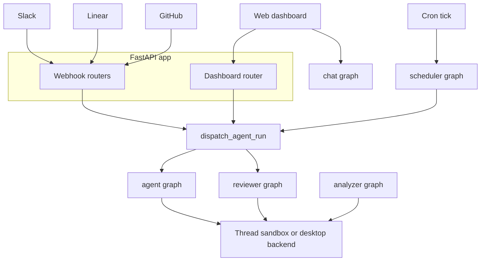

# Runtime and Product Architecture

Open SWE is a LangGraph deployment with a custom FastAPI application. The HTTP layer accepts browser and integration traffic, while durable LangGraph runs execute coding or review work against thread-scoped state and—except for PR chat—a backend. Five registered graph entrypoints separate the primary agent, reviewer, review-style analyzer, read-only PR chat, and time-triggered work.

## Runtime map

`langgraph.json` is the cloud deployment manifest. It registers thin `agent/graphs/` re-export modules as stable dotted entrypoints, mounts `agent.webapp:app`, configures checkpointer retention, loads `.env`, and builds the dashboard into the deployment image.

| Graph | Registered entrypoint | Responsibility |
|---|---|---|
| `agent` | `agent.graphs.agent:traced_agent` | Per-run coding-agent factory: backend, models, tools, skills, and middleware. |
| `reviewer` | `agent.graphs.reviewer:traced_reviewer_agent` | PR review and findings publication workflow. |
| `analyzer` | `agent.graphs.analyzer:traced_analyzer` | Repository-specific review-style learning. |
| `chat` | `agent.graphs.chat:traced_chat_agent` | Read-only discussion of one PR, without a sandbox. |
| `scheduler` | `agent.graphs.scheduler:get_scheduler` | A cron-tick dispatcher for maintenance and scheduled work. |

This shows the principal paths. `dispatch_agent_run` is the shared creation boundary for `agent` and `reviewer` runs; chat, analysis, and scheduler invocations use their own graph entrypoints.

## Graph and execution boundaries

`agent.server:get_agent` produces a fresh deep-agent graph for an executable thread. It uses the thread ID to acquire a cached or reconnected backend (or a desktop `LocalShellBackend`), starts it, resolves thread/team/profile model settings, persists normalized thread settings when needed, and assembles a composite backend, tools, skills, subagents, and middleware. If no thread ID is supplied or the graph is being loaded rather than executed, it returns a deliberately empty deep agent without provisioning a backend. This is important for graph discovery and other non-execution loads. See [Agent Graph & get_agent Factory](./agent-graph.md) and [Middleware Stack](./middleware-stack.md) for its detailed composition.

The reviewer follows the sandbox lifecycle but deliberately has a review-only toolset: `add_finding`, `update_finding`, `list_findings`, and `publish_review`; it does not receive commit, push, or PR-opening tools. Its preparation computes an in-diff line set so finding validation occurs when a finding is created, rather than failing only during GitHub publication. The analyzer uses the reviewer-style sandbox and authenticated `gh` access to mine historical human review feedback and finding outcomes, then saves a per-repository prompt through `save_review_style_prompt`. See [Reviewer & Review-Style Analyzer Graphs](./reviewer-and-analyzer.md).

The chat graph is intentionally sandbox-less and read-only. The dashboard review-chat proxy seeds the PR diff, findings, and overview as virtual `/pr/` files in the graph's `files` state channel. Filesystem tools can read that context, while `execute`, writes, edits, and deletion are excluded; GitHub-backed tools use a repository-scoped GitHub App token rather than a user credential.

The scheduler is a compiled, single-node `StateGraph`. Its `task` selects stale-run reconciliation, watch evaluation, background-task monitoring, session-cost or agent-cost refresh, or `launch_scheduled_agent_run`. Missing a watch key, thread ID, or schedule ID yields a structured status instead of launching ambiguous work. Scheduled agent runs ultimately use durable dispatch.

## HTTP composition and ingress

`agent/webapp.py` is a compatibility re-export of the application assembled by `agent/api/app.py:create_app`. At import time the API pins one event loop before queue workers are built. The app factory configures credentialed CORS from `DASHBOARD_ALLOWED_ORIGINS` and rejects `*`, then mounts dashboard, plan, workflow-approval, Linear, Slack, GitHub, and health routers plus the bundled dashboard UI. Its lifespan repeats event-loop pinning, validates sandbox and local-development LLM configuration at startup, and closes cached models on shutdown.

The dashboard router is rooted at `/dashboard/api` and applies a same-origin dependency to mutations. It is the browser-facing boundary for OAuth, profiles, team defaults, administration, repository and review-style configuration, and thread APIs. Importing `agent.dashboard` does not eagerly load this large surface: a PEP 562 `__getattr__` imports and caches `routes.router` only when the web application mounts it.

Slack, Linear, and GitHub webhook routes validate and normalize external events before scheduling their service work. They derive or resolve stable thread identities—for example, Linear uses the issue ID and reviewer runs use repository and PR coordinates—so later activity can recover the corresponding thread state rather than starting an unrelated session. GitHub rejects invalid webhook signatures; Slack rejects conflicting mapping rather than guessing an agent thread.

## Durable dispatch and state ownership

`dispatch_agent_run` is the common run-creation contract used by Slack, Linear, GitHub, dashboard, and scheduled agent/reviewer triggers. `assistant_id` selects `agent` or `reviewer`; `source` determines input identity and is retained for metadata/logging, not graph selection. The dispatcher also rejects ambiguous combinations of a prebuilt input with content or identity arguments.

The durable defaults are intentional: `multitask_strategy="interrupt"` interrupts an active run so the follow-up resumes with prior history; `durability="sync"` checkpoints before steps; streams are resumable and include subgraphs; and a private event-streaming v2 configurable marker and compatible stream modes make externally initiated runs observable in the dashboard. Background follow-ups may explicitly choose another multitask strategy such as `enqueue`.

Completion notification is best effort. The dispatcher attaches a webhook only when `RUN_COMPLETE_WEBHOOK_SECRET` is configured and `COMPLETION_WEBHOOK_URL` is absolute and non-loopback. Otherwise it logs the condition and creates the run without a webhook, avoiding a configuration error that would poison all run creation.

A graph factory is ephemeral, but thread execution context is durable: LangGraph checkpointing retains graph state, while LangGraph thread metadata holds the sandbox ID and related thread settings. The sandbox cache is in process and keyed by thread ID; another worker reconnects using the persisted ID. A deleted sandbox is replaced, but an existing unreachable coding sandbox raises by default because silent replacement can discard uncommitted work. Reviewer callers can allow replacement because their checkout is re-derived. The sandbox is published to the cache only after initialization and metadata binding succeed. See [Sandbox Lifecycle](./sandbox-lifecycle.md) and [Invocation](../workflows/invocation.md).

## Cloud and desktop product surfaces

The cloud manifest currently pins Python 3.14 and LangGraph API version 0.13.3. Its checkpointer TTL uses `delete`, sweeps every 60 minutes, and defaults to 43,200 minutes. The Dockerfile instructions attempt to build and install the dashboard static assets but allow a backend-only deployment if that build fails.

`langgraph.desktop.json` intentionally registers only the main agent graph, uses `agent.local_auth:auth` with Studio authentication disabled, and disables the bundled UI. A desktop run is identified by `configurable.source == "desktop"`. Its requested `local_project_path` must resolve to an existing directory that is either in `OPEN_SWE_LOCAL_PROJECTS_FILE` or beneath `OPEN_SWE_LOCAL_WORKTREES_DIR`; otherwise it is rejected. The local backend inherits only a small shell environment allowlist. Desktop scratch routes put large tool results and conversation history outside the project so they are not swept into `git add -A`.

The `ui/` application is a TanStack Router React client with routes for agent sessions and threads, local sessions, plans, automations, skills, reviews and styles, administration, integrations, usage, settings, environments, instructions, and sandbox views. The `/agents` layout requires a session except for enabled desktop-local routes and selects `cloud` or `local` streaming transport from the active route. Router `basepath` follows Vite's build base, allowing the bundle to run below a configured mount prefix.

## Operations and safe changes

- Add a deployable graph by exporting a stable factory through `agent/graphs/` and registering it in the appropriate manifest. Do not assume it becomes eligible for `dispatch_agent_run`; that contract selects only `agent` and `reviewer`.
- Add browser APIs through `create_app`, preserving session and mutation-origin protections rather than bypassing the dashboard boundary.
- Treat a coding sandbox that is unreachable as a recovery decision, not a cache miss. Replacing it changes the thread working tree.
- When changing dispatch defaults or stream fields, test durable run creation and cross-surface event attachment: dashboard observability relies on replayable v2-compatible streams for runs created outside the browser.
- When changing desktop path handling, retain real-path validation, the allowlist/worktree boundary, and artifact routing; each prevents a distinct local safety or repository-hygiene failure.

Related pages: [Agent Graph & get_agent Factory](./agent-graph.md), [Reviewer & Review-Style Analyzer Graphs](./reviewer-and-analyzer.md), [Sandbox Lifecycle](./sandbox-lifecycle.md), [Dashboard UI](../integrations/dashboard-ui.md), and [Invocation](../workflows/invocation.md).
