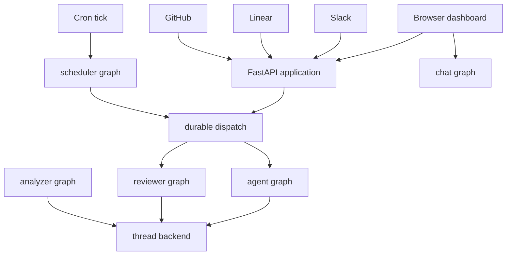
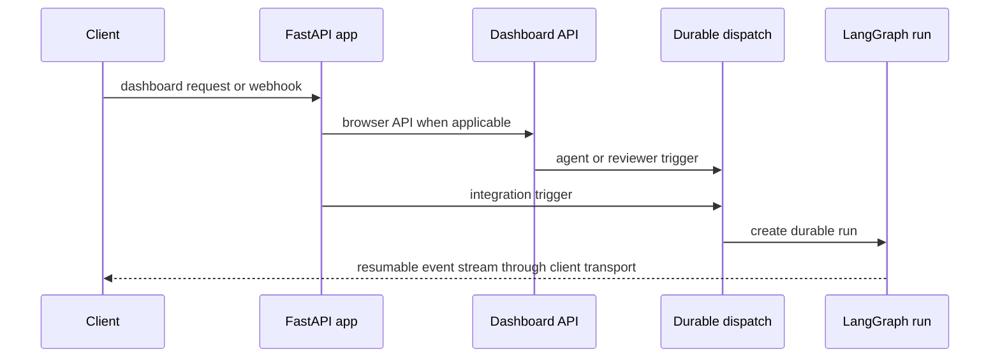

# Runtime Architecture and Public Surfaces

Open SWE is a LangGraph deployment whose custom FastAPI app is the public HTTP composition point. Browser, webhook, and scheduled work ultimately create durable LangGraph runs; the graph factory creates the thread-specific execution environment when a run actually executes. The registered graphs deliberately separate code changes, PR review, review-style analysis, PR discussion, and cron work.

## Hosted runtime and graph entrypoints

`langgraph.json` is the cloud manifest. It uses Python 3.14 and API version 0.13.3, loads `.env`, mounts `agent.webapp:app`, and exposes five stable entries via the thin `agent/graphs/` re-export modules:

| Graph ID | Entry point | Runtime role |
|---|---|---|
| `agent` | `agent.graphs.agent:traced_agent` | Coding-agent factory for an executable thread. |
| `reviewer` | `agent.graphs.reviewer:traced_reviewer_agent` | Review and finding-publication agent. |
| `analyzer` | `agent.graphs.analyzer:traced_analyzer` | Learns repository-specific review style. |
| `chat` | `agent.graphs.chat:traced_chat_agent` | Read-only, PR-context chat agent. |
| `scheduler` | `agent.graphs.scheduler:get_scheduler` | Cron-tick dispatcher. |

This is the principal hosted request topology. Durable dispatch is the shared creation boundary for agent and reviewer work; chat, analysis, and scheduler calls use their own registered graphs.

`get_agent` returns a fresh deep-agent graph for each executable run. It reads the thread configuration, resolves the sender's GitHub identity and thread settings, gets or reconnects the backend, starts it, then assembles models, tools, skills, subagents, and middleware. Discovery or non-execution loads—and calls without a thread ID—return an empty, no-sandbox agent instead, so merely loading a graph cannot provision infrastructure. See [Agent Graph](./agent-graph.md) for its detailed composition.

The reviewer shares the sandbox lifecycle but gets only finding tools (`add_finding`, `update_finding`, `list_findings`, and `publish_review`), not commit, push, or PR-opening tools. The analyzer uses the corresponding authenticated sandbox pattern to inspect historical PR reviews and finding outcomes, then persists a repository review-style prompt. In contrast, the `chat` graph has no sandbox: its dashboard proxy supplies PR information as virtual `/pr/` files in the graph state, retaining read access while excluding execution and file mutation. See [Reviewer and Analyzer](./reviewer-and-analyzer.md).

The scheduler is a one-node `StateGraph`. A tick selects reconciliation, watch evaluation, background-task monitoring, environment refresh, session or agent cost refresh, thread-feedback prompting, or a scheduled agent launch. Where a task requires an identifier, such as a watch key, thread ID, or schedule ID, missing input returns a status rather than launching uncertain work.

## HTTP application and dashboard boundary

`agent.webapp` is intentionally only a compatibility export of the app built in `agent.api.app`. `create_app()` installs tracing, dashboard, plan, workflow-approval, Linear, Slack, health, and GitHub routers, then mounts the dashboard last. Credentialed CORS is enabled only for configured `DASHBOARD_ALLOWED_ORIGINS`; `*` is rejected because credentials are allowed.

This shows the ingress-to-run path; webhook routers use the same dispatch contract after validating and normalizing their external input.

The dashboard aggregate router is prefixed `/dashboard/api` and applies the same-origin mutation dependency. It owns browser-facing authentication, preferences and profiles, team settings, repositories, reviews and review styles, schedules, environments, skills, integrations, analytics, incidents, and thread APIs. Its package lazily imports the aggregate router through `__getattr__`, avoiding a transitive import of every API and job module for code that only needs another dashboard submodule.

The dashboard is normally served from the backend origin. `mount_dashboard_ui` either serves a static build or reverse-proxies a Vite development server selected by `DASHBOARD_DEV_SERVER_URL`. Its catch-all explicitly declines LangGraph and API prefixes, serves immutable hashed assets, and returns the shell only for HTML navigation requests. The route must remain last: otherwise it can shadow routes that follow it. A deployment with no build and no dev server still serves the backend.

## Lifecycle, persistence, and failure behavior

At module import, and again during lifespan startup, the API pins one event loop before queue workers are created. Startup validates the GitHub login allowlist, sandbox provider configuration, and local-development LLM settings. It then attempts analytics migration, reporting activation, and worker startup; analytics failures are logged rather than preventing the service from starting. Shutdown stops that worker, closes analytics connections, and closes cached models.

Analytics is an optional PostgreSQL-backed reporting boundary. When `POSTGRES_URI` is unset it is disabled. When configured, migration loads the persisted deployment workspace ID and reporting activation records a one-time cutover timestamp. Readiness reports configuration, outbox pending/dead-letter state, and whether event projections are only complete from the capture start; it returns a non-ready result rather than propagating readiness-query failures.

`dispatch_agent_run` is the common agent/reviewer trigger contract used by the dashboard, integrations, and scheduled launches. `assistant_id` selects the graph while `source` is used to construct identity context and for metadata/logging. It rejects a prebuilt input combined with independent content or identity fields. The created run defaults to synchronous durability, interruption of an active run, subgraph streaming, resumable streams, and the event-stream compatibility marker; this lets the dashboard attach to runs initiated outside the browser.

Completion callbacks are optional. A callback is attached only when `RUN_COMPLETE_WEBHOOK_SECRET` is present and `COMPLETION_WEBHOOK_URL` is an absolute non-loopback HTTP(S) URL; otherwise dispatch creates the run without a callback rather than allowing bad callback configuration to fail every run.

LangGraph checkpoints persist graph state. Separately, thread metadata persists a sandbox ID and settings, while the process-local backend cache is keyed by thread ID. A later worker reconnects from the persisted ID. A missing/deleted sandbox may be recreated, but a reachable-recorded sandbox that cannot be connected raises by default: replacing it silently would discard uncommitted coding work. Review callers may opt into replacement because their checkout is re-derived. See [Invocation](../workflows/invocation.md) and [Deployment](../operations/deployment.md).

## Dashboard and desktop surfaces

The React `ui/` client uses TanStack Router. Its agent layout requires a normal session except for enabled desktop-local routes, tracks the active cloud thread or local session, and selects the `cloud` or `local` streaming transport accordingly. The wider application exposes agent sessions, plans, automations, skills, reviews, administration, integrations, usage, settings, environments, instructions, and sandbox-related views. See [Dashboard UI](../integrations/dashboard-ui.md).

Desktop intentionally starts a smaller local LangGraph service. `BackendSupervisor` reserves a loopback port, generates a per-start bearer token, requires a project allowlist and worktree directory, launches `langgraph dev` with ten jobs per worker, and polls its authenticated root endpoint for up to 60 seconds. Requests at `/local-graph` are proxied to that process with cookies removed and the bearer token injected. Startup failure includes captured backend logs; shutdown sends `SIGTERM` and escalates to `SIGKILL` after the stop timeout.

The desktop manifest exposes only `agent`, uses `agent.local_auth:auth`, disables Studio auth and the bundled UI. Desktop graph runs use a `LocalShellBackend`, but only after `local_project_path` resolves to an existing allowlisted project or a directory under the desktop worktree root. Its shell receives only a limited environment. Agent scratch routes for large results and conversation history point outside the project, preventing those artifacts from becoming accidental `git add -A` input.

## Safe extension and focused verification

- Register a new deployable graph through `agent/graphs/` and the relevant manifest; registration alone does not make it selectable by `dispatch_agent_run`, which is an agent/reviewer contract.
- Add HTTP routes before the dashboard catch-all and preserve the dashboard router's same-origin mutation protection.
- Treat analytics startup as optional but test configured migrations and readiness separately from a backend-only start.
- Preserve durable dispatch defaults and test both run creation and late dashboard stream attachment when changing event-stream fields.
- Exercise the desktop supervisor's readiness, failure, proxy, and termination paths in `desktop/test/backend-supervisor.test.cjs`; preserve real-path project authorization and out-of-project artifact routing when changing local execution.

Related: [Agent Graph](./agent-graph.md), [Reviewer and Analyzer](./reviewer-and-analyzer.md), [Dashboard UI](../integrations/dashboard-ui.md), [Deployment](../operations/deployment.md), and [Invocation](../workflows/invocation.md).
