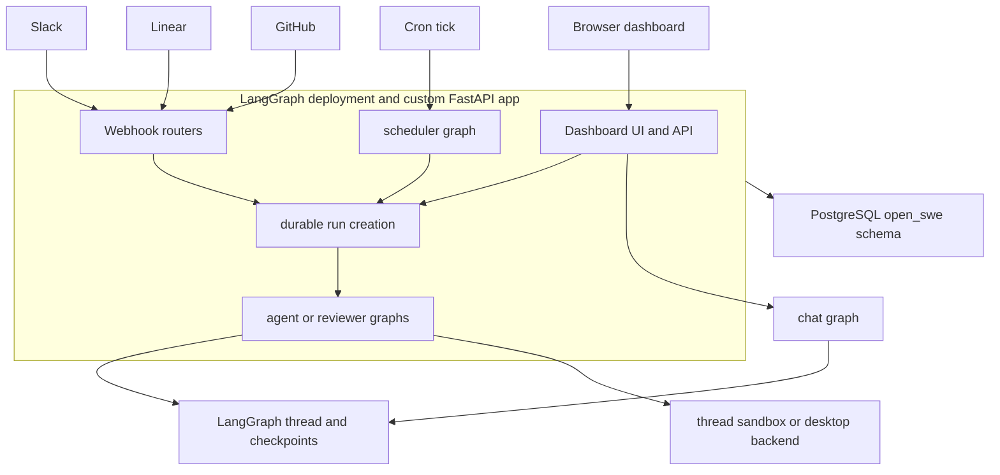

# Runtime Architecture and Public Surfaces

Open SWE is one LangGraph deployment with a custom FastAPI application. LangGraph owns graph execution, threads, checkpoints, and the platform API; the custom application supplies product APIs, authenticated integration ingress, persistence initialization, analytics/transcript workers, and the browser UI. The runtime therefore has several entry surfaces but a deliberately small set of durable run and thread boundaries.

## Deployment registry and graph roles

`langgraph.json` is the cloud manifest. It runs Python 3.14, uses an `api_version` compatible with `>=0.15.0rc1`, loads `.env`, mounts `agent.webapp:app`, and exposes six stable graph entrypoints through thin `agent/graphs/` re-export modules.

| Graph | Entrypoint | Runtime role |
|---|---|---|
| `agent` | `agent.graphs.agent:traced_agent` | Per-thread coding-agent factory with a sandbox or desktop backend. |
| `reviewer` | `agent.graphs.reviewer:traced_reviewer_agent` | Pull-request review and finding publication. |
| `analyzer` | `agent.graphs.analyzer:traced_analyzer` | Learns a repository-specific review style from historical outcomes. |
| `review-scout` | `agent.graphs.review_scout:traced_review_scout` | Builds a PR walkthrough on its own deterministic PR thread before review. |
| `chat` | `agent.graphs.chat:traced_chat_agent` | Read-only, sandbox-less discussion of a PR. |
| `scheduler` | `agent.graphs.scheduler:get_scheduler` | A single-node cron-tick dispatcher. |

`get_agent` is a factory, not a long-lived singleton: it creates a fresh deep-agent graph for a run. A non-executing graph load or missing thread ID receives an empty no-sandbox agent so graph discovery cannot provision a backend. For executable coding threads, the factory resolves the thread's backend and configuration, then composes models, tools, skills, subagents, and middleware. Detailed graph composition belongs in [Agent Graph & get_agent Factory](./agent-graph.md).

The reviewer uses the same reconnect-or-create sandbox pattern but is intentionally constrained to review tools such as `add_finding`, `update_finding`, `list_findings`, and `publish_review`, rather than commit, push, or PR-opening tools. The analyzer similarly uses review context to save a per-repository style prompt. The review scout is separate from both: it derives a PR-specific thread ID, prevents duplicate work on the same head, runs with durable defaults, and stores its walkthrough when complete; the reviewer waits up to its bounded timeout, then can continue without a walkthrough. See [Reviewer & Review-Style Analyzer Graphs](./reviewer-and-analyzer.md).

The chat graph has no sandbox. The dashboard review-chat proxy places the diff, findings, and overview in virtual `/pr/` files in the `files` state channel; filesystem access is read-only and GitHub tools obtain a repository-scoped App token rather than a user credential.

*Principal request paths: browser, webhook, and scheduled work converge on durable agent or reviewer runs, while graph state and product records have distinct persistence owners.*

## FastAPI composition and lifecycle

`agent/webapp.py` is a compatibility shim that re-exports the `app` assembled by `agent/api/app.py`. The factory pins a single event loop before queue workers are constructed, rejects `DASHBOARD_ALLOWED_ORIGINS=*` when credentialed CORS is enabled, adds tracing resource names, and mounts dashboard, plan, workflow-approval, Linear, Slack, GitHub, health, and sandbox-tool routers before mounting the dashboard UI.

The lifespan hook pins the loop again; validates GitHub-login policy, sandbox configuration, and local-development LLM configuration; requires PostgreSQL and migrates it before serving. It then makes best-effort migrations of legacy workspace and user Store records, synchronizes configured administrators, and starts analytics reporting and the transcript listener. A failed workspace import is deliberately not silent operationally: repository routing fails closed and GitHub receives a retryable 503 while ownership is unreadable. Analytics and transcript startup are non-fatal; transcript consumers fall back to in-process notifications. Shutdown stops the listener and analytics worker, disposes the database engine, and closes cached models.

The dashboard router lives at `/dashboard/api` and applies the same-origin mutation dependency to all included APIs. It aggregates browser product surfaces for authentication, profiles and user preferences, workspace/repository settings, reviews, skills, schedules, threads and transcripts, integrations such as Slack, Notion, and MCP, incidents, users, and analytics. `agent.dashboard` lazily imports this router, avoiding the complete FastAPI/job dependency surface for code that merely imports a dashboard submodule.

When static assets are available, the UI mount serves the SPA shell for browser navigation and leaves reserved platform/API paths to LangGraph or explicit routers. Asset files receive immutable caching, and no build directory means no UI route rather than a misleading shell. The dashboard build is best effort in the deployment image, so backend-only deployment remains possible. The React client uses TanStack Router, an SSR query integration, and Vite's `BASE_URL` as its router base path, allowing a configured HTTP mount prefix.

## Durable runs, external ingress, and scheduling

`dispatch_agent_run` is the shared trigger contract for agent/reviewer work from Slack, Linear, GitHub, browser/dashboard paths, and automations. `assistant_id` selects the graph; `source` builds sender/channel context and provides logging/metadata rather than choosing a graph. It rejects attempts to combine a prebuilt input with separate content or identity inputs.

The underlying `create_durable_run` defaults to `multitask_strategy="interrupt"`, synchronous durability, resumable streams, all dashboard-compatible stream modes, subgraph streaming, and the event-streaming compatibility marker. Thus a follow-up can interrupt/resume an active thread from checkpoints, and a dashboard can attach to runs started outside the browser with tool and subagent events. A completion webhook is attached only if `RUN_COMPLETE_WEBHOOK_SECRET` is set and `COMPLETION_WEBHOOK_URL` is absolute and non-loopback; bad completion configuration logs a warning and does not prevent run creation.

Webhook routers authenticate their providers before queuing service work. GitHub verifies its signature and checks workspace ownership; if ownership lookup fails it returns 503 so GitHub retries, while an unowned repository is ignored. Linear verifies its signature and considers only qualifying human comments. Slack resolves a stable agent thread from channel and Slack thread coordinates, rejects conflicting mappings rather than guessing, and claims event IDs to avoid duplicate delivery. These boundaries preserve continuity of external conversations without trusting unauthenticated traffic.

The scheduler compiles a one-node `StateGraph`. Its task switch handles stale-run reconciliation, baby-sit and expedited-review watch evaluation, background-task monitoring, workspace refresh, session/agent cost refresh, and thread-feedback prompts. Otherwise it launches a configured scheduled agent run. Required identifiers such as watch key, thread ID, or schedule ID produce explicit `missing_*` statuses instead of ambiguous execution.

## Persistence and execution context

Two persistence layers have different jobs. LangGraph checkpointing retains graph state, while thread metadata retains sandbox IDs and thread-specific settings. PostgreSQL is required in normal service operation for pull-request and repository records; `agent.database.postgres` normalizes accepted PostgreSQL URI forms, creates one async SQLAlchemy engine per URI with pool health checks, and scopes connections to the `open_swe` schema. Startup migration takes a PostgreSQL advisory transaction lock, creates the schema if needed, and upgrades Alembic revisions, preventing concurrent workers from racing schema initialization. Snapshot reads use repeatable-read, read-only transactions so a client reconciling a snapshot and event stream does not double-apply a changing view.

Sandbox connections are process-local, keyed by persisted sandbox ID, not by a factory result. A replacement worker reconnects from metadata. A deleted sandbox is recreated; an existing but unreachable coding sandbox raises by default because an empty replacement could lose uncommitted work. Callers such as reviewer and scout may allow replacement because they re-derive their checkout. See [Sandbox Lifecycle](./sandbox-lifecycle.md) and [Invocation](../workflows/invocation.md).

## Cloud and desktop surfaces

Cloud checkpointer retention uses deletion, a 60-minute sweep interval, and a 43,200-minute default TTL. The deployment Docker instructions build the dashboard for the configured mount prefix, stamp build information, and install it at `DASHBOARD_STATIC_DIR` if the optional build succeeds.

`langgraph.desktop.json` registers only `agent`, supplies a local checkpointer, disables Studio authentication through `agent.local_auth:auth`, and disables the bundled UI. A desktop source uses `LocalShellBackend` only after `local_project_path` resolves to an existing directory that is either explicitly allowlisted by `OPEN_SWE_LOCAL_PROJECTS_FILE` or lies under `OPEN_SWE_LOCAL_WORKTREES_DIR`. Its shell receives only a narrow environment allowlist. Desktop artifact routes place large tool output and evicted conversation history outside the project, preventing them from becoming accidental `git add -A` changes.

## Change and test focus

- Register a new deployable graph in its manifest and stable `agent/graphs/` entrypoint, but do not assume it is selectable through `dispatch_agent_run`; that contract is for agent/reviewer run triggers.
- Preserve the startup ordering: database configuration and migrations precede features that depend on product records. Treat workspace import failure as a routing availability issue, not as permission to process an unknown repository.
- Preserve webhook authentication, provider deduplication, and deterministic thread resolution when adding integrations.
- Do not turn unreachable coding sandboxes into cache misses; replacement changes the working tree semantics.
- When changing UI mounting, run `tests/dashboard/test_dashboard_ui.py`: it covers SPA-shell navigation, API/platform route precedence, static asset behavior, absent builds, and mount-prefix behavior. For scheduler changes, exercise every task branch and its `missing_*` guard.

Related pages: [Agent Graph & get_agent Factory](./agent-graph.md), [Reviewer & Review-Style Analyzer Graphs](./reviewer-and-analyzer.md), [Dashboard UI](../integrations/dashboard-ui.md), [Deployment](../operations/deployment.md), and [Invocation](../workflows/invocation.md).
