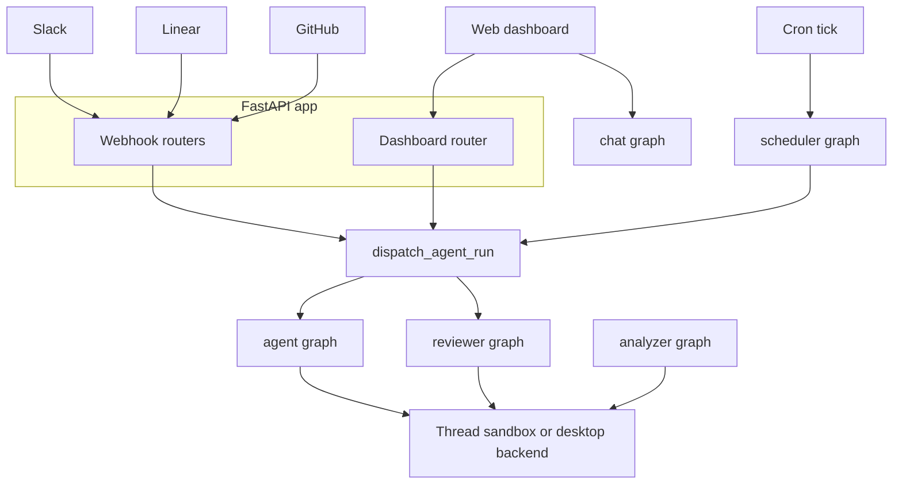

# System Architecture Overview

Open SWE is deployed as a LangGraph server with five registered graphs and a custom FastAPI application. The HTTP application accepts dashboard and integration traffic; durable run creation then invokes the coding or reviewer graph against thread-scoped state and, where applicable, a sandbox. The specialized analyzer, chat, and scheduler graphs are invoked through their own graph entrypoints.

## Runtime map

`langgraph.json` is the cloud deployment manifest. It registers thin `agent/graphs/` re-export modules as stable dotted entrypoints, mounts `agent.webapp:app`, and supplies the checkpointer and environment configuration.

| Graph | Registered entrypoint | Runtime responsibility |
|---|---|---|
| `agent` | `agent.graphs.agent:traced_agent` | Per-run coding agent factory; assembles tools, middleware, models, and a thread backend. |
| `reviewer` | `agent.graphs.reviewer:traced_reviewer_agent` | PR reviewer with a findings-and-publication workflow. |
| `analyzer` | `agent.graphs.analyzer:traced_analyzer` | Learns repository-specific guidance for the reviewer. |
| `chat` | `agent.graphs.chat:traced_chat_agent` | Sandbox-less, read-only PR discussion agent. |
| `scheduler` | `agent.graphs.scheduler:get_scheduler` | Receives scheduled ticks and fans them into maintenance work or scheduled runs. |

This diagram shows the principal invocation paths. `dispatch_agent_run` is for `agent` and `reviewer` runs; the scheduler graph, analyzer graph, and chat proxy have their own entrypoints rather than all being routed through that contract.

## Graph boundaries

The main `get_agent` factory creates a fresh deep agent for a run. For an executable thread it starts or reconnects the backend, resolves thread settings and model choices, and constructs the agent's tools and middleware. A missing `thread_id` or a graph load that is not marked for execution instead returns an empty, no-sandbox deep agent. This avoids provisioning resources during graph discovery and similar non-execution loads. The detailed composition and middleware ordering are documented in [Agent Graph & get_agent Factory](./agent-graph.md) and [Middleware Stack](./middleware-stack.md).

The reviewer also has a sandbox lifecycle, but its repository-facing toolset is constrained to review work: it manages findings and publishes the review rather than committing, pushing, or opening PRs. The analyzer uses the reviewer-style sandbox and authenticated `gh` pattern to mine historical human reviews and finding outcomes, then persists a per-repository review-style prompt through `save_review_style_prompt`. See [Reviewer & Review-Style Analyzer Graphs](./reviewer-and-analyzer.md) for their findings, recovery, and style-learning rules.

The chat graph deliberately has no shell or mutable filesystem. The dashboard review-chat proxy creates PR-scoped chat threads and seeds the diff, findings, and overview as virtual `/pr/` files in graph state. The chat agent can read that context and use read-only GitHub-backed tools; it cannot execute code, test, commit, or modify repository files.

The scheduler is a compiled, single-node `StateGraph`. Its `task` chooses reconciliation, watch evaluation, background-task monitoring, session-cost refresh, or `launch_scheduled_agent_run`; missing required identifiers return a structured status rather than launching an ambiguous job. Scheduled agent runs ultimately use the same durable dispatch mechanism as interactive agent runs.

## HTTP composition and ingress

`agent/webapp.py` is only a compatibility re-export of the application assembled by `agent/api/app.py:create_app`. That factory pins a single event loop before queue workers are built, configures credentialed CORS from `DASHBOARD_ALLOWED_ORIGINS`, and refuses a wildcard origin in that mode. It mounts dashboard, plan, workflow-approval, Linear, Slack, GitHub, and health routers. Its lifespan validates sandbox and local-development LLM configuration at startup and closes cached models at shutdown.

The dashboard router is rooted at `/dashboard/api` and applies the same-origin mutation guard. It owns the browser-facing OAuth, user/profile and team settings, administration, repository/review-style, and thread APIs. Importing `agent.dashboard` does not eagerly load that full route surface: its lazy `router` attribute imports `routes.py` only when the webapp mounts it.

Slack, Linear, and GitHub webhook routers normalize their external events into deterministic thread identities. Follow-up activity for the same external conversation, issue, or PR can therefore return to the same LangGraph thread and its durable context instead of creating an unrelated agent session.

## Durable dispatch and state ownership

`dispatch_agent_run` is the shared run-creation boundary for Slack, Linear, GitHub, dashboard, and scheduled **agent/reviewer** triggers. `assistant_id` selects `agent` or `reviewer`; `source` supplies input identity and metadata/logging rather than selecting behavior. It creates runs with interrupt-by-default multitasking, synchronous durability, resumable streaming, subgraph streaming, and the event-streaming v2 marker. A follow-up normally interrupts the active run and resumes from checkpoints with its history; callers such as background follow-ups may opt into another strategy.

Completion delivery is conditional: the dispatch layer attaches a completion webhook only when `RUN_COMPLETE_WEBHOOK_SECRET` is set and `COMPLETION_WEBHOOK_URL` is an absolute non-loopback URL. Invalid relative or loopback configuration disables the webhook with a warning rather than making every run creation fail.

The factory object is ephemeral, but the system is not stateless: LangGraph checkpoints preserve graph state, while thread metadata and the sandbox preserve thread-specific execution context. The in-process sandbox backend cache is keyed by `thread ID`; persisted sandbox metadata lets a new worker reconnect to the same sandbox. A deleted sandbox is recreated, but an existing unreachable sandbox normally raises instead of being silently replaced, protecting uncommitted coding-agent work. Reviewer callers may permit replacement because their checkout is re-derived for each review. See [Sandbox Lifecycle](./sandbox-lifecycle.md) for the lifecycle and recovery boundary, and [Invocation](../workflows/invocation.md) for trigger details.

## Deployment and client surfaces

The cloud manifest pins Python 3.12 and LangGraph API version 0.12.6. Its checkpointer TTL uses the `delete` strategy, sweeps every 60 minutes, and defaults to 43,200 minutes; `.env` supplies deployment environment variables.

`langgraph.desktop.json` is intentionally narrower: it registers only the main agent graph, uses `agent.local_auth:auth` with Studio auth disabled, and disables the bundled UI. A desktop run is recognized from `configurable.source == "desktop"` and uses `LocalShellBackend` rooted in a requested project only after that path passes the `OPEN_SWE_LOCAL_PROJECTS_FILE` allowlist. Desktop artifacts are routed outside the project directory so tool-result and history files are not accidentally included in a later `git add -A`.

The `ui/` application is a TanStack Router React client. Its generated route tree includes cloud and local agent sessions, agent threads, plans, schedules, skills, reviews and review styles, administration, integrations, usage, settings, environments, instructions, and sandbox views. The `/agents` layout requires a session except for enabled desktop-local routes, and creates the stream provider with `cloud` or `local` transport accordingly. Browser calls use the dashboard API prefix; the review chat client targets the PR-scoped `/dashboard/api/reviews/{owner}/{repo}/{number}/chat` proxy.

## Operations and change guide

- Add a deployable graph by exporting a stable factory through `agent/graphs/` and registering it in the appropriate manifest. Do not assume it will be eligible for `dispatch_agent_run`: that contract currently documents `agent` and `reviewer` selection.
- Add browser APIs by mounting an `APIRouter` from `create_app`; preserve the dashboard router's mutation-origin and session protections rather than bypassing its proxy layer.
- Treat an unreachable coding sandbox as a recovery decision, not a normal cache miss. Replacing it changes the thread's working tree and can discard uncommitted work.
- When changing dispatch defaults or stream protocol fields, exercise the dispatch tests and the cross-surface run-event test: dashboard observability depends on runs created outside the browser retaining resumable Protocol v2-compatible events.

Related pages: [Agent Graph & get_agent Factory](./agent-graph.md), [Middleware Stack](./middleware-stack.md), [Sandbox Lifecycle](./sandbox-lifecycle.md), [Dashboard UI](../integrations/dashboard-ui.md), [Quickstart](../quickstart.md), and [Invocation](../workflows/invocation.md).
