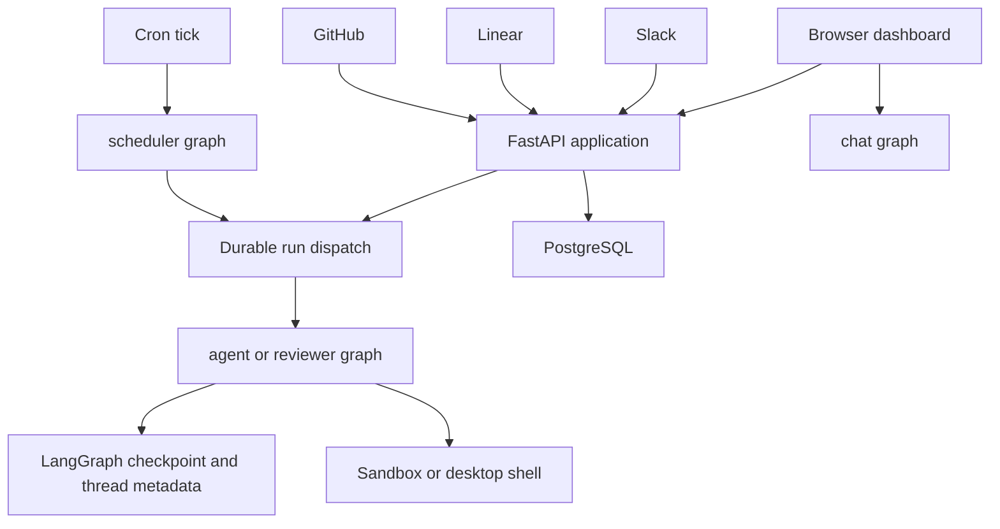

# Runtime Architecture and Service Composition

Open SWE runs as a LangGraph deployment with a custom FastAPI application. LangGraph supplies durable graph execution and checkpoints; FastAPI supplies the dashboard API, integration webhooks, health and completion endpoints, and optionally the static dashboard. PostgreSQL is the product-record system used for repositories and pull requests, while thread metadata and sandbox identity connect an execution to its durable working context.

## Deployment entrypoints

`langgraph.json` is the cloud manifest. It registers five stable graph factories through the thin `agent/graphs/` re-export modules and mounts `agent.webapp:app`. `agent/webapp.py` is deliberately only a compatibility import of the application constructed by `agent.api.app`.

| Graph | Entrypoint | Runtime role |
|---|---|---|
| `agent` | `agent.graphs.agent:traced_agent` | Creates the coding agent for an executable thread. |
| `reviewer` | `agent.graphs.reviewer:traced_reviewer_agent` | Runs repository preparation and review/finding work. |
| `analyzer` | `agent.graphs.analyzer:traced_analyzer` | Learns repository-specific review guidance. |
| `chat` | `agent.graphs.chat:traced_chat_agent` | Answers questions about one pull request without a sandbox. |
| `scheduler` | `agent.graphs.scheduler:get_scheduler` | Executes one cron-directed maintenance or scheduled-work task. |

This is the main ingress and execution topology. The dispatch path is specifically for `agent` and `reviewer`; chat and analysis are separate graph surfaces.

## Application composition and lifecycle

`create_app()` configures credentialed CORS from `DASHBOARD_ALLOWED_ORIGINS`, rejecting `*`, then mounts dashboard, plan, workflow-approval, Linear, Slack, health, and GitHub routers before attempting to mount dashboard static assets. The dashboard aggregate router is prefixed `/dashboard/api` and applies same-origin protection to mutations. It aggregates authentication, user and workspace settings, repository and pull-request review, MCP, schedules, skills, analytics, incidents, and thread routes. Its package-level lazy `router` attribute avoids importing this broad FastAPI surface when a dashboard submodule alone is needed.

The FastAPI lifespan is also an operational boundary. Startup pins the event loop, validates GitHub-login, sandbox, local-development LLM, and required PostgreSQL configuration; migrates the database; imports legacy workspace and user records from the LangGraph Store on a best-effort basis; syncs configured admins; and tries to start analytics reporting. A failed legacy import is logged but startup continues, while missing database configuration prevents startup. Shutdown stops the analytics worker, disposes the database engine, and closes cached models.

PostgreSQL access is centralized in `agent.database.postgres`: it normalizes PostgreSQL URLs to `asyncpg`, uses an engine with pool pre-ping, scopes connections to `open_swe`, and serializes migrations with a PostgreSQL advisory transaction lock. Its read-only context explicitly begins a read-only transaction and always rolls it back and invalidates its connection, preventing state from leaking through that path.

## Graph responsibilities and state boundaries

The coding factory `get_agent` returns a minimal tool-less agent when there is no thread ID or the graph is loaded outside execution. For an executable thread, it obtains a desktop shell or thread sandbox and starts it before resolving settings and constructing the full deep agent. This keeps graph discovery from allocating a backend. The more detailed agent factory contract is documented in [Agent Graph](./agent-graph.md).

The reviewer shares the sandbox pattern but intentionally receives review-only finding tools, not commit, push, or PR-opening capabilities. The analyzer uses a sandbox and authenticated GitHub access to mine historical review feedback and outcomes, then saves per-repository review-style guidance. In contrast, PR chat has no sandbox: the dashboard seeds diff, findings, and overview as `/pr/` virtual files; its filesystem and delegated tools remain read-only and GitHub tools receive a repository-scoped App token. See [Reviewer and Analyzer](./reviewer-and-analyzer.md).

The scheduler compiles a one-node `StateGraph`. Its task selector reconciles stale runs, evaluates watches or expedited approval, monitors background tasks, refreshes workspace or cost data, prompts for feedback, or launches a scheduled agent run. Missing identifiers return a structured status rather than creating ambiguous work.

## Durable dispatch and backend lifecycle

`dispatch_agent_run` is the shared durable creation contract for Slack, Linear, GitHub, dashboard, and scheduled agent/reviewer triggers. `assistant_id` chooses the graph and `source` supplies input identity plus metadata/logging. It rejects combining prebuilt input with content or source identities. The created run defaults to interruption of an active run, synchronous durability, resumable streams, subgraph streaming, and the event-stream compatibility marker/modes that let the dashboard attach to runs started elsewhere. Completion webhooks are optional: one is sent only when the secret is configured and the URL is absolute and non-loopback.

A graph factory is per-run, but state is not: checkpoints preserve graph state and thread metadata persists the sandbox ID. The in-process backend cache reconnects that ID after a worker recycle. A deleted sandbox may be recreated, but an existing unreachable coding sandbox raises instead of silently replacing uncommitted work; callers with re-derivable state, such as review preparation, can explicitly allow replacement. New sandbox metadata is bound before the backend is published to the cache.

## Cloud and desktop boundaries

The cloud manifest pins Python 3.14 and LangGraph API 0.13.3, loads `.env`, and deletes expired checkpoints on a 60-minute sweep with a default 43,200-minute TTL. Its dashboard build is best effort, allowing backend-only deployment if the static build fails.

The desktop manifest exposes only the main agent graph, disables bundled UI and Studio authentication, and uses local authentication plus a local checkpointer. Desktop requests use `source == "desktop"`; their project path must be a real existing directory on the project allowlist or inside the managed worktree directory. The local shell inherits only a small allowlisted environment. Artifact routes put large tool output and conversation-history scratch files outside the repository to avoid accidental `git add -A` inclusion.

The Electron-side `BackendSupervisor` starts `langgraph dev` on loopback with ten jobs per worker, a newly generated bearer token, project/worktree restrictions, and optional persistent artifacts/checkpoint paths. It probes the authenticated root endpoint until healthy or times out, retains bounded logs for startup failures, proxies `/local-graph` without browser cookies, and terminates the child gracefully before escalating to `SIGKILL`.

The React dashboard uses TanStack Router with a base path derived from Vite’s build base, SSR query integration, intent preloading, scroll restoration, and a common load-error component. Its `/agents` layout requires a session except for enabled desktop-local routes and selects `local` versus `cloud` streaming transport based on the active route. The generated tree includes agent sessions, local sessions, plans, automations, skills, reviews, administration, integrations, usage, settings, workspaces, and incident surfaces.

## Change and operations guidance

- Add a deployed graph by exporting a stable `agent/graphs/` entrypoint and registering it in the relevant manifest. Do not assume it participates in `dispatch_agent_run`.
- Preserve dashboard mutation-origin checks and CORS credential constraints when adding browser-facing APIs.
- Treat PostgreSQL migration locking and the startup database requirement as service availability concerns, not incidental initialization.
- Treat an unreachable coding sandbox as a recovery decision: replacing it changes the thread’s working tree.
- Changes to dispatch stream fields need cross-surface verification because the dashboard observes runs initiated by integrations.
- Desktop changes must preserve real-path authorization, token-authenticated loopback proxying, and out-of-repository artifact storage.

Related pages: [Agent Graph](./agent-graph.md), [Reviewer and Analyzer](./reviewer-and-analyzer.md), [Dashboard UI](../integrations/dashboard-ui.md), [Deployment](../operations/deployment.md), and [Invocation](../workflows/invocation.md).
