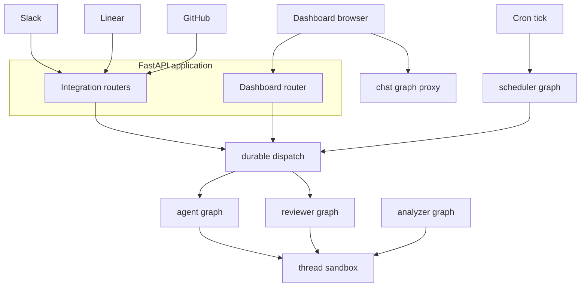

# Runtime Architecture and Entrypoints

Open SWE is a LangGraph deployment with five registered graph entrypoints and a custom FastAPI application. FastAPI is the ingress and browser-service boundary; durable runs enter the coding or reviewer graph through a common dispatcher. The analyzer, PR chat, and scheduler are deliberately separate graph surfaces because their state, capabilities, and invocation models differ.

## Runtime map

`langgraph.json` is the cloud manifest. Its thin `agent/graphs/` modules provide stable dotted exports while keeping graph implementation in the domain modules.

| Graph | Manifest entrypoint | Responsibility |
|---|---|---|
| `agent` | `agent.graphs.agent:traced_agent` | Coding agent factory for a thread-scoped workspace. |
| `reviewer` | `agent.graphs.reviewer:traced_reviewer_agent` | Pull-request review and findings publication. |
| `analyzer` | `agent.graphs.analyzer:traced_analyzer` | Repository-specific review-style analysis. |
| `chat` | `agent.graphs.chat:traced_chat_agent` | Read-only discussion of one pull request. |
| `scheduler` | `agent.graphs.scheduler:get_scheduler` | Cron-tick fan-out to maintenance or scheduled work. |

This is the main control-flow split: durable dispatch creates `agent` and `reviewer` runs, whereas the scheduler, analyzer, and chat surfaces have their own entrypoints and preparation paths.

## Graph factories and execution boundary

The main `get_agent` factory creates a fresh deep-agent graph for each execution load. It derives the GitHub identity, selects a desktop backend or gets/reconnects the thread sandbox, loads thread/team/profile model settings, then composes the backend, tools, subagent, and middleware. A missing `thread_id`, or a graph load not marked for execution, returns an empty no-sandbox agent. This is an important lifecycle guard: graph discovery must not allocate a workspace. See [Agent Graph](./agent-graph.md) for the detailed tool and middleware composition.

The reviewer has the same non-execution guard and a thread sandbox, but its deliberately limited toolset manages review findings and publication rather than committing, pushing, or opening pull requests. The analyzer also uses a sandbox, GitHub proxy authentication, and `gh`; it mines historical human review feedback and prior finding outcomes, then saves a per-repository review-style prompt for the reviewer. See [Reviewer and Analyzer](./reviewer-and-analyzer.md).

The chat graph is a different trust boundary. It has no shell or sandbox and exposes only read-oriented repository, findings, and web tools. The dashboard review-chat proxy owns PR chat threads and injects the diff, findings, and overview as virtual `/pr/` files in the `files` state channel. It seeds a new chat and reseeds when the PR head changes; an existing chat retains its prior context if a later reseed fails, while a first seed failure is returned to the caller.

The scheduler is a compiled single-node `StateGraph`. Its task selects stale-run reconciliation, a reviewer-watch evaluation, background-task monitoring, session-cost refresh, agent-cost refresh, or a scheduled agent launch. Required identifiers are checked before dependent work: for example, a watch needs `watch_key`, monitoring needs `thread_id`, and an ordinary schedule needs `schedule_id`; missing values produce a status result rather than an ambiguous job. Scheduled agent launches ultimately use durable dispatch.

## FastAPI composition and integration ingress

`agent.webapp:app` is the manifest HTTP entrypoint, but `agent/webapp.py` is only a compatibility re-export. `agent/api/app.py:create_app` assembles the actual FastAPI application. It pins the event loop before queue workers are built, configures credentialed CORS from `DASHBOARD_ALLOWED_ORIGINS`, rejects `*` in that configuration, and mounts dashboard, plan, workflow-approval, Linear, Slack, health, and GitHub routers. Its lifespan validates sandbox and local-development LLM configuration at startup and closes cached models at shutdown.

The dashboard router is rooted at `/dashboard/api` and has a same-origin dependency for mutations. It is the browser-facing service boundary for OAuth and session-backed profile/team settings, administration, repositories and review styles, schedules, and thread APIs. Its `router` export is lazy: importing another dashboard module does not also import the full FastAPI route surface.

Integration routers terminate at `/webhooks/github`, `/webhooks/linear`, and the Slack routes. GitHub and Linear verify provider signatures before accepting relevant events and hand accepted processing to background tasks. Their service layers resolve or preserve external conversation identities as LangGraph thread identifiers, allowing later activity on the same issue, PR, or Slack thread to return to its durable context rather than start an unrelated session.

## Durable dispatch, checkpoints, and sandboxes

`dispatch_agent_run` is the common run-creation contract used by dashboard and integration triggers, with `assistant_id` selecting `agent` or `reviewer`; `source` is input identity and logging metadata, not graph selection. It creates runs with `multitask_strategy="interrupt"`, synchronous durability, resumable streams, subgraph streaming, and the event-streaming-v2 configuration marker. Consequently, a normal follow-up interrupts and resumes the active run from a checkpoint with its history and the new message; callers that need deferred work may choose another strategy.

A completion callback is optional and defensive. It is attached only if `RUN_COMPLETE_WEBHOOK_SECRET` is set and `COMPLETION_WEBHOOK_URL` is absolute and non-loopback. Invalid callback configuration therefore disables completion delivery rather than preventing run creation.

A factory instance is ephemeral, but execution context is not. LangGraph checkpointing holds graph state; thread metadata holds the sandbox identifier; and an in-process backend proxy is keyed by thread ID. On a fresh worker, sandbox lifecycle reconnects from persisted metadata. It creates a sandbox when none exists and replaces one confirmed deleted, but normally raises for an existing unreachable coding sandbox instead of silently substituting an empty workspace that could lose uncommitted work. Callers whose checkout is re-derivable, such as the read-only reviewer, can explicitly permit replacement. See [Invocation](../workflows/invocation.md) and [Deployment](../operations/deployment.md) for operational procedures.

## Cloud and desktop operation

The cloud manifest uses Python 3.14 and LangGraph API version 0.13.3. It loads `.env` and configures checkpointer TTL deletion: a 60-minute sweep interval and a default TTL of 43,200 minutes.

`langgraph.desktop.json` is purposefully narrower: it registers only `agent`, uses `agent.local_auth:auth` with Studio authentication disabled, and disables the bundled UI. A `source == "desktop"` run replaces the remote sandbox with `LocalShellBackend`. Its requested local project must resolve to an existing directory that is either in `OPEN_SWE_LOCAL_PROJECTS_FILE` or below the desktop worktrees directory. The runtime routes large tool results and conversation history outside that project, preventing agent artifacts from being swept into a future `git add -A`.

## Change and test focus

- To expose a new deployable graph, export a stable factory from `agent/graphs/` and register it in the relevant manifest. Do not assume it is eligible for `dispatch_agent_run`, whose documented graph selection is `agent` and `reviewer`.
- Router additions belong in `create_app`; browser mutations should retain the dashboard's origin and session protections rather than bypassing the dashboard boundary.
- Treat sandbox replacement as a recovery policy, not a cache miss. Changing it affects the preservation of a coding thread's working tree.
- Changes to dispatch stream fields or interrupt/durability defaults need coverage of both run creation and cross-surface dashboard observation, because the dashboard must be able to attach to a run started by Slack, Linear, GitHub, or a scheduler.

Related: [Agent Graph](./agent-graph.md), [Reviewer and Analyzer](./reviewer-and-analyzer.md), [Dashboard UI](../integrations/dashboard-ui.md), [Deployment](../operations/deployment.md), and [Invocation](../workflows/invocation.md).
