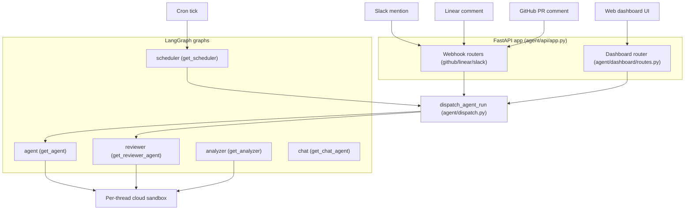

# System Architecture Overview

Open SWE is an internal coding agent built on [LangGraph](https://langchain-ai.github.io/langgraph/) and [Deep Agents](https://github.com/langchain-ai/deepagents). At runtime it is a LangGraph server that hosts several graphs plus a custom FastAPI application, driven by external invocation surfaces (Slack, Linear, GitHub, and the web dashboard). This page is the top-level map: the graphs, the HTTP app, the dashboard router, the sandbox layer, and the UI, and how a request travels from an invocation surface to a running agent inside an isolated sandbox.

## Runtime components

The deployable unit is described by `langgraph.json`, which registers five named graphs, mounts a custom HTTP app, and configures the checkpointer and environment. Each graph is exposed through a thin re-export module under `agent/graphs/` so the deployment references stable dotted paths.

| Graph name | Entrypoint | Role |
|---|---|---|
| `agent` | `agent.server:get_agent` (via `traced_agent`) | Main coding agent: clones a repo into a sandbox, edits, tests, commits, opens/updates PRs. |
| `reviewer` | `agent.reviewer:get_reviewer_agent` | Read-only PR code reviewer that files diff-anchored findings. |
| `analyzer` | `agent.analyzer:get_analyzer` | Learns a per-repo review-style prompt for the reviewer. |
| `chat` | `agent.chat:get_chat_agent` | Sandbox-less "chat with this PR" agent for the review UI. |
| `scheduler` | `agent.scheduler:get_scheduler` | Fans cron ticks into fresh agent threads and background jobs. |

Alongside the graphs, `langgraph.json` mounts the FastAPI application at `agent.webapp:app`, which is a compatibility shim re-exporting the app assembled in `agent/api/app.py`. That app hosts the dashboard router, the plan and workflow-approval routers, the GitHub/Linear/Slack webhook routers, and a health router.

Component diagram: invocation surfaces reach the FastAPI app, which dispatches durable runs into the graphs; the coding, reviewer, and analyzer graphs each run against a per-thread sandbox. See [sandbox lifecycle](repo://openwiki/architecture/sandbox-lifecycle.md), [middleware](repo://openwiki/architecture/middleware.md), and [invocation flow](repo://openwiki/architecture/invocation-flow.md) for the details behind each edge.

## The five graphs

**Agent** (`agent/server.py:get_agent`) is the main graph factory, invoked per thread. It resolves the GitHub token, gets-or-creates the sandbox for the thread, resolves the team/profile/per-thread model and effort, then constructs a fresh `create_deep_agent(...)` with the curated tool list and a large middleware stack. When there is no `thread_id` or the graph was not loaded for execution, it returns a trivial no-sandbox agent instead of provisioning resources.

**Reviewer** (`agent/reviewer.py:get_reviewer_agent`) mirrors the main agent's sandbox lifecycle but wires a review-only toolset (`add_finding`, `update_finding`, `list_findings`, `publish_review`) and a system prompt pinning a single-evolving-findings model and in-diff-only discipline. It has no commit/push/PR-opening tools. Its sandbox holds only a checkout that repo prep re-derives every run, so reviewer threads may replace an unreachable sandbox where the main agent must not.

**Analyzer** (`agent/analyzer.py:get_analyzer`) is a small graph that emits a per-repo review-style prompt (via `save_review_style_prompt`) consumed by the reviewer. It mines historical human PR review feedback and the reviewer's own past finding outcomes, using the same sandbox + `gh` pattern as the reviewer.

**Chat** (`agent/chat.py:get_chat_agent`) is a read-only "chat with this PR" agent for the review UI. Unlike the agent and reviewer it has **no sandbox**: PR context (diff, findings, overview) is seeded as virtual files under `/pr/` into the `files` state channel by the dashboard chat proxy, and it answers using those plus read-only GitHub API access.

**Scheduler** (`agent/scheduler.py:get_scheduler`) is a single-node `StateGraph` whose `_launch` node dispatches a cron tick to the right background task by `task` name - `reconcile`, `baby_sit`, background-task monitoring, `session_cost` refresh, or launching a scheduled agent run. It is the entry point through which time-based triggers fan out into fresh agent threads and maintenance jobs.

## The FastAPI app and dashboard router

`agent/api/app.py:create_app` composes the FastAPI application. It pins a single event loop before workers are built, configures CORS from `DASHBOARD_ALLOWED_ORIGINS` (rejecting `*` when credentials are allowed), and includes the dashboard, plan, workflow-approval, Linear/Slack/GitHub webhook, and health routers. A lifespan hook validates sandbox and local-dev LLM configuration at startup and closes cached models on shutdown.

The dashboard router (`agent/dashboard/routes.py`) is an `APIRouter` prefixed at `/dashboard/api`, guarded by a same-origin dependency for mutations. It owns GitHub OAuth, per-user profiles, admin endpoints, team defaults, enabled-repo lists, review-style management, and the thread API used by the web UI. The router is loaded lazily (`agent/dashboard/__init__.py`) so importing a dashboard submodule from middleware does not drag in the full route/API surface - only the webapp pays that cost.

The webhook routers (`agent/webhooks/*_routes.py`) receive Slack, Linear, and GitHub events. Each resolves a deterministic `thread_id` so follow-up messages on the same issue/thread/PR route to the same agent run.

## Dispatch: one durable contract

Every agent/reviewer run trigger - Slack, Linear, GitHub, dashboard, and scheduler - routes through `agent/dispatch.py:dispatch_agent_run`, a single durable dispatch contract. It replaces per-site `runs.create` calls with one function that creates a durable run and selects the graph via `assistant_id` (`"agent"` or `"reviewer"`); `source` is metadata/logging only. The contract defaults to `multitask_strategy="interrupt"` (a follow-up halts the active run, which resumes with full history plus the new message), `durability="sync"` (checkpoint before each step so a crash resumes from the last checkpoint), a completion webhook so every run ends with a signal, and `stream_resumable=True` plus the Protocol v2 run shape so the dashboard can attach to and observe runs it did not itself start.

## Stateless-agent principle

The agent itself is stateless. `get_agent` builds a fresh `create_deep_agent(...)` per run; **all per-thread state lives in the sandbox and in thread metadata**. The in-process backend cache is keyed by `thread_id`, and thread metadata persists `sandbox_id` across processes, so a recycled worker reconnects the same sandbox rather than losing work. This is why dispatch checkpoints synchronously and why an unreachable existing sandbox raises rather than being silently replaced: a replacement is empty, and swapping it in would destroy uncommitted work while looking like recovery.

## Deployment wiring (langgraph.json)

`langgraph.json` is the deployment manifest. It pins `python_version: "3.12"` and `api_version: "0.12.6"`, maps each graph name to its dotted entrypoint under `graphs`, and mounts the custom app under `http.app`. The `checkpointer.ttl` block sets a `delete` strategy with a 60-minute sweep interval and a default TTL of 43200 minutes, and `env` points at `.env`. A separate desktop manifest (`langgraph.desktop.json`) registers only the `agent` graph, disables Studio auth via `agent.local_auth:auth`, and disables the bundled UI - used for local desktop runs where the sandbox is replaced by a local shell backend (`agent/desktop.py`).

## The web/desktop UI

The `ui/` package is the web dashboard, a TanStack-Router React app (`ui/src/router.tsx`, `ui/src/routeTree.gen.ts`) whose routes cover agents/threads, PR review, review styles, admin, usage, and settings. It talks to the dashboard router's `/dashboard/api` endpoints and streams runs over the LangGraph run protocol. The same dispatch contract that serves webhook triggers also backs dashboard-initiated runs, so a run started in the UI and one started from Slack share the same lifecycle and are mutually observable.
