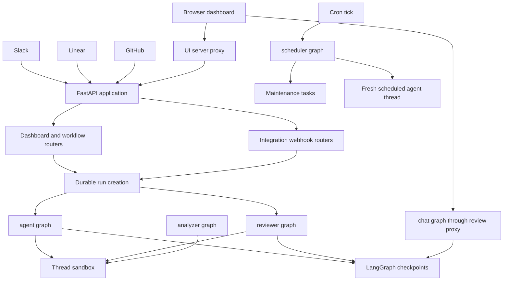

## System boundary

Open SWE deploys a LangGraph server whose cloud manifest exposes five named graphs and mounts a custom FastAPI application. The application is the integration and browser-facing boundary; graph factories own agent execution. The dashboard is a separate React/TanStack application that fronts the Python service rather than embedding it, while desktop uses a deliberately narrower local LangGraph manifest.

This context diagram distinguishes HTTP ingress from LangGraph execution. `dispatch_agent_run` is the common convenience contract for interactive agent and reviewer triggers; scheduled runs call the lower-level durable-run creator directly, and review chat has its own guarded proxy.

## Deployment graphs

`langgraph.json` is the cloud deployment manifest. It maps stable thin re-export modules in `agent/graphs/` to five graphs and mounts `agent.webapp:app` as custom HTTP application:

| Graph | Manifest entrypoint | Boundary and responsibility |
|---|---|---|
| `agent` | `agent.graphs.agent:traced_agent` | Coding-agent factory for an executable thread. |
| `reviewer` | `agent.graphs.reviewer:traced_reviewer_agent` | PR review and finding publication. |
| `analyzer` | `agent.graphs.analyzer:traced_analyzer` | Learns repository review-style guidance. |
| `chat` | `agent.graphs.chat:traced_chat_agent` | Read-only discussion of one PR. |
| `scheduler` | `agent.graphs.scheduler:get_scheduler` | One-node cron task dispatcher. |

The agent factory is intentionally per graph load/run rather than a shared agent singleton. When a thread ID is absent or LangGraph is loading the graph without executing it, the agent, reviewer, analyzer, and chat factories return an empty no-tool agent. The main agent otherwise gets a thread-keyed backend, starts it, and resolves thread/profile settings before creating the deep agent. This separates safe discovery from resource provisioning. Detailed tool and middleware composition belongs in [Agent Graph](./agent-graph.md) and [Reviewer and Analyzer](./reviewer-and-analyzer.md).

The reviewer has a sandbox-backed review toolset centred on fetching a diff, managing findings, publishing reviews, and resolving or replying to finding threads; it does not receive coding-agent commit/push/PR creation tools. The analyzer also uses the review sandbox pattern. Its preparation can authenticate `gh`, and it mines historical human review feedback and finding outcomes before persisting a per-repository prompt through `save_review_style_prompt`.

Review chat is a separate safety boundary: it has no sandbox and excludes filesystem mutation and shell execution. The dashboard review-chat proxy verifies ownership, enriches the initial command with virtual `/pr/` overview, diff, and findings files, forces the `chat` assistant, and proxies it to LangGraph. Initial state/history reads for a lazily not-yet-created chat thread become empty successful responses, allowing the client to hydrate a new conversation.

## FastAPI composition and browser boundary

`agent/webapp.py` is a compatibility re-export of the application assembled by `agent/api/app.py:create_app`. Import-time event-loop pinning occurs before queue workers are built; the lifespan validates sandbox and local-development LLM configuration and closes cached models on shutdown. The factory conditionally configures credentialed CORS from `DASHBOARD_ALLOWED_ORIGINS`, rejecting `*`, then mounts dashboard, plan, workflow-approval, Linear, Slack, health, and GitHub routers.

The main dashboard router is rooted at `/dashboard/api` and applies same-origin validation to mutations. It is deliberately lazy: importing another `agent.dashboard` submodule does not import the router and its full FastAPI/job surface until the webapp requests `agent.dashboard.router`.

The deployed UI server proxies `/dashboard/api/**` and `/webhooks/**` to the runtime `DASHBOARD_API_URL`. It forwards request method, headers, and body, preserves OAuth redirects rather than following them server-side, drops hop-by-hop and reframed response headers, and emits each upstream cookie separately. Consequently the browser continues to use a same-origin session cookie while a single dashboard image can front a deployment-selected backend. In development, Vite instead configures in-process proxies for backend prefixes.

## External triggers and durable execution

Slack, Linear, GitHub, dashboard actions, plan approvals, and background follow-ups create or continue LangGraph runs through `dispatch_agent_run` where they need the normal agent/reviewer dispatch contract. The caller chooses `assistant_id`; `source` is used to build identity context and logging, not graph selection. The contract rejects ambiguous combinations of a prebuilt input with content or identity fields.

Durability and observability are set when a run is created: the default multitask strategy is `interrupt`, durability is `sync`, event streaming is resumable, and the run configuration carries the event-streaming-v2 marker with values, updates, messages, custom, tasks, and checkpoints modes plus subgraphs. Thus a later dashboard client can replay and observe an externally-triggered run. A completion webhook is only attached when a secret is configured and its URL is absolute and non-loopback; otherwise run creation proceeds without it.

A scheduler invocation is a compiled `StateGraph` with exactly one `launch` node. By task name it reconciles stale runs, evaluates a watch, monitors background tasks, refreshes session or agent cost, or launches a stored agent schedule. Missing required watch, thread, or schedule identifiers return status objects. A valid agent schedule verifies the owner’s repository access, creates a fresh UUID thread with metadata, and invokes `create_durable_run` with the standard run configuration.

## Durable state and execution lifecycle

Factory instances are ephemeral; LangGraph checkpoints retain graph state, and LangGraph thread metadata retains the sandbox identity. The sandbox proxy cache is process-local and keyed by thread ID. On a new worker, the proxy can retrieve `sandbox_id` from inline/run or persisted thread metadata and reconnect. A deleted sandbox is replaced, but an existing unreachable coding sandbox raises by default rather than silently swapping in an empty working tree; reviewer-style callers can explicitly allow replacement because their checkout is re-derivable. The lifecycle publishes a new backend only after it is initialized and binds its ID to thread metadata.

Cloud checkpoint retention uses the `delete` strategy with a 60-minute sweep and a 43,200-minute default TTL. The present manifest specifies Python 3.14, LangGraph API 0.13.3, and environment loading from `.env`.

## Desktop boundary

`langgraph.desktop.json` registers only the `agent` graph, disables the bundled UI, and uses `agent.local_auth:auth` with Studio auth disabled. A run is desktop-originated only when `configurable.source == "desktop"`; its backend is `LocalShellBackend`, not a remote sandbox. The requested `local_project_path` must resolve to an existing directory that is either allowlisted by `OPEN_SWE_LOCAL_PROJECTS_FILE` or beneath `OPEN_SWE_LOCAL_WORKTREES_DIR`. Agent artifact routes for large tool results and conversation history are put under a configurable artifact root (or a temporary per-user root), outside the worktree by default, so they are not accidentally included in `git add -A`.

## Operating and extending the composition

- Add a deployment graph by exposing a stable factory from `agent/graphs/` and registering it in the relevant manifest. It will not automatically be eligible for `dispatch_agent_run`; that API does not validate or constrain arbitrary graph IDs.
- Add browser APIs through the FastAPI composition and preserve session and same-origin protections. If the dashboard needs to front a new backend path in production, add it deliberately to the UI proxy route configuration.
- Treat sandbox replacement as an explicit recovery decision. The default unreachable-sandbox failure protects thread-local uncommitted work.
- Changes to dispatch defaults or event fields need coverage of both durable-run arguments and an externally-created run viewed in the dashboard; resumability and the v2 marker are cross-surface compatibility requirements.
- Exercise desktop path validation and artifact routing whenever changing local execution. The allowlist/worktree boundary is the local shell authorization control.

Related pages: [Agent Graph](./agent-graph.md), [Reviewer and Analyzer](./reviewer-and-analyzer.md), [Threads and State](../concepts/threads-and-state.md), [Dashboard UI](../integrations/dashboard-ui.md), and [Invocation](../workflows/invocation.md).
