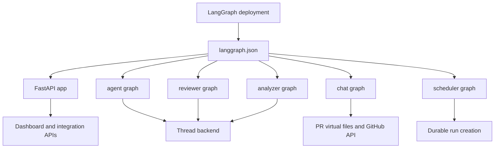
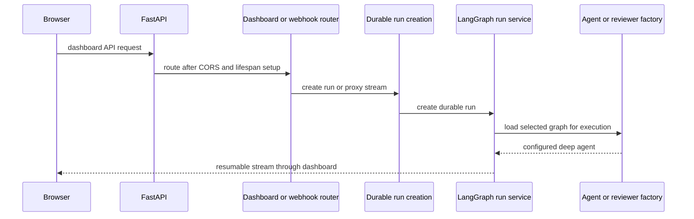

# Runtime and Product Architecture

Open SWE combines a LangGraph deployment with a custom FastAPI application. The deployment exposes five graph entrypoints; FastAPI owns product APIs, webhooks, health, and optional dashboard delivery. Coding and review work is created as durable LangGraph runs, while graph factories construct the per-run agent and its execution backend.

## Deployment runtime

`langgraph.json` is the cloud manifest. It registers five named graphs and mounts the compatibility application entrypoint `agent.webapp:app`, which re-exports the app assembled in `agent/api/app.py`. The thin `agent/graphs/` modules give deployment configuration stable imports while delegating to the implementation factories.

| Graph | Manifest entrypoint | Architectural role |
|---|---|---|
| `agent` | `agent.graphs.agent:traced_agent` | Main coding-agent factory for an executable thread. |
| `reviewer` | `agent.graphs.reviewer:traced_reviewer_agent` | Code-review agent and findings workflow. |
| `analyzer` | `agent.graphs.analyzer:traced_analyzer` | Per-repository review-style learning. |
| `chat` | `agent.graphs.chat:traced_chat_agent` | Read-only discussion of a pull request. |
| `scheduler` | `agent.graphs.scheduler:get_scheduler` | Cron-tick fan-out for maintenance and scheduled work. |

This diagram shows the deployed runtime: graph registration is separate from the custom HTTP application, and only the agent, reviewer, and analyzer require a thread execution backend.

The cloud manifest uses Python 3.14 and LangGraph API version 0.13.3. It loads `.env`; checkpointer TTL uses the `delete` strategy, a 60-minute sweep interval, and a 43,200-minute default. Its Dockerfile instructions attempt to build the dashboard bundle and continue with a backend-only image if that build fails.

### Factories and graph-specific boundaries

`get_agent` returns a fresh deep agent for a thread being executed. It deliberately returns a minimal agent with no tools when there is no thread ID or the graph is loaded outside execution, avoiding backend provisioning during discovery. For an executable run it selects a desktop local-shell backend or obtains the thread sandbox, starts it, resolves thread and model settings, and composes the backend, tools, skills, subagents, and middleware. LangGraph checkpoints preserve graph state; the factory itself is not a long-lived per-thread graph object. Details are in [Agent Graph & get_agent Factory](./agent-graph.md).

The reviewer follows the sandbox lifecycle but is constrained to review work. Its documented toolset includes `add_finding`, `update_finding`, `list_findings`, and `publish_review`, rather than commit, push, or PR-opening tools. Repository preparation and the computed in-diff line set happen before findings are accepted, so invalid locations are caught at finding creation rather than only at publication.

The analyzer also uses a sandbox and the `gh` pattern. It learns a repository-specific reviewer prompt from historical human pull-request feedback and past finding outcomes, then saves that prompt through `save_review_style_prompt`. Its preparation obtains a GitHub App token when a supplied review-style token is absent and configures the LangSmith sandbox GitHub proxy when applicable. See [Reviewer & Review-Style Analyzer Graphs](./reviewer-and-analyzer.md).

The chat graph intentionally has no sandbox. The review-chat proxy seeds pull-request diff, findings, and overview as virtual files beneath `/pr/` in the `files` state channel; its filesystem access is read-only and excludes `execute`, `write_file`, `edit_file`, and `delete`. It resolves a repository-scoped GitHub App installation token for GitHub-backed tools instead of handing those tools a user credential.

The scheduler compiles a one-node `StateGraph`. Its launch node dispatches reconciliation, watch evaluation, background-task monitoring, environment refresh, session cost, thread feedback, agent cost, or a scheduled agent run. Missing required watch, thread, or schedule identifiers produces a structured status instead of guessing which work to launch.

## HTTP composition and request routing

`create_app` installs the lifespan hook, applies credentialed CORS only for the configured `DASHBOARD_ALLOWED_ORIGINS`, and refuses `*` with credentials. It mounts dashboard, plan, workflow-approval, Linear, Slack, health, and GitHub routers, then installs the dashboard UI last. Before queue workers are built and again at startup, it pins the event loop; startup validates the GitHub-login allowlist, sandbox configuration, and local-development LLM configuration. Shutdown asynchronously closes cached models.

This is the normal browser-triggered run path. Integration webhooks follow the same ingress pattern where applicable; scheduler and review-style jobs call the lower-level durable-run creator directly because they select other graph IDs or prepare their own inputs.

The dashboard router is prefixed `/dashboard/api` and applies `require_same_origin_for_mutations` as a router dependency. It is the browser-facing boundary for authentication and OAuth, profiles, administration, repositories and review styles, thread and review APIs, schedules, environments, skills, integrations, and preferences. The `agent.dashboard` package lazily imports and caches `routes.router` with `__getattr__`, so consumers of dashboard submodules do not import the full FastAPI route and job surface.

### Serving the dashboard safely

`mount_dashboard_ui` serves a built dashboard at `/` when `DASHBOARD_STATIC_DIR` (or the in-repository build) contains `_shell.html`; alternatively `DASHBOARD_DEV_SERVER_URL` installs a reverse proxy to Vite for development. The catch-all is registered after API routes and declines reserved LangGraph and backend paths such as `/threads`, `/runs`, `/dashboard/api`, `/webhooks`, `/health`, and `/docs`. It also declines unknown non-HTML requests, preventing an API miss from receiving the application shell. Static-file resolution remains under the configured build directory, hashed assets receive immutable caching, and the shell is no-cache. `keep_dashboard_ui_last` is required after adding routes later.

## Durable run boundary

`create_durable_run` is the common primitive for LangGraph run creation; `dispatch_agent_run` is the higher-level adapter used by Slack, Linear, GitHub, dashboard, and several agent follow-up flows. The latter builds or accepts structured `RunInput`, rejects a prebuilt input combined with content or identities, and uses `assistant_id`—not `source`—to select the graph. Its documented agent/reviewer contract defaults to `assistant_id="agent"`; callers can select `reviewer`.

The creation defaults make cross-surface runs observable and recoverable: `multitask_strategy="interrupt"`, `durability="sync"`, creation if absent, resumable streams, all v3 stream modes, subgraph streaming, and the `__event_streaming_v2` configurable marker. An invocation ID is resolved or created and written into configurable data and metadata. A follow-up can choose another multitask policy, such as `enqueue`, where its caller needs it.

A completion webhook is attached only when `RUN_COMPLETE_WEBHOOK_SECRET` is set and `COMPLETION_WEBHOOK_URL` is absolute and non-loopback. Otherwise the URL resolves to `None`, so a bad local or relative completion configuration does not block run creation. Review-style analysis and scheduled automations call `create_durable_run` directly, retaining those same durable defaults while supplying their graph ID and prepared input.

## Cloud dashboard and local desktop

The `ui/` client uses TanStack Router. Its router base path follows Vite's build base, allowing a bundle built for an HTTP mount prefix to route under that prefix. The agents layout requires a session except for enabled desktop-local routes and selects `cloud` or `local` streaming transport from the active session route. Generated routes include cloud and local agent sessions, threads, skills, automations, reviews, plans, administration, integrations, usage, settings, environments, instructions, and sandbox views.

Desktop uses `langgraph.desktop.json`, which registers only the `agent` graph, uses `agent.local_auth:auth` with Studio authentication disabled, and disables the bundled UI. A desktop run is identified by `configurable.source == "desktop"`; `local_project_path` must resolve to an existing allowlisted project or a child of `OPEN_SWE_LOCAL_WORKTREES_DIR`. The resulting `LocalShellBackend` receives only the small `SHELL_ENV_KEYS` environment allowlist. Agent scratch routes put `large_tool_results` and `conversation_history` outside the project to avoid accidental inclusion by `git add -A`.

The Electron-side `BackendSupervisor` launches a local `langgraph dev` server on loopback, using the desktop manifest in development or the bundled runtime in packaged builds. It reserves a port, creates a random bearer token, supplies project/worktree/artifact environment settings, and polls the authenticated root endpoint until healthy or timeout. The public client configuration is `/local-graph` with graph ID `agent`; its proxy removes browser `host` and `cookie` headers before forwarding and injects the backend bearer token. Startup failures include captured recent logs, and shutdown sends `SIGTERM` before escalating to `SIGKILL` after its timeout.

## Change and test focus

- Add a deployed graph through an `agent/graphs/` stable export and the relevant manifest. Registration alone does not make it a `dispatch_agent_run` target.
- Preserve UI route ordering and reserved-path behavior when extending FastAPI; otherwise the shell can shadow a LangGraph or API endpoint.
- Preserve the durable creation fields and v3 marker when introducing a new trigger, because the dashboard must be able to attach to a run it did not start.
- For local changes, retain real-path project validation, the supervisor's loopback bearer token, and off-project artifacts; these are distinct local safety and repository-hygiene boundaries.
- Focused tests cover durable-run defaults and webhook degradation in `tests/agent/test_dispatch.py`, shell/proxy precedence and traversal protection in `tests/dashboard/test_dashboard_ui.py`, scheduler payload forwarding in `tests/agent/test_scheduler.py`, and desktop backend target, thread, activity, and credential behavior in `desktop/test/backend-supervisor.test.cjs`.

Related pages: [Agent Graph & get_agent Factory](./agent-graph.md), [Reviewer & Review-Style Analyzer Graphs](./reviewer-and-analyzer.md), [Dashboard UI](../integrations/dashboard-ui.md), [Deployment](../operations/deployment.md), [Quickstart](../quickstart.md), and [Invocation](../workflows/invocation.md).
