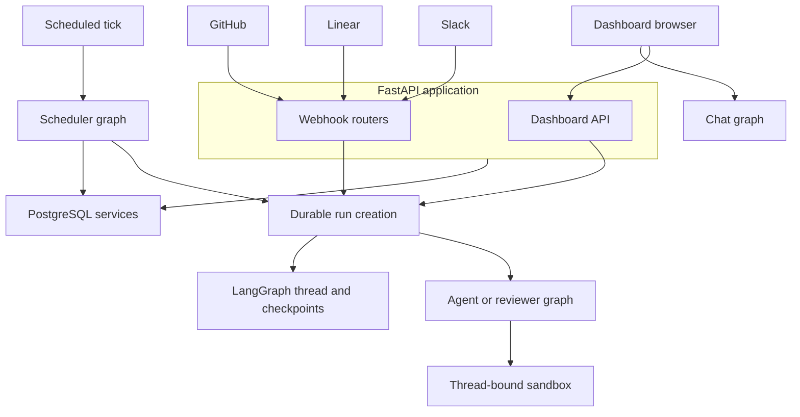

# System Architecture and Runtime Surfaces

Open SWE is a LangGraph deployment with a custom FastAPI application. The API composes browser-facing dashboard APIs, provider webhooks, thread APIs, and sandbox-tool access; it creates or observes durable LangGraph runs rather than running agent work in the request handler. Threads and checkpoints carry the durable conversation/run context, while a thread-bound sandbox supplies the mutable working environment for coding and review graphs.

## Runtime map

`langgraph.json` is the cloud deployment manifest. It registers six graph entrypoints through thin `agent/graphs/` re-export modules and mounts `agent.webapp:app`, a compatibility re-export of the FastAPI application assembled in `agent/api/app.py`.

| Graph | Entrypoint | System responsibility |
|---|---|---|
| `agent` | `agent.graphs.agent:traced_agent` | Builds the coding agent for a thread. |
| `reviewer` | `agent.graphs.reviewer:traced_reviewer_agent` | Prepares and reviews a pull request and publishes findings. |
| `analyzer` | `agent.graphs.analyzer:traced_analyzer` | Learns repository-specific review guidance. |
| `review-scout` | `agent.graphs.review_scout:traced_review_scout` | Runs the dedicated review-scout graph. |
| `chat` | `agent.graphs.chat:traced_chat_agent` | Provides read-only discussion of a pull request. |
| `scheduler` | `agent.graphs.scheduler:get_scheduler` | Executes a single scheduled maintenance or launch task. |

This diagram distinguishes request ingress from durable execution. `create_durable_run` is the common LangGraph run-creation primitive; `dispatch_agent_run` is the higher-level input-building wrapper used for agent and reviewer triggers. Other graph types can use the durable primitive directly.

## Graph responsibilities and execution context

The main graph factory is `agent.server:get_agent`. It wraps the internal factory in a thread-scoped tracing phase when `configurable.thread_id` is present. The factory resolves configuration and thread settings, establishes the execution backend, and constructs a fresh deep-agent graph for the run. A graph object is therefore ephemeral; persisted LangGraph state and thread metadata—not the factory result—provide cross-run continuity.

The reviewer shares the sandbox lifecycle but is intentionally constrained to review behavior. It prepares repository state and computes the changed-line set before model work, then exposes finding lifecycle tools (`add_finding`, `update_finding`, `list_findings`, and `publish_review`) rather than coding actions such as committing, pushing, or opening a PR. The analyzer likewise obtains a workspace-scoped sandbox and repository proxy access, mines human review feedback and previous finding outcomes, and saves repository review-style guidance. See [Reviewer & Review-Style Analyzer Graphs](./reviewer-and-analyzer.md).

The chat graph is a separate, sandbox-free surface. The dashboard review-chat proxy supplies the diff, findings, and overview as virtual `/pr/` files in graph state. Its filesystem capability is restricted to reads and its repository tools use a repository-scoped GitHub App installation token, not a user credential.

The scheduler compiles a one-node `StateGraph`. Its task discriminator handles stale-run reconciliation, watch evaluation, background task monitoring, workspace refresh, session/agent cost refresh, feedback prompts, legacy expedited-review cleanup, or a scheduled-agent launch. Missing required identifiers return explicit result statuses; transient sandbox failures are retried and finally reported as `sandbox_unavailable`.

## FastAPI composition, startup, and external ingress

`create_app()` creates the FastAPI app, attaches trace-resource and request-ID middleware, and mounts the dashboard, plan, workflow-approval, Linear, Slack, health, GitHub, and sandbox-tool routers before mounting static dashboard UI. Credentialed CORS is enabled only for origins from `DASHBOARD_ALLOWED_ORIGINS`; a wildcard is rejected because it is incompatible with credentialed requests.

The lifespan is also an operational boundary. Startup pins the event loop, validates GitHub-login, sandbox, and local-development LLM configuration, requires PostgreSQL, and runs migrations. It then performs best-effort imports from the former LangGraph Store and starts analytics, transcript, and bridge listeners; failures in those optional imports/listeners are logged with their documented degraded behavior. Shutdown stops listeners and the analytics worker and disposes the database engine.

The dashboard aggregate router lives below `/dashboard/api` and applies `require_same_origin_for_mutations` to its children. It composes authentication, user/profile/preferences, workspaces and repositories, pull requests and reviews, agent instructions and skills, schedules, threads/transcripts, integrations, analytics, API keys, and bridge endpoints. Its `router` is lazily imported through `agent.dashboard.__getattr__`, so importing a dashboard helper does not load the entire API surface.

Webhook routers are separate trust boundaries. For example, GitHub verifies `X-Hub-Signature-256`, records deliveries, routes only repositories owned by a workspace, and returns 503 when workspace ownership cannot be read so GitHub retries. Linear verifies its signature, records the delivery, and filters non-comment, non-create, bot, and unmentioned events. Their service layers derive deterministic thread IDs (such as a Linear issue ID or GitHub PR/issue coordinates), allowing follow-up activity to return to the same thread rather than creating unrelated sessions.

## Durable-run boundary and state ownership

`create_durable_run` uses the LangGraph SDK to ensure/title a thread if requested and create a run. Its durable defaults are `multitask_strategy="interrupt"`, `durability="sync"`, resumable streaming, the complete v3-compatible stream-mode set, subgraph streaming, and a v3 compatibility configurable marker. Thus a follow-up normally interrupts/resumes the active run from a checkpoint, and dashboard clients can replay and observe a run created by a non-browser trigger. Callers may override the strategy, for example to enqueue background follow-up work.

`dispatch_agent_run` builds a normalized input identity from its source/configuration unless passed a prebuilt input, rejects mixing those two input forms, records dashboard/Slack activity for applicable agent runs, and delegates to `create_durable_run`. The `assistant_id` passed to the durable API selects the graph; `source` controls input identity and operational metadata rather than selecting a graph.

A completion webhook is attached only if `RUN_COMPLETE_WEBHOOK_SECRET` is set and `COMPLETION_WEBHOOK_URL` is absolute and non-loopback. Invalid or absent completion configuration deliberately disables notifications rather than causing every run creation to fail.

Sandbox lifecycle is deliberately conservative. Thread metadata stores `sandbox_id`; in-process connections can be reused and workers reconnect from that persisted ID. A deleted sandbox is recreated, but an existing unreachable sandbox raises by default because silently replacing it could lose uncommitted work. A caller may permit replacement for re-derivable work such as read-only review preparation. A new sandbox ID is written only after creation/initialization, and the backend is published to the local cache only after binding and tool URL provisioning succeed. See [Threads and State](../concepts/threads-and-state.md) and [Invocation](../workflows/invocation.md).

PostgreSQL is required for pull-request and repository records. The database layer normalizes supported PostgreSQL URI forms to `asyncpg`, maintains an async engine with pre-ping/pool settings, sets the `open_swe` schema search path for connections and transactions, and serializes migrations with a PostgreSQL advisory transaction lock. Snapshot readers use repeatable-read, read-only transactions to avoid combining incompatible snapshots with a live event stream.

## Cloud dashboard and desktop surface

The cloud manifest uses Python 3.14 and API version `>=~=0.15.0rc1`. Its checkpointer TTL deletes expired data, sweeps every 60 minutes, and defaults to 43,200 minutes. It loads `.env`; Docker build instructions build the dashboard for the configured mount prefix on a best-effort basis, leaving the backend deployable when the UI build fails.

The React dashboard is a TanStack Router application whose generated route tree includes agents and local sessions, assistant, reviews and styles, administration, integrations, usage, workspace settings, incidents, automations, plans, skills, and instructions. Router `basepath` comes from Vite's build base, matching deployments served beneath a mount prefix. The agents layout permits enabled desktop-local routes without a web session but requires login elsewhere.

`langgraph.desktop.json` is intentionally narrower: it registers only `agent`, uses `agent.local_auth:auth` with Studio authentication disabled, installs a local checkpointer factory, and disables the bundled UI. A run whose source is `desktop` obtains a `LocalShellBackend`. Its `local_project_path` must resolve to an existing allowlisted project or to a child of `OPEN_SWE_LOCAL_WORKTREES_DIR`; the shell inherits only a fixed environment allowlist. Desktop artifact routes place large tool results and conversation history outside the project so scratch output is not accidentally included by `git add -A`.

## Change and test focus

- Registering a graph makes it deployable, not automatically eligible for a particular trigger. Use the stable `agent/graphs/` entrypoint and choose the appropriate invocation path.
- Preserve the FastAPI startup sequence when changing persistence or listeners: migrations are mandatory, while the Store migration and cross-process listeners intentionally degrade rather than block startup.
- Exercise run-creation defaults and replay from a non-dashboard trigger when changing dispatch or stream fields; cross-surface observability depends on resumable v3-compatible streams.
- Treat an unreachable coding sandbox as a recovery decision, not a cache miss. Test both deleted and unreachable cases, including the reviewer-only replacement exception.
- For desktop path changes, test real-path resolution, allowlist/worktree acceptance and rejection, and artifact placement outside the repository.

Related pages: [Agent Graph & get_agent Factory](./agent-graph.md), [Reviewer & Review-Style Analyzer Graphs](./reviewer-and-analyzer.md), [Threads and State](../concepts/threads-and-state.md), [Dashboard UI](../integrations/dashboard-ui.md), and [Invocation](../workflows/invocation.md).
