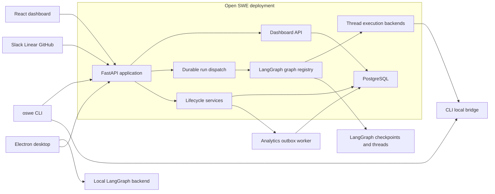

# Runtime Architecture and Service Composition

Open SWE is a LangGraph deployment whose custom FastAPI application is both the product HTTP boundary and the host for supporting services. Registered graphs perform agent, review, analysis, chat, and scheduled work; the application turns browser and integration requests into durable LangGraph runs, maintains PostgreSQL-backed product state, and serves the dashboard. The desktop app and `oswe` CLI are additional clients, not alternate agent implementations: each connects to a LangGraph backend and can supply local execution capability.

## System boundaries

```mermaid
flowchart LR
  Browser["React dashboard"] --> HTTP["FastAPI application"]
  Integrations["Slack Linear GitHub"] --> HTTP
  CLI["oswe CLI"] --> HTTP
  Desktop["Electron desktop"] --> LocalAPI["Local LangGraph backend"]
  Desktop --> HTTP

  subgraph Deployment["Open SWE deployment"]
    HTTP --> Dashboard["Dashboard API"]
    HTTP --> Dispatch["Durable run dispatch"]
    HTTP --> Services["Lifecycle services"]
    Dispatch --> Graphs["LangGraph graph registry"]
    Graphs --> Sandboxes["Thread execution backends"]
    Services --> Postgres["PostgreSQL"]
    Dashboard --> Postgres
  end

  Graphs --> Checkpoints["LangGraph checkpoints and threads"]
  Sandboxes --> Bridge["CLI local bridge"]
  CLI --> Bridge
  Services --> Analytics["Analytics outbox worker"]
  Analytics --> Postgres
```

This component diagram distinguishes request clients and FastAPI ingress from LangGraph's durable run and checkpoint platform, PostgreSQL product data, and the local-execution bridges that clients can provide.

## Graph registry and execution platform

`langgraph.json` is the cloud manifest. It registers six named graphs through stable `openswe.graphs.*` re-export modules: `agent`, `reviewer`, `analyzer`, `review-scout`, `chat`, and `scheduler`. `openswe.webapp:app` is the custom HTTP application mounted alongside the platform API. The manifest loads `.env`, retains checkpointer data with a delete TTL policy (60-minute sweep and 43,200-minute default), and best-effort builds the React dashboard into the image. A failed UI build therefore leaves a backend deployable.

The thin modules in `openswe/graphs/` are intentional deployment seams: graph implementation modules can move without changing the manifest's public dotted entrypoints. The main entrypoint delegates to `openswe.server:get_agent`; it wraps construction in a per-thread tracing phase when a string `thread_id` is present. Detailed graph behavior belongs in [Agent Graph](./agent-graph.md) and [Reviewer and Analyzer](./reviewer-and-analyzer.md).

Run creators should use `dispatch_agent_run` rather than call LangGraph directly for ordinary agent and reviewer runs. It normalizes a supplied message or a prebuilt input, rejects mixing the two forms, uses `assistant_id` to choose the `agent` or `reviewer` graph, and treats `source` as identity/metadata rather than graph selection. Its lower-level creation contract defaults to `multitask_strategy="interrupt"`, synchronous durability, resumable streams, all v3-compatible stream modes, and subgraph streaming. Thus an incoming follow-up can interrupt and resume an active thread from a checkpoint, while a dashboard that did not create the run can attach and replay its events.

Completion callbacks are deliberately optional. A completion webhook is attached only when `RUN_COMPLETE_WEBHOOK_SECRET` is set and `COMPLETION_WEBHOOK_URL` is absolute and non-loopback; invalid or incomplete configuration logs a warning and does not prevent run creation. The FastAPI completion endpoint verifies the token before processing an object payload.

## FastAPI composition and lifecycle

`openswe.webapp.py` is a compatibility re-export of the app assembled in `openswe.api.app`. The app pins its event loop before queue-backed work is constructed, configures Datadog/request-ID/audit middleware, and installs CORS for configured dashboard origins plus the `open-swe://app` desktop origin. It rejects `*` because credentials are enabled. Router composition includes the dashboard, plan and workflow approval APIs, integration webhooks, health and completion routes, sandbox tool and OpenAI-compatible routes, then mounts static dashboard assets.

The lifespan establishes the service dependencies in order: it validates GitHub login policy, sandbox configuration, and local LLM configuration; requires PostgreSQL and applies migrations; imports legacy user and automation state; syncs configured admins; then loads reporting metadata and starts the analytics worker. Transcript, bridge, notification, and UI-invalidation listeners are also started. Noncritical imports and listeners are logged and allowed to fail so the application can still start with reduced cross-process updates; shutdown stops those listeners and worker and closes the database.

The browser API is aggregated below `/dashboard/api` with a same-origin mutation dependency. It includes authentication, profiles and preferences, workspace and repository settings, threads and transcripts, reviews, schedules, skills, MCP/bridge access, analytics, audit logs, and administration. Importing `openswe.dashboard` does not pull this whole router into every caller: its PEP 562 `__getattr__` imports and caches `routes.router` only when requested.

## Persistence, analytics, and thread ownership

PostgreSQL is required in normal operation because repository and pull-request records live there. The database layer accepts PostgreSQL asyncpg URLs, creates an async SQLAlchemy engine with pre-ping and configurable pool limits, scopes connections to the `open_swe` schema, logs slow or failed queries, and serializes schema migrations with a PostgreSQL advisory transaction lock. This makes multiple application replicas safe to start concurrently.

Product data is distinct from LangGraph execution state. LangGraph threads and checkpoints preserve run state and thread metadata; PostgreSQL holds Open SWE's relational domains, migrations, notifications, analytics data, and sandbox-tool context. Sandbox metadata is always fetched from the live thread rather than a queued run configuration, preventing stale runs from rebinding or widening a sandbox/token scope.

The analytics subsystem is a PostgreSQL outbox. Enqueue writes a uniquely identified event transactionally; workers claim due rows using `FOR UPDATE SKIP LOCKED`, mark them delivering, ingest and acknowledge successes, and retry failures with jittered exponential backoff. A row becomes `dead_letter` after the configured attempt limit, so delivery is at-least-once rather than silently lost. The lifespan worker also recomputes summaries and enforces retention; reporting metadata exposes pending and failed delivery state.

Sandbox backends are an execution context, not checkpoint state. A thread's sandbox ID is persisted in thread metadata while process-local proxies/cache connections speed reuse. An existing sandbox is reconnected and its proxy identity refreshed; a deleted sandbox is replaced, but an unreachable coding sandbox normally fails rather than being silently replaced with an empty working tree. Replacement of merely unreachable boxes is explicitly allowed only for callers such as the reviewer whose checkout is re-derived. A newly created backend is bound to thread metadata and published to the cache only after initialization succeeds.

## Client surfaces

The bundled dashboard is a TanStack Router React application. The router uses Vite's base path, SSR-query integration, navigation timing, scroll restoration, intent preloading, and a common load-error component. Its route tree covers agent and assistant sessions, local sessions, plans, automations, bots, reviews, incidents, workspaces, integrations, usage, settings, feature flags, and administration. The `/agents` layout requires a user session and recognizes desktop-local threads so the appropriate local runtime can be selected. See [Dashboard UI](../integrations/dashboard-ui.md).

The Electron desktop app is a client and local supervisor. It starts a loopback-only `langgraph dev` backend from `langgraph.desktop.json`; that manifest registers only the agent graph, uses local authentication, a local checkpointer, and disables the bundled UI. Desktop-source runs use a `LocalShellBackend`, but only after `local_project_path` resolves to an existing allowlisted project or a child of `OPEN_SWE_LOCAL_WORKTREES_DIR`. Scratch large-tool results, evicted history, and blobs are routed outside the project to avoid accidental inclusion in `git add -A`.

`oswe` is a remote-client CLI. `oswe run` registers a bridge for the current directory, creates or continues a thread on the deployment, long-polls to execute the remote agent's sandbox requests locally, and follows the event stream with reconnection. This grants the agent unsandboxed access as the local user, so it is a deliberate trust boundary. The command prints only the agent's declared result to stdout and adopts its exit code; the same CLI also supports login/logout, credential checks, and MCP serving.

## Operating and extending the composition

- Add a cloud graph by exporting a stable `openswe/graphs/` entrypoint and registering it in `langgraph.json`; adding it does not automatically make it legal for `dispatch_agent_run`.
- Add browser APIs through `create_app` and the dashboard router so request IDs, audit behavior, CORS, static mounting, session checks, and same-origin mutation protection remain intact.
- Preserve lifecycle ordering when adding a service: database migration precedes services that query tables, and every started listener/worker needs shutdown handling.
- Treat an unreachable coding sandbox as a recovery event. Replacing it changes the effective working tree; do not turn that error into a cache miss.
- Monitor analytics outbox pending, stale, and dead-letter counts as delivery health, not merely process liveness.
- Changes to dispatch stream fields require testing runs started by integrations as well as the dashboard, because later event attachment depends on resumable v3-compatible streams.

Related pages: [Agent Graph](./agent-graph.md), [Reviewer and Analyzer](./reviewer-and-analyzer.md), [Threads and State](../concepts/threads-and-state.md), [Dashboard UI](../integrations/dashboard-ui.md), and [Deployment](../operations/deployment.md).
