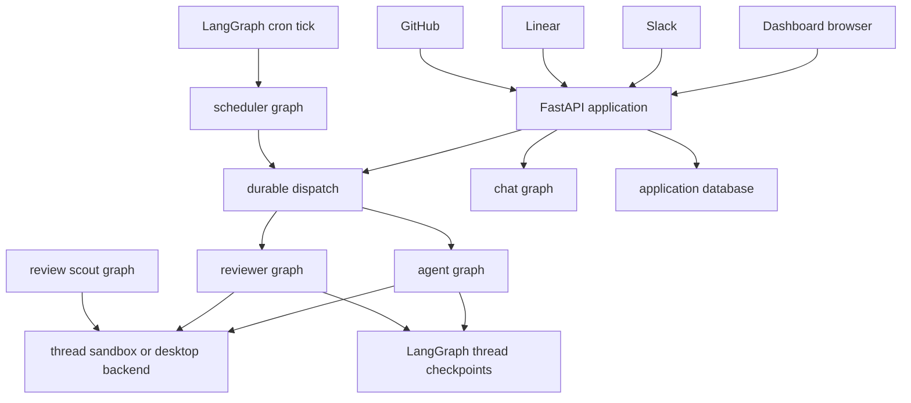

# System architecture and runtime boundaries

Open SWE is a LangGraph deployment whose custom FastAPI application is the integration and product boundary. Durable LangGraph runs perform coding and pull-request work; the API serves the dashboard and receives external events; PostgreSQL-backed application services own operational records and startup migrations; and a thread-scoped sandbox (or local backend) supplies execution state. The graph factory itself is deliberately short-lived—checkpointed graph state and thread metadata survive it.

## Deployment map

`langgraph.json` is the cloud manifest. It registers five stable graph entrypoints through thin `openswe/graphs/` modules, mounts `openswe.webapp:app`, loads `.env`, and configures checkpoint deletion after the configured retention period. Its image build attempts to bundle the dashboard but intentionally leaves the backend deployable if the UI build fails.

| Graph | Entrypoint | Runtime responsibility |
|---|---|---|
| `agent` | `openswe.graphs.agent:traced_agent` | Coding-agent factory for a runnable thread. |
| `reviewer` | `openswe.graphs.reviewer:traced_reviewer_agent` | Pull-request review findings and publication. |
| `review-scout` | `openswe.graphs.review_scout:traced_review_scout` | Background walkthrough planning for a PR. |
| `chat` | `openswe.graphs.chat:traced_chat_agent` | Read-only discussion of a PR. |
| `scheduler` | `openswe.graphs.scheduler:get_scheduler` | Cron-tick dispatch and maintenance. |

```mermaid
flowchart TD
  Browser["Dashboard browser"] --> API["FastAPI application"]
  Slack["Slack"] --> API
  Linear["Linear"] --> API
  GitHub["GitHub"] --> API
  Cron["LangGraph cron tick"] --> Scheduler["scheduler graph"]
  API --> Dispatch["durable dispatch"]
  Scheduler --> Dispatch
  Dispatch --> Agent["agent graph"]
  Dispatch --> Reviewer["reviewer graph"]
  API --> Chat["chat graph"]
  Agent --> Sandbox["thread sandbox or desktop backend"]
  Reviewer --> Sandbox
  Scout["review scout graph"] --> Sandbox
  Agent --> Checkpoints["LangGraph thread checkpoints"]
  Reviewer --> Checkpoints
  API --> Database["application database"]
```

This is the principal control plane: external or browser-originated work enters FastAPI, while agent and reviewer work is created through durable dispatch. Chat is a distinct read-only graph; the scheduler decides whether a tick is maintenance or a scheduled agent launch.

## Graph boundaries and execution context

The agent entrypoint delegates to `openswe.server:get_agent`, which builds a fresh graph for each invocation and wraps per-thread factory work in tracing. The complete factory resolves the invocation configuration, model and tool surface, and thread execution backend; see [Agent Graph & get_agent Factory](./agent-graph.md) for that composition. This separation matters operationally: do not use the in-memory factory result as a state store.

The reviewer uses a sandboxed checkout but has a review-focused tool surface: it prepares the repository and computes valid diff locations before model work, then works with findings tools rather than coding tools. The `review-scout` is another isolated PR workflow: it plans a shared walkthrough and human-input summary, has its own PR thread, and may avoid a model call when an unchanged head has no uncovered lines. Both review-oriented sandboxes may be replaced when unreachable because their checkout is re-derived.

PR chat intentionally has no sandbox. The review UI proxy supplies diff, findings, and overview as virtual `/pr/` files in graph state; read-oriented filesystem tools use those files, while shell and file mutation tools are excluded. It resolves a repository-scoped GitHub App installation token rather than exposing a user credential.

### Sandbox lifecycle and persistence

LangGraph checkpointing holds graph state. Thread metadata holds the sandbox identifier and related execution configuration; process-local connections only speed up reuse. `ensure_sandbox_for_thread` reconnects a recorded ID when necessary, creates and records an ID only after initialization succeeds, and refreshes the managed sandbox's GitHub proxy and git identity.

An existing but unreachable coding sandbox fails the run rather than silently becoming an empty replacement, protecting uncommitted work. A deleted sandbox is replaced because its recorded ID can no longer be recovered. Task-worker threads attach to their coordinator's sandbox and must not create one. These distinctions are part of the recovery contract; see [Sandbox Lifecycle](./sandbox-lifecycle.md).

## Service composition and ingress

`openswe.webapp:app` is a compatibility import of the FastAPI application assembled in `openswe.api.app`. The module pins an event loop before queue workers are created. `create_app` configures credentialed CORS from `DASHBOARD_ALLOWED_ORIGINS` (and rejects `*`), request IDs, audit logging, tracing, GitHub error mapping, and an `UnknownUser` conflict response. It then mounts dashboard, plan and approval, integration/webhook, sandbox tool and OpenAI-compatible, remote-runtime, and optional MCP surfaces before mounting static dashboard assets.

The lifespan is also an operations boundary. It validates GitHub login, sandbox, local-model, and database configuration; runs database migrations; performs best-effort legacy imports; starts analytics and cross-process notification listeners; and enters remote runtime/MCP lifespans. Shutdown cancels the blob import and stops listeners, workers, and the database. Several optional imports/listeners log and continue on failure, so their degraded behavior is narrower than an application-start failure.

The dashboard aggregate router is mounted at `/dashboard/api` with same-origin protection for mutations. It aggregates browser APIs for identity, profiles, workspaces, repositories and PRs, reviews, threads and transcripts, schedules, skills, integrations, audit/analytics, MCP, and UI invalidation. It is lazy-loaded through `openswe.dashboard.__getattr__`, so importing a small dashboard helper does not eagerly load the full FastAPI route and job surface.

Webhook route handling is intentionally separate from the dashboard API. Slack, Linear, and GitHub routes turn external events into thread-targeted work; related calls use stable thread identities and then use the shared dispatch boundary rather than each integration constructing incompatible LangGraph run parameters.

## Durable dispatch and scheduling

`dispatch_agent_run` is the common adapter for Slack, Linear, GitHub, dashboard, scheduled, and internal agent/reviewer triggers. It constructs normalized input and source identity unless the caller supplies a prebuilt input, rejecting mixes of the two. `assistant_id` chooses the target graph; `source` feeds metadata and input provenance rather than graph selection.

`create_durable_run` creates or titles the LangGraph thread when requested, assigns invocation metadata, and uses durable defaults: `interrupt` multitasking, synchronous checkpoint durability, resumable streams, subgraph streaming, and the v3-compatible stream modes/configuration marker. Thus a follow-up can interrupt a live run and resume from a checkpoint, and a dashboard can attach to a run created by an integration. A caller can opt into another strategy such as queued work.

Completion notification is fail-safe rather than required for creation. Dispatch attaches a completion webhook only when `RUN_COMPLETE_WEBHOOK_SECRET` exists and `COMPLETION_WEBHOOK_URL` is an absolute non-loopback URL; invalid or absent completion settings omit the webhook rather than causing every run creation to fail. A managed deep-agent option sends the run to a configured remote runtime while retaining the local thread as the dashboard/webhook index.

The scheduler is a compiled one-node `StateGraph`. Based on its task/state it reconciles stale runs, evaluates watches, monitors background tasks, refreshes workspace/session/agent cost data, prompts for thread feedback, runs human-review deadlines, or launches a scheduled agent run. Missing required keys return structured status results. Transient sandbox errors are retried for a bounded period; exhausted transient errors become `sandbox_unavailable`, while unrelated errors propagate.

## Cloud and desktop product surfaces

The cloud manifest uses Python 3.14, a release-candidate-compatible LangGraph API constraint, checkpointer TTL deletion with a 60-minute sweep and a 43,200-minute default, plus a separately swept store TTL. `langgraph.desktop.json` is intentionally smaller: it exposes only the agent graph, provides local auth with Studio auth disabled, uses a local checkpointer, and disables the bundled UI.

A run with `source == "desktop"` uses `LocalShellBackend` rather than a managed sandbox. Its requested project must resolve to an existing directory explicitly listed in `OPEN_SWE_LOCAL_PROJECTS_FILE` or underneath `OPEN_SWE_LOCAL_WORKTREES_DIR`; its child shell receives only a small environment allowlist. Desktop artifact routes put offloaded tool output, evicted history, and blobs outside the project so normal `git add -A` does not capture agent scratch data.

The `ui/` dashboard is a TanStack Router React application. It exposes agent/thread and local-session routes alongside reviews, workspaces, integrations, incidents, administration, usage, settings, skills, instructions, and automations. The agents layout requires a browser session, recognizes desktop-local threads, and may redirect ordinary agent routes to the experimental assistant UI; the backend remains the authority for API authorization and mutation-origin checks.

## Safe extension points

- Register a new deployable graph through `openswe/graphs/` and `langgraph.json`; registration alone does not make it a supported `dispatch_agent_run` target.
- Add browser-facing APIs to the app/router composition rather than bypassing request IDs, audit/tracing middleware, same-origin mutation protection, or dashboard static mounting.
- Treat sandbox replacement as a data-recovery choice. Coding sandboxes retain working-tree state; reviewer and scout replacement is safe only because their repository checkout is re-derived.
- Preserve durable dispatch stream settings when changing integration triggers. They are what let the dashboard observe work it did not create.
- Preserve desktop real-path and artifact-routing checks when changing local execution; they define the local filesystem trust boundary.

Related pages: [Agent Graph & get_agent Factory](./agent-graph.md), [Persistence, Workspaces, and Tasks](./persistence-workspaces-and-tasks.md), [Dashboard UI](../integrations/dashboard-ui.md), and [Invocation](../workflows/invocation.md).
