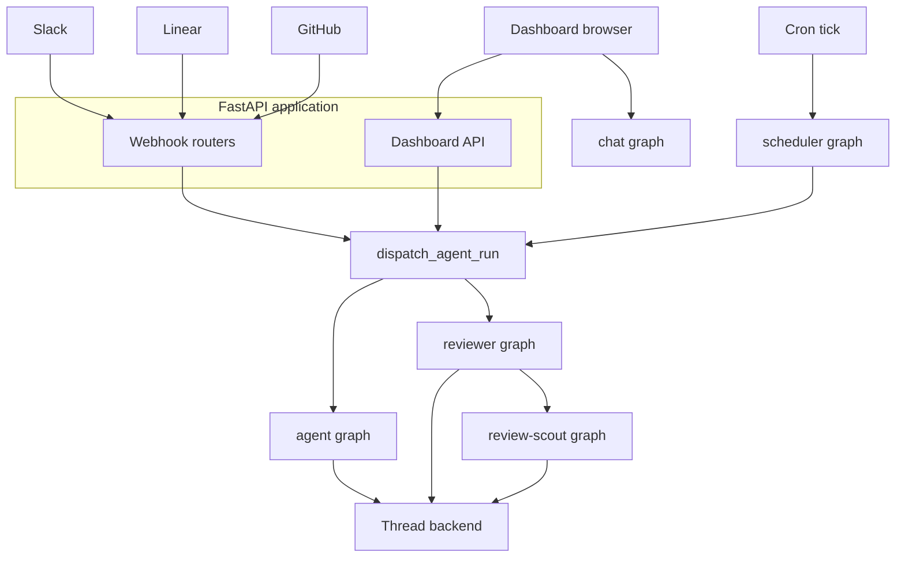

# Runtime and Product Architecture

Open SWE is a LangGraph deployment with a custom FastAPI application. FastAPI owns browser APIs, integration ingress, sandbox-facing HTTP endpoints, and static-dashboard mounting; LangGraph owns graph execution and checkpointed thread state. The cloud dashboard and the desktop application are separate clients of those runtime boundaries rather than alternate implementations of the agent.

## Deployment entrypoints

`langgraph.json` is the cloud manifest. It runs Python 3.14 and registers six stable thin entrypoints under `agent.graphs`: the coding `agent`, `reviewer`, review-style `analyzer`, `review-scout`, read-only PR `chat`, and `scheduler`. It mounts `agent.webapp:app`, which is only a compatibility re-export of the app assembled in `agent/api/app.py`.

| Graph | Entrypoint | Architectural role |
|---|---|---|
| `agent` | `agent.graphs.agent:traced_agent` | Thread-scoped coding agent. |
| `reviewer` | `agent.graphs.reviewer:traced_reviewer_agent` | Pull-request review and finding publication. |
| `analyzer` | `agent.graphs.analyzer:traced_analyzer` | Learns repository-specific review guidance. |
| `review-scout` | `agent.graphs.review_scout:traced_review_scout` | Produces and stores an ordered PR walkthrough before review. |
| `chat` | `agent.graphs.chat:traced_chat_agent` | Read-only chat about one PR. |
| `scheduler` | `agent.graphs.scheduler:get_scheduler` | Cron-tick maintenance and scheduled-work dispatcher. |

```mermaid
flowchart TD
  Slack["Slack"] --> Hooks["Webhook routers"]
  Linear["Linear"] --> Hooks
  GitHub["GitHub"] --> Hooks
  Browser["Dashboard browser"] --> Dash["Dashboard API"]
  Cron["Cron tick"] --> Scheduler["scheduler graph"]

  subgraph API["FastAPI application"]
    Hooks
    Dash
  end

  Hooks --> Dispatch["dispatch_agent_run"]
  Dash --> Dispatch
  Scheduler --> Dispatch
  Dispatch --> Agent["agent graph"]
  Dispatch --> Reviewer["reviewer graph"]
  Reviewer --> Scout["review-scout graph"]
  Agent --> Sandbox["Thread backend"]
  Reviewer --> Sandbox
  Scout --> Sandbox
  Browser --> Chat["chat graph"]
```

This shows the principal run-creation paths: durable dispatch is the shared boundary for coding and reviewer runs, whereas chat, analyzer, scout, and scheduler are separately registered graphs.

### Graph responsibilities and execution context

`agent.server:build_agent` creates a fresh deep-agent graph for an executable thread. It returns an intentionally empty no-backend agent when there is no thread ID or the graph is loading rather than executing; otherwise it resolves identity and settings and acquires the thread backend. Checkpointed LangGraph state and thread metadata outlive that factory result. See [Agent Graph](./agent-graph.md) and [Threads and State](../concepts/threads-and-state.md).

The reviewer prepares a deterministic checkout and computes the diff-line set before the model runs. Its review tools include finding creation, update, listing, and publication, rather than coding commit/push/PR-opening tools. The analyzer mines prior human feedback and finding outcomes to save a per-repository review-style prompt. The scout runs on its own PR-specific thread; it prepares a re-derivable review checkout, turns the PR change into ordered walkthrough steps, and persists them for the reviewer. Its sandbox may be replaced when unreachable because it contains only that reconstructed checkout.

PR chat is deliberately different: it has no sandbox. The dashboard proxy places diff, findings, and overview into virtual `/pr/` files in the graph's `files` state; filesystem mutation and shell tools are excluded, and GitHub tools receive a repository-scoped App token rather than a user credential.

The scheduler is a compiled one-node `StateGraph`. Its task selects reconciliation, watch evaluation, background-task monitoring, workspace refresh, session/agent cost refresh, feedback prompting, human-review deadlines, or a scheduled agent run. Missing required identifiers yields a status result; transient sandbox failures are retried and ultimately reported as `sandbox_unavailable`.

## HTTP composition and external ingress

`create_app` pins a single event loop before workers are constructed, then adds credentialed CORS, audit logging, tracing, request IDs, and dashboard UI mounting. CORS takes `DASHBOARD_ALLOWED_ORIGINS`, adds `open-swe://app` for the desktop client, and refuses wildcard origins with credentials. The app includes dashboard, plan, workflow approval, Linear, Slack, GitHub, health, sandbox-tool, and sandbox OpenAI-response routers.

Its lifespan is also operational startup: it validates GitHub login policy, sandbox and local LLM configuration, requires and migrates the database, imports legacy user/concierge data and automation workspaces, synchronizes configured admins, and tries to start analytics, transcript, and sandbox-bridge listeners. Some migration/listener/analytics failures are logged without stopping the service; shutdown stops listeners and analytics and closes the database.

The aggregate dashboard router is mounted below `/dashboard/api`; its mutation-origin dependency is applied to the whole aggregate. It owns browser-facing auth/profile/preferences, workspace and repository configuration, threads/transcripts, reviews, schedules, integrations, incidents, skills, analytics/audit logs, API keys, and bridge endpoints. It is lazily imported through `agent.dashboard.__getattr__`, preventing ordinary dashboard-submodule imports from pulling in all routes and jobs.

Slack, Linear, and GitHub routers validate and normalize events before their service work. They derive stable thread identities from their external conversation or issue/PR coordinates, so later activity finds the same LangGraph thread. Slack additionally has explicit routing rules for code channels, DMs, and concierge mode rather than treating every message as a new conversation.

## Durable work and backend lifecycle

`dispatch_agent_run` is the shared API used by Slack, Linear, GitHub, dashboard, and scheduled coding/reviewer triggers. `assistant_id` selects `agent` or `reviewer`; `source` supplies identity and metadata, not graph selection. It rejects an ambiguous mixture of a prebuilt input and independently supplied content or identities.

The durable defaults are `multitask_strategy="interrupt"`, synchronous checkpoint durability, resumable streams, all v3 stream modes, subgraph streaming, and the compatibility marker `__event_streaming_v2`. Thus a follow-up interrupts and resumes an active run from checkpoints, and the dashboard can replay and observe a run created by an external surface. A caller may choose another multitask strategy, such as `enqueue`, for background work.

Completion notification is optional: a completion webhook is attached only when `RUN_COMPLETE_WEBHOOK_SECRET` is present and `COMPLETION_WEBHOOK_URL` is absolute and non-loopback. Invalid notification configuration is logged and omitted rather than preventing run creation.

Sandbox connections are cached in-process by thread ID, while thread metadata stores the sandbox ID for reconnection after a worker change. An existing unreachable coding sandbox raises instead of silently being replaced, protecting uncommitted work; a deleted sandbox is recreated. Review-style callers can opt into replacement because their checkout is reconstructed. See [Invocation](../workflows/invocation.md) and [Deployment](../operations/deployment.md).

## Cloud and desktop surfaces

Cloud checkpointer retention uses a delete TTL strategy, a 60-minute sweep, and a 43,200-minute default. The deployment loads `.env`; its image build makes a best-effort dashboard build and continues as backend-only if it fails. The cloud manifest currently requests LangGraph API compatibility `>=0.15.0rc1`.

The separate `langgraph.desktop.json` registers only `agent`, disables Studio authentication through `agent.local_auth:auth`, uses a local SQLite checkpointer factory, and disables the bundled UI. Desktop runs are selected by `configurable.source == "desktop"`; they use `LocalShellBackend` only after `local_project_path` resolves to an existing allowlisted project or a path below `OPEN_SWE_LOCAL_WORKTREES_DIR`. Scratch routes for tool results, history, and blobs point outside the project, avoiding accidental inclusion by `git add -A`.

The Electron backend supervisor starts a local `langgraph dev` process on loopback with a random bearer token, a per-worker job count of 10, required project/worktree paths, and (when available) persistent artifact and checkpoint locations. It exposes that process to the desktop client under `/local-graph`, strips host and cookies when proxying, and authenticates each forwarded request with the generated bearer token. It waits for a healthy authenticated root response before publishing `{ apiUrl: "/local-graph", graphId: "agent" }`, and terminates the child on close after a timeout.

The `ui/` dashboard is a TanStack Router application. Its router uses Vite's base path, query integration, scroll restoration, intent preloading, and a common load-error boundary. The `/agents` layout requires a session except for enabled local desktop routes and chooses the appropriate route/session context for cloud or local agent work. See [Dashboard UI](../integrations/dashboard-ui.md).

## Safe change boundaries

- Add a deployable graph through `agent/graphs/` and the relevant manifest, but do not assume `dispatch_agent_run` can launch it: that contract is intentionally limited to `agent` and `reviewer`.
- Preserve CORS, same-origin mutation checks, and webhook validation when adding ingress; browser, desktop, and external traffic have different trust boundaries.
- Treat coding-sandbox replacement as data-loss-sensitive recovery. Changing it changes the working tree associated with a thread.
- Test externally initiated durable runs when changing stream configuration: resumability and v3-compatible fields are how the dashboard attaches after creation.
- Preserve desktop real-path allowlisting, loopback bearer authentication, and artifact routing when changing local execution.

Related pages: [Agent Graph](./agent-graph.md), [Threads and State](../concepts/threads-and-state.md), [Dashboard UI](../integrations/dashboard-ui.md), [Deployment](../operations/deployment.md), and [Invocation](../workflows/invocation.md).
