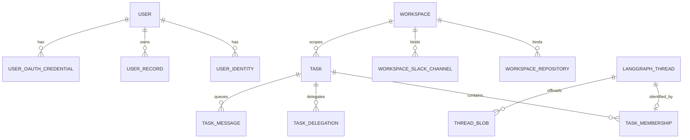

# Persistence, workspaces, threads, and tasks

Open SWE deliberately splits durable state by its operational owner. **LangGraph threads** hold the agent execution conversation, checkpoints/runs, and thread metadata used to find and authorize an active conversation. The **LangGraph Store** remains the small document store for plan-review artifacts and comments. **PostgreSQL** is the relational system of record for cross-thread, queryable, security-sensitive, or independently retained data: people and provider identities, encrypted OAuth credentials, workspaces and their bindings/snapshot lifecycle, the UI transcript/event model, offloaded thread blobs, task coordination, and durable task-message delivery.

This is not a rule that every thread-associated datum belongs in LangGraph. A sandbox filesystem is live workspace state, while PostgreSQL retains selected artifacts and transcript data after a sandbox is unavailable. A worker task therefore joins both systems: its LangGraph thread executes the work; PostgreSQL authorizes the worker’s permanent relationship to its coordinator and reliably holds messages awaiting delivery.

*PostgreSQL owns the relational rows shown above; `LANGGRAPH_THREAD` is an external LangGraph durable thread identified by `thread_id`, not a PostgreSQL foreign-key table.*

## Ownership boundaries

| Durable state | Owner and reason | Important access path |
| --- | --- | --- |
| Agent messages, execution/checkpoint state, run status, and thread metadata | LangGraph thread service; these are the execution unit and are created through `create_thread`. | `langgraph_client().threads` and `.runs`; creation requires a nonblank title. |
| Published plan HTML/Markdown, dismissal revision, and plan-review comments | LangGraph Store; a plan is also mirrored as an HTML file in the sandbox. Store failure does not prevent the best-effort sandbox mirror. | `openswe.threads.plan_store` namespaces `plan/content`, `plan/comments`, and `plan/dismissed`. |
| Thread transcript event log, read projections, turn/checkpoint references, attachments, and complete tool output | PostgreSQL; an append-only `thread_event` log is the transcript source of truth, while the related tables make UI reads efficient. | `openswe.transcript` writers/readers and the `thread*` migration tables. |
| Deepagents binary/offloaded content | PostgreSQL `thread_blob`, keyed by `(thread_id, path)`, rather than thread state or the legacy Store. | `ThreadBlobs`, with copy-on-thread duplication for referenced digests. |
| Users, provider identities, preferences/profiles/instructions/tokens, OAuth credentials | PostgreSQL; identities use provider immutable external IDs and durable records resolve a mutable GitHub login to `users.id`. | `User`, `UserRecords`, and OAuth credential functions. |
| Workspaces, repository/channel bindings, snapshot and refresh state | PostgreSQL; it supports uniqueness, live routing lookups, and concurrent definition versus refresh updates. | `WORKSPACES` / `WorkspaceStore`. |
| Task coordinator/worker membership, delegation attributes, queued task messages | PostgreSQL; relationships and idempotent delivery must outlive an individual LangGraph run. | `Task`, `TaskMembership`, `TaskDelegation`, and `TaskMessage`. |

## PostgreSQL runtime and migrations

`POSTGRES_URI` is mandatory for normal application startup because repository and pull-request records are PostgreSQL-backed. The URI accepts `postgres://` or `postgresql://` and is normalized to the asyncpg SQLAlchemy driver; an invalid non-PostgreSQL scheme is rejected. Connections set `open_swe, public` as their search path. The engine uses pre-ping and configurable pool size, overflow, timeout, and slow-query threshold settings.

At application startup, `database.migrate()` creates the `open_swe` schema if needed and upgrades Alembic heads while holding one transaction-scoped PostgreSQL advisory lock. That serializes concurrent replicas attempting initialization. Migrations run transaction-per-revision; preview deployments additionally discard stamped revisions superseded by a rebase. Production downgrades are intentionally not implemented by the migrations examined here.

Use `transaction()` for writes and `read_only_transaction()` for a read-only unit of work. For a multi-query view that must agree with an event stream, use `snapshot_transaction()`: it is repeatable-read and read-only, avoiding the per-statement snapshots of read committed. The focused database test verifies that read-only transactions reject writes and that their cleanup releases session state.

PostgreSQL notifications are an optimization, not durable delivery. Each process has one reconnecting `asyncpg` listener shared by channels. Notifications missed while disconnected are lost, so a channel may supply an `on_connected` catch-up coroutine; handler or catch-up failure is contained to that channel rather than tearing down the shared listener.

## Workspaces: authoritative routing and immutable boot inputs

A workspace combines an agent prompt, sandbox setup/update scripts, optional base snapshot and sizing/create parameters, repository bindings, Slack-channel bindings, and capture/refresh status. `WorkspaceRow` separates editable definition fields from snapshot/refresh state fields. This matters operationally: an administrator editing a workspace while a minutes-long refresh runs cannot have either writer restore stale values from the other category.

Repository and Slack bindings are modeled as separate tables keyed by the *bound resource*, not the workspace. Consequently the database enforces that a repository or channel belongs to only one workspace; application prechecks improve the error message, while constraints resolve races. A kitchen channel must also be a channel bound to the same workspace. Repository-level `may_start_threads` is a separate privilege: a binding alone does not authorize federated GitHub Actions OIDC to start a thread.

### Routing precedence and outage policy

Callers use `resolve_workspace()` rather than reconstructing selection. The first applicable answer wins:

1. a workspace already stamped on the thread;
2. a valid opening-message workspace tag;
3. the Slack channel’s owner;
4. the repository owner;
5. the user’s existing default workspace; or
6. the instance `default` workspace.

The channel deliberately outranks the repository: each workspace may use any repository, so a message sent in a workspace channel stays in that workspace. Tags and user defaults are accepted only when the workspace slug exists. `OPEN_SWE_UNASSIGNED_REPO_WORKSPACE` controls unassigned GitHub repositories: `default` routes them normally and `ignore` declines them.

A failed workspace lookup is not equivalent to an unbound resource. `repo_is_routable()` propagates `WorkspaceLookupError` so the GitHub webhook boundary can return a retryable failure rather than permanently drop an event. Other routing functions log and fall back to `default`, preferring a default-workspace run to no run. Tests cover precedence, immediate visibility of live database changes, the unassigned policy, and the distinct failure behaviors.

### Snapshot and refresh lifecycle

Setup and update scripts define a reproducible workspace image. Refresh runs them in a throwaway sandbox, captures the result under the workspace’s stable Docker-style snapshot name with the `latest` tag, records progress/log/error metadata, and removes the superseded image after a successful replacement. Runs boot from the recorded immutable `snapshot_id`, never the movable tag.

`ready_snapshot_id` keeps returning the prior snapshot while a new capture is in progress. A failed recapture therefore leaves the previous image usable and records the error rather than unexpectedly dropping new work to a base image. Workspace `create_params` are size-limited JSON and reject names that imply secrets or credentials, including sensitive proxy headers; script traces can expose command-line arguments, so refresh-log excerpts are restricted to the admin view.

## People and credentials

`users` represents a person by UUIDv7, and `user_identity` maps an immutable `(provider, external_id)`—currently GitHub or Slack—to that person. Mutable login, email, team ID, and last-seen data are attributes, not identity keys. This permits a renamed GitHub account or linked Slack account to remain the same person. A new person can be established only by an authorized GitHub login; Slack accounts are linked to an existing user instead. The identity claim/upsert handles concurrent first sign-ins by removing the speculative losing `users` row.

Per-person JSON records have `(user_id, kind, key)` identity. APIs accepting a GitHub login resolve it to the user ID and refuse a write for an unknown user, rather than persisting under an account handle that can change. These records contain migrated profile, GitHub OAuth-token, preference, and instruction data.

Third-party OAuth credentials live separately in `user_oauth_credential`, one row per person and provider. Access/refresh tokens and dynamic-client secrets arrive encrypted and are not decrypted by the persistence module. Credential refresh callers must hold their refresh guard around read and write, preventing two workers from reusing a rotated refresh token. Deleting a user cascades to identities, records, and credentials.

## Threads, artifacts, and retained transcript data

`create_thread()` is the single creation gateway for openable threads: it stamps a required title and optionally snapshots the owner preference for tools-in-sandbox. `if_exists="do_nothing"` does not overwrite an existing thread’s metadata. Thread metadata remains important as a durable routing/authorization boundary—for example, a task worker verifies its persisted metadata against its delegation before it can proceed.

The PostgreSQL transcript schema is separate from LangGraph’s execution state. `thread_event` is append-only and authoritative; `thread.version` advances per thread so readers can resume on `version > after`. `thread`, `thread_turn`, messages, tool calls, checkpoint references, attachments, and tool-output tables support efficient UI and artifact reads. In particular, attachment bytes and full tool output are outside the replayable event payload, keeping replay small; a turn checkpoint retains enough sandbox commit/reference information for later diffs even when the sandbox is gone.

Deepagents offloads binary content through `ThreadBlobs`, an `AgentStore` implementation backed by PostgreSQL. Reads, puts, deletes, and ordered searches are scoped to the thread; only dictionary values are supported. When a thread is copied, referenced SHA-256 blob paths are copied idempotently into the target thread. This data was moved from the LangGraph Store; its importer inserts PostgreSQL rows before deleting the legacy Store entries.

Plan review is the intentional Store exception. The published content is one record per thread, comments are individual entries, and a new published revision normally clears comments. The same plan is best-effort mirrored to `/workspace/plans/...` in the live sandbox; the published Store copy remains usable if that sandbox write fails. Updating plan status also merges the corresponding metadata into the LangGraph thread.

## Delegated tasks and durable notifications

A task belongs to exactly one workspace and connects one coordinator thread with zero or more worker threads. `TaskMembership.thread_id` is globally unique, so a thread cannot join two tasks. The schema additionally enforces one coordinator membership per task and foreign-key consistency between a task’s coordinator pointer, memberships, and delegations.

`spawn_worker` first authenticates the owner and verifies that the coordinator can read and post to the thread, has task coordination enabled, is not itself a sandbox guest, and has an attached sandbox. It resolves the workspace, validates model/effort against workspace choices, then derives a deterministic worker thread UUID from the coordinator thread and stable tool-call ID. `reserve_worker` serializes coordination per coordinator with an advisory transaction lock and makes that identity idempotent. It rejects a reused worker identity belonging to another task, a non-coordinator delegation, a vanished workspace, or a thread that moved workspaces.

After reservation, the worker LangGraph thread is created with copied owner/access/repository/sandbox metadata plus task-specific metadata. The service re-reads and compares security-sensitive fields; a conflict becomes a permanent launch error. It records the initial assignment before asking LangGraph to enqueue it. Launch errors are persisted and a retry resets initial-message attempts; cancellation marks the delegation, removes subscriptions and queued task messages, interrupts live runs, and cancels scheduled wakeups.

Task communication uses an outbox-like `task_message` row before a run is requested. A deterministic UUID and unique `(thread_id, delivery_id)` make each message idempotent. A recipient reads unacknowledged rows; message IDs found in its checkpointed state are marked delivered, otherwise they are supplied to a durable run. Delivery holds a per-recipient advisory lock, respects cancellation and busy-thread enqueue behavior, batches owed messages, and caps attempts at three. Delivered messages are retained for seven days before cleanup. If immediate dispatch fails after the row is saved, the sender receives a successful-but-pending result instead of being encouraged to duplicate the message.

When a worker reaches a terminal run status, its result is sent durably to the coordinator. If extracting the final answer fails, the coordinator still receives a completion notice directing it to inspect the worker thread. Cancelled workers suppress non-interrupted outcomes; otherwise, after notifying the coordinator, pending task and event-subscription delivery to the worker is attempted.

## Store-to-PostgreSQL migrations and operational checks

Several features were deliberately moved out of the LangGraph Store. Startup runs importers for user mappings, concierge preferences, user records, automations, skills, and asynchronously for thread blobs. Imports use a `store_import` progress row and `FOR UPDATE SKIP LOCKED`, so only one replica performs a named import. A pass completes only when it moves nothing, waits for no unresolved dependencies, and the last movement was over a day ago—allowing old replicas to finish writing during a rollout. PostgreSQL data wins if already present; user records whose users have not signed in remain in the Store for a future pass. Pending OAuth flows are intentionally not migrated because they expire quickly.

For operations and safe changes:

- Configure `POSTGRES_URI`; validate connectivity and migration permissions before serving traffic. Monitor slow-query warnings through `POSTGRES_SLOW_QUERY_MS` and size the engine with the `ANALYTICS_POOL_*` settings.
- Treat workspace scripts and `create_params` as administrative configuration, never credential storage. Inspect refresh logs only with their sensitive-data risk in mind.
- Preserve transactional and uniqueness constraints when extending workspaces or tasks. Do not replace repository/channel primary-key ownership with a best-effort cache.
- Make cross-thread sends idempotent and persist them before dispatching. PostgreSQL `NOTIFY` can accelerate readers but cannot substitute for the durable outbox or reconnect catch-up.
- Add an Alembic migration for PostgreSQL schema changes; startup automatically serializes upgrades across replicas. Extend the focused workspace tests for routing order, ownership races, snapshot fallback, or definition/state concurrency, and add task delivery tests when changing acknowledgment or retry behavior.
