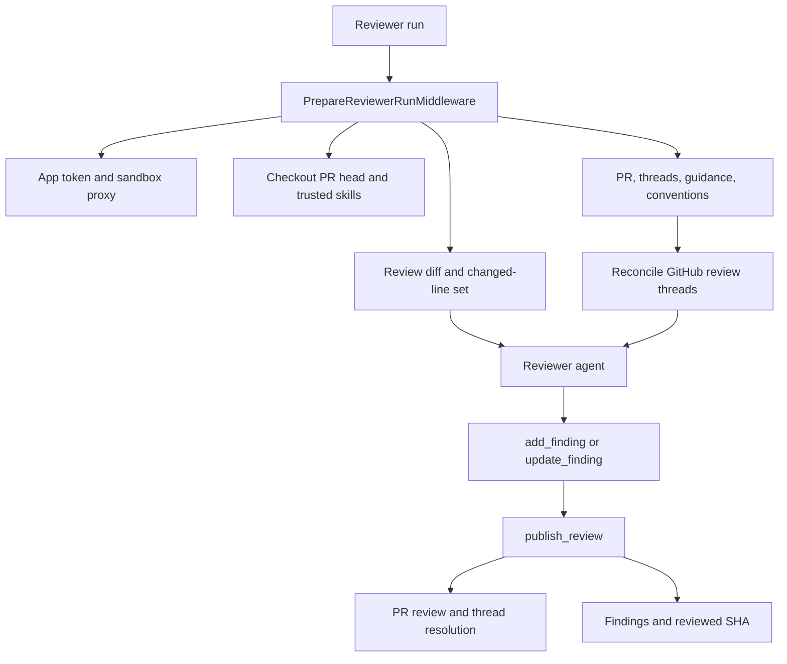
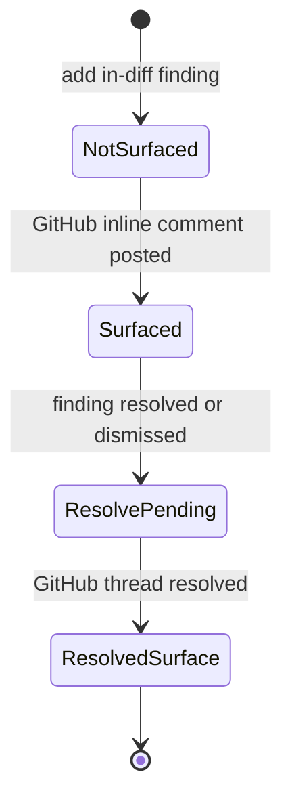

# Review and Style Analysis Graphs

Open SWE exposes two specialized deep-agent graphs: `reviewer` (`agent.graphs.reviewer:traced_reviewer_agent`) and `analyzer` (`agent.graphs.analyzer:traced_analyzer`). The reviewer evaluates a GitHub pull request using durable, per-PR findings; the analyzer learns a repository-specific supplement to that review policy. They share sandbox infrastructure but have deliberately different authority, state, and entry paths.

For trigger routing and webhook behavior, see [PR Review Workflow](../workflows/pr-review.md). For sandbox provider and recovery behavior, see [Sandbox Lifecycle](sandbox-lifecycle.md), and for the broader tool catalog, see [Tools](../concepts/tools.md).

## Reviewer: constrained PR assessment

### Authority boundary and construction

The reviewer is read-only with respect to the repository. Its system prompt prohibits commits, pushes, and direct `gh pr review` or review-API calls. It has no coding, commit, push, or PR-opening tools: repository changes cannot be an agent action. GitHub review mutation is centralized in `publish_review` and the finding-thread tools.

`get_reviewer_agent(config)` creates the graph per run. It shallow-copies the outer config and its `configurable` mapping before supplying a default recursion limit, preserving the caller's configuration. If the run has no `thread_id`, or the graph is not loaded for execution, it deliberately returns an empty deep agent rather than provisioning a sandbox.

For an executable run, the factory selects reviewer and subagent models from explicit configuration or team defaults, applies the Fable model gate, and attaches a cached sandbox backend with a reconnect closure. Its explicit tools are:

- review lifecycle: `fetch_review_diff`, `add_finding`, `update_finding`, `list_findings`, `publish_review`, `resolve_finding_thread`, and `reply_to_finding_thread`;
- read-only external helpers: `web_search`, `fetch_url`, and `http_request`.

It permits one `reviewer` subagent. The parent assigns a disjoint file partition; the subagent returns only candidate defects and has neither finding nor publication tools. The parent remains responsible for validation, persistence, and publication.

### Run preparation, GitHub access, and context

`PrepareReviewerRunMiddleware` performs deterministic setup before the first model call. For a configured source repository it mints a repository-scoped GitHub App installation token, caches it as the thread's bot token, and supplies it to the sandbox GitHub proxy. It then ensures a sandbox with `allow_replacement=True`, clones or fetches the repository, force-checks out the PR head, and materializes trusted repository skills from the base revision.

The middleware computes the review range and its unified diff, including delta-only re-review ranges, then derives the changed `(file, side, line)` set. It puts `diff_text` and `diff_line_set` in run state. This lets `add_finding` reject invalid anchors at creation time rather than waiting for GitHub to reject a batch.

In parallel, preparation fetches PR title and body, existing GitHub review threads, saved repository style, organization guidelines, root and scoped `AGENTS.md`/`CLAUDE.md` from the base SHA, an API standards skill, and optional author trace context. Existing threads are reconciled before their prompt block is rendered. Once the diff is available, scoped instructions are selected for changed files. The rendered prompt then selects first-review, re-review, or finding-reply guidance. Diff grouping is started as a background best-effort task and never blocks the review.

Reviewer setup and publication flow. Context retrieval is concurrent during preparation; reconciliation runs while loading the existing-thread context.

If sandbox replacement itself fails with `SandboxUnreachableError`, preparation posts a typed unreachable-sandbox notification on the PR and fails the run instead of silently leaving it unreviewed. This replacement policy is safe because the checkout is re-derived each run and findings are not sandbox state.

### Prompt and input-safety constraints

The prompt requires a concrete, changed-line-anchored failure mode and rejects speculation, ordinary style or naming nits, pre-existing defects, and duplicate fan-out for one defect across files. Explicit repository convention violations remain reviewable when they are anchored in the diff and have a concrete failure mode. Suggestions are restricted to small, obvious fixes.

PR title/body, existing review-thread comments, and finding replies are attacker-controlled GitHub content. The renderer places them in XML data blocks, treats their contents as data rather than instructions, validates login attributes against the GitHub login grammar, and neutralizes wrapper closing tags with `_escape_for_data_block`. Author trace context is also explicitly untrusted and must not be published.

### Durable finding lifecycle

Findings are stored in LangGraph metadata on the deterministic reviewer thread, rather than in the sandbox. `reviewer_thread_id(owner, repo, pr_number)` uses UUID5, allowing webhooks, dashboard code, and runs to retrieve the same one-per-PR thread across pushes. `set_reviewer_thread_metadata` writes `kind: "reviewer"`; that tag supports cross-thread lookup for the UI and usage aggregation.

A `Finding` records its location and side, severity and confidence, title/description/suggestion, diff membership and hunk, status, first and last-confirmed SHAs, publication identities, surface state, human-reply/reconciliation fields, fingerprint, and interaction history. Legacy persisted shapes are normalized on read. Surface state is monotonic: normalization resolves contradictory legacy data by retaining the furthest state.

Surface state moves forward independently of the finding's `open`, `resolved`, or `dismissed` status.

`add_finding` validates title, severity, confidence, side, and ordered line range. It resolves diff context from injected run state first, then `configurable`, then a fresh authenticated PR diff. A line-anchored range absent from the relevant diff side returns `success: false` and `in_diff: false`; the prompt tells the model not to re-anchor or retry. File-level findings are accepted but do not render inline. Successful findings retain an extracted diff hunk when diff text is available, clip suggestions beyond four lines, and deduplicate through their content fingerprint.

Before every normal run, `reconcile_findings_with_review_threads` matches findings to GitHub threads first by embedded marker, then recorded thread or comment identity. It backfills comment/thread IDs and marks matched findings surfaced. A finding becomes resolved only when all matched threads are resolved; outdated-but-not-resolved threads do not resolve it. The latest non-bot reply after the bot comment is retained as a `human_reply` interaction with `needs_reassessment`, giving a subsequent re-review a durable reason to reconsider.

### Publication and failure semantics

`publish_review` filters unpublished, in-diff, open findings at or above its severity threshold (default `medium`) and caps the batch at `REVIEW_FINDING_CAP` (6). A call posts one GitHub PR Review containing a fixed host-generated summary and one inline comment per renderable finding; a suggestion becomes a fenced `suggestion` block. Each comment includes an `open-swe-review-comment` JSON marker with finding identity and anchor metadata, which supports reconciliation and recovery of lost IDs.

On successful publication, the tool records review/comment/thread identities, resolves threads for resolved findings through GraphQL `resolveReviewThread`, advances `last_reviewed_sha`, records usage, clears the started-review comment, and settles the GitHub review check. On re-review, already published findings are not posted again, and a run with no new inline comments can intentionally skip a duplicate empty review while still resolving threads and advancing state.

Callers must inspect the structured result: `success: true` with `review_id: null` and `skipped_empty_re_review: true` is a valid no-post outcome; `dry_run: true` is evaluation simulation. A numeric `review_id` confirms a real review. If GitHub reports an unresolved anchor, the tool filters invalid findings and retries once with valid anchors when possible; otherwise it returns `unresolvable_findings` and a remediation hint, avoiding blind retries. Missing durable thread state is similarly a structured do-not-retry result.

## Analyzer: repository review-style learning

### Graph and sandbox model

The analyzer creates a repository-specific review-style prompt for the reviewer. Its preparation resolves the repository identity and mode, ensures a sandbox, and configures the LangSmith GitHub proxy with either the dashboard-provided OAuth token or a GitHub App installation token. The analyzer has just two domain tools: `read_finding_outcomes` and `save_review_style_prompt`. It has an 80-model-call limit plus input sanitization, tool-error, timeout, and response-sanitization middleware.

Like the reviewer, `get_analyzer` returns an empty agent when no `thread_id` is supplied or graph execution is disabled. Unlike the reviewer factory, it writes the default recursion limit directly into its incoming config; callers that need configuration isolation should not assume the reviewer behavior applies here.

`analyzer_mode` selects a virtual playbook:

- **`bootstrap`** uses `bootstrap-repo-analysis`. It is a cold-start procedure: collect and extend historical merged-PR feedback using `gh`, seek substantive human comments and reviewer norms, then synthesize an initial prompt.
- **`continual`** uses `continual-learning`. It reads confirmed and dismissed reviewer outcomes, promotes recurring confirmed patterns, demotes recurring false-positive patterns, and refines rather than replaces the current prompt.

The base prompt directs the model to the mode playbook and supplies `REVIEWER_STYLE_THEMES`, so learned advice stays bounded by the reviewer's high-signal, diff-anchored policy. The playbook, not the short base prompt, defines the operational procedure.

Both playbooks are packaged as virtual files. Launchers seed `build_skill_files()` into the input `files` channel; `get_analyzer` mounts a `StateBackend` at `/skills/` in a `CompositeBackend`. The agent reads `/skills/<name>/SKILL.md`, while the backend receives prefix-stripped paths. This avoids writing bundled procedural content into the execution sandbox.

### Style store and launch paths

`REVIEW_STYLES`, a typed store in the `review_styles` namespace keyed by `owner/repo`, owns a `ReviewStyle` record: analysis status, saved prompt and summary, sampled-reviewer/count metadata, analysis thread/run IDs, cron ID, error, and audit timestamps. The reviewer retrieves `custom_prompt` fail-soft during preparation: a store failure omits style guidance rather than failing a PR review. When available, it is appended under **Repository-specific review style**, and applies only when consistent with the global review bar.

`start_bootstrap_analysis` first collects review samples with the caller's GitHub token, marks the record running, then creates a durable analyzer run on `review_style_thread_id(owner, repo)`. It passes samples, counts, reviewers, OAuth token, bootstrap mode, and virtual skill files. Collection or durable-run startup failures mark the style record failed. `start_continual_run` creates an immediate outcome-driven durable run using the same deterministic style thread.

The terminal tool, `save_review_style_prompt`, requires a nonempty `custom_prompt` and `review_style_full_name`; it persists the trimmed prompt, summary, reviewers, and sample counts as a completed record. Empty output marks the record failed. After saving, it attempts cron registration but does not undo the saved style if registration fails.

### Continual cron operations

A successful save calls `ensure_continual_cron`. If the style record already has a cron ID, registration is idempotent. Otherwise it creates a daily LangGraph cron targeting `analyzer`, with `kind: "analyzer_continual"` metadata and a stable SHA-256-derived time between 05:00 and 08:59 UTC, then stores the returned cron ID. `remove_continual_cron` deletes a registered remote cron best-effort and clears the stored ID.

The cron itself is threadless, but its configurable explicitly provides the deterministic `review_style_thread_id` because the analyzer otherwise creates an empty graph. Its input contains no accumulating message history, while the shared thread still keys sandbox and metadata by repository. The scheduled configurable selects `continual`, and because it supplies no fresh user token, analyzer preparation obtains an App installation token. The same input seeds the bundled skills required by the playbook.

## Focused tests

The reviewer suite covers config isolation, diff and tool validation (including LEFT-side anchors), durable finding behavior, publishing and marker rendering, reconciliation, background diff groups, trace context, trigger/watch behavior, and review API/chat paths. In particular, `test_factory_config_isolation.py` protects the reviewer config-copy invariant; `test_reviewer_tools.py` exercises validation and persistence decisions; `test_reviewer_reconcile.py` covers marker backfill and terminal-thread rules; and `test_reviewer_publish.py` covers rendered markers and suggestions. `tests/analyzer/test_analyzer_cron.py` verifies cron creation, idempotence, removal, seeded continual skill files, explicit thread configuration, and the deterministic schedule window.
