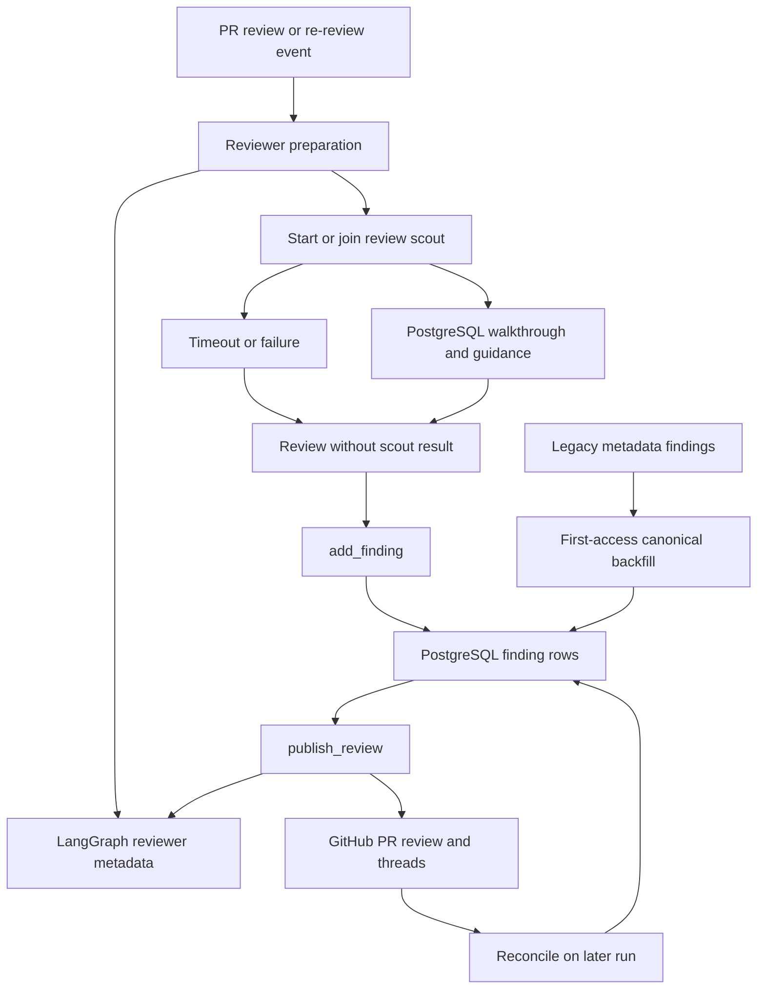

# Review, Style Analysis, and Review Scout Graphs

Open SWE registers three specialized LangGraph deep-agent graphs: `reviewer`, `analyzer`, and `review-scout`. They are deliberately different roles: the reviewer assesses and publishes a pull-request review; the analyzer learns a bounded, repository-specific review-style supplement; and the scout makes a review walkthrough and identifies author steering that materially changed the PR. The reviewer invokes the scout as an upstream aid, but a scout result is not a prerequisite for review completion.

For trigger routing and webhook behavior, see [PR Review Workflow](../workflows/pr-review.md). For sandbox replacement and lifecycle context, see [Sandbox Lifecycle](sandbox-lifecycle.md). For model/profile and instruction context, see [Models, Profiles, and Instructions](../concepts/models-profiles-instructions.md), and for the broader tool boundary, see [Tools](../concepts/tools.md).

## Responsibilities and authority boundaries

| Graph | Durable unit and primary output | Authority boundary |
| --- | --- | --- |
| `reviewer` | A deterministic reviewer thread per PR, PostgreSQL findings, and an optional GitHub PR Review | Cannot modify the repository: its tool set has no coding, commit, push, or PR-opening tool. GitHub review mutations go through its constrained finding and publication tools. |
| `analyzer` | A per-repository `ReviewStyle` record and a learned prompt supplement | It has only `read_finding_outcomes` and `save_review_style_prompt` as domain tools. Its output refines the reviewer's policy; it does not review or publish a PR. |
| `review-scout` | A walkthrough and author-guidance records pinned to one PR head SHA | It may create temporary local commits only to divide the checked-out diff into reading steps. It has no finding or GitHub-publication tool. |

All three factories return an empty deep agent when no `thread_id` is supplied or the graph is not loaded for execution. The reviewer and scout copy the config and `configurable` mapping before defaulting `recursion_limit`; the analyzer instead writes its default recursion limit into the incoming config. Do not rely on the reviewer’s config-isolation behavior when calling the analyzer.

## Reviewer: read-only assessment with controlled publication

`get_reviewer_agent` builds a graph for an executable run with review-specific tools—`fetch_review_diff`, finding lifecycle tools, `publish_review`, finding-thread resolution/reply tools, and read-only web helpers—and one `reviewer` subagent. The subagent is given a disjoint file partition and returns candidate defects; because it has no finding or publication tools, the parent alone validates, persists, ranks, and publishes findings.

Before the first model call, `PrepareReviewerRunMiddleware` provisions a sandbox. For source-driven runs it obtains a repository-scoped GitHub App installation token, caches it as the thread’s bot token, and configures the proxy; it then clones or fetches and checks out the requested PR head. Trusted repository skills are materialized from the base SHA, not the PR head. The sandbox is replaceable because its checkout is recreated every run. If replacement also fails with `SandboxUnreachableError`, the middleware posts an unreachable-sandbox notification and fails rather than silently abandoning the PR.

Preparation concurrently obtains the PR overview, GitHub review threads, repository style prompt, organization guidelines, root instructions, API standards, and the scout result. It materializes either the full or delta re-review diff and builds a changed-line set. That `diff_text` and `diff_line_set` state lets `add_finding` reject an invalid line anchor before publication. Existing GitHub threads are reconciled before they are rendered into the prompt. PR text, thread comments, and finding replies are placed in data blocks with closing tags neutralized, while login attributes are grammar-validated; they are content, not instructions.

`add_finding` validates severity, confidence, side, title, and ordered line range. It uses injected run state first, then configurable values, then an authenticated fresh diff to establish whether the anchor is in the diff. An out-of-diff result is explicitly `success: false, in_diff: false` and tells the model not to re-anchor or retry. Successful additions retain a diff hunk when available, cap suggestions at four lines, and are idempotent by a normalized content fingerprint among open findings.

### Finding state, storage migration, and publication

Findings are **not** durable LangGraph metadata in the current design. The canonical `Finding` rows and their interaction rows live in PostgreSQL under a pull request; `pull_request_finding_state` links that PR to the reviewer thread. LangGraph reviewer-thread metadata instead holds routing/lifecycle information such as `kind: reviewer`, PR identity, current and last-reviewed SHA, watch flag, and optional check/run references. This separation permits findings to outlive sandbox and checkpoint eviction while keeping webhook dispatch and UI thread discovery metadata-addressable.

Legacy data remains readable: when a reviewer thread has no PostgreSQL state, its first findings access reads legacy `metadata.findings`, creates the PR state row, and copies canonicalized records. The unique PR state makes the backfill one-time; concurrent creators use an insert conflict path and the losing caller reads the existing state. On each mutation, the state row is locked, the latest rows are reread, and only changed rows are written, preventing a stale snapshot from discarding concurrently added findings. A missing LangGraph thread is converted to a structured `thread_not_found` do-not-retry tool result rather than being mistaken for an empty finding set.

Reviewer control flow and persistence boundaries. Findings and scout products are stored in PostgreSQL; LangGraph metadata identifies and coordinates the reviewer thread. Legacy metadata findings are copied once, and finding writes use locked, current-state mutation for idempotent/concurrent-safe behavior.

A finding includes its anchor, severity/confidence/category, description and optional suggestion, first/last-confirmed SHAs, GitHub identities, surface state, reconciliation fields, diff hunk, fingerprint, rank, and interaction history. Publication surface state moves forward from `not_surfaced` through `surfaced` and resolution states, so legacy normalization keeps the furthest state when old fields conflict.

`publish_review` requires a ranking that lists each expected finding exactly once. It selects unpublished, open, in-diff findings at or above the threshold, renders line-anchored entries, and posts a single GitHub review. Default threshold is `medium`; normal publication is not capped by `filter_findings_for_publish`, while evaluation uses `REVIEW_FINDING_CAP`. Each inline comment embeds an `open-swe-review-comment` JSON marker. Publication writes GitHub identities back to PostgreSQL, resolves eligible threads with GraphQL, advances `last_reviewed_sha` in LangGraph metadata, and settles the check. A successful empty re-review has `review_id: null` plus `skipped_empty_re_review: true`; evaluation returns `dry_run: true`. Callers must inspect those fields rather than treating `success` alone as proof that GitHub received a new review.

On later preparation, reconciliation locates GitHub threads by marker before stored IDs, backfills identities, and records human replies as `needs_reassessment` interactions. It marks a finding resolved only when all matched threads are resolved; an outdated-but-unresolved thread does not resolve the finding. Watch-mode push handling only starts a re-review for a reviewer thread whose `watch` metadata is true and whose head/diff needs review; it updates live `head_sha` metadata so an in-flight run can avoid publishing against stale frozen configuration.

## Analyzer: a bounded repository-style feedback loop

The analyzer produces a repository-specific supplement, not an alternate review policy. Its base prompt directs it to a virtual playbook and exposes `REVIEWER_STYLE_THEMES`, while the reviewer injects the saved prompt only under **Repository-specific review style** and only when it agrees with the global review bar.

`analyzer_mode` selects one of two bundled skills:

- **`bootstrap`** collects and mines historical merged-PR human review feedback to establish a cold-start style profile.
- **`continual`** reads recorded reviewer finding outcomes to promote recurring useful patterns and demote recurring false positives while refining the saved prompt.

The launch input seeds these `SKILL.md` playbooks in its `files` channel. The analyzer mounts a `StateBackend` at `/skills/` in a `CompositeBackend`, so SkillsMiddleware reads them as virtual files rather than copying the procedures into the execution sandbox.

`REVIEW_STYLES` is a typed `review_styles` store keyed by `owner/repo`. A `ReviewStyle` records analysis status, prompt, approval policy, analysis summary, sampling metadata, analyzer thread/run IDs, continual-cron ID, error, and timestamps. Reviewer lookup is intentionally fail-soft: a store error means no learned supplement, not a failed PR review. Bootstrap first collects samples and marks the record running before creating its durable analyzer run; collection or startup failure marks it failed. Continual runs reuse the deterministic review-style thread. The terminal `save_review_style_prompt` rejects empty output, saves a completed record, then attempts idempotent cron registration without rolling back a successfully saved prompt if cron creation fails.

A per-repository continual cron is registered once after a saved prompt. Its SHA-256-derived daily schedule is spread across 05:00–08:59 UTC. Although the cron request is threadless and supplies no accumulating message history, its configurable explicitly supplies the deterministic review-style `thread_id`; without it the analyzer would return an empty agent. Removing a cron is best-effort and clears the stored cron ID.

## Review scout: walkthrough and author steering

The reviewer starts or joins a scout keyed by a deterministic per-PR scout thread and waits up to `SCOUT_WAIT_SECONDS` (600 seconds) for a walkthrough for the exact head SHA. An existing matching walkthrough is reused. An active run on the same head is joined rather than duplicated; a newer-head run supersedes an older run so stale walkthroughs are not written. If PostgreSQL is unavailable, data is incomplete, the run fails, or the wait expires, the reviewer continues without the walkthrough while the scout may still finish for the review page.

Scout preparation uses a replaceable, App-token-backed sandbox and checks out the PR. It creates an isolated working tree, asks the model to stage logical groups, and `commit_walkthrough_step` makes bounded-title temporary commits. After the agent, finalization maps those commits back to PR diff ranges and replaces the PostgreSQL walkthrough for that PR with an ordered, head- and merge-base-pinned set of steps. It stores nothing when no non-`other` step was produced. The temporary commits are a parsing mechanism, not repository publication.

The scout also reads qualifying human follow-up messages from checkpointed source-agent threads. It can call `record_guidance` only with a quote that matches a stored human turn, preventing diff text from impersonating author instruction. Guidance records are upserted by PR and quote hash and scoped to the scouted head; the visible guidance is exactly the set backed by the most recently completed scout head. Re-running a scout can therefore carry a reaffirmed point forward or make an old point disappear without an explicit delete. The reviewer waits for the scout before loading this guidance and adds it, when available, to its review context.

## Focused verification

`tests/reviewer/test_reviewer_findings.py` exercises PostgreSQL ownership, first-access metadata backfill, canonical legacy-shape normalization, idempotent concurrent insertion, and latest-state mutation semantics. `tests/reviewer/test_reviewer_watch.py` verifies watch gating, unchanged-diff/no-op behavior, re-review configuration, live-head metadata updates, check-run behavior, token scoping, and close/reopen watch transitions. When changing the scout, also test same-head joining, stale-head prevention, timeout fallback, and head-pinned walkthrough/guidance persistence; when changing publication, preserve the marker-first reconciliation and structured no-post outcomes.
