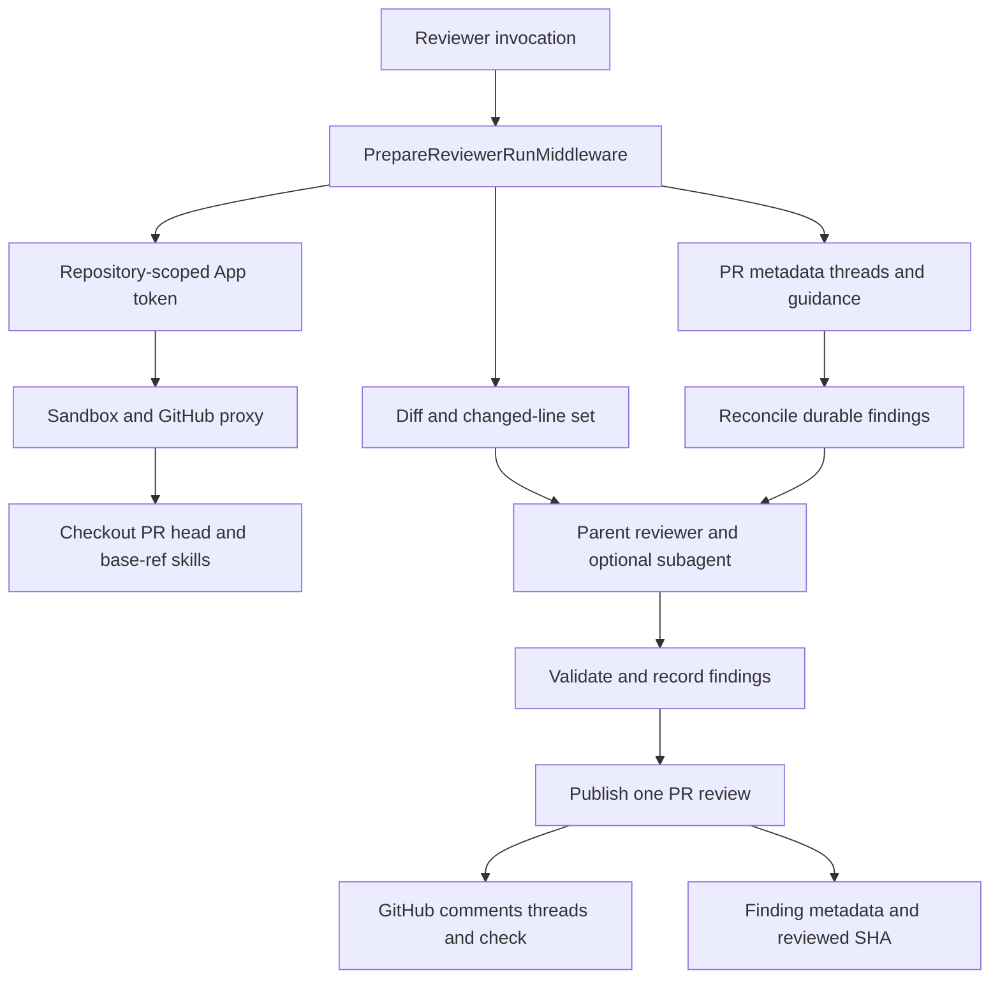
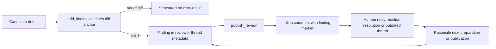
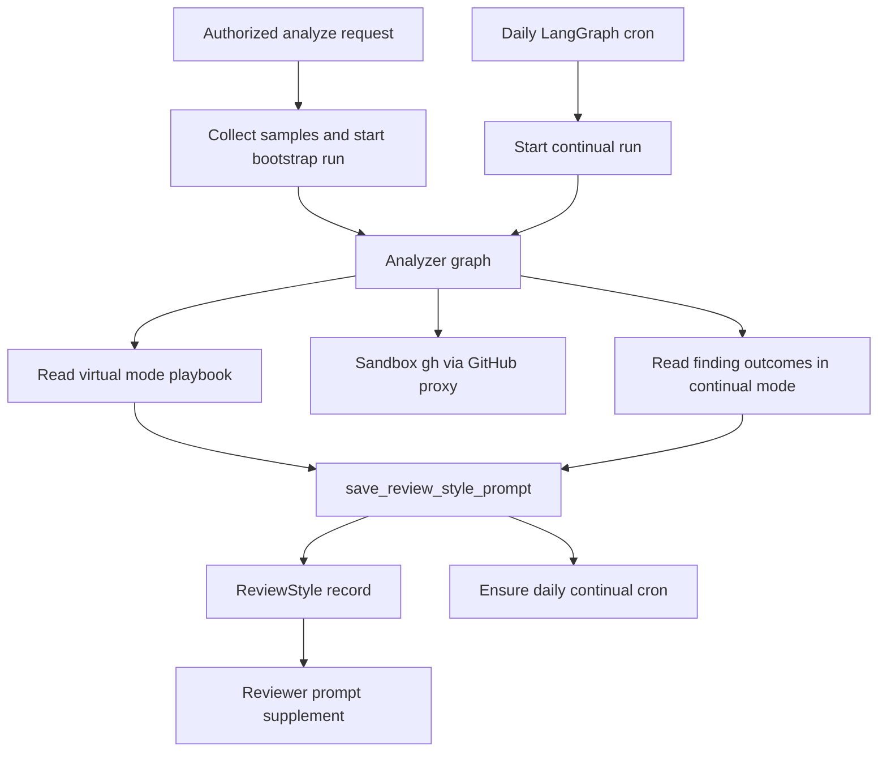

# Review and Review-Style Graphs

Open SWE deploys two specialized deep-agent graphs: `reviewer` (`agent.graphs.reviewer:traced_reviewer_agent`) evaluates a pull request, while `analyzer` (`agent.graphs.analyzer:traced_analyzer`) learns a per-repository supplement to the review policy. They share LangGraph execution, models, and sandbox infrastructure, but not authority or durable state: the reviewer owns PR-scoped findings and GitHub review publication; the analyzer owns the repository style profile.

For event routing and user-visible PR behavior, see [PR Review Workflow](../workflows/pr-review.md). For sandbox provisioning and recovery, see [Sandbox Lifecycle](sandbox-lifecycle.md). [Context Engineering](../workflows/context-engineering.md) describes the broader prompt-assembly approach.

## Reviewer: a constrained PR assessment graph

### Authority and construction

The reviewer is read-only with respect to repository contents. Its purpose-built tool list has review lifecycle tools—`fetch_review_diff`, `add_finding`, `update_finding`, `list_findings`, `publish_review`, `resolve_finding_thread`, and `reply_to_finding_thread`—plus `web_search`, `fetch_url`, and `http_request`; it has no code-writing, commit, push, or PR-opening capability. Review mutation is therefore centralized in the finding/thread tools and `publish_review`, rather than being delegated to arbitrary `gh` commands.

`get_reviewer_agent(config)` constructs a graph per execution. It copies the outer configuration and `configurable` mapping before setting a default recursion limit, preserving a caller-supplied limit. With no `thread_id`, or when graph execution is disabled, it returns an empty agent and does not provision a sandbox. Otherwise it resolves configured or team-default reviewer and subagent models, applies the team Fable gate, and uses a cached sandbox backend with a reconnection function.

There is one `reviewer` subagent. The parent is expected to delegate an explicit disjoint file partition; the subagent returns candidate defects, while the parent retains the finding and publication tools and is responsible for validation, persistence, and publication. Both reviewer models are bounded by the normal reviewer model-call recursion limit; the parent additionally installs input/message sanitization, tool-error, timeout, proxy-refresh, queue, tool-call repair, stable-result-order, model-error, and review-check-settlement middleware.

### Preparation and review context

Before the first model call, `PrepareReviewerRunMiddleware` deterministically provisions the execution context. When a source repository is configured, it obtains a repository-scoped GitHub App installation token, caches it for the thread as a bot token, provisions a sandbox with that token in its GitHub proxy, clones or fetches the repository, and checks out the PR head. Trusted repository skills are materialized from the base revision, not the untrusted PR head.

The middleware computes the initial or delta re-review diff and the changed `(file, side, line)` set. It returns `diff_text` and `diff_line_set` in run state, allowing creation-time anchor validation. It concurrently retrieves PR metadata, current GitHub review threads, the saved repository style prompt, organization guidance, root instructions, API standards, and then scoped `AGENTS.md`/`CLAUDE.md` selected from changed files. Existing GitHub threads are reconciled before their context block is rendered. The final prompt selects first-review, re-review, or finding-reply context.

Reviewer preparation makes repository state and review context available before model work; publication persists results outside the sandbox.

Sandbox replacement is explicitly allowed for reviewer threads: a sandbox contains only a checkout that preparation can derive again, while findings are durable thread metadata. If even replacement raises `SandboxUnreachableError`, preparation posts a typed PR notification and fails rather than silently leaving the PR unreviewed. Diff grouping is a separate background, best-effort pass; it stores ordered logical groups on the reviewer thread for the UI and does not block the review.

### Prompt safety and review bar

The review policy requires an in-diff, concrete failure mode. It rejects speculative reports, ordinary style or naming nits, pre-existing problems, and duplicate fan-out for one defect. A changed line that violates an explicit base-branch repository convention can be reported, provided it meets the same anchored and concrete standard. Suggestions are reserved for small, obvious fixes.

PR title/body, existing thread comments, and finding replies are untrusted content. Prompt renderers place this content in XML data blocks; `_escape_for_data_block` neutralizes closing wrapper tags, and GitHub login values are constrained to the GitHub login grammar. This prevents a PR author from escaping the data wrapper to supply instructions. Existing comment bodies are also length-limited before inclusion.

## Findings: durable lifecycle and GitHub feedback

The canonical reviewer thread is a UUID5 derived from owner, repository, and PR number. Findings live in that LangGraph thread's metadata, not in the sandbox, so they survive sandbox eviction and can be found cross-thread using `metadata.kind == "reviewer"`. Changing this deterministic ID formula would orphan live reviewer state.

A `Finding` captures severity and confidence; category, title, description, and optional suggestion; path, side, line range, diff membership, and hunk; first/last-confirmed SHA; GitHub review/comment/thread identities; status; monotonic surface state; human-reply/reconciliation fields; fingerprint; and interaction history. Compatibility normalization folds older shapes into this schema and resolves contradictory surface states by retaining the furthest state. Confidence is recorded for calibration but does not itself gate publication.

`add_finding` validates title, severity, confidence, side, and ordered range. It resolves diff context in priority order from injected run state, configurable values, then a fresh authenticated PR diff. A range outside the corresponding diff side returns `success: false` and `in_diff: false`, with an instruction not to re-anchor or retry. A successful finding may save its extracted diff hunk; suggestions over four lines are dropped, and fingerprint-based storage deduplicates repeated findings. A missing reviewer thread becomes a structured do-not-retry tool result because a retry cannot recreate evicted, evaluation-only, or never-created durable state.

Findings are the durable feedback loop between PR review and later reassessment.

Reconciliation identifies Open SWE comments first by the embedded marker and then by recorded thread or comment ID. It backfills publication IDs and advances matched findings to surfaced. A finding is marked resolved only if every matched thread is resolved; an outdated-but-unresolved thread is terminal for matching but does not resolve the finding. The latest human reply after the bot comment is saved as a `human_reply` interaction marked `needs_reassessment`, so a later review has durable evidence to reconsider it.

### Publication contract

`publish_review` filters unpublished, open, in-diff findings at or above the requested severity (default `medium`) and applies `REVIEW_FINDING_CAP` (6). It posts one GitHub PR Review with host-generated summary text and one inline comment per renderable finding. Inline comments include an `open-swe-review-comment` JSON marker containing the finding ID and anchor metadata; an optional suggestion is rendered as a fenced `suggestion` block.

After posting, the tool stamps review, comment, and thread identifiers into findings, backfills from GitHub if necessary, and resolves threads belonging to resolved findings using GraphQL `resolveReviewThread`. It advances `last_reviewed_sha`, records reviewer usage, clears the started-review comment, and settles the review check. Re-reviews only surface newly discovered findings from the reviewed head; an empty re-review may intentionally omit a duplicate summary while still resolving threads and advancing state.

Tool success is not synonymous with a newly posted review: `success: true`, `review_id: null`, and `skipped_empty_re_review: true` means a valid no-post result, while `dry_run: true` is evaluation simulation. GitHub authentication failure invalidates the cached token and returns a re-authentication error. If GitHub rejects a batch for unresolved anchors, the tool filters invalid findings and retries at most once with valid anchors; otherwise it returns `unresolvable_findings` and a remediation hint rather than inviting identical retries.

## Analyzer: repository-specific review-style learning

### Graph, modes, and sandbox boundary

The analyzer creates the reviewer's repository-specific style prompt. It has only two domain tools: `read_finding_outcomes` and `save_review_style_prompt`. Its model is bounded to 80 calls and wrapped with input sanitization, tool-error, timeout-wrapup, and response-sanitization middleware. Like the reviewer, it returns an empty agent without a `thread_id` or when execution is disabled. Unlike the reviewer factory, it writes the default recursion limit directly into the supplied config.

Analyzer preparation ensures a sandbox and configures the LangSmith GitHub proxy. It uses the caller-provided review-style OAuth token when present, otherwise obtains a GitHub App installation token. This lets bootstrap work access public repositories even when the App is not installed, while scheduled work can use App authentication.

`analyzer_mode` picks a playbook, with the default mapping falling back to bootstrap:

- **`bootstrap`** is cold-start analysis. It mines historical merged-PR human feedback with `gh`, verifies and extends any supplied samples, identifies repository-specific patterns and calibration, then synthesizes an initial prompt.
- **`continual`** reads confirmed and dismissed reviewer outcomes, promotes recurring confirmed patterns, demotes recurring false positives, and refines the current prompt rather than recrawling history.

The short system prompt points to the selected playbook and supplies `REVIEWER_STYLE_THEMES`, keeping learned guidance subordinate to the reviewer's global high-signal policy. The two `SKILL.md` playbooks are virtual files: launchers seed their stripped paths in the run input `files` channel, while `get_analyzer` mounts a `StateBackend` at `/skills/` in a `CompositeBackend`. Thus the agent reads `/skills/<name>/SKILL.md` without writing bundled procedures into the sandbox.

Bootstrap and continual paths both save one repository profile, which the reviewer consumes fail-soft.

### Style records and operations

`REVIEW_STYLES` is a typed store in the `review_styles` namespace, keyed by normalized `owner/repo`. A `ReviewStyle` holds status, custom prompt, summary, sampled reviewers and counts, analysis thread/run IDs, cron ID, error, creator, and timestamps. Prompt retrieval in reviewer preparation fails soft: a store outage omits the supplement but does not fail the PR review. When found, the prompt is appended as **Repository-specific review style** and applies only when it agrees with the global review bar.

The authorized `POST /review-styles/{full_name}/analyze` route checks repository access, avoids concurrent analysis, then starts bootstrap. Bootstrap collects samples before it marks the record running and starts a durable analyzer run on the deterministic `review_style_thread_id`; collection or startup failures mark the record failed. The API also supports cancellation, prompt updates, and deletion; deletion cancels an active run, removes its cron best-effort, then deletes the profile. Status synchronization converts finished, failed, missing, or interrupted durable runs into completed or failed records based on whether a prompt was saved.

`save_review_style_prompt` requires `review_style_full_name` and nonempty prompt text. It persists trimmed prompt, summary, reviewer list, and sample counts as completed; empty output marks the record failed. A successful save attempts `ensure_continual_cron`, but cron-registration failure does not roll back the saved style.

A stored cron ID makes registration idempotent. Otherwise `ensure_continual_cron` creates an `analyzer` daily cron with `kind: "analyzer_continual"` metadata, virtual skill files, and a stable SHA-256-derived time from 05:00 through 08:59 UTC. The cron is threadless at scheduling level, but supplies the deterministic style `thread_id` in configurable—without it the analyzer factory would return an empty agent. Its fresh input carries no accumulated messages; no OAuth token is supplied, so preparation falls back to the App token.

## Focused tests

`tests/reviewer/test_factory_config_isolation.py` protects the reviewer's non-mutating factory behavior. The reviewer suite also exercises diff/LEFT-side anchors, finding normalization and persistence, publication marker and suggestion rendering, reconciliation, review API and chat paths, auto-review/watch behavior, outcomes, diff grouping, and style synchronization. `tests/analyzer/test_analyzer_cron.py` verifies cron creation, idempotence, removal, explicit analyzer thread configuration, seeded continual skill files, and the stable schedule window.
